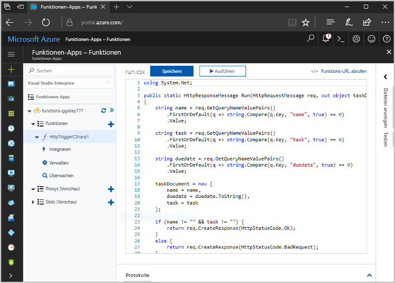
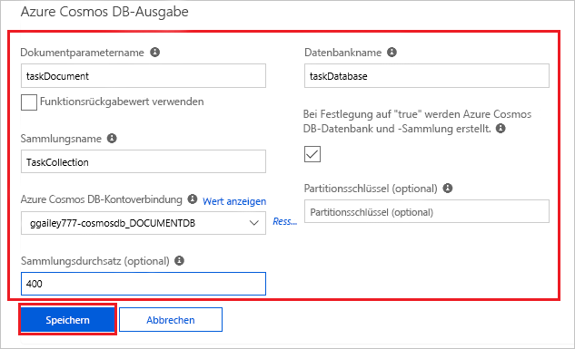
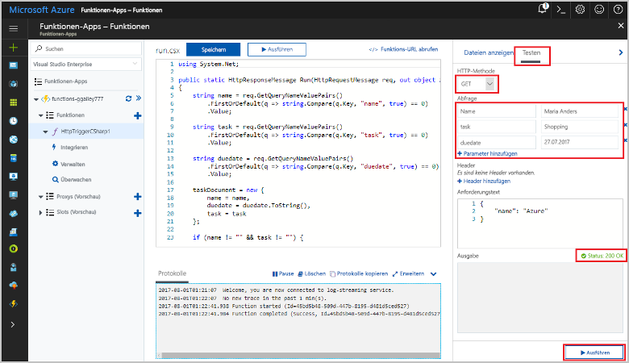

# <a name="store-unstructured-data-using-azure-functions-and-cosmos-db"></a>Speichern von unstrukturierten Daten mit Azure Functions und Cosmos DB

[Azure Cosmos DB](https://azure.microsoft.com/services/cosmos-db/) eignet sich hervorragend zum Speichern von unstrukturierten Daten und JSON-Daten. In Kombination mit Azure Functions ermöglicht Cosmos DB das schnelle und einfache Speichern von Daten. Dabei ist viel weniger Code erforderlich als beim Speichern von Daten in einer relationalen Datenbank.

Eingabe- und Ausgabebindungen bieten in Azure Functions eine deklarative Möglichkeit, eine Verbindung mit externen Dienstdaten Ihrer Funktion herzustellen. In diesem Thema erfahren Sie, wie Sie eine bereits vorhandene C#-Funktion aktualisieren, um eine Ausgabebindung hinzuzufügen, die unstrukturierte Daten in einem Cosmos DB-Dokument speichert. 



## <a name="prerequisites"></a>Voraussetzungen

Für dieses Tutorial benötigen Sie Folgendes:

[!INCLUDE [Previous quickstart note](../../includes/functions-quickstart-previous-topics.md)]

## <a name="add-an-output-binding"></a>Hinzufügen einer Ausgabebindung

1. Erweitern Sie sowohl Ihre Funktionen-App als auch Ihre Funktion.

1. Wählen Sie **Integrieren** und anschließend **+ Neue Ausgabe** (rechts oben auf der Seite) aus. Wählen Sie **Azure Cosmos DB** aus, und klicken Sie auf **Auswählen**.

    

3. Verwenden Sie die **Ausgabeeinstellungen für Azure Cosmos DB** wie in der folgenden Tabelle angegeben: 

    

    | Einstellung      | Empfohlener Wert  | Beschreibung                                |
    | ------------ | ---------------- | ------------------------------------------ |
    | **Dokumentparametername** | taskDocument | Name, der auf das Cosmos DB-Objekt im Code verweist |
    | **Datenbankname** | taskDatabase | Name der Datenbank zum Speichern von Dokumenten |
    | **Sammlungsname** | TaskCollection | Name der Sammlung von Cosmos DB-Datenbanken |
    | **If true, creates the Cosmos DB database and collection** (Erstellt die Cosmos DB-Datenbank und -Sammlung, falls zutreffend) | Aktiviert | Die Sammlung ist noch nicht vorhanden und muss erstellt werden. |

4. Wählen Sie neben **Cosmos DB document connection** (Cosmos DB-Dokumentverbindung) die Option **Neu** und anschließend **+ Neu erstellen** aus. 

5. Verwenden Sie die Einstellungen für **Neues Konto**, wie in der folgenden Tabelle angegeben: 

    

    | Einstellung      | Empfohlener Wert  | Beschreibung                                |
    | ------------ | ---------------- | ------------------------------------------ |
    | **ID** | Name der Datenbank | Eindeutige ID für die Cosmos DB-Datenbank  |
    | **API** | SQL (DocumentDB) | Wählen Sie die Dokumentdatenbank-API aus.  |
    | **Abonnement** | Azure-Abonnement | Azure-Abonnement  |
    | **Ressourcengruppe** | myResourceGroup |  Verwenden Sie die vorhandene Ressourcengruppe, die Ihre Funktions-App enthält. |
    | **Standort**  | Europa, Westen | Wählen Sie einen Standort in der Nähe Ihrer Funktions-App oder in der Nähe anderer Apps aus, die die gespeicherten Dokumente verwenden.  |

6. Klicken Sie auf **OK**, um die Datenbank zu erstellen. Die Datenbankerstellung dauert unter Umständen einige Minuten. Nach Abschluss der Datenbankerstellung wird die Datenbankverbindungszeichenfolge als Einstellung der Funktions-App gespeichert. Der Name dieser App-Einstellung wird in **Cosmos DB account connection** (Cosmos DB-Kontoverbindung) eingefügt. 
 
8. Wählen Sie nach dem Festlegen der Verbindungszeichenfolge **Speichern** aus, um die Bindung zu erstellen.

## <a name="update-the-function-code"></a>Aktualisieren des Funktionscodes

Ersetzen Sie den vorhandenen C#-Funktionscode durch den folgenden Code:

```csharp
using System.Net;

public static HttpResponseMessage Run(HttpRequestMessage req, out object taskDocument, TraceWriter log)
{
    string name = req.GetQueryNameValuePairs()
        .FirstOrDefault(q => string.Compare(q.Key, "name", true) == 0)
        .Value;

    string task = req.GetQueryNameValuePairs()
        .FirstOrDefault(q => string.Compare(q.Key, "task", true) == 0)
        .Value;

    string duedate = req.GetQueryNameValuePairs()
        .FirstOrDefault(q => string.Compare(q.Key, "duedate", true) == 0)
        .Value;

    taskDocument = new {
        name = name,
        duedate = duedate.ToString(),
        task = task
    };

    if (name != "" && task != "") {
        return req.CreateResponse(HttpStatusCode.OK);
    }
    else {
        return req.CreateResponse(HttpStatusCode.BadRequest);
    }
}

```
Dieses Codebeispiel liest die Abfragezeichenfolgen der HTTP-Anforderung und weist sie Feldern im `taskDocument`-Objekt zu. Die `taskDocument`-Bindung sendet die Objektdaten aus diesem Bindungsparameter zur Speicherung an die gebundene Dokumentdatenbank. Die Datenbank wird bei der erstmaligen Ausführung der Funktion erstellt.

## <a name="test-the-function-and-database"></a>Testen der Funktion und der Datenbank

1. Erweitern Sie das rechte Fenster, und wählen Sie **Test** aus. Klicken Sie unter **Abfrage** auf **+ Parameter hinzufügen**, und fügen Sie der Abfragezeichenfolge die folgenden Parameter hinzu:

    + `name`
    + `task`
    + `duedate`

2. Klicken Sie auf **Ausführen**, und vergewissern Sie sich, dass der Status „200“ zurückgegeben wird.

    

1. Erweitern Sie links im Azure-Portal die Symbolleiste, geben Sie `cosmos` in das Suchfeld ein, und wählen Sie **Azure Cosmos DB** aus.

    

2. Wählen Sie die erstellte Datenbank und anschließend **Daten-Explorer** aus. Erweitern Sie die Knoten unter **Sammlungen**, wählen Sie das neue Dokument aus, und vergewissern Sie sich, dass es Ihre Abfragezeichenfolgen-Werte sowie einige zusätzliche Metadaten enthält. 

    

Sie haben Ihrem HTTP-Trigger erfolgreich eine Bindung hinzugefügt, die unstrukturierte Daten in einer Cosmos DB-Datenbank speichert.

[!INCLUDE [Clean-up section](../../includes/clean-up-section-portal.md)]

## <a name="next-steps"></a>Nächste Schritte

[!INCLUDE [functions-quickstart-next-steps](../../includes/functions-quickstart-next-steps.md)]

Weitere Informationen zu Bindungen an eine Cosmos DB-Datenbank finden Sie unter [Cosmos DB-Bindungen in Azure Functions](functions-bindings-documentdb.md).

