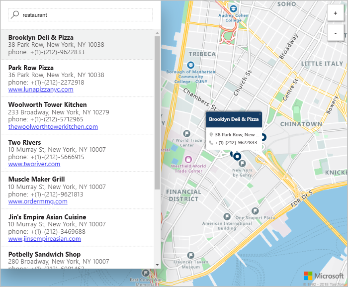

# Starten einer interaktiven Kartensuche mit Azure Maps

In diesem Artikel werden die Funktionen von Azure Maps beschrieben, um eine Karte mit interaktiven Suchfunktionen zu erstellen. Es werden die grundlegenden Schritte zum Erstellen eines eigenen Maps-Kontos sowie zum Abrufen Ihres Kontoschlüssels beschrieben, der in der Demowebanwendung verwendet wird. 

Wenn Sie kein Azure-Abonnement besitzen, können Sie ein [kostenloses Konto](https://azure.microsoft.com/free/?WT.mc_id=A261C142F) erstellen, bevor Sie beginnen.

## Anmelden beim Azure-Portal

Melden Sie sich beim [Azure-Portal](https://portal.azure.com/)an.

## Erstellen eines Kontos und Abrufen Ihres Schlüssels

1. Klicken Sie im [Azure-Portal](https://portal.azure.com) links oben auf **Ressource erstellen**.
2. Geben Sie im Feld *Marketplace durchsuchen* das Wort **Maps** ein.
3. Wählen Sie in den *Ergebnissen* die Option **Maps** aus. Klicken Sie auf die unterhalb der Karte angezeigte Schaltfläche **Erstellen**. 
4. Geben Sie auf der Seite **Azure Maps-Konto erstellen** die folgenden Werte ein:
    - *Name* des neuen Kontos 
    - *Abonnement*, das Sie für dieses Konto verwenden möchten
    - Die *Ressourcengruppe* für dieses Konto. Sie können für die Ressourcengruppe die Option *Neu erstellen* oder die Option *Vorhandene verwenden* auswählen.
    - Wählen Sie den *Ressourcengruppenstandort*.
    - Lesen Sie die *Lizenzbedingungen* und die *Datenschutzerklärung*, und aktivieren Sie zum Akzeptieren der Bestimmungen das Kontrollkästchen. 
    - Klicken Sie schließlich auf die Schaltfläche **Erstellen**.

    

5. Nachdem Ihr Konto erfolgreich erstellt wurde, öffnen Sie es, und navigieren Sie zum Abschnitt „Einstellungen“ des Kontomenüs. Klicken Sie auf **Schlüssel**, um den primären und den sekundären Schlüssel für Ihr Azure Maps-Konto anzuzeigen. Kopieren Sie den Wert für den **Primärschlüssel** zur Verwendung im folgenden Abschnitt in die lokale Zwischenablage. 

## Herunterladen der Anwendung

1. Laden Sie den Inhalt der Datei [interactiveSearch.html](https://github.com/Azure-Samples/azure-maps-samples/blob/master/src/interactiveSearch.html) herunter, oder kopieren Sie ihn.
2. Speichern Sie den Inhalt dieser Datei lokal unter **AzureMapDemo.html**, und öffnen Sie die Datei in einem Text-Editor.
3. Suchen Sie nach der Zeichenfolge `<insert-key>`, und ersetzen Sie sie durch den Wert für den **Primärschlüssel**, den Sie im vorherigen Abschnitt abgerufen haben. 

## Starten der Anwendung

1. Öffnen Sie die Datei **AzureMapDemo.html** in einem Browser Ihrer Wahl.
2. Die Karte von Los Angeles wird angezeigt. Vergrößern und verkleinern Sie sie, um zu sehen, wie die Karte abhängig vom Zoomfaktor automatisch mit mehr oder weniger Informationen gerendert wird. 
3. Ändern Sie den Standardmittelpunkt der Karte. Suchen Sie in der Datei **AzureMapDemo.html** nach der Variable **center**. Ersetzen Sie den Wert des Längengrad/Breitengrad-Paars für diese Variable durch die neuen Werte **[-74,0060, 40,7128]**. Speichern Sie die Datei, und aktualisieren Sie Ihren Browser. 
3. Probieren Sie die interaktiven Suchfunktionen aus. Geben Sie in das Suchfeld in der oberen linken Ecke der Demowebanwendung **Restaurants** ein. 
4. Bewegen Sie den Mauszeiger über die Liste der Adressen/Standorte, die unterhalb des Suchfelds angezeigt werden. Beachten Sie dabei, wie über dem entsprechenden Pin auf der Karte Informationen zum jeweiligen Standort angezeigt werden. Zum Schutz von Privatunternehmen werden fiktive Namen und Adressen angezeigt. 

    

## Bereinigen von Ressourcen

In den Tutorials wird ausführlich gezeigt, wie Maps mit Ihrem Konto verwendet und konfiguriert wird. Wenn Sie mit den Tutorials fortfahren möchten, sollten Sie die in diesem Schnellstart erstellten Ressourcen nicht bereinigen. Falls Sie nicht fortfahren möchten, führen Sie die folgenden Schritte aus, um alle erstellten Ressourcen zu löschen, die im Rahmen dieser Schnellstartanleitung erstellt wurden:

1. Schließen Sie den Browser, in dem die Webanwendung **AzureMapDemo.html** ausgeführt wird.
2. Klicken Sie im Azure-Portal im Menü auf der linken Seite auf **Alle Ressourcen**, und wählen Sie Ihr Maps-Konto aus. Klicken Sie im oberen Bereich des Blatts **Alle Ressourcen** auf **Löschen**.

## Nächste Schritte

In diesem Schnellstart haben Sie Ihr Maps-Konto erstellt und eine Demo-App gestartet. Informationen zum Erstellen Ihrer eigenen Anwendung mithilfe der Maps-APIs finden Sie im folgenden Tutorial.

> [!div class="nextstepaction"]
> [Suchen nach interessanten Punkten mit Maps](./tutorial-search-location.md)

Weitere Codebeispiele und eine interaktive Programmiererfahrung finden Sie in den folgenden Anleitungen:

> [!div class="nextstepaction"]
> [Suchen nach einer Adresse mit dem Suchdienst von Azure Maps](./how-to-search-for-address.md)

> [!div class="nextstepaction"]
> [Verwenden des Azure Maps-Kartensteuerelements](./how-to-use-map-control.md)
