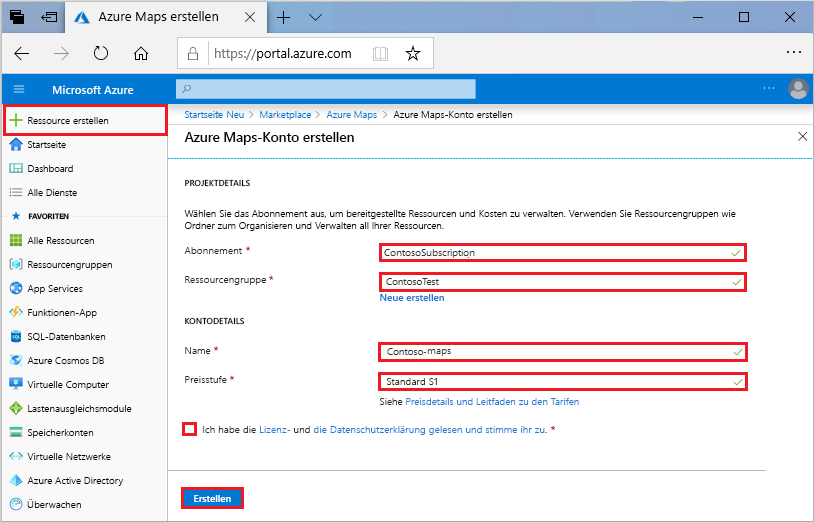
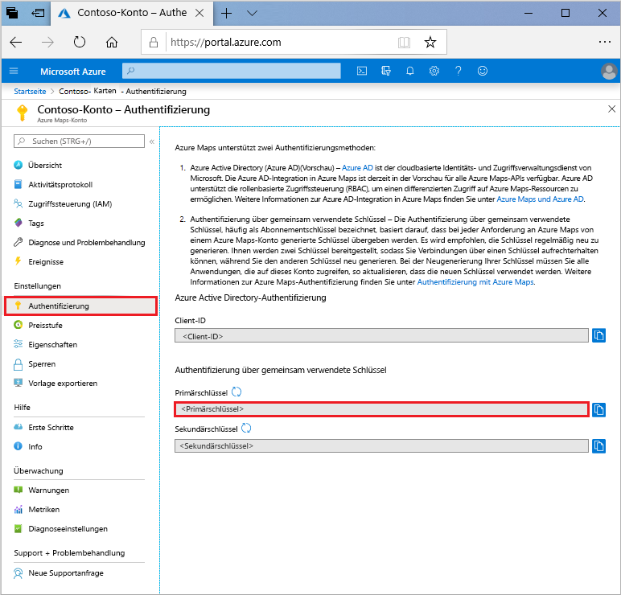

# Schnellstart: Erstellen einer interaktiven Kartensuche mit Azure Maps

In diesem Artikel werden die Funktionen von Azure Maps beschrieben, um eine Karte mit interaktiven Suchfunktionen zu erstellen. Die folgenden grundlegenden Schritte werden erläutert:
* Erstellen eines eigenen Azure Maps-Kontos
* Abrufen Ihres Kontoschlüssels zur Verwendung in der Demowebanwendung

Wenn Sie kein Azure-Abonnement besitzen, können Sie ein [kostenloses Konto](https://azure.microsoft.com/free/?WT.mc_id=A261C142F) erstellen, bevor Sie beginnen.

## Melden Sie sich auf dem Azure-Portal an.

Melden Sie sich beim [Azure-Portal](https://portal.azure.com) an.

## Erstellen eines Kontos mit Azure Maps

Erstellen Sie mithilfe der folgenden Schritte ein neues Maps-Konto:

1. Klicken Sie im [Azure-Portal](https://portal.azure.com) links oben auf **Ressource erstellen**.
2. Geben Sie im Feld *Marketplace durchsuchen* das Wort **Maps** ein.
3. Wählen Sie in den *Ergebnissen* die Option **Maps** aus. Klicken Sie auf die unterhalb der Karte angezeigte Schaltfläche **Erstellen**.
4. Geben Sie auf der Seite **Azure Maps-Konto erstellen** die folgenden Werte ein:
    * *Abonnement*, das Sie für dieses Konto verwenden möchten
    * Name der *Ressourcengruppe* für dieses Konto. Sie können für die Ressourcengruppe die Option *Neu erstellen* oder die Option *Vorhandene verwenden* auswählen.
    * *Name* des neuen Kontos
    * Der *Tarif* für dieses Konto.
    * Lesen Sie die *Lizenzbedingungen* und die *Datenschutzerklärung*, und aktivieren Sie zum Akzeptieren der Bestimmungen das Kontrollkästchen.
    * Klicken Sie auf die Schaltfläche **Erstellen** .

## Abrufen des Primärschlüssels für Ihr Konto

Rufen Sie nach der Erstellung des Maps-Kontos den Schlüssel ab, mit dem Sie die Maps-APIs abfragen können. Sie sollten den Primärschlüssel Ihres Kontos als Abonnementschlüssel verwenden, wenn Sie Azure Maps-Dienste aufrufen.

1. Öffnen Sie Ihr Maps-Konto im Portal.
2. Wählen Sie im Abschnitt „Einstellungen“ die Option **Authentifizierung** aus.
3. Kopieren Sie den **Primärschlüssel** in die Zwischenablage. Speichern Sie ihn lokal zur späteren Verwendung in diesem Tutorial.

## Herunterladen der Anwendung

1. Navigieren Sie zu [interactiveSearch.html](https://github.com/Azure-Samples/AzureMapsCodeSamples/blob/master/AzureMapsCodeSamples/Tutorials/interactiveSearch.html), und klicken Sie darauf, um den Inhalt auf der GitHub-Benutzeroberfläche anzuzeigen. Klicken Sie mit der rechten Maustaste auf die Schaltfläche **Rohdaten**, und kopieren Sie den Inhalt der Datei, oder wählen Sie „Speichern unter“ aus, um die Datei herunterzuladen.
2. Speichern Sie den Inhalt dieser Datei lokal unter **AzureMapDemo.html**. Öffnen Sie die Datei in einem Text-Editor.
3. Suchen Sie nach der Zeichenfolge `<Your Azure Maps Key>`. Ersetzen Sie sie durch den **Primärschlüssel**, den Sie im vorherigen Abschnitt kopiert haben.

## Öffnen der Anwendung

1. Öffnen Sie die Datei **AzureMapDemo.html** in einem Browser Ihrer Wahl.
2. Die Karte der Stadt Los Angeles wird angezeigt. Vergrößern und verkleinern Sie sie, um zu sehen, wie die Karte abhängig vom Zoomfaktor automatisch mit mehr oder weniger Informationen gerendert wird. 
3. Ändern Sie den Standardmittelpunkt der Karte. Suchen Sie in der Datei **AzureMapDemo.html** nach der Variable **center**. Ersetzen Sie den Wert des Längengrad/Breitengrad-Paars für diese Variable durch die neuen Werte **[-74,0060, 40,7128]** . Speichern Sie die Datei, und aktualisieren Sie Ihren Browser.
4. Probieren Sie die interaktiven Suchfunktionen aus. Geben Sie **Restaurants** in das Suchfeld in der oberen linken Ecke der Demowebanwendung ein.
5. Bewegen Sie den Mauszeiger über die Liste der Adressen und Standorte, die unterhalb des Suchfelds angezeigt wird. Beachten Sie dabei, wie über dem entsprechenden Pin auf der Karte Informationen zum jeweiligen Standort angezeigt werden. Zum Schutz von Privatunternehmen werden fiktive Namen und Adressen angezeigt.

    

## Bereinigen von Ressourcen

In den Tutorials wird ausführlich erläutert, wie Sie Azure Maps mit Ihrem Konto verwenden und konfigurieren. Wenn Sie mit den Tutorials fortfahren möchten, sollten Sie die in diesem Schnellstart erstellten Ressourcen nicht bereinigen. Falls Sie nicht fortfahren möchten, führen Sie die folgenden Schritte aus, um die Ressourcen zu bereinigen:

1. Schließen Sie den Browser, in dem die Webanwendung **AzureMapDemo.html** ausgeführt wird.
2. Klicken Sie im Azure-Portal im Menü auf der linken Seite auf **Alle Ressourcen**. Wählen Sie dann Ihr Azure Maps-Konto aus. Wählen Sie oben auf dem Blatt **Alle Ressourcen** die Option **Löschen** aus.

## Nächste Schritte

In diesem Schnellstart haben Sie Ihr Azure Maps-Konto und eine Demo-App erstellt. Sehen Sie sich die folgenden Tutorials an, um mehr über Azure Maps zu erfahren:

> [!div class="nextstepaction"]
> [Suchen nach Points of Interest in der Nähe mit Azure Maps](tutorial-search-location.md)

Weitere Codebeispiele und eine interaktive Codierumgebung finden Sie in den folgenden Anleitungen:

> [!div class="nextstepaction"]
> [Suchen nach einer Adresse mit dem Suchdienst von Azure Maps](how-to-search-for-address.md)

> [!div class="nextstepaction"]
> [Verwenden des Azure Maps-Kartensteuerelements](how-to-use-map-control.md)
