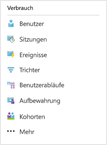
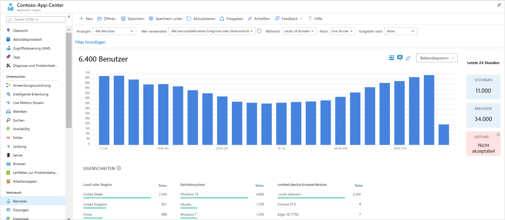
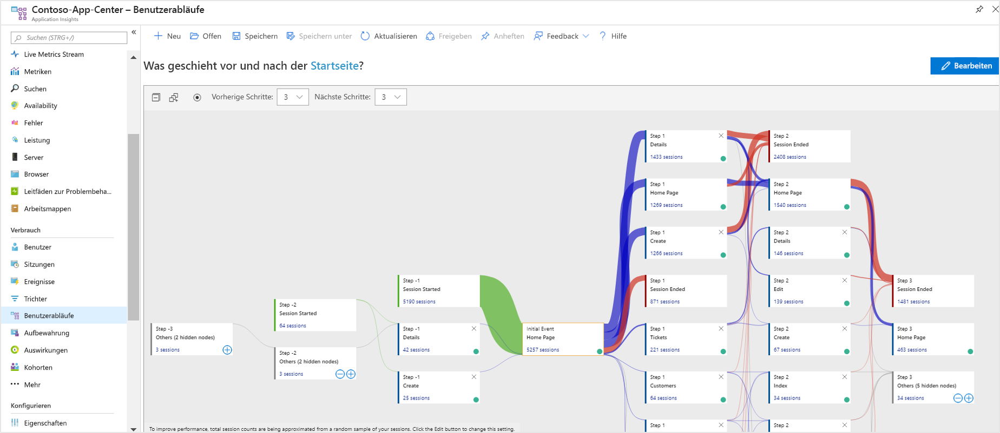

# <a name="start-analyzing-your-mobile-app-with-app-center-and-application-insights"></a>Analysieren Ihrer mobilen Apps mit App Center und Application Insights

In diesem Schnellstart erfahren Sie, wie Sie die Instanz von App Center Ihrer App mit Application Insights verbinden. Mit Application Insights können Sie Ihre Telemetriedaten mit leistungsfähigen Tools abfragen, segmentieren, filtern und analysieren. Diese Tools sind leistungsstärker als die Tools, die im [Analytics](https://docs.microsoft.com/mobile-center/analytics/)-Dienst von App Center zur Verfügung stehen.

## <a name="prerequisites"></a>Voraussetzungen

Für die Durchführung dieses Schnellstarts benötigen Sie Folgendes:

- ein Azure-Abonnement
- Eine iOS-, Android-, Xamarin-, Universal Windows- oder React Native-App
 
Wenn Sie kein Azure-Abonnement besitzen, können Sie ein [kostenloses Konto](https://azure.microsoft.com/free/) erstellen, bevor Sie beginnen.

## <a name="sign-up-with-app-center"></a>Registrieren für App Center
Erstellen Sie zunächst ein Konto, und [registrieren Sie sich für App Center](https://appcenter.ms/signup?utm_source=ApplicationInsights&utm_medium=Azure&utm_campaign=docs).

## <a name="onboard-to-app-center"></a>Integration in App Center

Bevor Sie Application Insights mit Ihrer mobilen App verwenden können, müssen Sie Ihre App in [App Center](https://docs.microsoft.com/mobile-center/) aufnehmen. Application Insights erhält keine direkten Telemetriedaten Ihrer mobilen App. Stattdessen sendet Ihre App benutzerdefinierte Ereignistelemetriedaten an App Center. Anschließend exportiert App Center kontinuierlich mit dem Empfang Kopien dieser benutzerdefinierten Ereignisse in Application Insights. (Dies gilt nicht für das [Application Insights JS SDK](https://github.com/Microsoft/ApplicationInsights-JS) oder das [React Native-Plug-In](https://github.com/Microsoft/ApplicationInsights-JS/tree/master/extensions/applicationinsights-react-native), bei denen die Telemetriedaten direkt an Application Insights gesendet werden.)

Um Ihre App aufzunehmen, führen Sie den Schnellstart für App Center für jede Plattform durch, die von Ihrer App unterstützt wird. Erstellten Sie jeweils eine App Center-Instanz für jede Plattform:

* [iOS](https://docs.microsoft.com/mobile-center/sdk/getting-started/ios)
* [Android](https://docs.microsoft.com/mobile-center/sdk/getting-started/android)
* [Xamarin](https://docs.microsoft.com/mobile-center/sdk/getting-started/xamarin)
* [Universal Windows](https://docs.microsoft.com/mobile-center/sdk/getting-started/uwp)
* [React Native](https://docs.microsoft.com/mobile-center/sdk/getting-started/react-native)

## <a name="track-events-in-your-app"></a>Nachverfolgen von Ereignissen in Ihrer App

Nachdem Ihre App in App Center aufgenommen wurde, muss sie mit dem App Center-SDK angepasst werden, sodass sie benutzerdefinierte Ereignistelemetriedaten sendet. Benutzerdefinierte Ereignisse sind die einzige Art von App Center-Telemetriedaten, die in Application Insights exportiert werden.

Um benutzerdefinierte Ereignisse von iOS-Apps zu senden, verwenden Sie die Methoden `trackEvent` und `trackEvent:withProperties` im App Center-SDK. [Erfahren Sie mehr zum Nachverfolgen von Ereignissen von iOS-Apps.](https://docs.microsoft.com/mobile-center/sdk/analytics/ios)

```Swift
MSAnalytics.trackEvent("Video clicked")
```

Um benutzerdefinierte Ereignisse von Android-Apps zu senden, verwenden Sie die `trackEvent`-Methode im App Center-SDK. [Erfahren Sie mehr zum Nachverfolgen von Ereignissen von Android-Apps.](https://docs.microsoft.com/mobile-center/sdk/analytics/android)

```Java
Analytics.trackEvent("Video clicked")
```

Um benutzerdefinierte Ereignisse von anderen App-Plattformen zu senden, verwenden Sie die `trackEvent`-Methoden in deren jeweiligen App Center-SDK.

Um sicherzustellen, dass Ihre benutzerdefinierten Ereignisse empfangen werden, wechseln Sie zur Registerkarte **Ereignisse** im Bereich **Analytics** in App Center. Es kann einige Minuten dauern, bis Ereignisse angezeigt werden, nachdem Sie von Ihrer App gesendet wurden.

## <a name="create-an-application-insights-resource"></a>Erstellen einer Application Insights-Ressource

Sobald Ihre App benutzerdefinierte Ereignisse sendet und diese von App Center empfangen werden, müssen Sie eine Application Insights-Ressource für App Center im Azure-Portal erstellen:

1. Melden Sie sich beim [Azure-Portal](https://portal.azure.com/) an.
2. Klicken Sie auf **Ressource erstellen** > **Entwicklertools** > **Application Insights**.

    > [!NOTE]
    > Wenn Sie zum ersten Mal eine Application Insights-Ressource erstellen, können Sie mehr dazu im Dokument [Erstellen einer Application Insights-Ressource](https://docs.microsoft.com/azure/azure-monitor/app/create-new-resource) erfahren.

    Ein Konfigurationsfeld wird geöffnet. Füllen Sie die Eingabefelder anhand der Informationen in der unten stehenden Tabelle aus.

    | Einstellungen        |  value           | BESCHREIBUNG  |
   | ------------- |:-------------|:-----|
   | **Name**      | Ein global eindeutiger Wert wie z.B. „myApp-iOS“ | Der Name, der die zu überwachende App identifiziert. |
     | **Ressourcengruppe**     | Eine neue Ressourcengruppe, oder eine vorhandene aus dem Menü | Die Ressourcengruppe, in der die neue Application Insights-Ressource erstellt werden soll |
   | **Location** | Ein Standort aus dem Menü | Wählen Sie einen Standort in Ihrer Nähe oder in der Nähe des Standorts, in dem Ihre App gehostet wird. |

3. Klicken Sie auf **Erstellen**.

Wenn Ihre App mehrere Plattformen unterstützt (iOS, Android usw.), ist es am sinnvollsten, mehrere Application Insights-Ressourcen zu erstellen, eine für jede Plattform.

## <a name="export-to-application-insights"></a>Exportieren in Application Insights

In Ihrer neuen Application Insights-Ressource auf der Seite **Übersicht**. Kopieren Sie den Instrumentierungsschlüssel aus Ihrer Ressource.

Führen Sie in der [App Center](https://appcenter.ms/)-Instanz für Ihre App Folgendes durch:

1. Klicken Sie auf der Seite **Einstellungen** auf **Exportieren**.
2. Klicken Sie auf **Neuer Export**, wählen Sie **Application Insights** aus, und klicken Sie anschließend auf **Anpassen**.
3. Fügen Sie den Application Insights-Instrumentierungsschlüssel in das Feld ein.
4. Stimmen Sie Erhöhung der Nutzung des Azure-Abonnements zu, das die Application Insights-Ressource enthält. Das erste GB an empfangenen Daten ist für jede Application Insights-Ressource kostenlos. [Weitere Informationen zu den Preisen von Application Insights](https://azure.microsoft.com/pricing/details/application-insights/)

Denken Sie daran, dass Sie diese Schritte für jede Plattform, die Ihre App unterstützt, durchführen müssen.

Sobald der [Export](https://docs.microsoft.com/mobile-center/analytics/export) eingerichtet ist, wird jedes benutzerdefinierte Ereignis, das von App Center empfangen wird, in Application Insights kopiert. Es kann einige Minuten dauern, bis die Ereignisse Application Insights erreichen. Wenn sie also nicht sofort angezeigt werden, warten Sie erst ab, bevor Sie weitere Diagnosen durchführen.

Um Ihnen bei der ersten Verbindung mehr Daten zur Verfügung zu stellen, werden die letzten 48 Stunden an benutzerdefinierten Ereignissen in App Center automatisch in Application Insights exportiert.

## <a name="start-monitoring-your-app"></a>Überwachen Ihrer App

Application Insights kann die Telemetriedaten zu benutzerdefinierten Ereignissen aus Ihrer App abfragen, segmentieren, filtern und analysieren. Diese Funktionen reichen über diejenigen in App Center hinaus.

1. **Abfragen der Telemetriedaten zu benutzerdefinierten Ereignissen.** Klicken Sie auf der Seite **Übersicht** in Application Insights auf **Protokolle (Analytics)** .

   Das Protokolle (Analytics)-Portal von Application Insights, das mit Ihrer Application Insights-Ressource verknüpft ist, wird geöffnet. Über das Protokolle (Analytics)-Portal können Sie Ihre Daten direkt mit Ihrer Log Analytics-Abfragesprache abfragen, sodass Sie beliebige komplexe Fragen zu Ihrer App und deren Benutzern stellen können.
   
   Öffnen Sie im Protokolle (Analytics)-Portal eine neue Registerkarte, und fügen Sie anschließend die folgende Abfrage ein. Sie gibt die Anzahl der verschiedenen Benutzer zurück, die in den letzten 24 Stunden ein benutzerdefiniertes Ereignis gesendet haben, nach der Anzahl geordnet.

   ```AIQL
   customEvents
   | where timestamp >= ago(24h)
   | summarize dcount(user_Id) by name 
   | order by dcount_user_Id desc 
   ```

   

   1. Wählen Sie die Abfrage aus, indem Sie im Text-Editor an eine beliebige Stelle in der Abfrage klicken.
   2. Klicken Sie auf **Los**, um die Abfrage auszuführen. 

   Erfahren Sie mehr zu [Application Insights Analytics](../../azure-monitor/app/analytics.md) und zur [Log Analytics-Abfragesprache](https://aka.ms/LogAnalyticsLanguageReference).


2. **Segmentieren und filtern Sie die Telemetriedaten zu benutzerdefinierten Ereignissen.** Klicken Sie auf der Seite **Übersicht** in Application Insights im Inhaltsverzeichnis auf **Benutzer**.

   

   Das Tool „Benutzer“ zeigt an, wie viele Benutzer Ihrer App auf bestimmte Schaltflächen geklickt, bestimmte Seiten besucht oder bestimmte Aktionen ausgeführt haben, die Sie als Ereignis mit dem App Center-SDK nachverfolgen. Wenn Sie Ihre App Center-Ereignisse segmentieren und filtern möchten, ist das Benutzertool hervorragend geeignet.

    

   Segmentieren Sie Ihre Nutzung beispielsweise nach Region, indem Sie im Dropdownmenü **Trennen nach** **Land oder Region** auswählen.

3. **Analysieren Sie Mustern bei Wechseln, der Vermerkdauer und der Navigation in Ihrer App.** Klicken Sie auf der Seite **Übersicht** in Application Insights im Inhaltsverzeichnis auf **Benutzerabläufe**.

   

   Das Tool „Benutzerabläufe“ visualisiert, welche Ereignisse Benutzer nach einem Startereignis senden. Dies ist nützlich, um sich einen Überblick darüber zu verschaffen, wie Benutzer durch Ihre App navigieren. Zudem werden so Stellen offen gelegt, an denen viele Benutzer Ihre App verlassen oder dieselbe Aktion wiederholt durchführen.

   Zusätzlich zu Benutzerabläufen hat Application Insights mehrere andere Analysetools für Benutzerverhalten, die Antworten auf spezifische Fragen liefern:

   * **Verkaufstrichter** zum Analysieren und Überwachen der Wechselraten
   * **Vermerkdauer** zum Analysieren der dauerhaften Bindung von Benutzern an Ihre App.
   * **Workbooks**, in denen Visualisierungen und Text in einem Bericht zusammengefasst werden, um sie in dieser Form mit anderen zu teilen
   * **Kohorten** zum Benennen und Speichern spezifischer Benutzer- oder Ereignisgruppen, damit auf diese ganz leicht von anderen Analysetools verwiesen werden kann

## <a name="clean-up-resources"></a>Bereinigen von Ressourcen

Wenn Sie Application Insights nicht weiter mit App Center verwenden möchten, deaktivieren Sie den Export in App Center, und löschen Sie die Application Insights-Ressource. Danach wird Ihnen diese Ressource nicht mehr von Application Insights in Rechnung gestellt.

So deaktivieren Sie den Export in App Center:

1. Navigieren Sie in App Center zu **Einstellungen** und **Export**.
2. Klicken Sie auf dem Application Insights-Export, den Sie löschen möchten, und klicken Sie anschließend auf **Export löschen** am unteren Rand, und bestätigen Sie den Vorgang.

So löschen Sie die Application Insights-Erweiterung:

1. Klicken Sie in der linken oberen Ecke des Azure-Portals auf **Ressourcengruppen**, und klicken Sie dann auf die Ressourcengruppe, in der Ihre Application Insights-Ressource erstellt wurde.
2. Öffnen Sie die Application Insights-Ressource, die Sie löschen möchten. Klicken Sie anschließend auf **Löschen** im oberen Menü der Ressource, und bestätigen Sie den Vorgang. Dadurch wird die Kopie der Daten unwiderruflich gelöscht, die in Application Insights exportiert wurde.

## <a name="next-steps"></a>Nächste Schritte

> [!div class="nextstepaction"]
> [Erhalten Sie Einblick, wie die App von Kunden verwendet wird.](../../azure-monitor/app/usage-overview.md)
