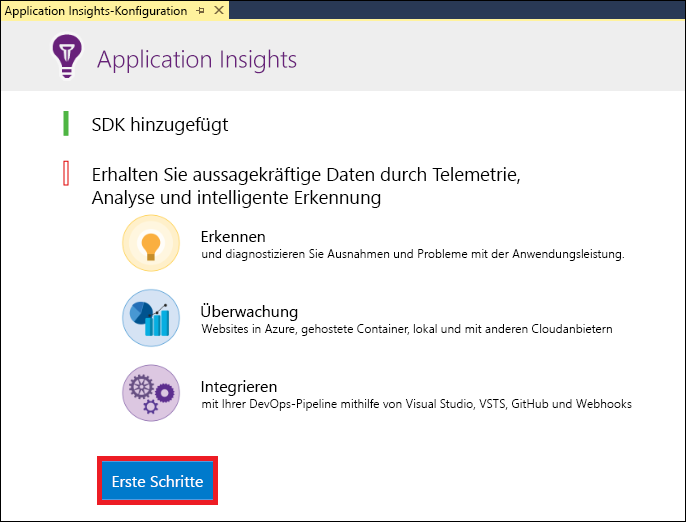
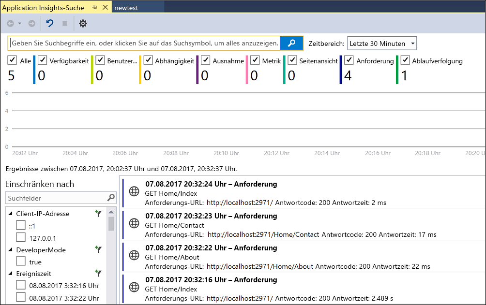
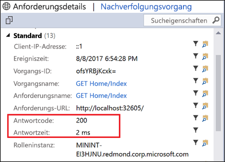
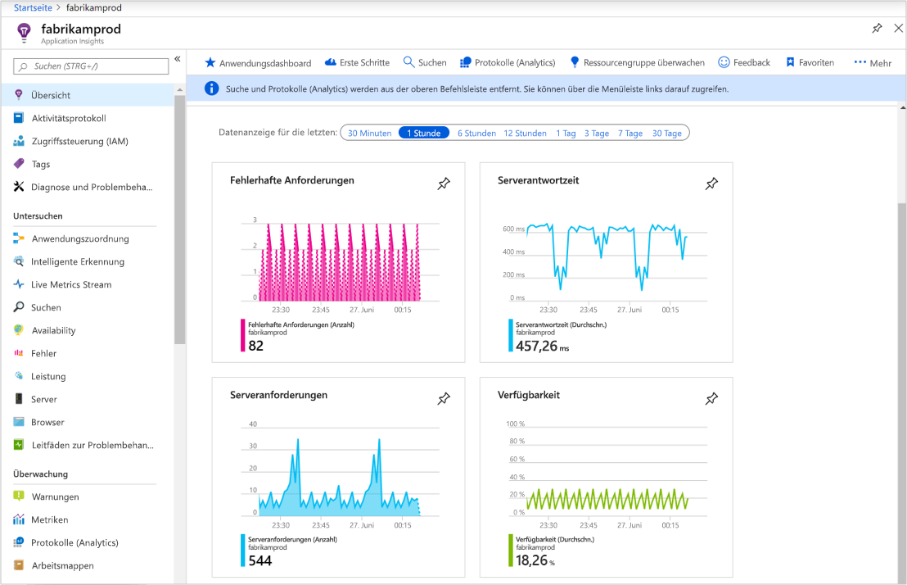
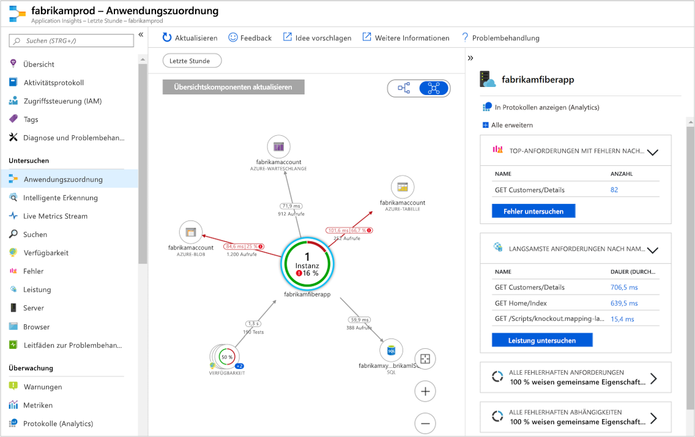
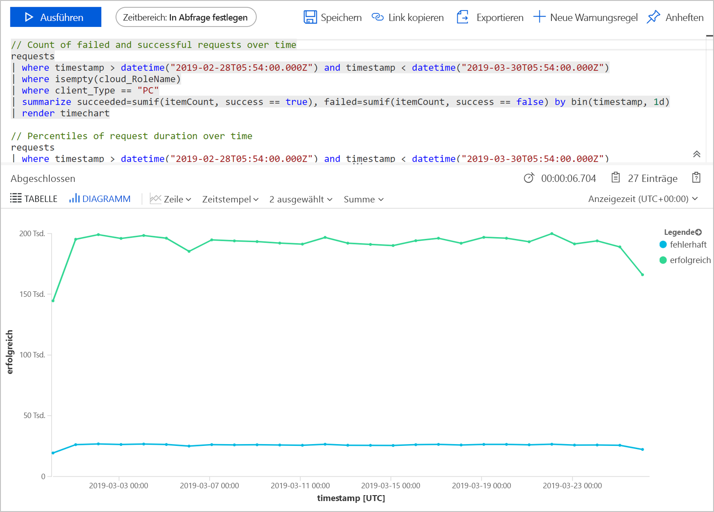
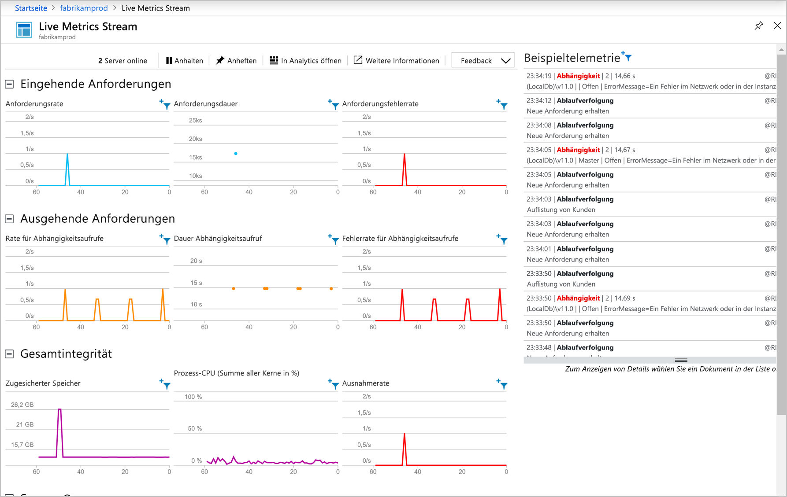

# <a name="start-monitoring-your-aspnet-web-application"></a>Starten der Überwachung Ihrer ASP.NET-Webanwendung

Mit Azure Application Insights können Sie die Verfügbarkeit, Leistung und Nutzung Ihrer Webanwendung ganz einfach überwachen.  Sie können auch Fehler in Ihrer Anwendung schnell erkennen und diagnostizieren, ohne darauf warten zu müssen, dass diese Fehler von Benutzern gemeldet werden.  Mit den Informationen, die Sie in Application Insights über die Leistung und Effizienz Ihrer App sammeln, können Sie fundierte Entscheidungen zur Wartung und Verbesserung der Anwendung treffen.

Diese Schnellstartanleitung zeigt, wie Sie Application Insights zu einer vorhandenen ASP.NET-Webanwendung hinzufügen und mit der Analyse von Livestatistiken beginnen, einer der vielen Methoden, mit denen Sie Ihre Anwendung analysieren können. Wenn Sie noch nicht über eine ASP.NET-Webanwendung verfügen, können Sie mithilfe der Schnellstartanleitung unter [Erstellen einer ASP.NET-Web-App](../../app-service/app-service-web-get-started-dotnet-framework.md) eine erstellen.

## <a name="prerequisites"></a>Voraussetzungen
So führen Sie diesen Schnellstart durch:

- Installieren Sie [Visual Studio 2019](https://visualstudio.microsoft.com/downloads/?utm_medium=microsoft&utm_source=docs.microsoft.com&utm_campaign=inline+link&utm_content=download+vs2019) mit den folgenden Workloads:
    - ASP.NET und Webentwicklung
    - Azure-Entwicklung


Wenn Sie kein Azure-Abonnement besitzen, können Sie ein [kostenloses Konto](https://azure.microsoft.com/free/) erstellen, bevor Sie beginnen.

## <a name="enable-application-insights"></a>Aktivieren von Application Insights

1. Öffnen Sie Ihr Projekt in Visual Studio 2019.
2. Wählen Sie aus dem Menü „Projekt“ die Option **Application Insights konfigurieren**. Visual Studio fügt Ihrer Anwendung das Application Insights SDK hinzu.

    > [!IMPORTANT]
    > Der Prozess zum Hinzufügen von Application Insights variiert je nach ASP.NET-Vorlagentyp. Wählen Sie bei Verwendung der Vorlage **Leer** oder **Mobile Azure-App** die Option **Projekt** > **Application Insights-Telemetrie hinzufügen**. Alle anderen ASP.NET-Vorlagen finden Sie in den Anleitungen im obigen Schritt. 

3. Klicken Sie auf **Erste Schritte**. (In früheren Versionen von Visual Studio wird stattdessen die Schaltfläche **Kostenlos starten** angezeigt.)

    

4. Wählen Sie Ihr Abonnement aus, und klicken Sie auf das **Registrieren**.

5. Wählen Sie **Projekt** > **NuGet-Pakete verwalten** > **Paketquelle: nuget.org** >  **,** und aktualisieren Sie die Application Insights SDK-Pakete auf die neueste stabile Version.

6. Führen Sie Ihre Anwendung aus, indem Sie entweder aus dem Menü **Debuggen** die Option **Debuggen starten** auswählen oder die Taste F5 drücken.

## <a name="confirm-app-configuration"></a>Bestätigen der App-Konfiguration

Application Insights sammelt Telemetriedaten für Anwendung, unabhängig davon, ob sie ausgeführt wird oder nicht. Geben Sie folgendermaßen vor, um diese Daten anzuzeigen.

1. Öffnen Sie Application Insights. Klicken Sie dazu auf **Ansicht** -> **Weitere Fenster** -> **Application Insights-Suche**.  Sie sehen die Telemetriedaten Ihrer aktuellen Sitzung.<BR><br>

2. Klicken Sie auf die erste Anforderung in der List (in diesem Beispiel „GET Home/Index“), um die Anforderungsdetails anzuzeigen. Beachten Sie, dass sowohl Statuscode als auch Antwortzeit sowie weitere wertvolle Informationen zur Anforderung angezeigt werden.<br><br>

## <a name="start-monitoring-in-the-azure-portal"></a>Starten der Überwachung im Azure-Portal

Sie können jetzt Application Insights im Azure-Portal öffnen, um verschiedene Details zu Ihrer ausgeführten Anwendung anzuzeigen.

1. Erweitern Sie im Projektmappen-Explorer den Ordner **Verbundene Dienste** (Wolkensymbol mit Stecker), klicken Sie mit der rechten Maustaste auf den Ordner **Application Insights**, und klicken Sie anschließend auf **Application Insights-Portal öffnen**.  Sie sehen einige Informationen zu Ihrer Anwendung sowie verschiedene Optionen.

    

2. Klicken Sie auf **Anwendungsübersicht**, um ein visuelles Layout der Abhängigkeitsbeziehungen zwischen den Komponenten Ihrer Anwendung zu erhalten.  Jede Komponente zeigt KPIs wie z.B. Last, Leistung, Fehler und Warnungen an.

    

3. Klicken Sie für eine der Anwendungskomponenten auf das **App-Analyse**-Symbol  **In Protokollen anzeigen (Analytics)** . Dadurch wird **Protokolle (Analytics)** geöffnet. Hier steht eine erweiterte Abfragesprache zum Analysieren aller Daten zur Verfügung, die von Application Insights gesammelt werden. In diesem Fall wird eine Abfrage für Sie generiert, die die Anzahl von Anforderungen als Diagramm darstellt. Sie können selbst Abfragen zum Analysieren anderer Daten schreiben.

    

4. Klicken Sie auf der linken Seite unter „Untersuchen“ auf **Live Metrics Stream**. Damit werden Livestatistiken über Ihre Anwendung während der Ausführung angezeigt. Hierzu gehören Informationen wie die Anzahl von eingehenden Anforderungen, die Dauer dieser Anforderungen sowie jegliche auftretenden Fehler. Sie können auch kritische Leistungsmetriken wie Prozessor und Arbeitsspeicher untersuchen.

    

    Wenn Sie bereit sind, Ihre Anwendung in Azure zu hosten, können Sie sie jetzt veröffentlichen. Führen Sie die in der Schnellstartanleitung [Erstellen einer ASP.NET-Web-App](../../app-service/app-service-web-get-started-dotnet.md#update-the-app-and-redeploy) beschriebenen Schritte aus.

5. Wenn Sie die Application Insights-Überwachung mithilfe von Visual Studio hinzufügen, können Sie die clientseitige Überwachung automatisch hinzufügen. Um die clientseitige Überwachung manuell einer Anwendung hinzuzufügen, fügen Sie Ihrer Anwendung den folgenden JavaScript-Code hinzu:

```html
<!-- 
To collect user behavior analytics about your application, 
insert the following script into each page you want to track.
Place this code immediately before the closing </head> tag,
and before any other scripts. Your first data will appear 
automatically in just a few seconds.
-->
<script type="text/javascript">
var appInsights=window.appInsights||function(a){
  function b(a){c[a]=function(){var b=arguments;c.queue.push(function(){c[a].apply(c,b)})}}var c={config:a},d=document,e=window;setTimeout(function(){var b=d.createElement("script");b.src=a.url||"https://az416426.vo.msecnd.net/scripts/a/ai.0.js",d.getElementsByTagName("script")[0].parentNode.appendChild(b)});try{c.cookie=d.cookie}catch(a){}c.queue=[];for(var f=["Event","Exception","Metric","PageView","Trace","Dependency"];f.length;)b("track"+f.pop());if(b("setAuthenticatedUserContext"),b("clearAuthenticatedUserContext"),b("startTrackEvent"),b("stopTrackEvent"),b("startTrackPage"),b("stopTrackPage"),b("flush"),!a.disableExceptionTracking){f="onerror",b("_"+f);var g=e[f];e[f]=function(a,b,d,e,h){var i=g&&g(a,b,d,e,h);return!0!==i&&c["_"+f](a,b,d,e,h),i}}return c
  }({
      instrumentationKey:"<your instrumentation key>"
  });

window.appInsights=appInsights,appInsights.queue&&0===appInsights.queue.length&&appInsights.trackPageView();
</script>
```

Weitere Informationen finden Sie im GitHub-Repository für unser [JavaScript SDK (Open Source)](https://github.com/Microsoft/ApplicationInsights-JS).

## <a name="clean-up-resources"></a>Bereinigen von Ressourcen
Wenn Sie die Tests abgeschlossen haben, können Sie die Ressourcengruppe und alle dazugehörigen Ressourcen löschen. Gehen Sie dazu wie folgt vor:
1. Klicken Sie im Azure-Portal im Menü auf der linken Seite auf **Ressourcengruppen** und dann auf **myResourceGroup**.
2. Klicken Sie auf der Seite mit Ihrer Ressourcengruppe auf **Löschen**, geben Sie im Textfeld **myResourceGroup** ein, und klicken Sie dann auf **Löschen**.

## <a name="next-steps"></a>Nächste Schritte
In dieser Schnellstartanleitung haben Sie Ihre Anwendung für die Überwachung durch Azure Application Insights aktiviert.  Fahren Sie mit den Tutorials fort, um zu lernen, wie Sie Statistiken überwachen und Fehler in Ihrer Anwendung erkennen.

> [!div class="nextstepaction"]
> [Azure Application Insights-Tutorials](tutorial-runtime-exceptions.md)
