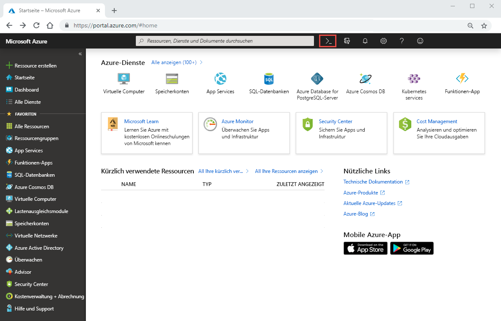
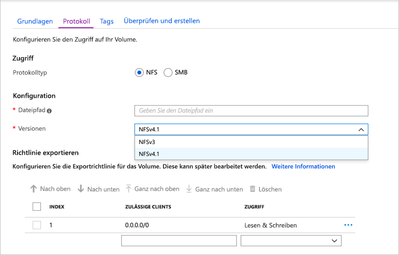
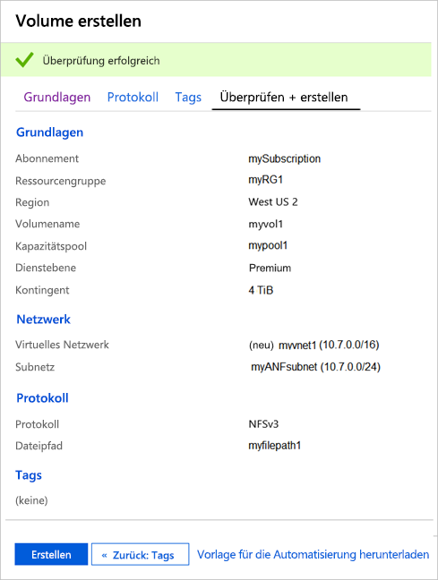
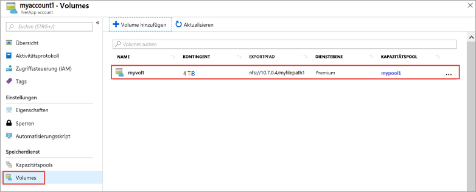

# Schnellstart: Einrichten von Azure NetApp Files und Erstellen eines NFS-Volumes 

In diesem Artikel erfahren Sie, wie Sie auf schnelle Weise Azure NetApp Files einrichten und ein Volume erstellen. 

In dieser Schnellstartanleitung wird Folgendes eingerichtet:

- Registrierung für Azure NetApp Files und NetApp-Ressourcenanbieter
- NetApp-Konto
- Kapazitätspool
- NFS-Volume für Azure NetApp Files

Wenn Sie kein Azure-Abonnement besitzen, können Sie ein [kostenloses Konto](https://azure.microsoft.com/free/?WT.mc_id=A261C142F) erstellen, bevor Sie beginnen.

## Voraussetzungen 

> [!IMPORTANT] 
> Sie müssen Zugriff auf den Azure NetApp Files-Dienst erhalten.  Informationen zum Anfordern des Zugriffs auf den Dienst finden Sie auf der Seite für die [Übermittlung der Azure NetApp Files-Warteliste](https://forms.office.com/Pages/ResponsePage.aspx?id=v4j5cvGGr0GRqy180BHbR8cq17Xv9yVBtRCSlcD_gdVUNUpUWEpLNERIM1NOVzA5MzczQ0dQR1ZTSS4u).  Sie müssen auf eine offizielle Bestätigungs-E-Mail des Azure NetApp Files-Teams warten, bevor Sie fortfahren können. 

## Registrieren für Azure NetApp Files und NetApp-Ressourcenanbieter

1. Klicken Sie im Azure-Portal in der rechten oberen Ecke auf das Azure Cloud Shell-Symbol.

    

2. Geben Sie das Abonnement an, das für Azure NetApp Files in die Whitelist aufgenommen wurde:
    
        az account set --subscription <subscriptionId>

3. Registrieren des Azure-Ressourcenanbieters: 
    
        az provider register --namespace Microsoft.NetApp --wait  

    Der Registrierungsvorgang kann einige Zeit in Anspruch nehmen.

## Erstellen eines NetApp-Kontos

1. Geben Sie im Suchfeld des Azure-Portals **Azure NetApp Files** ein, und wählen Sie in der daraufhin angezeigten Liste die Option **Azure NetApp Files (Vorschauversion)** aus.

      

2. Klicken Sie auf **+ Hinzufügen**, um ein neues NetApp-Konto zu erstellen.

     

3. Geben Sie im Fenster für das neue NetApp-Konto folgende Informationen an: 
   1. Geben Sie **myaccount1** als Kontoname ein. 
   2. Wählen Sie Ihr Abonnement aus.
   3. Wählen Sie **Neu erstellen** aus, um eine neue Ressourcengruppe zu erstellen. Geben Sie **myRG1** als Ressourcengruppenname ein. Klicken Sie auf **OK**. 
   4. Wählen Sie den Standort Ihres Kontos aus.  

        

      

4. Klicken Sie auf **Erstellen**, um Ihr neues NetApp-Konto zu erstellen.

## Einrichten eines Kapazitätspools

1. Wählen Sie auf dem Azure NetApp Files-Verwaltungsblatt Ihr NetApp-Konto (**myaccount1**) aus.

      

2. Klicken Sie auf dem Azure NetApp Files-Verwaltungsblatt Ihres NetApp-Kontos auf **Kapazitätspools**.

      

3. Klicken Sie auf **+ Pools hinzufügen**. 

      

4. Geben Sie Informationen für den Kapazitätspool an: 
    1. Geben Sie **mypool1** als Poolname ein.
    2. Wählen Sie für den Servicelevel die Option **Premium** aus. 
    3. Geben Sie eine Poolgröße von **4 (TiB)** an. 

5. Klicken Sie auf **OK**.

## Erstellen eines NFS-Volumes für Azure NetApp Files

1. Klicken Sie auf dem Azure NetApp Files-Verwaltungsblatt Ihres NetApp-Kontos auf **Volumes**.

      

2. Klicken Sie auf **+ Volume hinzufügen**.

      

3. Geben Sie im Fenster „Volume erstellen“ Informationen für das Volume an: 
   1. Geben Sie **myvol1** als Volumename ein. 
   3. Wählen Sie Ihren Kapazitätspool (**mypool1**) aus.
   4. Übernehmen Sie für das Kontingent den Standardwert. 
   5. Klicken Sie unter „Virtuelles Netzwerk“ auf **Neu erstellen**, um ein neues virtuelles Azure-Netzwerk (VNET) zu erstellen.  Geben Sie anschließend folgende Informationen an:
       * Geben Sie **myvnet1** als VNET-Name ein.
       * Geben Sie einen Adressraum für Ihre Einstellung an (beispielsweise 10.7.0.0/16).
       * Geben Sie **myANFsubnet** als Subnetzname ein.
       * Geben Sie den Subnetzadressbereich an (beispielsweise 10.7.0.0/24). Beachten Sie, dass Sie das dedizierte Subnetz nicht für andere Ressourcen freigeben können.
       * Wählen Sie für die Subnetzdelegierung die Option **Microsoft.NetApp/volumes** aus.
       * Klicken Sie auf **OK**, um das VNET zu erstellen.
   6. Wählen Sie unter „Subnetz“ das neu erstellte VNET (**myvnet1**) als Delegatsubnetz aus.

        

        

4. Klicken Sie auf **Protokoll**, und wählen Sie dann **NFS** als Protokolltyp für das Volume aus.   

    Geben Sie **myfilepath1** als Dateipfad zum Erstellen des Exportpfads für das Volume an. 

    

5. Klicken Sie auf **Überprüfen + erstellen**.

      

5. Überprüfen Sie die Informationen für das Volume, und klicken Sie anschließend auf **Erstellen**.  
    Das erstellte Volume wird auf dem Blatt „Volumes“ angezeigt.

      

## Bereinigen von Ressourcen

Wenn Sie fertig sind, können Sie die Ressourcengruppe bei Bedarf löschen. Das Löschen einer Ressourcengruppe kann nicht rückgängig gemacht werden.  

> [!IMPORTANT]
> Alle Ressourcen innerhalb der Ressourcengruppen werden permanent gelöscht und der Vorgang kann nicht rückgängig gemacht werden. 

1. Geben Sie im Suchfeld des Azure-Portals **Azure NetApp Files** ein, und wählen Sie in der daraufhin angezeigten Liste die Option **Azure NetApp Files** aus.

2. Klicken Sie in der Liste der Abonnements auf die Ressourcengruppe (myRG1), die Sie löschen möchten. 

    

3. Klicken Sie auf der Seite für die Ressourcengruppe auf die Option **Ressourcengruppe löschen**.

     

    Ein Fenster mit der Warnung, dass die Ressourcen mit der Ressourcengruppe gelöscht werden, wird geöffnet.

4. Geben Sie den Namen der Ressourcengruppe (myRG1) ein, um zu bestätigen, dass Sie die Ressourcengruppe und alle darin enthaltenen Ressourcen permanent löschen möchten, und klicken Sie dann auf **Löschen**.

     

## Nächste Schritte  

> [!div class="nextstepaction"]
> [Verwalten von Volumes mithilfe von Azure NetApp Files](azure-netapp-files-manage-volumes.md)  
