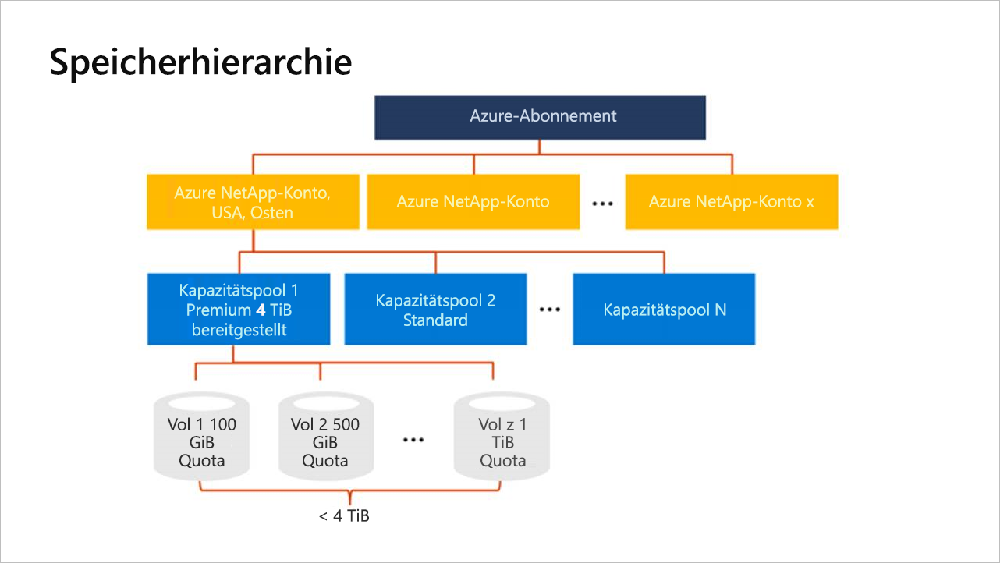

# Grundlegendes zur Speicherhierarchie von Azure NetApp Files

Vor der Erstellung eines Volumes in Azure NetApp Files müssen Sie zunächst einen Pool für bereitgestellte Kapazität erwerben und einrichten.  Um einen Kapazitätspool einrichten zu können, benötigen Sie ein NetApp-Konto. Die Informationen zur Speicherhierarchie sind beim Einrichten und Verwalten Ihrer Azure NetApp Files-Ressourcen hilfreich.

## NetApp-Konten

- Ein NetApp-Konto fungiert als administrative Gruppierung der einzelnen Kapazitätspools.  
- Ein NetApp-Konto ist nicht dasselbe wie Ihr allgemeines Azure-Speicherkonto. 
- Ein NetApp-Konto deckt einen regionalen Bereich ab.   
- Sie können über mehrere NetApp-Konten in einer Region verfügen, jedes NetApp-Konto ist aber an eine einzelne Region gebunden.

## Kapazitätspools

- Ein Kapazitätspool wird anhand der bereitgestellten Kapazität gemessen.  
- Die Kapazität wird durch die festen SKUs bereitgestellt, die Sie erworben haben (beispielsweise eine Kapazität von 4 TB).
- Ein Kapazitätspool kann lediglich einen einzelnen Servicelevel aufweisen.  
  Aktuell steht nur das Servicelevel „Premium“ zur Verfügung.
- Die einzelnen Kapazitätspools gehören jeweils nur zu einem einzelnen NetApp-Konto.  
- Ein Kapazitätspool kann nicht zwischen NetApp-Konten verschoben werden.   
  Im [Konzeptdiagramm der Speicherhierarchie](#conceptual_diagram_of_storage_hierarchy) weiter unten kann beispielsweise der Kapazitätspool 1 nicht aus dem NetApp-Konto für „USA, Osten“ in das NetApp-Konto für „USA, Westen 2“ verschoben werden.  

## Volumes

- Ein Volume wird anhand des logischen Kapazitätsverbrauchs gemessen und kann auf bis zu 100 TB pro Volume skaliert werden.
- Der Kapazitätsverbrauch eines Volumes wird mit der bereitgestellten Kapazität des dazugehörigen Pools verrechnet.
- Jedes Volume gehört zu einem einzelnen Pool, ein Pool kann jedoch mehrere Volumes enthalten. 
- Ein Volume kann innerhalb des gleichen NetApp-Kontos zwischen Pools verschoben werden.    
  Im [Konzeptdiagramm der Speicherhierarchie](#conceptual_diagram_of_storage_hierarchy) weiter unten können beispielsweise die Volumes aus dem Kapazitätspool 1 in den Kapazitätspool 2 verschoben werden.

## Konzeptdiagramm der Speicherhierarchie 
Das folgende Beispiel zeigt die Beziehungen zwischen Azure-Abonnement, NetApp-Konten, Kapazitätspools und Volumes.   

## Nächste Schritte

1. [Erstellen eines NetApp-Kontos](azure-netapp-files-create-netapp-account.md)
2. [Einrichten eines Kapazitätspools](azure-netapp-files-set-up-capacity-pool.md)
3. [Erstellen eines Volumes für Azure NetApp Files](azure-netapp-files-create-volumes.md)
4. [Konfigurieren der Exportrichtlinie für ein Volume (optional)](azure-netapp-files-configure-export-policy.md)