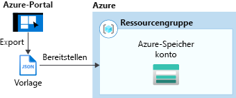
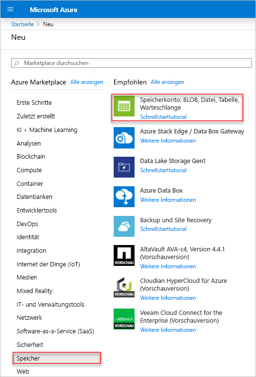
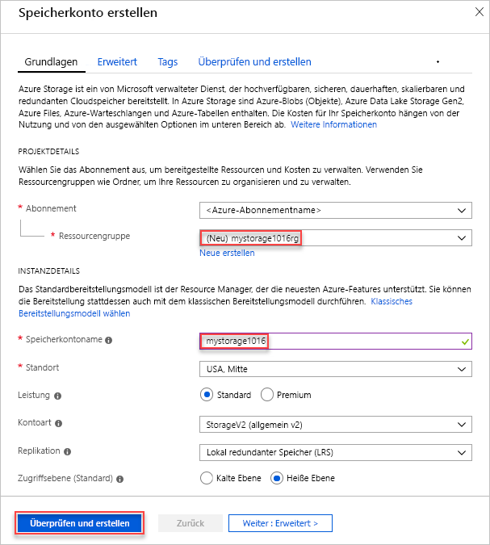
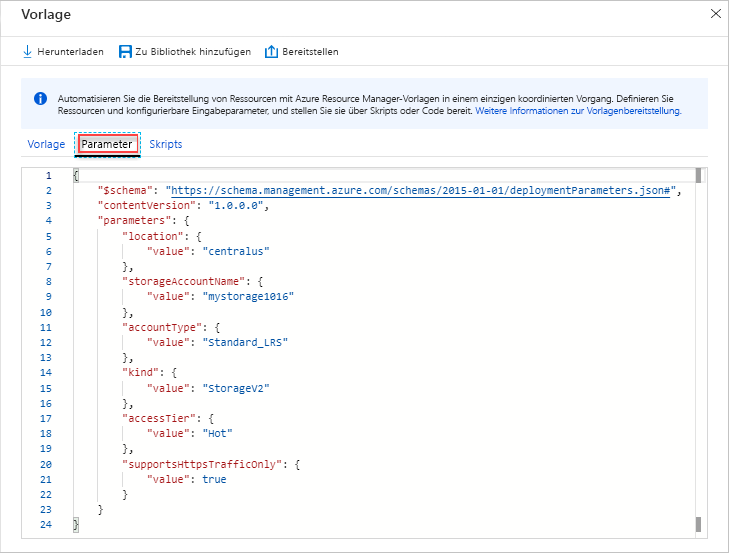
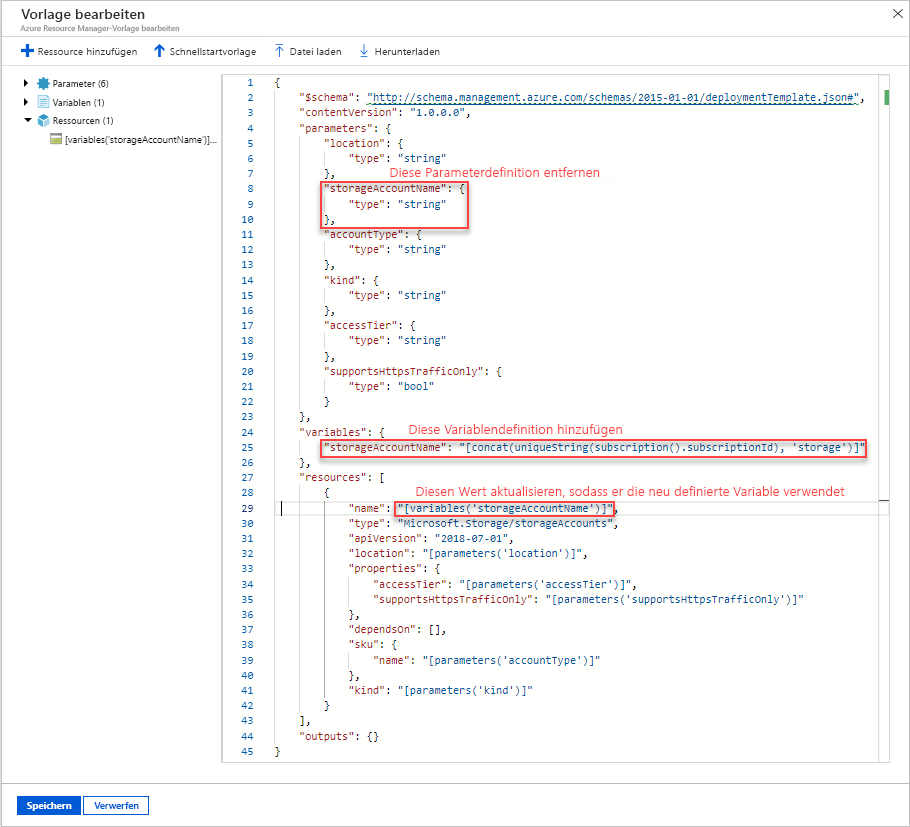
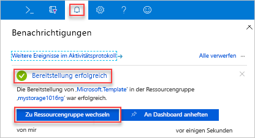
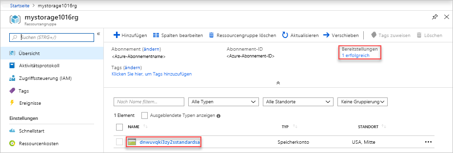

# <a name="quickstart-create-and-deploy-azure-resource-manager-templates-by-using-the-azure-portal"></a>Schnellstart: Erstellen und Bereitstellen von Azure Resource Manager-Vorlagen über das Azure-Portal

Hier erfahren Sie, wie Sie mit dem Azure-Portal eine Resource Manager-Vorlage erstellen und diese dann über das Portal bearbeiten und bereitstellen. Resource Manager-Vorlagen sind JSON-Dateien, mit denen die Ressourcen definiert werden, die Sie für Ihre Lösung bereitstellen müssen. Weitere Informationen zu den Konzepten der Bereitstellung und Verwaltung Ihrer Azure-Lösungen finden Sie unter [Übersicht über Azure Resource Manager-Vorlagen](overview.md).



Nach Abschluss des Tutorials stellen Sie ein Azure Storage-Konto bereit. Andere Azure-Ressourcen werden nach dem gleichen Verfahren bereitgestellt.

Wenn Sie kein Azure-Abonnement besitzen, können Sie ein [kostenloses Konto](https://azure.microsoft.com/free/) erstellen, bevor Sie beginnen.

## <a name="generate-a-template-using-the-portal"></a>Generieren einer Vorlage über das Portal

Das Erstellen einer Resource Manager-Vorlage von Grund auf ist keine einfache Aufgabe, insbesondere dann, wenn Sie noch nicht mit der Azure-Bereitstellung und dem JSON-Format vertraut sind. Über das Azure-Portal können Sie eine Ressource konfigurieren, z.B. ein Azure Storage-Konto. Vor dem Bereitstellen der Ressource können Sie Ihre Konfiguration in eine Resource Manager-Vorlage exportieren. Die Vorlage kann gespeichert und später wiederverwendet werden.

Viele erfahrene Vorlagenentwickler verwenden diese Methode, um Vorlagen zu generieren, wenn sie Azure-Ressourcen bereitstellen möchten, mit denen sie nicht vertraut sind. Weitere Informationen zum Exportieren von Vorlagen über das Portal finden Sie unter [Exportieren von Ressourcengruppen in Vorlagen](../management/manage-resource-groups-portal.md#export-resource-groups-to-templates). Als andere Möglichkeit kann über [Azure-Schnellstartvorlagen](https://azure.microsoft.com/resources/templates/) eine funktionierende Vorlage gesucht werden.

1. Navigieren Sie in einem Webbrowser zum [Azure-Portal](https://portal.azure.com), und melden Sie sich an.
1. Wählen Sie im Menü des Azure-Portals die Option **Ressource erstellen** aus.

    

1. Wählen Sie **Storage** > **Speicherkonto** aus.

    
1. Geben Sie Folgendes ein:

    |Name|value|
    |----|----|
    |**Ressourcengruppe**|Wählen Sie **Neu erstellen** aus, und geben Sie den gewünschten Namen für die Ressourcengruppennamen ein. Auf dem Screenshot lautet der Name der Ressourcengruppe *mystorage1016rg*. Eine Ressourcengruppe ist ein Container für Azure-Ressourcen. Eine Ressourcengruppe vereinfacht das Verwalten von Azure-Ressourcen. |
    |**Name**|Geben Sie einen eindeutigen Namen für Ihr Speicherkonto ein. Der Speicherkontoname muss in Azure eindeutig sein und darf nur Kleinbuchstaben und Ziffern enthalten. Der Name muss zwischen 3 und 24 Zeichen umfassen. Wenn die Fehlermeldung „Der Speicherkontoname ‚mystorage1016‘ wird bereits verwendet“ angezeigt wird, versuchen Sie es mit **&lt;Ihr Name>storage&lt;Aktuelles Datum im Format MMTT>** , z. B. **johndolestorage1016**. Weitere Informationen finden Sie unter [Benennungsregeln und -einschränkungen](/azure/architecture/best-practices/resource-naming).|

    Für die restlichen Eigenschaften können Sie die Standardwerte verwenden.

    

    > [!NOTE]
    > Bei manchen der exportierten Vorlagen sind vor der Bereitstellung noch einige Änderungen erforderlich.

1. Wählen Sie am unteren Bildschirmrand **Überprüfen + erstellen** aus. Wählen Sie im nächsten Schritt nicht **Erstellen** aus.
1. Wählen Sie am unteren Bildschirmrand **Download a template for automation** (Herunterladen einer Vorlage für die Automatisierung) aus. Das Portal zeigt die generierte Vorlage:

    

    Im Hauptbereich wird die Vorlage angezeigt. Dabei handelt es sich um eine JSON-Datei mit sechs übergeordneten Elementen: `schema`, `contentVersion`, `parameters`, `variables`, `resources` und `output`. Weitere Informationen finden Sie unter [Verstehen der Struktur und Syntax von Azure Resource Manager-Vorlagen](./template-syntax.md).

    Sechs Parameter wurden definiert. Einer davon heißt **storageAccountName**. Der zweite hervorgehobene Teil im vorherigen Screenshot veranschaulicht, wie in der Vorlage auf diesen Parameter zu verweisen ist. Im nächsten Abschnitt bearbeiten Sie die Vorlage, um einen generierten Name für das Speicherkonto zu verwenden.

    In der Vorlage ist eine Azure-Ressource definiert. Der Typ ist `Microsoft.Storage/storageAccounts`. Sehen Sie sich die Definition der Ressource und die Definitionsstruktur an.
1. Wählen Sie am oberen Bildschirmrand die Option **Herunterladen** aus.
1. Öffnen Sie die heruntergeladene ZIP-Datei, und speichern Sie **template.json** auf Ihrem Computer. Im nächsten Abschnitt verwenden Sie ein Bereitstellungstool für Vorlagen, um die Vorlage zu bearbeiten.
1. Wählen Sie die Registerkarte **Parameter**, um die von Ihnen angegebenen Werte für die Parameter anzuzeigen. Notieren Sie diese Werte, da Sie diese im nächsten Abschnitt benötigen, wenn Sie die Vorlage bereitstellen.

    

    Mit der Kombination aus Vorlagendatei und Parameterdatei können Sie eine Ressource erstellen. In diesem Tutorial erstellen Sie ein Azure Storage-Konto.

## <a name="edit-and-deploy-the-template"></a>Bearbeiten und Bereitstellen der Vorlage

Das Azure-Portal kann für einige grundlegende Bearbeitungen der Vorlage verwendet werden. In dieser Schnellstartanleitung verwenden Sie ein Portaltool namens *Vorlagenbereitstellung*. *Vorlagenbereitstellung* wird in diesem Tutorial verwendet, damit Sie für das gesamte Tutorial nur eine Schnittstelle benötigen: das Azure-Portal. Komplexere Vorlagen sollten ggf. in [Visual Studio Code](quickstart-create-templates-use-visual-studio-code.md) bearbeitet werden, da dort umfangreichere Bearbeitungsfunktionen zur Verfügung stehen.

> [!IMPORTANT]
> Die Vorlagenbereitstellung bietet eine Schnittstelle zum Testen einfacher Vorlagen. Es wird nicht empfohlen, diese Funktion in der Produktion zu verwenden. Speichern Sie Ihre Vorlagen stattdessen in einem Azure Storage-Konto oder einem Quellcode-Repository wie GitHub.

Azure erfordert, dass jeder Azure-Dienst einen eindeutigen Namen aufweist. Die Bereitstellung schlägt u.U. fehl, wenn Sie einen bereits vorhandenen Speicherkontonamen eingegeben haben. Um dieses Problem zu vermeiden, ändern Sie die Vorlage so, dass durch Aufrufen der Vorlagenfunktion `uniquestring()` ein eindeutiger Speicherkontoname generiert wird.

1. Wählen Sie im Menü des Azure-Portals oder auf der **Startseite** die Option **Ressource erstellen** aus.
1. Geben Sie in **Marketplace durchsuchen** den Begriff **Vorlagenbereitstellung** ein, und drücken Sie dann die **EINGABETASTE**.
1. Wählen Sie **Vorlagenbereitstellung** aus.

    
1. Klicken Sie auf **Erstellen**.
1. Wählen Sie **Eigene Vorlage im Editor erstellen**.
1. Wählen Sie **Datei laden**, und befolgen Sie dann die Anweisungen zum Laden der Datei „template.json“, die Sie im vorherigen Abschnitt heruntergeladen haben.
1. Nehmen Sie die folgenden drei Änderungen an der Vorlage vor:

    

   - Entfernen Sie den Parameter **storageAccountName** wie im vorherigen Screenshot gezeigt.
   - Fügen Sie eine Variable mit der Bezeichnung **storageAccountName** wie im vorherigen Screenshot gezeigt hinzu:

       ```json
       "storageAccountName": "[concat(uniqueString(subscription().subscriptionId), 'storage')]"
       ```

       Zwei Vorlagenfunktionen werden hier verwendet: `concat()` und `uniqueString()`.
   - Aktualisieren Sie das Element „name“ der Ressource **Microsoft.Storage/storageAccounts**, um anstelle des Parameters die neu definierte Variable zu verwenden:

       ```json
       "name": "[variables('storageAccountName')]",
       ```

     Die endgültige Vorlage sollte wie folgt aussehen:

     ```json
     {
       "$schema": "https://schema.management.azure.com/schemas/2015-01-01/deploymentTemplate.json#",
       "contentVersion": "1.0.0.0",
       "parameters": {
           "location": {
               "type": "string"
           },
           "accountType": {
               "type": "string"
           },
           "kind": {
               "type": "string"
           },
           "accessTier": {
               "type": "string"
           },
           "supportsHttpsTrafficOnly": {
               "type": "bool"
           }
       },
       "variables": {
           "storageAccountName": "[concat(uniqueString(subscription().subscriptionId), 'storage')]"
       },
       "resources": [
           {
               "name": "[variables('storageAccountName')]",
               "type": "Microsoft.Storage/storageAccounts",
               "apiVersion": "2018-07-01",
               "location": "[parameters('location')]",
               "properties": {
                   "accessTier": "[parameters('accessTier')]",
                   "supportsHttpsTrafficOnly": "[parameters('supportsHttpsTrafficOnly')]"
               },
               "dependsOn": [],
               "sku": {
                   "name": "[parameters('accountType')]"
               },
               "kind": "[parameters('kind')]"
           }
       ],
       "outputs": {}
     }
     ```
1. Wählen Sie **Speichern** aus.
1. Geben Sie die folgenden Werte ein:

    |Name|value|
    |----|----|
    |**Ressourcengruppe**|Wählen Sie den im letzten Abschnitt erstellten Ressourcengruppenname aus. |
    |**Location**|Wählen Sie einen Standort für das Speicherkonto aus. Beispiel: **USA, Mitte**. |
    |**Kontotyp**|Geben Sie für diese Schnellstartanleitung **Standard_LRS** ein. |
    |**Kind**|Geben Sie für diese Schnellstartanleitung **StorageV2** ein. |
    |**Zugriffsebene**|Geben Sie für diese Schnellstartanleitung **Heiße Ebene** ein. |
    |**Https Traffic Only Enabled** (Nur HTTPS-Datenverkehr aktiviert)| Wählen Sie für diese Schnellstartanleitung die Option **true** aus. |
    |**Ich stimme den oben genannten Geschäftsbedingungen zu**|(auswählen)|

    Hier sehen Sie einen Screenshot einer Beispielbereitstellung:

    

1. Wählen Sie die Option **Kaufen**.
1. Klicken Sie am oberen Bildschirmrand auf das Glockensymbol (Benachrichtigungen), um den Bereitstellungsstatus anzuzeigen. Dieser sollte **Die Bereitstellung wird ausgeführt...** lauten. Warten Sie, bis die Bereitstellung abgeschlossen wurde.

    

1. Wählen Sie im Benachrichtigungsbereich die Option **Zu Ressourcengruppe wechseln** aus. Ein Bildschirm wird angezeigt, der etwa wie folgt aussieht:

    

    Sie können sehen, dass der Bereitstellungsstatus erfolgreich war und nur ein Speicherkonto in der Ressourcengruppe vorhanden ist. Der Name des Speicherkontos ist eine eindeutige Zeichenfolge, die von der Vorlage generiert wird. Weitere Informationen zur Verwendung von Azure-Speicherkonten finden Sie unter [Schnellstart: Hochladen, Herunterladen und Auflisten von Blobs über das Azure-Portal](../../storage/blobs/storage-quickstart-blobs-portal.md).

## <a name="clean-up-resources"></a>Bereinigen von Ressourcen

Wenn Sie die Azure-Ressourcen nicht mehr benötigen, löschen Sie die Ressourcengruppe, um die bereitgestellten Ressourcen zu bereinigen.

1. Klicken Sie im linken Menü des Azure-Portals auf **Ressourcengruppe**.
1. Geben Sie den Namen der Ressourcengruppe in das Feld **Nach Name filtern** ein.
1. Klicken Sie auf den Namen der Ressourcengruppe.  Das Speicherkonto in der Ressourcengruppe wird angezeigt.
1. Klicken Sie im oberen Menü auf **Ressourcengruppe löschen**.

## <a name="next-steps"></a>Nächste Schritte

In diesem Tutorial haben Sie gelernt, wie Sie über das Azure-Portal eine Vorlage generieren und anschließend bereitstellen. In dieser Schnellstartanleitung wurde eine einfache Vorlage mit einer einzelnen Azure-Ressource verwendet. Bei komplexeren Vorlagen empfiehlt es sich, die Vorlage unter Verwendung von Visual Studio Code oder Visual Studio zu entwickeln. Weitere Informationen zur Vorlagenentwicklung finden Sie in unserer neuen Tutorialreihe für Anfänger:

> [!div class="nextstepaction"]
> [Tutorials für Anfänger](./template-tutorial-create-first-template.md)