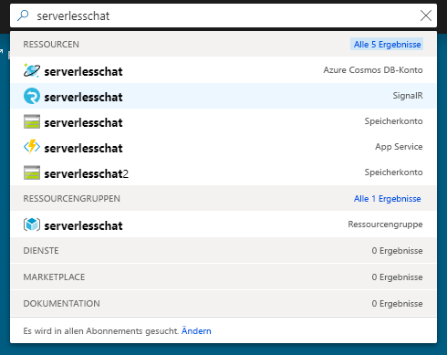

# <a name="quickstart-use-javascript-to-create-a-chat-room-with-azure-functions-and-signalr-service"></a>Schnellstart: Erstellen eines Chatraums mit Azure Functions und SignalR Service mithilfe von JavaScript

Mit Azure SignalR Service können Sie Ihrer Anwendung ganz einfach Echtzeitfunktionen hinzufügen. Azure Functions ist eine serverlose Plattform, mit der Sie Ihren Code ohne Verwaltung von Infrastruktur ausführen können. In dieser Schnellstartanleitung verwenden Sie JavaScript, um eine serverlose Echtzeit-Chatanwendung mithilfe von SignalR Service und Functions zu erstellen.

## <a name="prerequisites"></a>Voraussetzungen

- Ein Code-Editor wie [Visual Studio Code](https://code.visualstudio.com/)
- Ein Azure-Konto mit einem aktiven Abonnement. Sie können [kostenlos ein Konto erstellen](https://azure.microsoft.com/free/?ref=microsoft.com&utm_source=microsoft.com&utm_medium=docs&utm_campaign=visualstudio).
- [Azure Functions Core Tools](https://github.com/Azure/azure-functions-core-tools#installing), Version 2 oder höher. Dient zum lokalen Ausführen von Azure-Funktions-Apps.
- [Node.js](https://nodejs.org/en/download/), Version 10.x

   > [!NOTE]
   > Die Beispiele können auch mit anderen Node.js-Versionen verwendet werden. Weitere Informationen finden Sie in der [Übersicht über die Runtimeversionen von Azure Functions](../azure-functions/functions-versions.md#languages).

> [!NOTE]
> Dieser Schnellstart kann unter MacOS, Windows oder Linux ausgeführt werden.

## <a name="log-in-to-azure"></a>Anmelden an Azure

Melden Sie sich unter <https://portal.azure.com/> mit Ihrem Azure-Konto beim Azure-Portal an.

[!INCLUDE [Create instance](includes/signalr-quickstart-create-instance.md)]

[!INCLUDE [Clone application](includes/signalr-quickstart-clone-application.md)]

## <a name="configure-and-run-the-azure-function-app"></a>Konfigurieren und Ausführen der Azure Functions-App

1. Bestätigen Sie im Browser, in dem das Azure-Portal geöffnet ist, dass die von Ihnen zuvor bereitgestellte SignalR-Dienstinstanz erfolgreich erstellt wurde, indem Sie nach ihrem Namen im Suchfeld oben im Portal suchen. Wählen Sie die Instanz aus, um sie zu öffnen.

    

1. Wählen Sie **Schlüssel** aus, um die Verbindungszeichenfolgen für die SignalR-Dienstinstanz anzuzeigen.

1. Wählen Sie die primäre Verbindungszeichenfolge aus, und kopieren Sie diese.

    

1. Öffnen Sie in Ihrem Code-Editor den Ordner *src/chat/javascript* im geklonten Repository.

1. Benennen Sie *local.settings.sample.json* in *local.settings.json* um.

1. Fügen Sie in **local.settings.json** die Verbindungszeichenfolge in den Wert der **AzureSignalRConnectionString**-Einstellung ein. Speichern Sie die Datei .

1. JavaScript-Funktionen werden in Ordnern organisiert. In jedem Ordner befinden sich zwei Dateien: *function.json* definiert die Bindungen, die in der Funktion verwendet werden, und *index.js* ist der Textkörper der Funktion. Es gibt zwei durch HTTP ausgelöste Funktionen in dieser Funktions-App:

    - **negotiate**: Verwendet die *SignalRConnectionInfo*-Eingabebindung, um gültige Verbindungsinformationen zu generieren und zurückzugeben.
    - **messages**: Empfängt eine Chatnachricht im Anforderungstext und verwendet die *SignalR*-Ausgabebindung, um die Nachricht an alle verbundenen Clientanwendungen zu senden.

1. Stellen Sie im Terminal sicher, dass Sie sich im Ordner *src/chat/javascript* befinden. Führen Sie die Funktions-App aus.

    ```bash
    func start
    ```

    

[!INCLUDE [Run web application](includes/signalr-quickstart-run-web-application.md)]

[!INCLUDE [Cleanup](includes/signalr-quickstart-cleanup.md)]

## <a name="next-steps"></a>Nächste Schritte

In diesem Schnellstart haben Sie eine serverlose Echtzeitanwendung in VS Code erstellt und ausgeführt. Im nächsten Schritt erfahren Sie mehr darüber, wie Sie Azure Functions aus VS Code bereitstellen.

> [!div class="nextstepaction"]
> [Bereitstellen von Azure Functions mit VS Code](/azure/javascript/tutorial-vscode-serverless-node-01)
