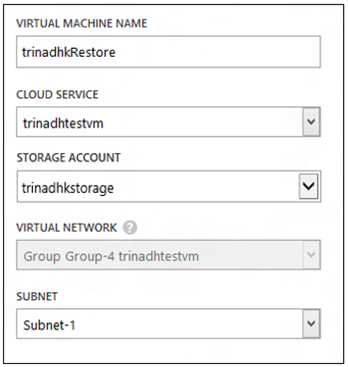

<properties
	pageTitle="Azure Backup - Wiederherstellung eines virtuellen Computers"
	description="Informationen Sie zum Wiederherstellen des virtuellen Computers in Azure"
	services="backup"
	documentationCenter=""
	authors="aashishr"
	manager="shreeshd"
	editor=""/>

<tags
	ms.service="backup"
	ms.workload="storage-backup-recovery"
	ms.tgt_pltfrm="na"
	ms.devlang="na"
	ms.topic="article"
	ms.date="05/27/2015"
	ms.author="aashishr"/>

# Wiederherstellen einer virtuellen Maschine
Sie können einen virtuellen Computer auf einen neuen virtuellen Computer aus die Sicherungen in Azure-sicherungstresor mithilfe der Wiederherstellen-Aktion wiederherstellen.

## Wählen Sie ein Element wiederherstellen

1. Navigieren Sie zu den **geschützte Elemente** Registerkarte, und wählen Sie den virtuellen Computer auf einen neuen virtuellen Computer wiederhergestellt werden sollen.

    

    Die **Wiederherstellungspunkt** Spalte in der **geschützte Elemente** Seite teilt Ihnen die Anzahl der Wiederherstellungspunkte für eine virtuelle Maschine. Die **neueste Wiederherstellungspunkt** Spalte enthält den Zeitpunkt der letzten Sicherung aus dem ein virtuellen Computers wiederhergestellt werden können.

2. Klicken Sie auf **Wiederherstellen** zum Öffnen der **Element wiederherstellen** Assistenten.

    

## Wählen Sie einen Wiederherstellungspunkt

1. In der **Wählen Sie einen Wiederherstellungspunkt** Bildschirm können Sie wiederherstellen aus der neueste Wiederherstellungspunkt oder aus einem früheren Zeitpunkt in der Zeit. Die Standardoption ausgewählt, wenn der Assistent geöffnet ist, neueste Wiederherstellungspunkt.

    

2. Um zu einen früheren Zeitpunkt Zeitpunkt auswählen, wählen Sie die **Datum auswählen** in der Dropdownliste aus, und wählen Sie ein Datum im Kalender-Steuerelement durch Klicken auf das Kalendersymbol. Im Steuerelement alle Datumsangaben in Wiederherstellungspunkte enthalten eine leichte Grauschattierung und können vom Benutzer ausgewählt werden.

    

    Nachdem Sie ein Datum im Kalender-Steuerelement geklickt haben, zeigt die Wiederherstellung verfügbar, dass das Datum in Wiederherstellung Punkte in der folgenden Tabelle angezeigt werden sollen. Die **Zeit** Spalte gibt die Zeit an, in dem die Momentaufnahme erstellt wurde. Die **Typ** Spalte zeigt die [Konsistenz](https://azure.microsoft.com/documentation/articles/backup-azure-vms/#consistency-of-recovery-points) des Wiederherstellungspunkts. Tabelle zeigt die Anzahl der verfügbaren Wiederherstellungspunkte an diesem Tag in Klammern.

    

3. Wählen Sie den Wiederherstellungspunkt aus der **Wiederherstellungspunkte** Tabelle, und klicken Sie auf den Vorwärtspfeil, um zum nächsten Bildschirm zu gelangen.

## Geben Sie einen Zielspeicherort

1. In der **Wählen wiederherstellen Instanz** Bildschirm geben Sie Details, wo Sie die virtuelle Maschine wiederherstellen.

  - Geben Sie den Namen des virtuellen Computers: In einem bestimmten Cloud-Dienst sollte der Name des virtuellen Computers eindeutig sein. Wenn Sie beabsichtigen, einen vorhandenen virtuellen Computer mit dem gleichen Namen zu ersetzen, zuerst den vorhandenen virtuellen Computer und den Datenträger und dann wiederherzustellen Sie die Daten aus der Azure-Sicherung.
  - Wählen Sie einen Cloud-Dienst für die VM: Dies ist für das Erstellen eines virtuellen Computers erforderlich. Sie können entweder einen vorhandenen Clouddienst verwenden oder einen neuen Clouddienst erstellen.

        Whatever cloud service name is picked should be globally unique. Typically, the cloud service name gets associated with a public-facing URL in the form of [cloudservice].cloudapp.net. Azure will not allow you to create a new cloud service if the name has already been used. If you choose to create select create a new cloud service, it will be given the same name as the virtual machine – in which case the VM name picked should be unique enough to be applied to the associated cloud service.

        We only display cloud services and virtual networks that are not associated with any affinity groups in the restore instance details. [Learn More](https://msdn.microsoft.com/en-us/library/azure/jj156085.aspx).

2. Wählen Sie ein Speicherkonto für die VM: Dies ist erforderlich für das Erstellen des virtuellen Computers. Sie können aus vorhandenen Speicherkonten in der gleichen Region wie der Tresor der Azure-Sicherung auswählen. Speicherkonten unterstützt nicht, die Zone redundant sein oder eine Premium-Speichertyp.

    Treten keine Speicherkonten mit unterstützten Konfigurationen, erstellen Sie ein Speicherkonto Konfiguration vor Beginn der Restore-Vorgang unterstützt.

    

3. Wählen Sie ein virtuelles Netzwerk: das virtuelle Netzwerk (VNET) für den virtuellen Computer zum Zeitpunkt der Erstellung des virtuellen Computers ausgewählt werden. Die Wiederherstellung wird UI alle VNETs innerhalb dieses Abonnements, die verwendet werden kann. Es ist nicht notwendig, eine VNET für die wiederhergestellte VM auswählen können – mit dem wiederhergestellten virtuellen Computer über das Internet eine Verbindung herstellen können, selbst wenn das VNET nicht angewendet wird.

    Wenn der Cloud-Dienst aktiviert ein virtuelles Netzwerk zugeordnet ist, können Sie das virtuelle Netzwerk nicht ändern.

    

4. Wählen Sie ein Subnetz: für den Fall, dass das VNET Subnetze verfügt, wird standardmäßig das erste Subnetz ausgewählt. Wählen Sie Optionen im Subnetz Ihrer Wahl. Subnetdetails finden Sie unter Netzwerke-Erweiterung in der [Startseite Portals](https://manage.windowsazure.com/), fahren Sie mit virtuellen Netzwerken und wählen Sie das virtuelle Netzwerk und Drilldown zu konfigurieren, um die Subnetdetails finden Sie unter.

    

5. Klicken Sie auf die **Senden** Symbol im Assistenten, um die Details zu übermitteln, und erstellen ein Wiederherstellungsauftrag.

## Nachverfolgen des Wiederherstellungsvorgangs
Nach dem Eingeben aller Informationen in den Wiederherstellungs-Assistenten und übermittelt es versucht Azure-Sicherung, einen Auftrag, um den Wiederherstellungsvorgang zu verfolgen.

Schaffung von Arbeitsplätzen erfolgreich ist, sehen Sie, dass ein Toast Benachrichtigung, der Auftrag erstellt wird. Sie können weitere Details abrufen, indem Sie auf die **Auftrag anzeigen** Schaltfläche, die Sie auf **Aufträge** Registerkarte.

Nach dem Abschluss des Wiederherstellungsvorgangs versehen als abgeschlossen **Aufträge** Registerkarte.

Nach dem Wiederherstellen des virtuellen Computers müssen Sie möglicherweise die Erweiterungen, die auf den ursprünglichen virtuellen Computer erneut installieren und [neu erstellen die Endpunkte](virtual-machines-set-up-endpoints) für den virtuellen Computer im Azure-Portal.

## Problembehandlung
Bei den meisten Fehlern befolgen Sie die empfohlene Aktion vorgeschlagen, die in die Fehlerdetails. Hier sind einige weitere Punkte, die bei der Problembehandlung helfen:

| Sicherungsvorgang | Fehlerdetails | Problemumgehung |
| -------- | -------- | -------|
| Wiederherstellen | Cloud-interner Fehler bei der Wiederherstellung | <ol><li>Cloud-Dienst, die Sie wiederherstellen möchten, ist mit DNS-Einstellungen konfiguriert. Sie können überprüfen,  $deployment = "ServiceName" Get-AzureDeployment - ServiceName-Slot "Produktion" Get-AzureDns - DnsSettings $deployment. DnsSettings ist Adresse konfiguriert wurde, dies bedeutet, dass die DNS-Einstellungen konfiguriert werden.  <li>Cloud-Diensts, an die Sie wiederherstellen möchten, die mit reservierte IP-Adressen konfiguriert ist und vorhandene virtuelle Computer im Cloud-Dienst im angehaltenen Zustand sind. Sehen Sie ein Cloud-Dienst verfügt über IP mit folgendem Powershell-Cmdlets reserviert: $deployment = "Servicename" Get-AzureDeployment - ServiceName-Slot "Produktion" $ Datenausführungsverhinderung. ReservedIPName</ol> |

## Nächste Schritte
- [Verwalten von virtuellen Computern](backup-azure-manage-vms)

<!---HONumber=GIT-SubDir-->