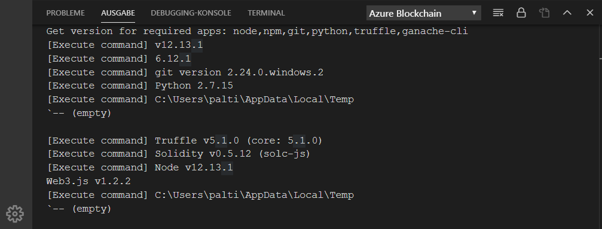
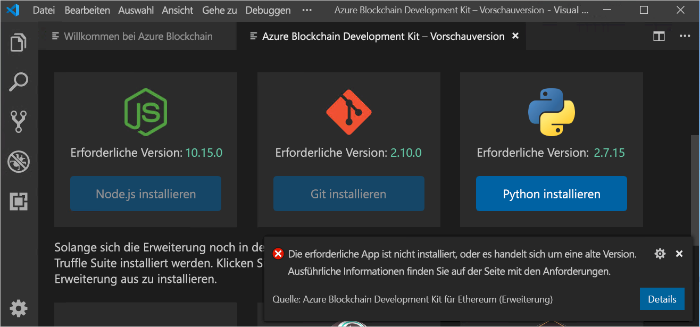

# Schnellstart: Herstellen einer Verbindung mit einem Azure Blockchain Service-Konsortiumsnetzwerk mithilfe von Visual Studio Code

In diesem Schnellstart installieren und verwenden Sie das Azure Blockchain Development Kit für die Ethereum-Erweiterung in Visual Studio Code zum Anfügen an ein Konsortium in Azure Blockchain Service. Das Azure Blockchain Development Kit vereinfacht die Erstellung, Verbindung und Bereitstellung von Smart Contracts in Ethereum-Ledgern. 

[!INCLUDE [quickstarts-free-trial-note](../../../includes/quickstarts-free-trial-note.md)]

## Voraussetzungen

* [Quickstart: Create a blockchain member using the Azure portal (Schnellstart: Erstellen eines Blockchainmitglieds über das Azure-Portal)](create-member.md) oder [Schnellstart: Erstellen eines Blockchainmitglieds für den Azure Blockchain-Dienst mithilfe der Azure CLI](create-member-cli.md)
* [Visual Studio Code](https://code.visualstudio.com/Download)
* [Azure Blockchain Development Kit für Ethereum-Erweiterung](https://marketplace.visualstudio.com/items?itemName=AzBlockchain.azure-blockchain)
* [Node.js](https://nodejs.org)
* [Git-Client](https://git-scm.com)
* [Python](https://www.python.org/downloads/release/python-2715/). Fügen Sie Ihrem Pfad „python. exe“ hinzu. Python ist in Ihrem Pfad für das Azure Blockchain Development Kit erforderlich.
* [Truffle](https://www.trufflesuite.com/docs/truffle/getting-started/installation)
* [Ganache CLI](https://github.com/trufflesuite/ganache-cli)

### Überprüfen der Azure Blockchain Development Kit-Umgebung

Mit dem Azure Blockchain Development Kit wird überprüft, ob die Voraussetzungen für Ihre Entwicklungsumgebung erfüllt wurden. Bereiten Sie Ihre Entwicklungsumgebung wie folgt vor:

Wählen Sie in der VS Code-Befehlspalette die Option **Azure Blockchain: Show Welcome Page** (Azure Blockchain: Willkommensseite anzeigen).

Das Azure Blockchain Development Kit führt ein Überprüfungsskript mit einer Dauer von ca. einer Minute aus. Sie können die Ausgabe anzeigen, indem Sie **Terminal > New Terminal** (Terminal > Neues Terminal) wählen. Wählen Sie in der Menüleiste des Terminals die Registerkarte **Output** (Ausgabe) und in der Dropdownliste dann **Azure Blockchain**. Eine erfolgreiche Überprüfung sieht in etwa wie in der folgenden Abbildung aus:

 Falls ein benötigtes Tool fehlt, können Sie eine neue Registerkarte mit dem Namen **Azure Blockchain Development Kit – Preview** (Azure Blockchain Development Kit: Vorschauversion) verwenden. Darauf sind die erforderlichen Apps, die installiert werden müssen, und die Links zum Herunterladen der Tools aufgeführt.

Installieren Sie ggf. fehlende Voraussetzungen, bevor Sie mit dem Schnellstart fortfahren.

## Herstellen einer Verbindung mit dem Konsortiumsmitglied

Sie können eine Verbindung mit Konsortiumsmitgliedern herstellen, indem Sie die VS Code-Erweiterung für das Azure Blockchain Development Kit verwenden. Nachdem die Verbindung mit einem Konsortium hergestellt wurde, können Sie Smart Contracts kompilieren, erstellen und für ein Azure Blockchain Service-Konsortiumsmitglied bereitstellen.

Falls Sie keinen Zugriff auf ein Azure Blockchain Service-Konsortiumsmitglied haben, müssen Sie als Voraussetzung [Quickstart: Create a blockchain member using the Azure portal (Schnellstart: Erstellen eines Blockchainmitglieds über das Azure-Portal)](create-member.md) oder [Schnellstart: Erstellen eines Blockchainmitglieds für den Azure Blockchain-Dienst mithilfe der Azure CLI](create-member-cli.md) durcharbeiten.

1. Erweitern Sie im VS Code-Explorer-Bereich (Visual Studio Code) die Erweiterung **Azure Blockchain**.
1. Wählen Sie die Option **Connect to Consortium** (Verbindung mit Konsortium herstellen).

   

    Befolgen Sie die Anweisungen zum Authentifizieren per Browser, wenn Sie zum Durchführen der Azure-Authentifizierung aufgefordert werden.
1. Wählen Sie in der Dropdownliste der Befehlspalette die Option **Connect to Azure Blockchain Service consortium** (Verbindung mit Azure Blockchain Service-Konsortium herstellen).
1. Wählen Sie das Abonnement und die Ressourcengruppe aus, das bzw. die Ihrem Azure Blockchain Service-Konsortiumsmitglied zugeordnet ist.
1. Wählen Sie Ihr Konsortium in der Liste aus.

Die Konsortiums- und Blockchainmitglieder sind im Visual Studio Explorer in der Seitenleiste aufgeführt.

## Nächste Schritte

In diesem Schnellstart haben Sie das Azure Blockchain Development Kit für die Ethereum-Erweiterung in Visual Studio Code zum Anfügen an ein Konsortium in Azure Blockchain Service verwendet. Im nächsten Tutorial erfahren Sie, wie Sie das Azure Blockchain Development Kit für Ethereum und Truffle verwenden, um eine Smart Contract-Funktion über eine Transaktion zu erstellen, bereitstellen und auszuführen.

> [!div class="nextstepaction"]
> [Erstellen und Bereitstellen von Smart Contracts mithilfe von Visual Studio Code](send-transaction.md)