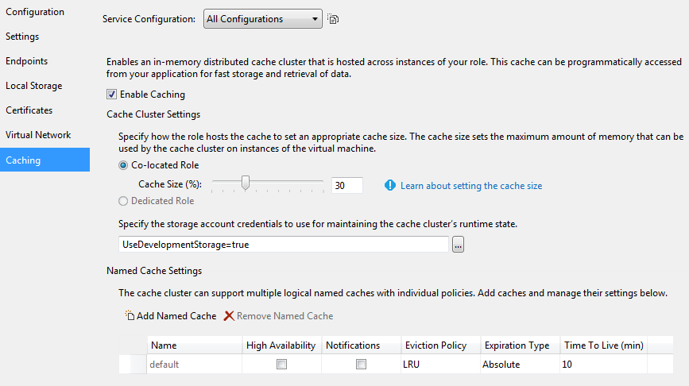
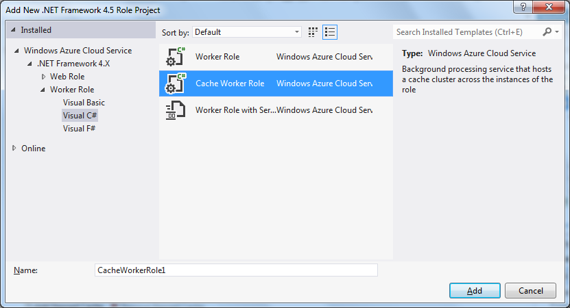
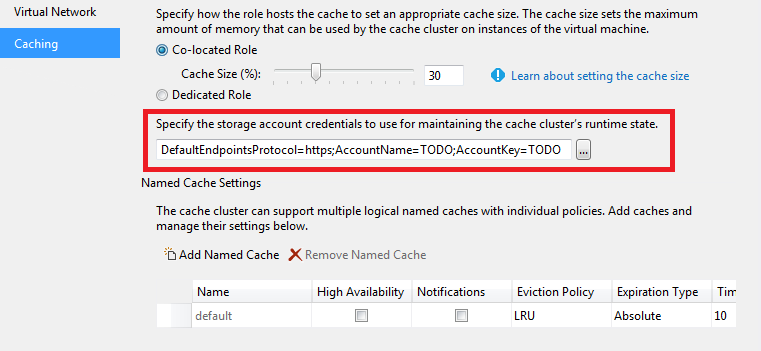
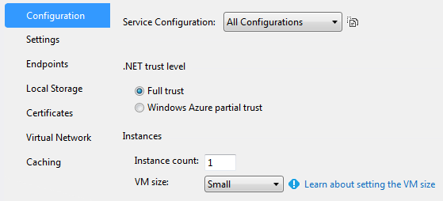
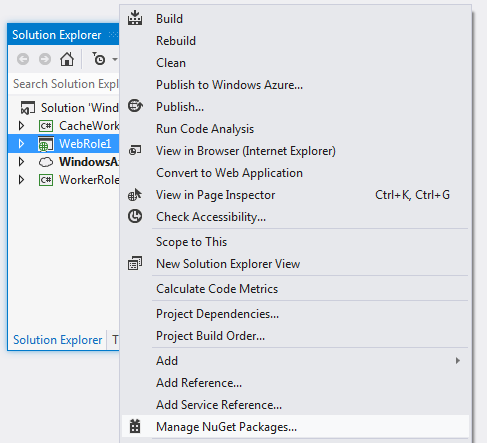
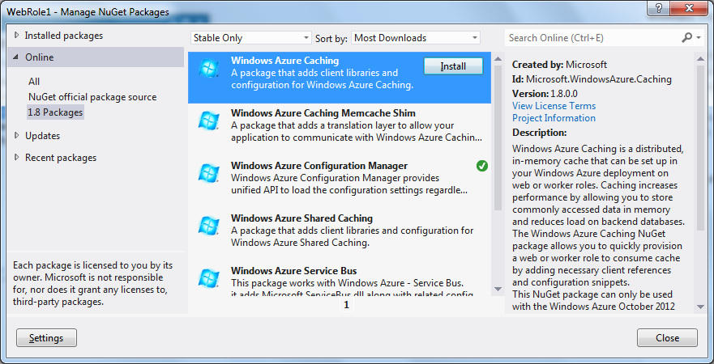

<properties linkid="Contact - Support" urlDisplayName="Caching" pageTitle="How to use In-Role Cache (.NET) - Azure feature guide" metaKeywords="Azure cache, Azure caching, Azure cache, Azure caching, Azure store session state, Azure cache .NET, Azure cache C#" description="Learn how to use Azure In-Role Cache. The samples are written in C# code and use the .NET API." metaCanonical="" services="cache" documentationCenter=".NET" title="How to Use In-Role Cache for Azure Cache" authors="" solutions="" manager="" editor="" />

Verwenden des In-Role Caches (Azure Cache)
==========================================

Dieser Leitfaden zeigt Ihnen die ersten Schritte mit **In-Role Cache für Azure Cache**. Die Beispiele sind in C\#-Code geschrieben und es wird die .NET-API verwendet. Es werden folgende Szenarien vorgestellt: **Konfigurieren eines Cacheclusters**, **Konfigurieren von Cacheclients**, **Hinzufügen und Entfernen von Objekten vom Cache, Speichern des ASP.NET-Sitzungszustands im Cache** und **Aktivieren des ASP.NET-Seitenausgabecaches mithilfe des Cache**. Weitere Informationen zur Verwendung des In-Role Cache erhalten Sie unter [Nächste Schritte](#next-steps).

Inhaltsverzeichnis
------------------

-   [Was ist ein In-Role Cache?](#what-is)
-   [Erste Schritte mit dem In-Role Cache](#getting-started-cache-role-instance)
    -   [Konfigurieren eines Cacheclusters](#enable-caching)
    -   [Konfigurieren der Cacheclients](#NuGet)
-   [Arbeiten mit Caches](#working-with-caches)
    -   [Vorgehensweise: Erstellen eines DataCache-Objekts](#create-cache-object)
    -   [Vorgehensweise: Hinzufügen zu und Abrufen eines Objekts aus dem Cache](#add-object)
    -   [Vorgehensweise: Angeben des Ablaufs eines Objekts im Cache](#specify-expiration)
    -   [Vorgehensweise: Speichern des ASP.NET-Sitzungsstatus im Cache](#store-session)
    -   [Vorgehensweise: Speichern der ASP.NET-Seitenausgabe im Cache](#store-page)
-   [Nächste Schritte](#next-steps)

## Was ist ein In-Role Cache?

In-Role Caches bieten eine Caching-Schicht für Azure-Anwendungen. Das Caching erhöht die Leistung, indem es Daten vorübergehend im Speicher anderer Backend-Quellen speichert. Außerdem kann es die Kosten in Zusammenhang mit Datenbanktransaktionen in der Cloud reduzieren. Der In-Role Cache umfasst folgende Features:

-   Vorbereitete ASP.NET-Anbieter für Sitzungsstatus und Seitenausgabecaching für schnellere Webanwendungen, ohne Änderung des Anwendungscodes
-   Zwischenspeichern beliebiger serialisierbarer verwalteter Objekte, z. B.: CLR-Objekte, Zeilen, XML und Binärdaten
-   Konsistentes Entwicklungsmodell für Azure und Windows Server AppFabric

In-Role Cache bietet eine neue Möglichkeit, um Cachings durchzuführen, indem ein Teil des Speichers der virtuellen Maschine verwendet wird, der die Rolleninstanz Ihrer Azure Cloud Services (auch als gehostete Dienste bekannt) hostet. Dadurch erhalten Sie eine höhere Flexibilität bei der Bereitstellung, die Caches können sehr groß sein und es gibt keine Cache-spezifischen Beschränkungen.

Das Caching von Rolleninstanzen bietet folgende Vorteile:

-   Keine Zusatzkosten für das Caching. Sie zahlen lediglich für die Rechenressourcen, die den Cache hosten.
-   Beschränkungen und Engpässe werden eliminiert.
-   Mehr Kontrolle und Isolation.
-   Verbesserte Leistung.
-   Caches werden automatisch in der Größe angepasst, wenn Rollen vergrößert oder verkleinert werden. Effektives Skalieren des Speichers, der für das Caching zur Verfügung seht, wenn Rolleninstanzen hinzugefügt oder entfernt werden.
-   Genaues Entwicklungszeit-Debugging
-   Unterstützung des Memcache-Protokolls

Darüber hinaus bietet das Caching von Rolleninstanzen die folgenden konfigurierbaren Optionen:

-   Konfigurieren einer dedizierten Rolle für das Caching oder Zusammenstellen des Cachings auf bereits bestehenden Rollen.
-   Bereitstellen des Caches für verschiedene Clients in der gleichen Cloud-Dienstbereitstellung
-   Erstellen unterschiedlich bezeichneter Caches mit verschiedenen Eigenschaften
-   Optionales Konfigurieren hoher Verfügbarkeit individueller Caches
-   Verwenden erweiterter Caching-Funktionen wie Regionen, Tagging und Benachrichtigungen

Dieser Leitfaden bietet einen Überblick über die ersten Schritte mit In-Role Cache. Detaillierte Informationen zu diesen Features, die über den Rahmen dieses Leitfadens hinausgehen, finden Sie unter [Überblick In-Role Cache](http://go.microsoft.com/fwlink/?LinkId=254172).

## Erste Schritte mit dem In-Role Cache

In-Role Cache bietet eine Möglichkeit, um das Caching über den Speicher der virtuellen Maschine zu aktivieren, der Ihre Rolleninstanzen hostet. Die Rolleninstanzen, die Ihre Caches hosten, werden als **Cachecluster** bezeichnet. Es gibt zwei Bereitstellungstopologien für das Caching auf Rolleninstanzen:

-   **Dediziertes Rollencaching**: Die Rolleninstanzen werden ausschließlich für das Caching verwendet.
-   **Zusammengestelltes Rollencaching**: Der Cache teilt die VM-Ressourcen (Bandbreite, CPU und Speicher) mit der Anwendung.

Um das Caching auf Rolleninstanzen zu verwenden, müssen Sie einen Cachecluster und anschließend die Cacheclients konfigurieren, damit sie auf den Cachecluster zugreifen können.

-   [Konfigurieren eines Cacheclusters](#enable-caching)
-   [Konfigurieren der Cacheclients](#NuGet)

## Konfigurieren eines Cacheclusters

Zum Konfigurieren eines **Zusammengestellten Rollencacheclusters** müssen Sie die Rolle auswählen, in der Sie den Cachecluster hosten möchten. Klicken Sie im **Projektmappen-Explorer** mit der rechten Maustaste auf die Rolleneigenschaften und wählen Sie **Eigenschaften**.

Gehen Sie zur Registerkarte **Caching**, markieren Sie das Kästchen **Caching aktivieren**, und geben Sie die gewünschten Cachingoptionen an. Wenn das Caching in einer **Workerrolle** oder einer **ASP.NET- Webrolle** aktiviert ist, lautet die Standardeinstellung wie folgt: **Zusammengestelltes Rollencaching**, wobei 30 % des Speichers für die Rolleninstanzen dem Caching zugewiesen sind. Es wird automatisch ein Standardcache konfiguriert. Wenn gewünscht können weitere Caches mit anderen Namen erstellt werden, die ebenfalls den zugewiesenen Speicher teilen.

Fügen Sie eine **Cache-Workerrolle** zu Ihrem Projekt hinzu, um einen **Dedizierten Rollencachecluster** zu konfigurieren.

Wenn eine **Cache-Workerrolle** zu einem Projekt hinzugefügt wird, lautet die Standardkonfiguration **Dediziertes Rollencaching**.

Sobald das Caching aktiviert ist, kann das Cachecluster-Speicherkonto konfiguriert werden. In-Role Cache erfordert ein Azure-Speicherkonto. Das Speicherkonto wird verwendet, um Konfigurationsdaten für den Cachecluster aufzubewahren, auf den von allen virtuellen Maschinen zugegriffen wird, die dem Cachecluster zugewiesen sind. Das Speicherkonto wird auf der Cachecluster-Eigenschaftenseite auf der Registerkarte **Caching** direkt oberhalb der **Benannten Cacheeinstellungen** festgelegt.

> Wird das Speicherkonto nicht konfiguriert, kann die Rolle nicht gestartet werden.

Die Größe des Cache ergibt sich aus einer Kombination der VM-Größe der Rolle, der Anzahl der Instanzen der Rolle und der Art des Clusters, d. h. sie hängt davon ab, ob der Cachecluster als dedizierter Rollen- oder als zusammengestellter Rollencachecluster konfiguriert wird.

> In diesem Abschnitt finden Sie eine vereinfachte Übersicht über die Konfiguration der Cachegröße. Weitere Informationen zur Cachegröße und zur Kapazitätenplanung erhalten Sie unter [In-Role Cache – Erwägungen bezüglich der Kapazitätsplanung](http://go.microsoft.com/fwlink/?LinkId=252651).

Klicken Sie zum Konfigurieren der Größe der virtuellen Maschine und der Anzahl der Instanzen mit der rechten Maustaste im **Projektmappen-Explorer** auf "Rolleneigenschaften" und wählen Sie **Eigenschaften**.

Gehen Sie zur Registerkarte **Konfiguration**. Die standardmäßig festgelegte **Anzahl der Instanzen** ist 1 und die **Größe der VM** ist standardmäßig als **Klein** festgelegt.

Gesamter verfügbarer Speicher für die verschiedenen VM-Größen:

-   **Klein**: 1,75 GB
-   **Mittel**: 3,5 GB
-   **Groß**: 7 GB
-   **Extragroß**: 14 GB

> Die Speichergrößen beziehen sich auf den gesamten Speicherplatz, der der VM zur Verfügung steht und für das Betriebssystem, Cacheprozesse, Cachedaten und Anwendungen geteilt wird. Weitere Informationen zur Konfiguration der Größe virtueller Maschinen finden Sie unter [Konfiguration der Größe einer virtuellen Maschine](http://go.microsoft.com/fwlink/?LinkId=164387). Beachten Sie, dass **besonders kleine** virtuelle Maschinen das Caching nicht unterstützen.

Wird **Zusammengestelltes Rollencaching** festgelegt, wird die Cachegröße gemäß des prozentualen Anteils des Speichers der virtuellen Maschine festgelegt. Wird **Dediziertes Rollencaching** festgelegt, wird der gesamte Speicher, der der virtuellen Maschine zur Verfügung steht, für das Caching verwendet. Wenn zwei Rolleninstanzen konfiguriert werden, wird der gemeinsame Speicher der virtuellen Maschinen verwendet. Dadurch entsteht ein Cachecluster, bei dem der verfügbare Cachingspeicher auf mehrere Rolleninstanzen verteilt wird, der den Cacheclients jedoch als einzelne Ressource zur Verfügung steht. Die Konfiguration zusätzlicher Rolleninstanzen erhöht die Cachegröße auf die gleiche Art und Weise. Die Einstellungen, die nötig sind, um diese Cachegröße bereitzustellen, finden Sie in der Tabelle für die Kapazitätsplanung unter [In-Role Cache – Erwägungen bezüglich der Kapazitätsplanung](http://go.microsoft.com/fwlink/?LinkId=252651).

Sobald der Cachecluster konfiguriert wurde, können Sie die Cacheclients konfigurieren, um Zugriff auf den Cache zu erlauben.

## Konfigurieren der Cacheclients

Um auf einen In-Role Cache zugreifen zu können, müssen die Clients in der gleichen Bereitstellung konfiguriert werden. Handelt es sich bei dem Cachecluster um einen dedizierten Rollencachecluster, sind die Clients in der Bereitstellung andere Rollen. Handelt es sich bei dem Cachecluster um einen zusammengestellten Rollencachecluster, können die Clients entweder die anderen Rollen in der Bereitstellung oder die Rollen selbst sein, die den Cachecluster hosten. Es wird ein NuGet-Paket bereitgestellt, das für die Konfiguration der einzelnen Clientrollen, die auf den Cache zugreifen, verwendet werden kann. Klicken Sie zum Konfigurieren einer Rolle für den Zugriff auf einen Cachecluster mithilfe des Caching NuGet-Pakets mit der rechten Maustaste im**Projektmappen-Explorer** auf das Rollenprojekt, und wählen Sie **NuGet-Pakete verwalten** aus.

Wählen Sie **In-Role Cache**, klicken Sie auf **Installieren** und anschließend auf **Akzeptieren**.

> Wird der **In-Role Cache** nicht in der Liste angezeigt, geben Sie **WindowsAzure.Caching** in das Feld **Onlinesuche** ein, und wählen Sie ihn aus den Ergebnissen aus.

Funktionen des NuGet-Pakets: Es fügt die erforderliche Konfiguration zur Konfigurationsdatei der Rolle hinzu; es fügt eine Cacheclient-Einstellung für die Diagnoseebene zur Datei "ServiceConfiguration.cscfg der Azure-Anwendung hinzu und es fügt die erforderlichen Assemblyverweise hinzu.

> Für ASP.NET-Webrollen fügt das Caching NuGet-Paket außerdem zwei auskommentierte Abschnitte zu web.config hinzu. Der erste Abschnitt sorgt dafür, dass der Sitzungsstatus im Cache gespeichert wird, und der zweite Abschnitt ermöglicht das ASP.NET-Seitenausgabecaching. Weitere Informationen finden Sie unter [Vorgehensweise: Speichern des ASP.NET-Sitzungsstatus im Cache](#store-session) und [Vorgehensweise: Speichern der ASP.NET-Seitenausgabe im Cache](#store-page).

Das NuGet-Paket fügt die folgenden Konfigurationselemente zu web.config oder app.config der Rolle hinzu. Unter dem Element **configSections** werden **dataCacheClients** und **cacheDiagnostics** Abschnitte hinzugefügt. Wenn kein **configSections**-Element vorhanden ist, wird es als untergeordnetes Element des **configuration**-Elements erstellt.

    <configSections>
      <!-- Vorhandene Abschnitte aus Gründen der Übersichtlichkeit weggelassen. -->

      <section name="dataCacheClients" 
               type="Microsoft.ApplicationServer.Caching.DataCacheClientsSection, Microsoft.ApplicationServer.Caching.Core" 
               allowLocation="true" 
               allowDefinition="Everywhere" />

      <section name="cacheDiagnostics" 
               type="Microsoft.ApplicationServer.Caching.AzureCommon.DiagnosticsConfigurationSection, Microsoft.ApplicationServer.Caching.AzureCommon" 
               allowLocation="true" 
               allowDefinition="Everywhere" />
    </configSections>

Diese neuen Abschnitte umfassen Referenzen auf ein **dataCacheClients** Element und ein **cacheDiagnostics** Element. Diese Elemente werden außerdem zum Element **Konfiguration** hinzugefügt.

    <dataCacheClients>
      <dataCacheClient name="default">
        <autoDiscover isEnabled="true" identifier="[Cachecluster-Rollenname]" />
        <!--<localCache isEnabled="true" sync="TimeoutBased" objectCount="100000" ttlValue="300" />-->
      </dataCacheClient>
    </dataCacheClients>
    <cacheDiagnostics>
      <crashDump dumpLevel="Off" dumpStorageQuotaInMB="100" />
    </cacheDiagnostics>

Ersetzen Sie nach Hinzufügen der Konfiguration **[Cachecluster-Rollenname]** mit dem Namen der Rolle, die den Cachecluster hostet.

> Wird **[Cachecluster-Rollenname]** nicht mit dem Namen der Rolle, die den Cachecluster hostet, ersetzt, wird eine **TargetInvocationException** ausgelöst, wenn auf den Cache mit **DatacacheException** zugegriffen wird. Es wird folgende Meldung angezeigt: "Es ist keine derartige Rolle vorhanden".

Das NuGet-Paket fügt außerdem die Einstellung **ClientDiagnosticLevel** zu den **ConfigurationSettings** der Cacheclientrolle in ServiceConfiguration.cscfg hinzu. Das folgende Beispiel entspricht dem Abschnitt **WebRole1** einer ServiceConfiguration.cscfg Datei mit einem **ClientDiagnosticLevel** von 1. Dabei handelt es sich um die Standardeinstellung des **ClientDiagnosticLevel**.

    <Role name="WebRole1">
      <Instances count="1" />
      <ConfigurationSettings>
        <!-- Vorhandene Einstellungen aus Gründen der Übersichtlichkeit weggelassen. -->
        <Setting name="Microsoft.WindowsAzure.Plugins.Caching.ClientDiagnosticLevel" 
                 value="1" />
      </ConfigurationSettings>
    </Role>

> Der In-Role Cache bietet sowohl einen Cacheserver als auch eine Cacheclient-Diagnosestufe. Die Diagnosestufe ist eine einzelne Einstellung, die festlegt, welche Diagnosedaten für das Caching gesammelt werden. Weitere Informationen finden Sie unter [Problembehebung und Diagnose für In-Role Caches](http://msdn.microsoft.com/de-de/library/windowsazure/hh914135.aspx)

Das NuGet-Paket fügt außerdem Referenzen zu den folgenden Assemblys hinzu:

-   Microsoft.ApplicationServer.Caching.Client.dll
-   Microsoft.ApplicationServer.Caching.Core.dll
-   Microsoft.WindowsFabric.Common.dll
-   Microsoft.WindowsFabric.Data.Common.dll
-   Microsoft.ApplicationServer.Caching.AzureCommon.dll
-   Microsoft.ApplicationServer.Caching.AzureClientHelper.dll

Handelt es sich bei Ihrer Rolle um eine ASP.NET-Webrolle, wird auch die folgende Assembly hinzugefügt:

-   Microsoft.Web.DistributedCache.dll.

> Diese Assemblys befinden sich im Ordner C:\\Program Files\\Microsoft SDKs\\Windows Azure\\.NET SDK\\2012-10\\ref\\Caching\\.

Nachdem die Zwischenspeicherung im Clientprojekt konfiguriert wurde, können Sie die in den folgenden Abschnitten beschriebenen Methoden verwenden, um mit dem Cache zu arbeiten.

## Arbeiten mit Caches

Die folgenden Schritte in diesem Abschnitt beschreiben, wie allgemeine Aufgaben in Bezug auf das Caching durchgeführt werden.

-   [Vorgehensweise: Erstellen eines DataCache-Objekts](#create-cache-object)
-   [Vorgehensweise: Hinzufügen zu und Abrufen eines Objekts aus dem Cache](#add-object)
-   [Vorgehensweise: Angeben des Ablaufs eines Objekts im Cache](#specify-expiration)
-   [Vorgehensweise: Speichern des ASP.NET-Sitzungsstatus im Cache](#store-session)
-   [Vorgehensweise: Speichern der ASP.NET-Seitenausgabe im Cache](#store-page)

## Vorgehensweise: Erstellen eines DataCache-Objekts

Um programmseitig mit dem Cache arbeiten zu können, benötigen Sie eine Referenz auf den Cache. Fügen Sie folgende Zeile am Anfang jeder Datei ein, von der aus Sie den In-Role Cache verwenden möchten:

    using Microsoft.ApplicationServer.Caching;

> Sollte Visual Studio die Typen in der Using-Anweisung selbst nach der Installation des Caching NuGet-Pakets, das die nötigen Referenzen hinzufügt, nicht erkennen, stellen Sie sicher, dass das Zielprofil für das Projekt .NET Framework 4.0 oder höher ist, und wählen Sie eines der Profile, das auf kein **Client Profile** verweist. Anweisungen zum Konfigurieren von Cacheclients finden Sie unter [Konfigurieren der Cacheclients](#NuGet).

Es gibt zwei Möglichkeiten, um ein **DataCache**-Objekt zu erstellen. Sie können entweder einfach einen **DataCache** erstellen und den Namen des gewünschten Caches angeben.

    DataCache cache = new DataCache("default");

Sobald der **DataCache** instanziiert ist, können Sie ihn verwenden, um mit dem Cache wie in den nachfolgenden Abschnitten beschrieben, zu interagieren.

Die zweite Möglichkeit besteht darin, mithilfe des Standardkonstruktors ein neues **DataCacheFactory**-Objekt in der Anwendung zu erstellen. Dadurch verwendet der Cacheclient die Einstellungen in der Konfigurationsdatei. Rufen Sie entweder die **GetDefaultCache**-Methode der neuen **DataCacheFactory**-Instanz auf, damit ein **DataCache**-Objekt zurückgegeben wird, oder die **GetCache**-Methode, und übergeben Sie den Namen Ihres Caches. Bei diesen Methoden wird ein **DataCache**-Objekt zurückgegeben, das Sie anschließend verwenden können, um programmseitig auf den Cache zuzugreifen.

    // Cacheclient wurde gemäß der Einstellungen in der Anwendungskonfigurationsdatei konfiguriert.
    DataCacheFactory cacheFactory = new DataCacheFactory();
    DataCache cache = cacheFactory.GetDefaultCache();
    // Oder DataCache cache = cacheFactory.GetCache("MyCache");
    // Der Cache kann jetzt verwendet werden, um Elemente hinzuzufügen oder abzurufen. 

## Vorgehensweise: Hinzufügen zu und Abrufen eines Objekts aus dem Cache

Mit der **Add**- oder **Put**-Methode können Sie ein Element zum Cache hinzufügen. Durch die **Add**-Methode wird das angegebene Objekt zum Cache hinzugefügt, der Schlüssel ist der Wert des Schlüsselparameters.

    // Zeichenfolge "value" zum Cache hinzufügen, Schlüssel lautet "item"
    cache.Add("item", "value");

Wenn sich bereits ein Objekt mit demselben Schlüssel im Cache befindet, wird eine **DataCacheException** mit der folgenden Meldung ausgegeben:

> ErrorCode:SubStatus: Es wird versucht, ein Objekt zu erstellen, dessen Schlüssel bereits im Cache vorhanden ist. Der Cache akzeptiert nur eindeutige Schlüsselwerte für Objekte.

Zum Abrufen eines Objekts mit einem bestimmten Schlüssel kann die **Get**-Methode verwendet werden. Wenn das Objekt vorhanden ist, wird es zurückgegeben, falls nicht, wird Null zurückgegeben.

    // Zeichenfolge "value" zum Cache hinzufügen, Schlüssel lautet "key"
    object result = cache.Get("Item");
    if (result == null)
    {
        // "Item" nicht im Cache. Aus angegebener Datenquelle abrufen
        // und hinzufügen.
        string value = GetItemValue(...);
        cache.Add("item", value);
    }
    else
    {
        // "Item" ist im Cache, Ergebnis in richtigen Typ umwandeln.
    }

Mit der **Put**-Methode wird das Objekt mit dem angegebenen Schlüssel dem Cache hinzugefügt, falls es nicht vorhanden ist, bzw. ersetzt, falls es vorhanden ist.

    // Zeichenfolge "value" zum Cache hinzufügen, Schlüssel lautet "item". Wenn vorhanden,
    // ersetzen.
    cache.Put("item", "value");

## Vorgehensweise: Angeben des Ablaufs eines Objekts im Cache

Standardmäßig laufen Elemente im Cache 10 Minuten nach der Ablage im Cache ab. Die Zeit kann in den Rolleneigenschaften der Rolle, die den Cachecluster hostet, unter **Lebensdauer (min)** konfiguriert werden.

Es gibt drei verschiedene **Ablauftypen**: **Keine**, **Absolut** und **Gleitendes Fenster**. Diese Typen bestimmen, wie **Lebensdauer (min)** eingesetzt wird, um das Ablaufdatum festzulegen. Der Standardablauftyp lautet **Absolut** und bedeutet, dass der Countdown für den Ablauf eines Elements beginnt, sobald dieses im Cache abgelegt wird. Sobald die für ein Element angegebene Zeitdauer verstrichen ist, läuft es ab. Wird **Gleitendes Fenster** angegeben, wird die Lebensdauer für ein Element jedes Mal zurückgesetzt, wenn im Cache auf das Element zugegriffen wird. Das Element läuft nicht ab, solange die angegebene Zeit nach dem letzten Zugriff nicht abläuft. Wird **Keine** angegeben, muss die **Lebensdauer (min)** auf **0** gesetzt werden. Das Element läuft in diesem Fall nicht ab und bleibt gültig, solange es sich im Cache befindet.

Wird eine längere oder kürzere Lebensdauer als die in den Rolleneigenschaften angegebene gewünscht, kann eine spezifische Lebensdauer angegeben werden, wenn ein Element im Cache hinzugefügt oder aktualisiert wird. Verwenden Sie dafür die Überladung von **Add** und **Put**, die einen **TimeSpan**-Parameter annehmen. Im folgenden Beispiel wird die Zeichenfolge **value** mit dem Schlüssel **item** und einer Zeitüberschreitungseinstellung von 30 Minuten dem Cache hinzugefügt.

    // Zeichenfolge "value" zum Cache hinzufügen, Schlüssel lautet "item"
    cache.Add("item", "value", TimeSpan.FromMinutes(30));

Um das verbleibende Zeitüberschreitungsintervall eines Elements im Cache anzuzeigen, kann mit der **GetCacheItem**-Methode ein **DataCacheItem**-Objekt abgerufen werden, das Informationen zu dem Element im Cache (einschließlich dem verbleibenden Zeitüberschreitungsintervall) enthält.

    // DataCacheItem-Objekt abrufen, das Informationen zu
    // "item" im Cache enthält. Wenn es kein Objekt mit dem Schlüssel "item" gibt, wird
    // Null zurückgegeben. 
    DataCacheItem item = cache.GetCacheItem("item");
    TimeSpan timeRemaining = item.Timeout;

## Vorgehensweise: Speichern des ASP.NET-Sitzungsstatus im Cache

Der Session State Provider für In-Role Caches ist ein außerprozessmäßiger Speichermechanismus für ASP.NET-Anwendungen. Mit diesem Anbieter können Sie den Sitzungsstatus in einem Azure-Cache speichern und müssen dies nicht im Arbeitsspeicher oder ein einer SQL Server-Datenbank tun. Konfigurieren Sie zuerst Ihren Cachecluster, um den Caching Session State Provider zu nutzen. Konfigurieren Sie anschließend mithilfe des Caching NuGet-Pakets wie unter [Erste Schritte mit dem In-Role Cache](#getting-started-cache-role-instance) beschrieben Ihre ASP.NET-Anwendung. Sobald das Caching NuGet-Paket installiert ist, fügt es einen auskommentierten Abschnitt in web.config hinzu, der die nötige Konfiguration für die ASP.NET-Anwendung beinhaltet, um den Session State Provider für den In-Role Cache zu verwenden.

    <!--Kommentare aus diesem Abschnitt entfernen, um In-Role Cache für Sitzungsstatuscaching zu verwenden
    <system.web>
      <sessionState mode="Custom" customProvider="AFCacheSessionStateProvider">
        <providers>
          <add name="AFCacheSessionStateProvider" 
            type="Microsoft.Web.DistributedCache.DistributedCacheSessionStateStoreProvider,
                  Microsoft.Web.DistributedCache" 
            cacheName="default" 
            dataCacheClientName="default"/>
        </providers>
      </sessionState>
    </system.web>-->

> Sollte web.config diesen auskommentierten Abschnitt nach der Installation des Caching NuGet-Pakets nicht enthalten, stellen Sie sicher, dass Sie den aktuellen NuGet-Paketmanager über [NuGet-Paketmanager Installation](http://go.microsoft.com/fwlink/?LinkId=240311) installiert haben. Deinstallieren und reinstallieren Sie anschließend das Paket.

Entfernen Sie Kommentare aus dem angegebenen Abschnitt, um den Session State Provider für In-Role Cache zu aktivieren. Der Standardcache wird im bereitgestellten Codeausschnitt angegeben. Geben Sie den gewünschten Cache im **cacheName**-Attribut an, wenn ein anderer Cache verwendet werden soll.

Weitere Informationen zur Verwendung des Caching-Services Session State Provider finden Sie unter [Session State Provider für In-Role Cache](http://msdn.microsoft.com/de-de/library/windowsazure/gg185668.aspx).

## Vorgehensweise: Speichern der ASP.NET-Seitenausgabe im Cache

Der Output Cache Provider für In-Role Caches ist ein außerprozessmäßiger Speichermechanismus für Ausgabecachedaten. Diese Daten sind für vollständige HTTP-Antworten bestimmt (Zwischenspeichern von Seitenausgaben). Der Provider schließt sich an den neuen Ausgabecache-Provider-Erweiterungspunkt an, der in ASP.NET 4 eingeführt wurde. Um den Output Cache Provider zu verwenden, müssen Sie zuerst Ihren Cachecluster und anschließend die ASP.NET-Anwendung konfigurieren. Verwenden Sie dafür das Caching NuGet-Paket, wie unter [Erste Schritte mit In-Role Cache](#getting-started-cache-role-instance) beschrieben. Sobald das Caching NuGet-Paket installiert ist, fügt es einen auskommentierten Abschnitt in web.config hinzu, der die nötige Konfiguration für die ASP.NET-Anwendung beinhaltet, um den Output Cache Provider für den In-Role Cache zu verwenden.

    <!--Kommentare aus diesem Abschnitt entfernen, um In-Role Cache für Ausgabecaching zu verwenden
    <caching>
      <outputCache defaultProvider="AFCacheOutputCacheProvider">
        <providers>
          <add name="AFCacheOutputCacheProvider" 
            type="Microsoft.Web.DistributedCache.DistributedCacheOutputCacheProvider,
                  Microsoft.Web.DistributedCache" 
            cacheName="default" 
            dataCacheClientName="default"/>
        </providers>
      </outputCache>
    </caching>-->

> Sollte web.config diesen auskommentierten Abschnitt nach der Installation des Caching NuGet-Pakets nicht enthalten, stellen Sie sicher, dass Sie den aktuellen NuGet-Paketmanager über [NuGet-Paketmanager Installation](http://go.microsoft.com/fwlink/?LinkId=240311) installiert haben. Deinstallieren und reinstallieren Sie anschließend das Paket.

Entfernen Sie Kommentare aus dem angegebenen Abschnitt, um den Output Cache Provider für In-Role Cache zu aktivieren. Der Standardcache wird im bereitgestellten Codeausschnitt angegeben. Geben Sie den gewünschten Cache im **cacheName**-Attribut an, wenn ein anderer Cache verwendet werden soll.

Fügen Sie jeder Seite, für die Sie die Ausgabe zwischenspeichern möchten, eine **OutputCache**-Direktive hinzu.

    <%@ OutputCache Duration="60" VaryByParam="*" %>

In diesem Beispiel verbleiben die zwischengespeicherten Daten 60 Sekunden lang im Cache. Für jede Parameterkombination wird eine andere Version der Seite zwischengespeichert. Weitere Informationen zu den verfügbaren Optionen finden Sie unter [OutputCache-Direktive](http://go.microsoft.com/fwlink/?LinkId=251979).

Weitere Informationen zur Verwendung des Output Cache Providers für In-Role Cache finden Sie unter [Output Cache Provider für In-Role Cache](http://msdn.microsoft.com/de-de/library/windowsazure/gg185662.aspx).

## Nächste Schritte

Nachdem Sie sich nun mit den Grundlagen von In-Role Cache vertraut gemacht haben, folgen Sie diesen Links, um zu erfahren, wie komplexere Cachingaufgaben ausgeführt werden.

-   Weitere Informationen finden Sie in der MSDN-Referenz: [In-Role Cache](http://www.microsoft.com/en-us/showcase/Search.aspx?phrase=azure+caching)
-   Erfahren Sie, wie Sie die Migration auf den In-Role Cache durchführen: [Migration auf den In-Role Cache](http://msdn.microsoft.com/de-de/library/hh914163.aspx)
-   Sehen Sie sich die Beispiele an: [In-Role Cache Beispiele](http://msdn.microsoft.com/de-de/library/jj189876.aspx)
-   Sehen Sie sich [Maximale Leistung: Beschleunigen der Clouddienste mit Azure-Caching](http://channel9.msdn.com/Events/TechEd/NorthAmerica/2013/WAD-B326#fbid=kmrzkRxQ6gU) von TechEd 2013 zum In-Role Caching an.

