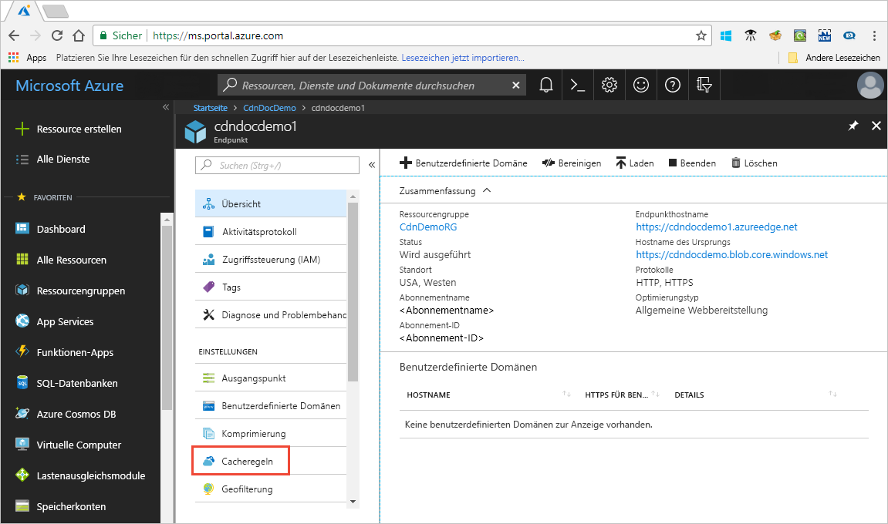

# Tutorial: Festlegen der Azure CDN-Cacheregeln

> [!NOTE] 
> Cacheregeln sind nur für die Profile **Azure CDN Standard von Verizon** und **Azure CDN Standard von Akamai** verfügbar. Für Profile von **Azure CDN von Microsoft** müssen Sie die [Standard-Regel-Engine](cdn-standard-rules-engine-reference.md) verwenden und für Profile von **Azure CDN Premium von Verizon** die [Verizon Premium-Regel-Engine](cdn-rules-engine.md) im **Verwaltungsportal**, um eine ähnliche Funktionalität nutzen zu können.
 

In diesem Tutorial wird beschrieben, wie Sie anhand von Azure CDN-Cacheregeln (Content Delivery Network) das Standardverhalten bei Cacheablauf sowohl global als auch mit benutzerdefinierten Bedingungen (z.B. URL-Pfad und Dateierweiterungen) festlegen oder ändern können. Azure CDN bietet zwei Arten von Cacheregeln:
- Globale Cacheregeln: Sie können für jeden Endpunkt in Ihrem Profil eine globale Cacheregel festlegen, die sich auf alle Anforderungen an den Endpunkt auswirkt. Die globale Cacheregel überschreibt alle HTTP-Header mit Cacheanweisungen, sofern solche festgelegt wurden.

- Benutzerdefinierte Cacheregeln: Sie können für jeden Endpunkt in Ihrem Profil eine oder mehrere benutzerdefinierte Cacheregeln festlegen. Benutzerdefinierte Cacheregeln, die mit bestimmten Pfaden und Dateierweiterungen übereinstimmen, werden nacheinander verarbeitet und überschreiben die globale Cacheregel, sofern eine solche festgelegt wurde. 

In diesem Tutorial lernen Sie Folgendes:
> [!div class="checklist"]
> - Öffnen der Seite mit den Cacheregeln
> - Erstellen einer globalen Cacheregel
> - Erstellen einer benutzerdefinierten Cacheregel

[!INCLUDE [quickstarts-free-trial-note](../../includes/quickstarts-free-trial-note.md)]

## Voraussetzungen

Bevor Sie die Schritte in diesem Tutorial ausführen können, müssen Sie zunächst ein CDN-Profil und mindestens einen CDN-Endpunkt erstellen. Weitere Informationen finden Sie unter [Quickstart: Erstellen eines Azure CDN-Profils und -Endpunkts](cdn-create-new-endpoint.md).

## Öffnen der Seite mit den Azure CDN-Cacheregeln

1. Wählen Sie im [Azure-Portal](https://portal.azure.com) ein CDN-Profil sowie einen Endpunkt aus.

2. Wählen Sie im linken Bereich unter „Einstellungen“ die Option **Cacheregeln** aus.

   

   Die Seite **Cacheregeln** wird geöffnet.

   

## Festlegen globaler Cacheregeln

Erstellen Sie wie folgt eine globale Cacheregel:

1. Legen Sie unter **Globale Cacheregeln** die Option **Verhalten für das Zwischenspeichern von Abfragezeichenfolgen** auf **Abfragezeichenfolgen ignorieren** fest.

2. Legen Sie **Verhalten beim Zwischenspeichern** auf **Bei Fehlen festlegen**.
       
3. Geben Sie unter **Dauer bis Cacheablauf** in das Feld **Tage** die Zahl „10“ ein.

    Die globale Cacheregel wirkt sich auf alle Anforderungen an den Endpunkt aus. Diese Regel berücksichtigt die Ursprungsheader mit Cacheanweisungen, sofern diese vorhanden sind (`Cache-Control` oder `Expires`). Wenn diese nicht angegeben sind, wird der Cache auf 10 Tage festgelegt. 

    

## Festlegen benutzerdefinierter Cacheregeln

Erstellen Sie wie folgt eine benutzerdefinierte Cacheregel:

1. Legen Sie unter **Benutzerdefinierte Cacheregeln** die Option **Übereinstimmungsbedingung** auf **Pfad** und **Übereinstimmungswert** auf `/images/*.jpg` fest.
    
2. Legen Sie **Verhalten beim Zwischenspeichern** auf **Überschreiben** fest, und geben Sie „30“ in das Feld **Tage** ein.
       
    Diese benutzerdefinierte Cacheregel legt für alle Bilddateien mit der Erweiterung `.jpg` im Ordner `/images` Ihres Endpunkts eine Cachedauer von 30 Tagen fest. Er überschreibt alle `Cache-Control`- oder `Expires`-HTTP-Header, die vom Ursprungsserver gesendet werden.

    

    
## Bereinigen von Ressourcen

In den vorherigen Schritten haben Sie Cacheregeln erstellt. Wenn Sie diese Cacheregeln nicht mehr verwenden möchten, können Sie sie entfernen, indem Sie diese Schritte ausführen:
 
1. Wählen Sie ein CDN-Profil aus, und markieren Sie dann den Endpunkt mit den Cacheregeln, die Sie entfernen möchten.

2. Wählen Sie im linken Bereich unter „Einstellungen“ die Option **Cacheregeln** aus.

3. Legen Sie unter **Globale Cacheregeln** die Option **Verhalten beim Zwischenspeichern** auf **Nicht festgelegt** fest.
 
4. Aktivieren Sie unter **Benutzerdefinierte Cacheregeln**, das Kontrollkästchen neben der Regel, die Sie löschen möchten.

5. Klicken Sie auf **Löschen**.

6. Klicken Sie am oberen Rand der Seite auf **Speichern**.

## Nächste Schritte

In diesem Tutorial haben Sie Folgendes gelernt:

> [!div class="checklist"]
> - Öffnen der Seite mit den Cacheregeln
> - Erstellen einer globalen Cacheregel
> - Erstellen einer benutzerdefinierten Cacheregel

Fahren Sie mit dem nächsten Artikel fort, um zu erfahren, wie Sie zusätzliche Einstellungen für Cacheregeln konfigurieren.

> [!div class="nextstepaction"]
> [Steuern des Azure CDN-Zwischenspeicherverhaltens mit Cacheregeln](cdn-caching-rules.md)

