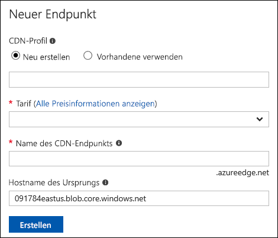
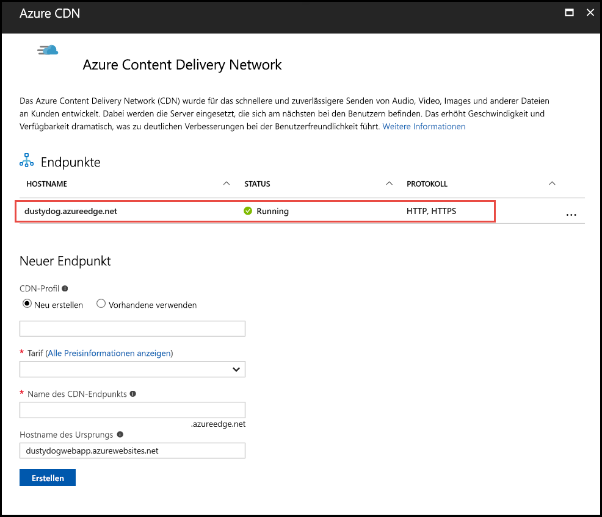
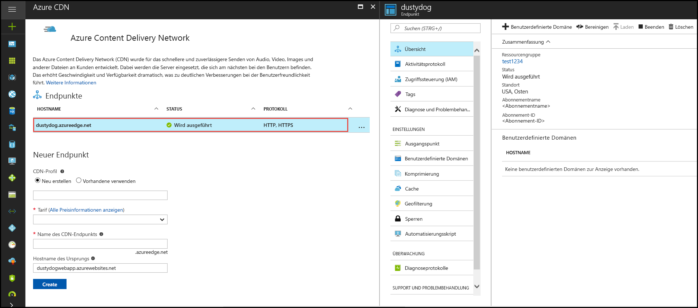

# Integrieren eines Azure-Speicherkontos in CDN
Sie können Azure Content Delivery Network (CDN) zum Zwischenspeichern von Inhalten aus Azure Storage aktivieren. Azure CDN bietet Entwicklern eine globale Lösung für die Übermittlung von Inhalten mit hoher Bandbreite. Sie können Blobs und statische Inhalte von Compute-Instanzen auf physischen Knoten in den USA, Europa, Asien, Australien und Südamerika zwischenspeichern.

## Schritt 1: Erstellen eines Speicherkontos
Gehen Sie folgendermaßen vor, um für ein Azure-Abonnement ein neues Speicherkonto zu erstellen. Ein Speicherkonto ermöglicht den Zugriff auf Azure Storage-Dienste. Das Speicherkonto stellt die höchste Ebene des Namespace für den Zugriff auf die verschiedenen Komponenten des Azure Storage-Diensts dar: Azure Blob Storage, Queue Storage und Table Storage. Weitere Informationen finden Sie unter [Einführung in Microsoft Azure Storage](../storage/common/storage-introduction.md).

Um ein Speicherkonto zu erstellen, müssen Sie entweder der Dienstadministrator oder ein Co-Administrator für das zugehörige Abonnement sein.

> [!NOTE]
> Es gibt mehrere Methoden zum Erstellen eines Speicherkontos, einschließlich Azure-Portal und PowerShell. In diesem Tutorial erfahren Sie, wie Sie das Azure-Portal verwenden.   
> 

**So erstellen Sie ein Speicherkonto für ein Azure-Abonnement**

1. Melden Sie sich beim [Azure-Portal](https://portal.azure.com) an.
2. Wählen Sie links oben **Ressource erstellen** aus. Wählen Sie auf der Seite **Neu** die Option **Speicher** und anschließend **Speicherkonto – Blob, Datei, Tabelle, Warteschlange** aus.
    
    Der Bereich **Speicherkonto erstellen** wird angezeigt.   

    

3. Geben Sie im Feld **Name** einen Unterdomänennamen ein. Dieser Eintrag kann 3 bis 24 Kleinbuchstaben und Zahlen enthalten.
   
    Dieser Wert wird der Hostname im URI, der zum Adressieren von Blob-, Warteschlangen- oder Tabellenressourcen für das Abonnement verwendet wird. Um auf eine Containerressource in Blob Storage zu verweisen, verwenden Sie einen URI im folgenden Format:
   
    http://*&lt;Speicherkontobezeichnung&gt;*.blob.core.windows.net/*&lt;MeinContainer&gt;*

    Dabei ist *&lt;StorageAccountLabel&gt;* der Wert, die Sie im Feld **Name** eingegeben haben.
   
    > [!IMPORTANT]    
    > Die URL-Bezeichnung bildet die Unterdomäne des Speicherkonto-URI und muss unter allen gehosteten Diensten in Azure eindeutig sein.
   
    Dieser Wert wird auch als Name für das Speicherkonto im Portal verwendet oder beim programmgesteuerten Zugriff auf dieses Konto.
    
4. Behalten Sie die Standardwerte für **Bereitstellungsmodell**, **Kontoart**, **Leistung** und **Replikation** bei. 
    
5. Als **Abonnement** wählen Sie das Abonnement aus, das Sie mit dem Speicherkonto verwenden möchten.
    
6. Wählen Sie unter **Ressourcengruppe** eine Ressourcengruppe aus (bzw. erstellen Sie sie). Informationen zu Ressourcengruppen finden Sie unter [Übersicht über den Azure Resource Manager](../azure-resource-manager/resource-group-overview.md#resource-groups).
    
7. Wählen Sie unter **Standort** einen Standort für Ihr Speicherkonto aus.
    
8. Klicken Sie auf **Erstellen**. Das Erstellen des Speicherkontos kann einige Minuten dauern.

## Schritt 2: Aktivieren von CDN für das Speicherkonto

Sie können CDN direkt aus Ihrem Speicherkonto heraus für Ihr Speicherkonto aktivieren. 

1. Wählen Sie über das Dashboard ein Speicherkonto und dann im linken Bereich **Azure CDN** aus. Wenn die Schaltfläche **Azure CDN** nicht sofort angezeigt wird, können Sie im Feld **Suchen** im linken Bereich „CDN“ eingeben.
    
    Der Bereich **Azure Content Delivery Network** wird angezeigt.

    
    
2. Erstellen Sie einen neuen Endpunkt, indem Sie die entsprechenden Informationen angeben:
    - **CDN-Profil:** Sie können ein neues CDN-Profil erstellen oder ein vorhandenes CDN-Profil verwenden.
    - **Tarif:** Wählen Sie nur dann einen Tarif aus, wenn Sie ein CDN-Profil erstellen.
    - **CDN-Endpunktname:** Geben Sie einen CDN-Endpunktnamen ein.

    > [!TIP]
    > Für einen neuen CDN-Endpunkt wird standardmäßig der Hostname Ihres Speicherkontos als Ursprungsserver verwendet.

3. Klicken Sie auf **Erstellen**. Der erstellte Endpunkt wird in der Liste mit den Endpunkten angezeigt.

    

> [!NOTE]
> Wenn Sie erweiterte Konfigurationseinstellungen (z.B. den Optimierungstyp) für den CDN-Endpunkt angeben möchten, können Sie stattdessen die [Azure-CDN-Erweiterung](cdn-create-new-endpoint.md#create-a-new-cdn-endpoint) verwenden, um einen CDN-Endpunkt oder ein CDN-Profil zu erstellen.

## Schritt 3: Aktivieren weiterer CDN-Features

Wählen Sie im Bereich **Azure CDN** des Speicherkontos in der Liste den CDN-Endpunkt aus, um den Bereich für die CDN-Konfiguration zu öffnen. Sie können weitere CDN-Features für die Übertragung aktivieren, z.B. Komprimierung, Abfragezeichenfolge und Geofilterung. Sie können dem CDN-Endpunkt außerdem eine benutzerdefinierte Domänenzuordnung hinzufügen und HTTPS für benutzerdefinierte Domänen aktivieren.
    

## Schritt 4: Zugriff auf CDN-Inhalte
Verwenden Sie für den Zugriff auf die im CDN zwischengespeicherten Inhalte den im Portal bereitgestellten CDN-URL. Die Adresse eines zwischengespeicherten Blobs hat das folgende Format:

http://<*Endpunktname*\>.azureedge.net/<*meinÖffentlicherContainer*\>/<*Blobname*\>

> [!NOTE]
> Nachdem Sie den CDN-Zugriff auf ein Speicherkonto aktiviert haben, kommen alle öffentlich verfügbaren Objekte für den CDN-Edgezwischenspeicher in Frage. Wenn Sie ein Objekt ändern, das derzeit in CDN zwischengespeichert ist, stehen die neuen Inhalte erst dann über CDN zur Verfügung, wenn CDN die Inhalte aktualisiert. Dies erfolgt nach Ablauf der Lebensdauer der zwischengespeicherten Inhalte.

## Schritt 5: Entfernen von Inhalten aus dem CDN
Wenn ein Objekt nicht mehr in Azure CDN zwischengespeichert werden soll, können Sie einen der folgenden Schritte ausführen:

* Legen Sie den öffentlichen Container als privat fest. Weitere Informationen finden Sie unter [Verwalten des anonymen Lesezugriffs auf Container und Blobs](../storage/blobs/storage-manage-access-to-resources.md).
* Deaktivieren oder löschen Sie den CDN-Endpunkt mit dem Azure-Portal.
* Ändern Sie den gehosteten Dienst so, dass er nicht mehr auf Anforderungen für das Objekt antwortet.

Ein bereits in Azure CDN zwischengespeichertes Objekt bleibt zwischengespeichert, bis die Lebensdauer des Objekts abgelaufen ist oder der Endpunkt gelöscht wird. Wenn die Lebensdauer abläuft, prüft Azure CDN, ob der CDN-Endpunkt weiterhin gültig ist und ob weiterhin anonym auf das Objekt zugegriffen werden kann. Ist dies nicht der Fall, wird das Objekt nicht mehr zwischengespeichert.

## Zusätzliche Ressourcen
* [Hinzufügen einer benutzerdefinierten Domäne zum CDN-Endpunkt](cdn-map-content-to-custom-domain.md)
* [Konfigurieren von HTTPS in einer benutzerdefinierten Azure CDN-Domäne](cdn-custom-ssl.md)

