<properties linkid="dev-net-tutorials-hybrid-solution" urlDisplayName="Hybrid Application" pageTitle="Hybrid On-Premises/ Cloud Application (.NET) - Azure" metaKeywords="Azure Service Bus tutorial,hybrid .NET" description="Learn how to create a .NET On-Premises/Cloud Hybrid Application Using the Azure Service Bus Relay." metaCanonical="" services="service-bus" documentationCenter=".NET" title=".NET On-Premises/Cloud Hybrid Application Using Service Bus Relay" authors="sethm" solutions="" manager="dwrede" editor="mattshel" />

Hybride lokale/Cloud-.NET-Anwendung mit Service Bus Relay
=========================================================

EINFÜHRUNGEINFÜHRUNG
--------------------

Die Entwicklung hybrider Cloudanwendungen mit Azure ist dank Visual Studio 2013 und dem kostenlosen Azure SDK für .NET völlig unkompliziert. In diesem Leitfaden wird davon ausgegangen, dass Sie noch keine Erfahrung mit der Verwendung von Azure haben. In weniger als 30 Minuten verfügen Sie über eine Anwendung, die verschiedene Microsoft Azure-Ressourcen nutzt und aktiv in der Cloud ausgeführt wird.

Sie erhalten Informationen zu folgenden Themen:

-   Erstellen oder Anpassen eines vorhandenen Webdiensts zur Verwendung durch eine Weblösung
-   Verwenden von Azure Service Bus Relay zum Freigeben von Daten zwischen einer Azure-Anwendung und einem an einem anderen Ort gehosteten Webdienst

[WACOM.INCLUDE [create-account-note](../includes/create-account-note.md)]

### UNTERSTÜTZUNG HYBRIDER LÖSUNGEN DURCH SERVICE BUS RELAY

Geschäftslösungen bestehen normalerweise aus einer Kombination von benutzerdefiniertem Code, der geschrieben wurde, um neue und individuelle Geschäftsanforderungen in Angriff zu nehmen und vorhandene Funktionen, die von bereits verwendeten Lösungen und Systemen bereitgestellt werden, zu integrieren.

Lösungsarchitekten setzen die Cloud inzwischen ein, um Skalierungsanforderungen leichter bewältigen zu können und die Betriebskosten zu senken. Dabei stellen sie fest, dass sich vorhandene Dienstressourcen, die sie als Bausteine für ihre Lösungen nutzen möchten, innerhalb der Unternehmensfirewall befinden und somit nicht problemlos von der Cloudlösung darauf zugegriffen werden kann. Viele interne Dienste werden nicht so erstellt oder gehostet, dass sie einfach am Rand des Unternehmensnetzwerks verfügbar gemacht werden können.

*Service Bus Relay* wurde konzipiert, damit vorhandene WCF (Windows Communication Foundation)-Webdienste sicher von Lösungen aufgerufen werden können, die sich außerhalb des Unternehmensumkreises befinden, ohne dass aufwändige Änderungen an der Netzwerkinfrastruktur des Unternehmens ausgeführt werden müssen. Service Bus Relay-Dienste dieser Art werden weiterhin innerhalb der vorhandenen Umgebung gehostet, das Lauschen auf eingehende Sitzungen und Anforderungen wird jedoch an den in der Cloud gehosteten Servicebus delegiert. Dieser schützt die Dienste durch die Azure Active Directory-Zugriffssteuerung außerdem vor unbefugtem Zugriff.

### DAS LÖSUNGSSZENARIO

In diesem Lernprogramm erstellen Sie eine ASP.NET MVC 4-Website, mit der Sie eine Produktliste auf der Produktbestandsseite anzeigen können.

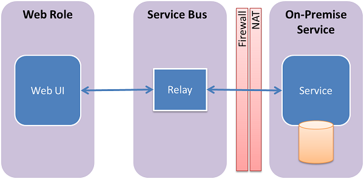

In diesem Lernprogramm wird davon ausgegangen, dass Sie über Produktinformationen in einem vorhandenen lokalen System verfügen, auf das über Service Bus Relay zugegriffen werden kann. Dies wird durch einen Webdienst simuliert, der in einer einfachen Konsolenanwendung ausgeführt und durch einen im Arbeitsspeicher befindlichen Produktsatz unterstützt wird. Sie können diese Konsolenanwendung auf Ihrem eigenen Computer ausführen und die Webrolle in Azure bereitstellen. Dabei werden Sie feststellen, dass die im Azure-Datencenter ausgeführte Webrolle tatsächlich Aufrufe an Ihren Computer sendet, obwohl dieser sich mit ziemlicher Sicherheit hinter mindestens einer Firewall und einer NAT (Network Address Translation)-Ebene befindet.

Im Folgenden wird ein Bildschirmfoto der Startseite der vollständigen Webanwendung dargestellt.

EINRICHTEN DER UMGEBUNGEINRICHTEN DER ENTWICKLUNGSUMGEBUNG
----------------------------------------------------------

Bevor Sie mit der Entwicklung der Azure-Anwendung beginnen können, müssen Sie über die entsprechenden Tools verfügen und die Entwicklungsumgebung einrichten.

1.  Klicken Sie auf die folgende Schaltfläche, um das Azure SDK für .NET zu installieren:

    [Tools und SDK herunterladen](http://go.microsoft.com/fwlink/?LinkId=271920)

2.  Klicken Sie auf **install the SDK**.

3.  Wählen Sie den Link für Ihre Visual Studio-Version aus. Bei den Schritten in diesem Lernprogramm wird Visual Studio 2013 verwendet:

    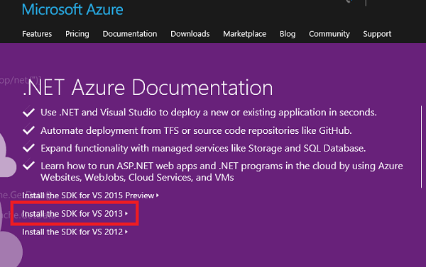

4.  Wenn Sie dazu aufgefordert werden, **WindowsAzureSDKForNet.exe** auszuführen oder zu speichern, klicken Sie auf **Ausführen**:

    

5.  Klicken Sie im Webplattform-Installer auf **Installieren**, und setzen Sie die Installation fort:

    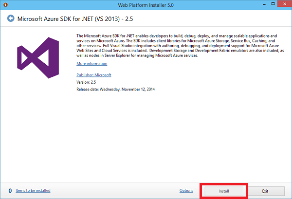

6.  Nach Abschluss der Installation haben Sie alles zur Hand, was Sie benötigen, um mit der Entwicklung zu beginnen. Das SDK enthält Tools, mit denen Sie ganz leicht Azure-Anwendungen in Visual Studio entwickeln können. Wenn Visual Studio nicht installiert ist, wird außerdem die kostenlose Version Visual Studio Express installiert.

ERSTELLEN EINES NAMESPACESERSTELLEN EINES NAMESPACES
----------------------------------------------------

Um mit der Verwendung von Service Bus-Features in Azure beginnen zu können, müssen Sie zuerst einen Dienstnamespace erstellen. Ein Dienstnamespace ist eine Bereichseinheit zur Adressierung von Service Bus-Ressourcen innerhalb Ihrer Anwendung.

Sie können Namespaces und Service Bus-Nachrichtenentitäten im [Azure-Verwaltungsportal](http://manage.windowsazure.com) oder im Server-Explorer von Visual Express verwalten, neue Namespaces lassen sich jedoch nur im Portal erstellen.

### So erstellen Sie einen Dienstnamespace im Portal:

1.  Melden Sie sich beim [Azure-Verwaltungsportal](http://manage.windowsazure.com) an.

2.  Klicken Sie im linken Navigationsbereich des Verwaltungsportals auf **Service Bus**.

3.  Klicken Sie im unteren Bereich des Verwaltungsportals auf **Erstellen**.   
     

4.  Geben Sie im Dialogfeld **Add a new namespace** einen Namen für den Namespace ein. Es wird sofort geprüft, ob dieser Name verfügbar ist.   
     

5.  Wählen Sie nach der Bestätigung, dass der Name für den Namespace verfügbar ist, das Land oder die Region, wo dieser Namespace gehostet werden soll. (Stellen Sie sicher, dass dies dasselbe Land/dieselbe Region ist, in dem/der Sie Ihre Rechnerressourcen einsetzen.)

    WICHTIG: Wählen Sie **dieselbe Region**, in der Sie auch Ihre Anwendung einsetzen möchten. Dies sorgt für die beste Leistung.

6.  Aktivieren Sie das Kontrollkästchen. Ihr Dienstnamespace wird nun erstellt und aktiviert. Eventuell müssen Sie einige Minuten warten, bis die Ressourcen für Ihr Konto bereitgestellt werden.

    

Der erstellte Namespace wird dann im Verwaltungsportal angezeigt und nach einem Moment aktiviert. Warten Sie, bis der Status **Aktiv** lautet, bevor Sie fortfahren.

ABRUFEN DER VERWALTUNGSANMELDEINFORMATIONENABRUFEN DER STANDARDANMELDEINFORMATIONEN ZUR VERWALTUNG FÜR DEN NAMESPACE
--------------------------------------------------------------------------------------------------------------------

Wenn Sie Verwaltungsvorgänge für den neuen Namespace ausführen möchten (z. B. eine Warteschlange erstellen), müssen Sie die Anmeldeinformationen zur Verwaltung für den Namespace abrufen.

1.  Klicken Sie im Hauptfenster auf den Namen Ihres Dienstnamespaces.

    

2.  Klicken Sie auf **Verbindungsinformationen**.

    

3.  Suchen Sie im Bereich **Access connection information** nach den Einträgen **Default Issuer** und **Standardschlüssel**.

4.  Notieren Sie sich den Schlüssel, oder kopieren Sie ihn in die Zwischenablage.

### Verwalten eines Servicenamespace mit dem Server-Explorer von Visual Studio:

Führen Sie das [hier](http://http://msdn.microsoft.com/en-us/library/windowsazure/ff687127.aspx) im Abschnitt **So stellen Sie von Visual Studio eine Verbindung mit Azure her** beschriebene Verfahren aus, um in Visual Studio anstatt im Verwaltungsportal einen Namespace zu verwalten und Verbindungsinformationen abzurufen. Bei der Anmeldung bei Azure wird der Knoten **Service Bus** in der Struktur **Microsoft Azure** im Server-Explorer automatisch mit allen Namespaces gefüllt, die Sie bereits erstellt haben. Klicken Sie mit der rechten Maustaste auf einen Namespace und klicken Sie dann auf **Eigenschaften**, um die Verbindungszeichenfolge und andere diesem Namespace zugeordnete Metadaten anzuzeigen, die im Bereich **Eigenschaften** in Visual Studio dargestellt werden.

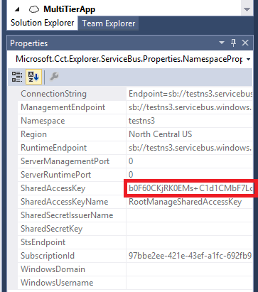

Notieren Sie sich den Wert **SharedAccessKey**, oder kopieren Sie ihn in die Zwischenablage.

ERSTELLEN EINES LOKALEN SERVERSERSTELLEN EINES LOKALEN SERVERS
--------------------------------------------------------------

Zunächst erstellen Sie ein (falsches) lokales Produktkatalogsystem. Dies ist relativ einfach; Sie können es sich als ein echtes lokales Produktkatalogsystem mit einer vollständigen Dienstoberfläche vorstellen, das integriert werden soll.

Zu Anfang stellt das Projekt eine Visual Studio-Konsolenanwendung dar. Mithilfe des Service Bus NuGet-Pakets werden die Servicebusbibliotheken und -konfigurationseinstellungen hinzugefügt. Die NuGet Visual Studio-Erweiterung ermöglicht eine problemlose Installation und Aktualisierung von Bibliotheken und Tools in Visual Studio und Visual Studio Express. Das Service Bus NuGet-Paket stellt die einfachste Möglichkeit zum Abrufen der Service Bus-API und Konfigurieren der Anwendung mit allen Service Bus-Abhängigkeiten dar. Weitere Informationen zum Verwenden von NuGet und dem Service Bus-Paket finden Sie unter [Verwenden des NuGet Service Bus-Pakets](http://go.microsoft.com/fwlink/?LinkId=234589).

### ERSTELLEN DES PROJEKTS

1.  Starten Sie Microsoft Visual Studio 2013 oder Microsoft Visual Studio Express mit Administratorberechtigungen. Klicken Sie mit der rechten Maustaste auf **Microsoft Visual Studio 2013** (oder **Microsoft Visual Studio Express**), und klicken Sie dann auf **Als Administrator ausführen**, um Visual Studio mit Administratorberechtigungen zu starten.
2.  Klicken Sie in Visual Studio im Menü **Datei** auf **Neu** und dann auf **Projekt**.

    

3.  Klicken Sie in **Installierte Vorlagen** unter **Visual C\#** auf **Konsolenanwendung**. Geben Sie in das Feld **Name** den Namen **ProductsServer** ein:

    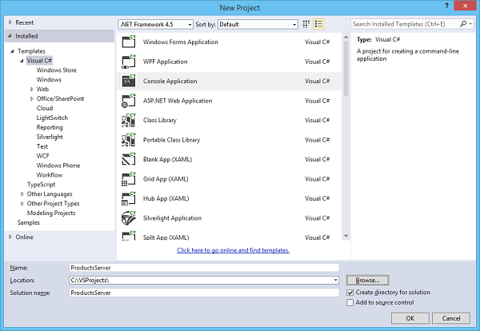

4.  Klicken Sie auf **OK**, um das Projekt **ProductsServer** zu erstellen.

5.  Klicken Sie im Projektmappen-Explorer mit der rechten Maustaste auf **ProductsServer**, und klicken Sie dann auf **Eigenschaften**.
6.  Klicken Sie links auf die Registerkarte **Anwendung**, und stellen Sie dann sicher, dass in der Dropdownliste **Zielframework** die Option **.NET Framework 4** oder **.NET Framework 4.5** angezeigt wird. Falls dies nicht der Fall ist, wählen Sie diese Option aus der Dropdownliste aus, und klicken Sie dann auf **Ja**, wenn Sie aufgefordert werden, das Projekt erneut zu laden.

    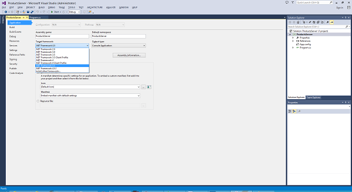

7.  Wenn Sie den NuGet-Paket-Manager für Visual Studio bereits installiert haben, fahren Sie mit dem nächsten Schritt fort. Besuchen Sie andernfalls [NuGet](http://nuget.org), und klicken Sie auf [Install NuGet](http://visualstudiogallery.msdn.microsoft.com/27077b70-9dad-4c64-adcf-c7cf6bc9970c). Befolgen Sie die Anweisungen, um den NuGet-Paket-Manager zu installieren, und starten Sie Visual Studio dann neu.

8.  Klicken Sie im Projektmappen-Explorer mit der rechten Maustaste auf **Verweise**, und klicken Sie dann auf **NuGet-Pakete verwalten**.
9.  Klicken Sie in der linken Spalte des NuGet-Dialogfelds auf **Online**.

10. Klicken Sie in der rechten Spalte auf das Feld **Suche**, geben Sie "**Microsoft Azure**" ein, und wählen Sie das Element **Microsoft Azure Service Bus** aus. Klicken Sie auf **Installieren**, um die Installation abzuschließen, und schließen Sie das Dialogfeld.

    

    Beachten Sie, dass nun auf die erforderlichen Clientassemblys verwiesen wird.

11. Fügen Sie eine neue Klasse für den Produktvertrag hinzu. Klicken Sie im Projektmappen-Explorer mit der rechten Maustaste auf das Projekt **ProductsServer**. Klicken Sie auf **Hinzufügen** und dann auf **Klasse**.

    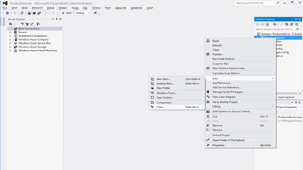

12. Geben Sie in das Feld **Name** den Namen **ProductsContract.cs** ein. Klicken Sie dann auf **Hinzufügen**.
13. Ersetzen Sie in **ProductsContract.cs** die Namespacedefinition durch den folgenden Code, mit dem der Vertrag für den Dienst definiert wird:

        namespace ProductsServer
        {
            using System.Collections.Generic;
            using System.Runtime.Serialization;
            using System.ServiceModel;

            // Datenvertrag für den Dienst definieren
            [DataContract]
            // Serialisierbare Eigenschaften deklarieren
            public class ProductData
            {
                [DataMember]
                public string Id { get; set; }
                [DataMember]
                public string Name { get; set; }
                [DataMember]
                public string Quantity { get; set; }
            }

            // Dienstvertrag definieren.
            [ServiceContract]
            interface IProducts
            {
                [OperationContract]
                IList<ProductData> GetProducts();

            }

            interface IProductsChannel : IProducts, IClientChannel
            {
            }
        }

14. Ersetzen Sie in **Program.cs** die Namespacedefinition durch den folgenden Code, mit dem der Profildienst und der dafür vorgesehene Host hinzugefügt werden:

        namespace ProductsServer
        {
            using System;
            using System.Linq;
            using System.Collections.Generic;
            using System.ServiceModel;

            // IProducts-Schnittstelle implementieren
            class ProductsService : IProducts
            {
                    
                // Produktarray zur Anzeige auf der Website auffüllen
                ProductData[] products = 
                    new []
                        {
                            new ProductData{ Id = "1", Name = "Rock", 
                                             Quantity = "1"},
                            new ProductData{ Id = "2", Name = "Paper", 
                                             Quantity = "3"},
                            new ProductData{ Id = "3", Name = "Scissors", 
                                             Quantity = "5"},
                            new ProductData{ Id = "4", Name = "Well", 
                                             Quantity = "2500"},
                        };

                // Meldung in der Dienstkonsolenanwendung anzeigen, 
                // wenn die Produktliste abgerufen wird
                public IList<ProductData> GetProducts()
                {
                    Console.WriteLine("GetProducts called.");
                    return products;
                }

            }

            class Program
            {
                // Funktion "Main()" in der Dienstanwendung definieren
                static void Main(string[] args)
                {
                    var sh = new ServiceHost(typeof(ProductsService));
                    sh.Open();

                    Console.WriteLine("Press ENTER to close");
                    Console.ReadLine();

                    sh.Close();
                }
            }
        }

15. Doppelklicken Sie im Projektmappen-Explorer auf die Datei **app.config**, um sie im Visual Studio-Editor zu öffnen. Ersetzen Sie den Inhalt von **&lt;system.ServiceModel\>** durch den folgenden XML-Code. Achten Sie darauf, *yourServiceNamespace* durch den Namen Ihres Dienstnamespaces zu ersetzen und *yourIssuerSecret* durch den Schlüssel, den Sie zuvor aus dem Azure-Verwaltungsportal abgerufen haben:

        <system.serviceModel>
          <extensions>
             <behaviorExtensions>
                <add name="transportClientEndpointBehavior" type="Microsoft.ServiceBus.Configuration.TransportClientEndpointBehaviorElement, Microsoft.ServiceBus, Version=2.0.0.0, Culture=neutral, PublicKeyToken=31bf3856ad364e35"/>
              </behaviorExtensions>
              <bindingExtensions>
                 <add name="netTcpRelayBinding" type="Microsoft.ServiceBus.Configuration.NetTcpRelayBindingCollectionElement, Microsoft.ServiceBus, Version=2.0.0.0, Culture=neutral, PublicKeyToken=31bf3856ad364e35"/>
              </bindingExtensions>
          </extensions>
          <services>
             <service name="ProductsServer.ProductsService">
               <endpoint address="sb://yourServiceNamespace.servicebus.windows.net/products" binding="netTcpRelayBinding" contract="ProductsServer.IProducts"
        behaviorConfiguration="products"/>
             </service>
          </services>
          <behaviors>
             <endpointBehaviors>
               <behavior name="products">
                 <transportClientEndpointBehavior>
                    <tokenProvider>
                       <sharedSecret issuerName="owner" issuerSecret="yourIssuerSecret" />
                    </tokenProvider>
                 </transportClientEndpointBehavior>
               </behavior>
             </endpointBehaviors>
          </behaviors>
        </system.serviceModel>

16. Drücken Sie **F6**, oder klicken Sie im Menü **Build** auf **Projektmappe erstellen**, um die Anwendung zu erstellen und die Richtigkeit Ihrer bisherigen Arbeit zu prüfen.

ERSTELLEN EINER ASP.NET MVC-ANWENDUNGERSTELLEN EINER ASP.NET MVC-ANWENDUNG
--------------------------------------------------------------------------

In diesem Abschnitt erstellen Sie eine einfache ASP.NET-Anwendung, in der von Ihrem Produktdienst abgerufene Daten angezeigt werden.

### ERSTELLEN DES PROJEKTS

1.  Stellen Sie sicher, dass Microsoft Visual Studio 2013 mit Administratorberechtigungen ausgeführt wird. Wenn dies nicht der Fall ist, klicken Sie mit der rechten Maustaste auf **Microsoft Visual Studio 2013** (oder **Microsoft Visual Studio Express**), und klicken Sie dann auf **Als Administrator ausführen**, um Visual Studio mit Administratorberechtigungen zu starten. Für den später in diesem Leitfaden behandelten Microsoft Azure-Serveremulator muss Visual Studio mit Administratorberechtigungen gestartet worden sein.

2.  Klicken Sie in Visual Studio im Menü **Datei** auf **Neu** und dann auf **Projekt**.

3.  Klicken Sie in **Installierte Vorlagen** unter **Visual C\#** auf **ASP.NET-Webanwendung**. Nennen Sie das Projekt **ProductsPortal**. Klicken Sie dann auf **OK**.

    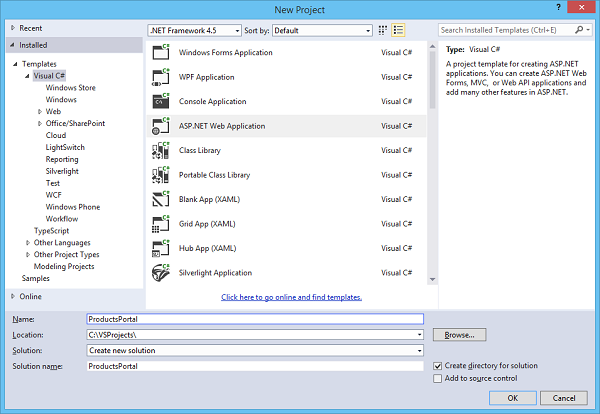

4.  Klicken Sie in der Liste **Vorlage auswählen** auf **MVC** und dann auf **OK**.

    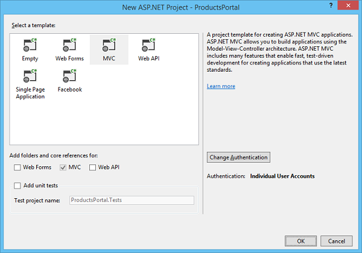

5.  Klicken Sie im Projektmappen-Explorer mit der rechten Maustaste auf **Modelle**. Klicken Sie auf **Hinzufügen** und dann auf **Klasse**. Geben Sie in das Feld **Name** den Namen **Product.cs** ein. Klicken Sie dann auf **Hinzufügen**.

    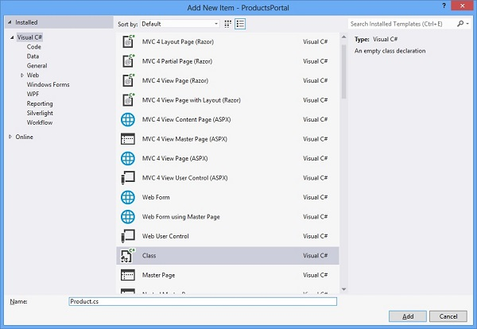

### ÄNDERN DER WEBANWENDUNG

1.  Ersetzen Sie in der Datei **Product.cs** in Visual Studio die vorhandene Namespacedefinition durch den folgenden Code:

        // Eigenschaften für den Produktbestand deklarieren
        namespace ProductsWeb.Models
        {
            public class Product
            {
                public string Id { get; set; }
                public string Name { get; set; }
                public string Quantity { get; set; }
            }
        }

2.  Ersetzen Sie in der Datei **HomeController.cs** in Visual Studio die vorhandene Namespacedefinition durch den folgenden Code:

        namespace ProductsWeb.Controllers
        {
            using System.Collections.Generic;
            using System.Web.Mvc;
            using Models;

            public class HomeController : Controller
            {
                // Ansicht des Produktbestands zurückgeben
                public ActionResult Index(string Identifier, string ProductName)
                {
                    var products = new List<Product> 
                        {new Product {Id = Identifier, Name = ProductName}};
                    return View(products);
                }

            }
        }

3.  Erweitern Sie im Projektmappen-Explorer **Views\\Shared**:

    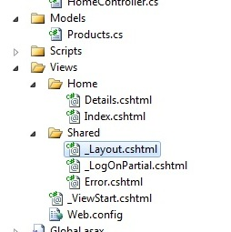

4.  Doppelklicken Sie als Nächstes auf **\_Layout.cshtml**, um die Datei im Visual Studio-Editor zu öffnen.

5.  Ändern Sie alle Vorkommnisse von **My ASP.NET Application** in **LITWARE's Products**.

6.  Entfernen Sie die Links **Home**, **About** und **Contact**. Löschen Sie den hervorgehobenen Code:

    

7.  Erweitern Sie im Projektmappen-Explorer **Views\\Home**:

    

8.  Doppelklicken Sie auf **Index.cshtml**, um die Datei im Visual Studio-Editor zu öffnen. Ersetzen Sie den gesamten Inhalt der Datei durch den folgenden Code:

        @model IEnumerable<ProductsWeb.Models.Product>

        @{
            ViewBag.Title = "Index";
        }

        <h2>Prod Inventory</h2>

        <table>
            <tr>
                <th>
                    @Html.DisplayNameFor(model => model.Name)
                </th>
                <th></th>
                <th>
                    @Html.DisplayNameFor(model => model.Quantity)
                </th>
            </tr>

        @foreach (var item in Model) {
            <tr>
                <td>
                    @Html.DisplayFor(modelItem => item.Name)
                </td>
                <td>
                    @Html.DisplayFor(modelItem => item.Quantity)
                </td>
            </tr> 
        }

        </table>

9.  Drücken Sie **F6** oder **STRG+UMSCHALT+B** zum Erstellen des Projekts, um die Richtigkeit Ihrer bisherigen Arbeit zu prüfen.

### LOKALES AUSFÜHREN DER ANWENDUNG

Führen Sie die Anwendung aus, um sicherzustellen, dass sie funktioniert.

1.  Stellen Sie sicher, dass **ProductsPortal** das aktive Projekt ist. Klicken Sie im Projektmappen-Explorer mit der rechten Maustaste auf den Projektnamen, und wählen Sie **Als Startprojekt festlegen** aus.
2.  Drücken Sie in Visual Studio die Taste **F5**.
3.  Die Anwendung sollte ausgeführt in einem Browser angezeigt werden:

    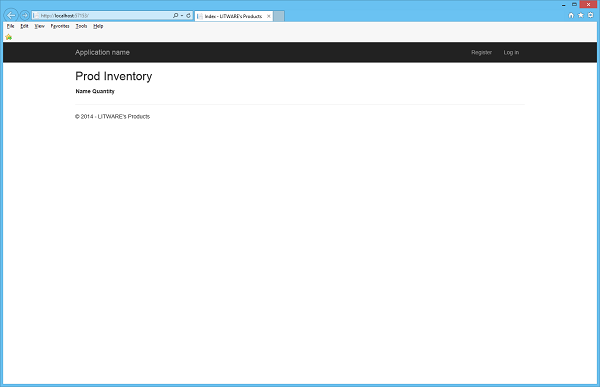

    BEREITSTELLEN FÜR AZUREFERTIGSTELLEN DER ANWENDUNG ZUR BEREITSTELLUNG FÜR AZURE
    -------------------------------------------------------------------------------

    Sie können die Anwendung für einen Azure-Clouddienst oder eine Azure-Website bereitstellen. Informationen zum Unterschied zwischen Websites und Clouddiensten finden Sie unter [Azure-Ausführungsmodelle](http://www.windowsazure.com/en-us/develop/net/fundamentals/compute/). Informationen zum Bereitstellen der Anwendung für eine Azure-Website finden Sie unter [Bereitstellen einer ASP.NET-Webanwendung für eine Azure-Website](http://www.windowsazure.com/en-us/develop/net/tutorials/get-started/). Dieser Abschnitt enthält ausführliche Schritte für die Bereitstellung der Anwendung für einen Azure-Clouddienst.

    Zur Bereitstellung der Anwendung für einen Clouddienst fügen Sie der Projektmappe ein Bereitstellungsprojekt für das Clouddienstprojekt hinzu. Das Bereitstellungsprojekt enthält Konfigurationsinformationen, die benötigt werden, um die Anwendung ordnungsgemäß in der Cloud auszuführen.

    1.  Klicken Sie im Projektmappen-Explorer mit der rechten Maustaste auf das Projekt **ProductsPortal**, um die Anwendung in der Cloud bereitstellen zu können. Klicken Sie auf **Konvertieren** und dann auf **Convert to Azure Cloud Service Project**.

        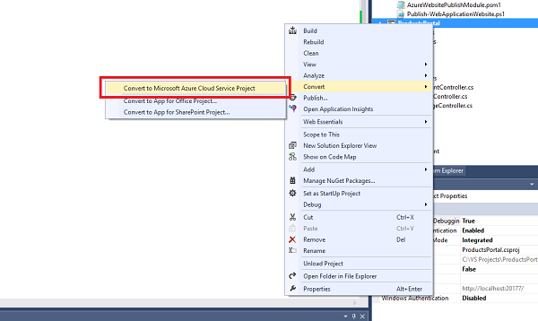

    2.  Drücken Sie **F5**, um die Anwendung zu testen.
    3.  Der Azure-Serveremulator wird gestartet. Der Serveremulator nutzt den lokalen Computer, um die in Azure ausgeführte Anwendung zu emulieren. Sie können in der Taskleiste prüfen, ob der Emulator gestartet wurde:

        

    4.  Im Browser wird weiterhin die lokal ausgeführte Anwendung angezeigt. Die Darstellung und Funktion unterscheiden sich nicht von der Ausführung als reguläre ASP.NET MVC 4-Anwendung.

    ZUSAMMENSETZEN DER EINZELTEILEZUSAMMENSETZEN DER EINZELTEILE
    ------------------------------------------------------------

    Im nächsten Schritt wird der lokale Produktserver mit der ASP.NET MVC-Webanwendung zusammengeführt.

    1.  Falls noch nicht geöffnet, öffnen Sie in Visual Studio das Projekt **ProductsPortal**, das Sie im Abschnitt "Erstellen einer ASP.NET MVC-Anwendung" erstellt haben, erneut.

    2.  Fügen Sie das NuGet-Paket den Projektverweisen hinzu, wie im Schritt "Erstellen eines lokalen Servers" beschrieben. Klicken Sie im Projektmappen-Explorer mit der rechten Maustaste auf **Verweise**, und klicken Sie dann auf **Manage NuGet Packages**.

    3.  Suchen Sie nach "WindowsAzure.ServiceBus", und wählen Sie das Element **Microsoft Azure Service Bus** aus. Schließen Sie die Installation dann ab, und schließen Sie dieses Dialogfeld.

    4.  Klicken Sie im Projektmappen-Explorer mit der rechten Maustaste auf das Projekt **ProductsPortal**. Klicken Sie auf **Hinzufügen** und dann auf **Vorhandenes Element**.

    5.  Navigieren Sie im Konsolenprojekt **ProductsServer** zur Datei **ProductsContract.cs**. Klicken Sie, um **ProductsContract.cs** zu markieren. Klicken Sie auf den nach unten weisenden Pfeil neben **Hinzufügen** und dann auf **Link hinzufügen**.

        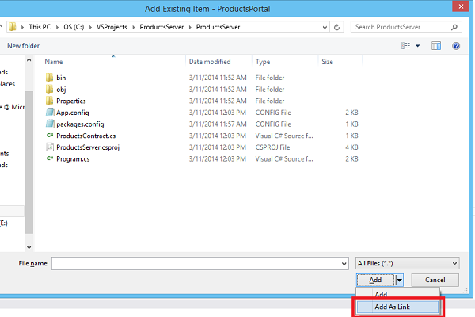

    6.  Öffnen Sie nun die Datei **HomeController.cs** im Visual Studio-Editor, und ersetzen Sie die Namespace-Definition durch den folgenden Code. Ersetzen Sie *yourServiceNamespace* durch den Namen Ihres Dienstnamespaces und *yourIssuerSecret* durch Ihren Schlüssel. Der Client kann daraufhin den lokalen Dienst aufrufen und das Ergebnis des Aufrufs zurückgeben.

            namespace ProductsWeb.Controllers
            {
                using System.Linq;
                using System.ServiceModel;
                using System.Web.Mvc;
                using Microsoft.ServiceBus;
                using Models;
                using ProductsServer;

                public class HomeController : Controller
                {
                    // Kanalfactory deklarieren.
                    static ChannelFactory<IProductsChannel> channelFactory;

                    static HomeController()
                    {
                        // Tokenanmeldeinformationen für gemeinsamen geheimen Schlüssel zur Authentifizierung erstellen. 
                        channelFactory = new ChannelFactory<IProductsChannel>(new NetTcpRelayBinding(), 
                            "sb://yourServiceNamespace.servicebus.windows.net/products");
                        channelFactory.Endpoint.Behaviors.Add(new TransportClientEndpointBehavior { 
                            TokenProvider = TokenProvider.CreateSharedSecretTokenProvider(
                                "owner", "yourIssuerSecret") });
                    }

                    public ActionResult Index()
                    {
                        using (IProductsChannel channel = channelFactory.CreateChannel())
                        {
                            // Ansicht des Produktbestands zurückgeben
                            return this.View(from prod in channel.GetProducts()
                                             select
                                                 new Product { Id = prod.Id, Name = prod.Name, 
                                                     Quantity = prod.Quantity });
                        }
                    }
                }
            }

    7.  Klicken Sie im Projektmappen-Explorer mit der rechten Maustaste auf **ProductsPortal**. Klicken Sie auf **Hinzufügen** und dann auf **Vorhandenes Projekt**.

    8.  Navigieren Sie zum Projekt **ProductsServer**, und doppelklicken Sie dann auf die Projektmappendatei **ProductsServer.csproj**, um sie hinzuzufügen.

    9.  Klicken Sie im Projektmappen-Explorer mit der rechten Maustaste auf die Projektmappe **ProductsPortal**, und klicken Sie dann auf **Eigenschaften**.

    10. Klicken Sie auf der linken Seite auf **Startprojekt**. Klicken Sie auf der rechten Seite auf **Mehrere Startprojekte**. Stellen Sie sicher, dass **ProductsServer**, **ProductsPortal.Azure** und **ProductsPortal** in dieser Reihenfolge mit der Aktion **Start** für **ProductsServer** und **ProductsPortal.Azure** und **Keine** für **ProductsPortal** angezeigt werden. Beispiel:

        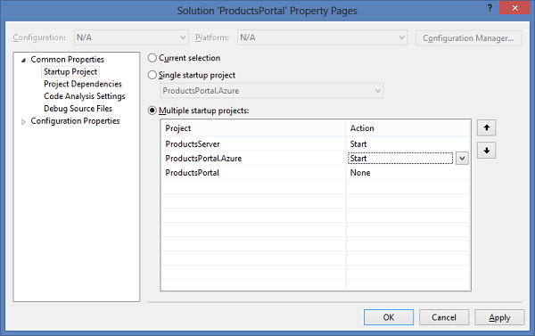

    11. Klicken Sie im Dialogfeld **Eigenschaften** auf der linken Seite auf **ProjectDependencies**.

    12. Klicken Sie in der Dropdownliste **Projekte** auf **ProductsServer**. Stellen Sie sicher, dass **ProductsPortal** deaktiviert und **ProductsPortal.Azure** aktiviert ist. Klicken Sie dann auf **OK**:

        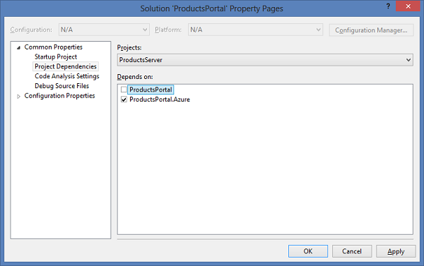

    AUSFÜHREN DER ANWENDUNGAUSFÜHREN DER ANWENDUNG
    ----------------------------------------------

    1.  Klicken Sie im Menü **Datei** in Visual Studio auf **Save All**.

    2.  Drücken Sie **F5**, um die Anwendung zu erstellen und auszuführen. Der lokale Server (die Konsolenanwendung **ProductsServer**) sollte zuerst gestartet werden, danach die Anwendung **ProductsWeb** in einem Browserfenster, wie im Bildschirmfoto unten dargestellt. Dieses Mal werden Sie feststellen, dass in der Produktbestandsliste Daten aus dem lokalen Produktdienstsystem aufgeführt werden.

        

    BEREITSTELLEN DER ANWENDUNGBEREITSTELLEN DER ANWENDUNG FÜR AZURE
    ----------------------------------------------------------------

    1.  Klicken Sie im Projektmappen-Explorer mit der rechten Maustaste auf das Projekt **ProductsPortal**, und klicken Sie dann auf **Publish to Azure**.

    2.  Sie müssen sich möglicherweise anmelden, damit alle Ihre Abonnements angezeigt werden.

        Klicken Sie auf **Sign in to see more subscriptions**:

        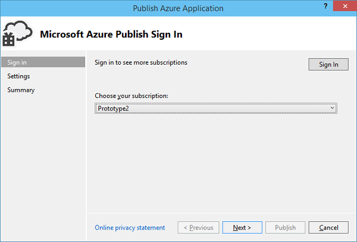

    3.  Melden Sie sich mit Ihrem Microsoft-Konto an.

    4.  Klicken Sie auf **Weiter**. Wenn das Abonnement noch keine gehosteten Dienste enthält, werden Sie aufgefordert, einen zu erstellen. Der gehostete Dienst dient als Container für Ihre Anwendung im Microsoft Azure-Abonnement. Geben Sie einen Namen für Ihre Anwendung ein, und wählen Sie die Region aus, für die die Anwendung optimiert werden soll. (Benutzer aus dieser Region können schnellere Ladezeiten beim Zugriff erwarten.)

        

    5.  Wählen Sie den gehosteten Dienst aus, in dem Sie die Anwendung veröffentlichen möchten. Behalten Sie die unten angezeigten Standardwerte bei den restlichen Einstellungen bei. Klicken Sie auf **Weiter**:

        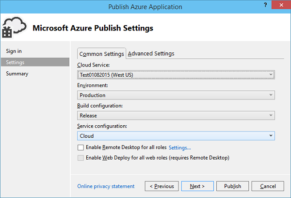

    6.  Klicken Sie auf der letzten Seite auf **Veröffentlichen**, um die Bereitstellung zu starten:

        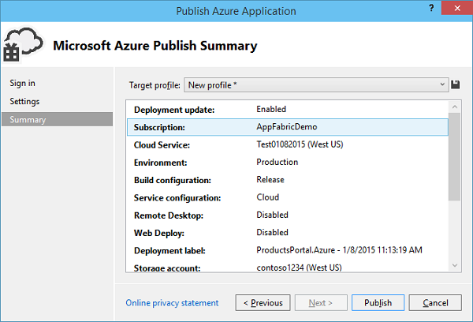

        Dies dauert etwa 5-7 Minuten. Da es sich hierbei um Ihre erste Veröffentlichung handelt, wird von Azure ein virtueller Computer (VM) bereitgestellt, eine Sicherheitshärtung durchgeführt, eine Webrolle auf der VM zum Hosten der Anwendung erstellt, der Code für die Webrolle bereitgestellt und schließlich der Lastenausgleich und das Netzwerk konfiguriert, damit Ihre Anwendung öffentlich verfügbar ist.

    7.  Während der Veröffentlichung können Sie die Aktivität im Fenster **Azure-Aktivitätsprotokoll** überwachen, das normalerweise unten in Visual Studio oder Visual Web Developer verankert ist:

        

    8.  Nach Fertigstellung der Bereitstellung können Sie die Website anzeigen, indem Sie auf den Link **Website-URL** im Überwachungsfenster klicken.

        

        Die Website hängt vom lokalen Server ab, deshalb müssen Sie die Anwendung **ProductsServer** für die Website lokal ausführen, damit sie ordnungsgemäß funktioniert. Wenn Sie Anforderungen auf der Cloudwebsite durchführen, werden bei der lokalen Konsolenanwendung eingehende Anforderungen angezeigt, wie im folgenden Bildschirmfoto durch die Ausgabe "GetProducts called" angegeben.

        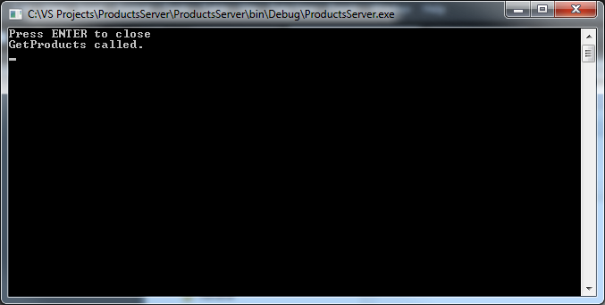

Informationen zum Unterschied zwischen Websites und Clouddiensten finden Sie unter [Azure-Ausführungsmodelle](http://www.windowsazure.com/en-us/develop/net/fundamentals/compute/).

LÖSCHEN DER ANWENDUNGBEENDEN UND LÖSCHEN DER ANWENDUNG
------------------------------------------------------

Nach der Bereitstellung der Anwendung empfiehlt es sich, sie zu deaktivieren, damit Sie andere Anwendungen im Rahmen der kostenlosen 750 Stunden/Monat (31 Tage/Monat) Serverzeit erstellen und bereitstellen können.

Bei Azure werden Webrolleninstanzen pro genutzter Serverzeitstunde berechnet. Serverzeit wird genutzt, sobald die Anwendung bereitgestellt wird, selbst wenn die Instanzen nicht ausgeführt werden und sich im Status **Beendet** befinden. Ein kostenloses Konto umfasst 750 Stunden/Monat (31 Tage/Monat) dedizierte Serverzeit für virtuelle Computer zum Hosten dieser Webrolleninstanzen.

In den folgenden Schritten erfahren Sie, wie Sie die Anwendung beenden und löschen.

1.  Melden Sie sich beim [Azure-Verwaltungsportal](http://manage.windowsazure.com) an, klicken Sie auf **Cloud Services** und dann auf den Namen des Diensts.

2.  Klicken Sie auf die Registerkarte **Dashboard** und dann auf **Beenden**, um die Anwendung vorübergehend anzuhalten. Sie können sie erneut starten, indem Sie auf **Start** klicken. Klicken Sie auf **Löschen**, um die Anwendung vollständig aus Azure zu löschen. Sie kann danach nicht wiederhergestellt werden.

    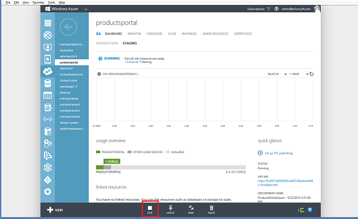

Nächste SchritteNächste Schritte
--------------------------------

Weitere Informationen zu Service Bus finden Sie in den folgenden Ressourcen:

-   [Azure Service Bus](http://msdn.microsoft.com/en-us/library/windowsazure/ee732537.aspx)
-   [Gewusst wie-Themen für Service Bus](/en-us/manage/services/service-bus/)
-   [Verwenden von Service Bus-Warteschlangen](/en-us/develop/net/how-to-guides/service-bus-queues/)

