<properties linkid="dev-net-e2e-multi-tier" urlDisplayName="Multi-Tier Application" pageTitle=".NET Multi-Tier Application - Azure Tutorial" metaKeywords="Azure Service Bus queue tutorial, Azure queue tutorial, Azure worker role tutorial, Azure .NET queue tutorial, Azure C# queue tutorial, Azure C# worker role tutorial" description="A tutorial that helps you develop a multi-tier app in Azure that uses Service Bus queues to communicate between tiers. Samples in .NET." metaCanonical="" services="cloud-services,service-bus" documentationCenter=".NET" title=".NET Multi-Tier Application Using Service Bus Queues" authors="sethm" solutions="" manager="dwrede" editor="mattshel" />

.NET-Anwendungen mit mehreren Ebenen unter Verwendung von Servicebus-Warteschlangen
===================================================================================

Mit Visual Studio 2013 und dem kostenlosen Azure SDK für .NET können Sie schnell und einfach für Azure entwickeln. Falls Sie Visual Studio 2013 noch nicht haben, installiert das SDK Visual Studio Express 2013 automatisch, sodass Sie kostenlos mit der Entwicklung für Azure beginnen können. Dieser Leitfaden geht davon aus, dass Sie noch keine Erfahrung mit Windows Azure haben. Nach Abschluss dieses Leitfadens haben Sie eine Anwendung in Ihrer lokalen Umgebung, die verschiedene Azure-Ressourcen verwendet und demonstriert, wie Anwendungen mit mehreren Ebenen funktionieren.

Sie lernen Folgendes:

-   Vorbereitung Ihres Computers für die Azure-Entwicklung mit einem einzigen Download und einer einzigen Installation
-   Einsatz von Visual Studio für die Azure-Entwicklung.
-   Erstellung von Anwendungen mit mehreren Ebenen in Azure mit Web- und Arbeiterrollen.
-   Kommunikation zwischen Ebenen mithilfe von Servicebus-Warteschlangen

[WACOM.INCLUDE [create-account-note](../includes/create-account-note.md)]

In diesem Lernprogramm werden Sie eine Abwendung mit mehreren Ebenen in einem Azure-Clouddienst erstellen und ausführen. Als Front-End dient eine ASP.NET MVC-Webrolle, und als Backend eine Arbeiterrolle. Dieselbe Anwendung mit mehreren Ebenen könnte auch mit einem Webprojekt als Front-End erstellt und auf einer Azure-Website anstelle eines Clouddienstes bereitgestellt werden. Hinweise zu den Unterschieden für Front-Ends mit Azure-Websites finden Sie im Abschnitt [Nächste Schritte](#nextsteps).

Im Folgenden wird ein Screenshot der fertigen Anwendung angezeigt:

**Hinweis** Azure bietet ebenfalls Funktionen für Speicher-Warteschlangen. Weitere Informationen zu Speicher- und Servicebus-Warteschlangen in Azure finden Sie unter [Windows Azure-Warteschlangen und Windows Azure Service Bus-Warteschlangen – Vergleich und Gegenüberstellung](http://msdn.microsoft.com/de-de/library/windowsazure/hh767287.aspx).

[WACOM.INCLUDE [create-account-note](../includes/create-account-note.md)]

Kommunikation zwischen RollenSzenario-Übersicht: Kommunikation zwischen Rollen
------------------------------------------------------------------------------

Um eine Bestellung zur Verarbeitung zu übermitteln, muss die Front-End-GUI in ihrer Funktion als Webrolle mit der Logikkomponente in der mittleren Ebene interagieren, die eine Arbeiterrolle erfüllt. Dieses Beispiel verwendet die verwaltete Servicebus-Messaging-Funktion für die Kommunikation zwischen Ebenen.

Durch die verwaltete Messaging-Funktion zwischen Web- und mittlerer Ebene werden die Komponenten voneinander entkoppelt. Im Gegensatz zur direkten Kommunikation (z. B. per TCP oder HTTP) verbindet sich die Webebene nicht direkt mit der mittleren Ebene, sondern schiebt Arbeitseinheiten in Form von Nachrichten zum Servicebus, der diese zuverlässig aufbewahrt, bis die mittlere Ebene diese konsumieren und verarbeiten kann.

Der Servicebus bietet zwei Entitäten für die verwaltete Messaging-Funktion: Warteschlangen und Themen. Mit Warteschlangen wird jede Nachricht von einem einzelnen Empfänger konsumiert. Themen unterstützen das Veröffentlichungs- und Abonnementsmuster, mit dem jede veröffentlichte Nachricht allen für das entsprechende Thema registrierten Abonnements zugänglich gemacht wird. Jedes Abonnement pflegt eine eigene Nachrichten-Warteschlange. Abonnements können mit Filterregeln konfiguriert werden. Diese sorgen dafür, dass nur Nachrichten in der Abonnement-Warteschlange landen, welche die Filterregeln erfüllen. Dieses Beispiel verwendet Servicebus-Warteschlangen.

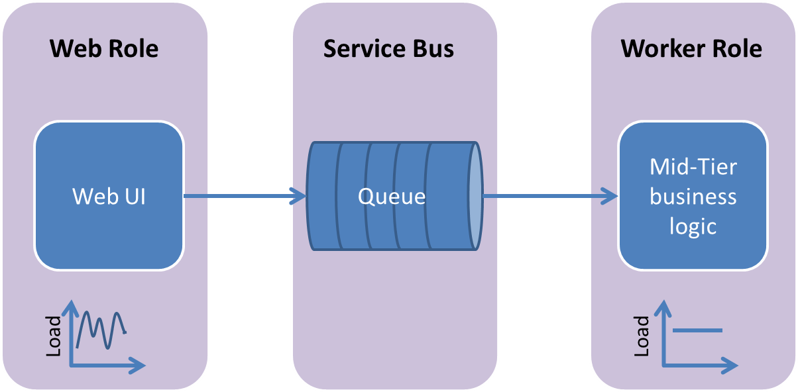

Dieser Kommunikationsmechanismus bietet verschiedene Vorteile gegenüber direkten Nachrichten, genauer gesagt:

-   **Zeitliche Entkopplung.** Dank des asynchronen Nachrichtenmusters müssen Producer und Consumer nicht gleichzeitig online sein. Der Servicebus speichert die Nachrichten zuverlässig, bis der Consumer diese entgegennehmen kann. Auf diese Weise können die Komponenten verteilter Anwendungen voneinander entkoppelt werden, z. B. zu Wartungszwecken oder bei einem Komponentenausfall, ohne das Gesamtsystem zu beeinträchtigen. Außerdem genügt es unter Umständen, wenn die konsumierende Anwendung nur zu bestimmten Tageszeiten online ist.

-   **Belastungsausgleich**. In vielen Anwendungen schwankt die Systemlast mit der Zeit, während die Bearbeitungszeit pro Arbeitseinheit normalerweise konstant ist. Durch die Einführung einer Warteschlange zwischen Nachrichtenproducer und Consumer muss der Consumer (Arbeiter) anstatt der Spitzenlast nur die durchschnittliche Last verarbeiten können. Die Länge der Warteschlange schwankt ebenso wie die eingehende Last. Dies ermöglicht direkte Einsparungen bei der Infrastruktur, die zur Bearbeitung der Anwendungslast benötigt wird.

-   **Lastenausgleich.** Mit zunehmender Last können zusätzliche Arbeitsprozesse zur Verarbeitung der Warteschlange eingesetzt werden. Jede Nachricht wird nur von einem der Arbeitsprozesse verarbeitet. Außerdem ermöglicht dieser entnahmebasierte Lastenausgleich eine optimale Auslastung der Arbeiter, selbst wenn sich deren Rechenleistung stark unterscheidet, da jeder Arbeiter die Nachrichten mit seinem eigenen Maximaldurchsatz aus der Warteschlange entnimmt. Dieses Schema nennt man auch das "Konkurrierende Consumer"-Schema.

    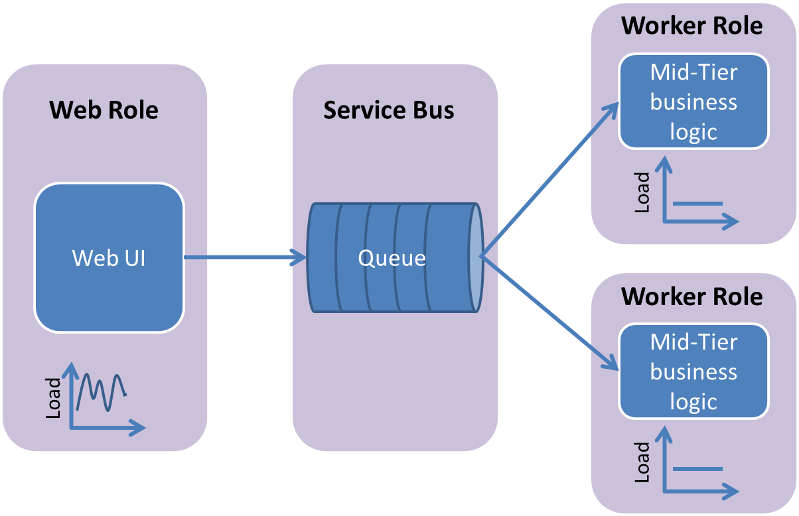

In den folgenden Abschnitten wird der Code für die Implementierung dieser Architektur behandelt.

Einrichten der UmgebungEinrichten der Entwicklungsumgebung
----------------------------------------------------------

Bevor Sie mit der Entwicklung Ihrer Azure-Anwendung beginnen können, brauchen Sie die Tools und müssen Ihre Entwicklungsumgebung einrichten.

1.  Klicken Sie auf die folgende Schaltfläche, um das Azure SDK für .NET zu installieren.

    [Tools und SDK herunterladen](http://go.microsoft.com/fwlink/?LinkId=271920)

2.  Klicken Sie auf **SDK installieren**.

3.  Wählen Sie den korrekten Link für Ihre Visual Studio-Version aus. Die Schritte in diesem Lernprogramm verwenden Visual Studio 2013.

    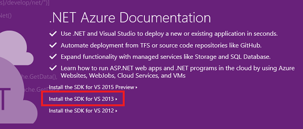

4.  Wenn Sie aufgefordert werden, die ausführbare Installationsdatei auszuführen oder zu speichern, klicken Sie auf **Ausführen**:

    

5.  Klicken Sie im Webplattform-Installer auf **Installieren**, und setzen Sie die Installation fort:

    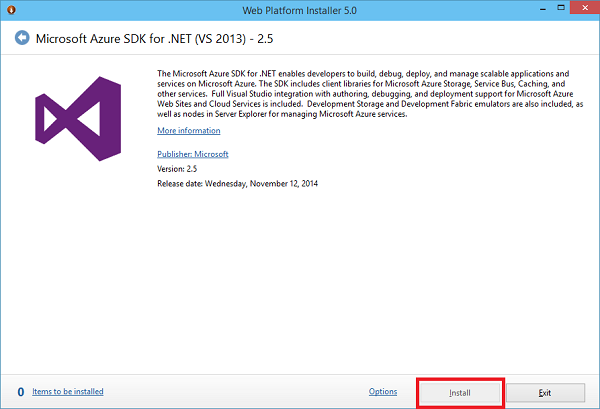

6.  Nach Abschluss der Installation haben Sie alles zur Hand, was Sie benötigen, um mit der Entwicklung zu beginnen. Das SDK enthält Tools, mit denen Sie schnell und einfach Azure-Anwendungen in Visual Studio entwickeln können. Falls Sie Visual Studio nicht installiert haben, wird das kostenlose Visual Studio Express für das Web installiert.

Einrichten des NamespaceEinrichten des Servicebus-Namespace
-----------------------------------------------------------

Der nächste Schritt ist die Einrichtung des Dienstnamespace und eines freigegebenen geheimen Schlüssels. Dienstnamespaces bieten Anwendungsgrenzen für alle Anwendungen, die mit einem Servicebus verbunden sind. Ein freigegebener geheimer Schlüssel wird bei der Erstellung eines Dienstnamespace automatisch vom System generiert. Dienstnamespace und freigegebener geheimer Schlüssel bilden gemeinsam die Anmeldeinformationen, mit denen sich der Servicebus gegenüber der Anwendung authentifiziert.

Namespaces und Entitäten für die Servicebus-Nachrichten können auch im Visual Studio Server-Explorer verwaltet werden, neue Namespaces können dagegen nur im Portal erstellt werden.

### Einrichten eines Namespace über das Verwaltungsportal

1.  Melden Sie sich auf dem [Windows Azure-Verwaltungsportal](http://manage.windowsazure.com) an.

2.  Klicken Sie im linken Navigationsbereich des Verwaltungsportals auf **Servicebus**.

3.  Klicken Sie im unteren Bereich des Verwaltungsportals auf **Erstellen**.

    

4.  Geben Sie im Dialogfeld **Add a new namespace** einen Namen für den Namespace ein. Das System prüft sofort, ob dieser Name verfügbar ist.
     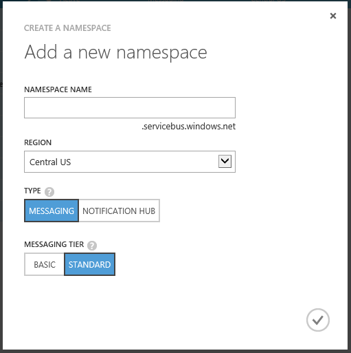

5.  Wählen Sie nach der Bestätigung, dass der Name für den Namespace verfügbar ist, das Land oder die Region, wo dieser Namespace gehostet werden soll. (Stellen Sie sicher, dass dies dasselbe Land/dieselbe Region ist, in dem/der sie Ihre Rechnerressourcen einsetzen.)

    WICHTIG: Wählen Sie **dieselbe Region**, in der Sie auch Ihre Anwendung einsetzen möchten. Dies sorgt für die beste Leistung.

6.  Aktivieren Sie das Kontrollkästchen. Ihr Dienstnamespace wird nun erstellt und aktiviert. Eventuell müssen Sie einige Minuten warten, bis die Ressourcen für Ihr Konto bereitgestellt werden.

    

7.  Klicken Sie im Hauptfenster auf den Namen Ihres Dienstnamespaces.

    

8.  Klicken Sie auf **Verbindungsinformationen**.

    

9.  Suchen Sie im Bereich **Access connection information** nach den Einträgen **Default Issuer** und **Standardschlüssel**.

10. Notieren Sie den Schlüssel oder kopieren Sie ihn in die Zwischenablage.

### Verwalten von Namespaces und Nachrichten-Entitäten im Visual Studio Server-Explorer

Führen Sie die [hier](http://http://msdn.microsoft.com/de-de/library/windowsazure/ff687127.aspx) im Abschnitt **Verbinden mit Windows Azure in Visual Studio** beschriebenen Schritte aus, um Namespaces zu verwalten und Verbindungsinformationen über Visual Studio anstatt aus dem Verwaltungsportal abzurufen. Wenn Sie sich bei Azure anmelden, wird der Knoten **Service Bus** unterhalb der **Microsoft Azure**-Baumdarstellung im Server-Explorer automatisch mit allen Namespaces ausgefüllt, die Sie bereits erstellt haben. Klicken Sie mit der rechten Maustaste auf einen Namespace und klicken Sie anschließend auf **Eigenschaften**, um Verbindungszeichenfolge und andere Metadaten dieses Namespace im Bereich **Eigenschaften** in Visual Studio anzuzeigen.

Notieren Sie den Wert **SharedAccessKey** oder kopieren Sie ihn in die Zwischenablage:

Erstellen einer WebrolleErstellen einer Webrolle
------------------------------------------------

In diesem Abschnitt lernen Sie, das Front-End Ihrer Anwendung zu erstellen. Zunächst erstellen Sie die verschiedenen Seiten, aus denen Ihre Anwendung besteht. Anschließend fügen Sie den Code hinzu, mit dem Elemente an die Servicebus-Warteschlange übergeben und der Status der Warteschlange angezeigt wird.

### Erstellen des Projekts

1.  Starten Sie entweder Microsoft Visual Studio 2013 oder Microsoft Visual Studio Express mit Administratorrechten. Um Visual Studio mit Administratorrechten zu starten, klicken Sie mit der rechten Maustaste auf **Microsoft Visual Studio 2013 (oder Microsoft Visual Studio Express)** und klicken Sie anschließend auf **Als Administrator ausführen**. Für den ebenfalls in diesem Leitfaden behandelten Azure-Serveremulator muss Visual Studio mit Administratorrechten gestartet werden.

    Klicken Sie in Visual Studio im Menü **Datei** auf **Neu** und anschließend auf **Projekt**.

    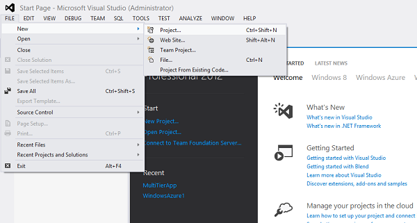

2.  Klicken Sie im Menü **Installierte Vorlagen** unter **Visual C\#** auf **Cloud** und anschließend auf **Azure-Clouddienst**. Geben Sie dem Projekt den Namen **MultiTierApp**. Klicken Sie anschließend auf **OK**.

    

3.  Doppelklicken Sie in den **.NET Framework 4.5**-Rollen auf **ASP.NET-Webrolle**.

    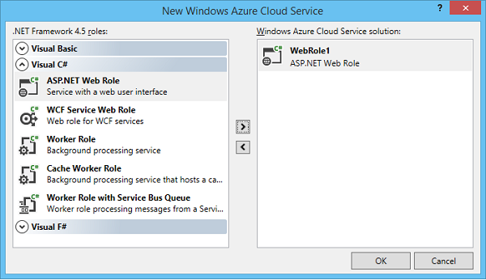

4.  Zeigen Sie auf **WebRole1** unter **Azure-Clouddienst-Lösung**, klicken Sie auf das Stiftsymbol und geben Sie der Webrolle den Namen **FrontendWebRole**. Klicken Sie anschließend auf **OK**. (Achten Sie darauf "Frontend" mit kleinem "e" einzugeben, nicht als "FrontEnd".)

    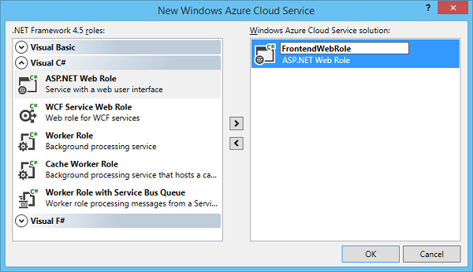

5.  Klicken Sie im Dialogfeld **Neues ASP.NET-Projekt** in der Liste **Vorlage auswählen** auf **MVC** und anschließend auf **OK**.

    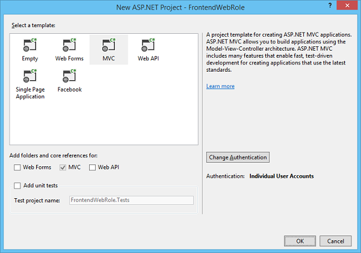

6.  Klicken Sie im **Projektmappen-Explorer** mit der rechten Maustaste auf **Verweise** und anschließend auf **NuGet-Pakete verwalten...** oder auf **Bibliothekspaketverweis hinzufügen**.

7.  Wählen Sie im linken Bereich des Dialogfelds **Online** aus. Suchen Sie nach "**WindowsAzure**" und wählen Sie das Element **Azure-Dienstbus** aus. Schließen Sie die Installation ab und schließen Sie das Dialogfeld.

    

8.  Beachten Sie, dass die benötigten Clientassemblys nun referenziert sind und einige neue Codedateien hinzugefügt wurden.

9.  Klicken Sie im **Projektmappen-Explorer** mit der rechten Maustaste auf **Modelle** und anschließend auf **Hinzufügen** und auf **Klasse**. Geben Sie in das Feld Name den Namen **OnlineOrder.cs** ein. Klicken Sie anschließend auf **Hinzufügen**.

### Schreiben des Codes für Ihre Webrolle

In diesem Abschnitt erstellen Sie die verschiedenen Seiten, aus denen Ihre Anwendung besteht.

1.  Ersetzen Sie in der Datei **OnlineOrder.cs** in Visual Studio die bestehende Namespace-Definition durch den folgenden Code:

        namespace FrontendWebRole.Models
        {
            public class OnlineOrder
            {
                public string Customer { get; set; }
                public string Product { get; set; }
            }
        }

2.  Doppelklicken Sie im **Projektmappen-Explorer** auf **Controllers\\HomeController.cs**. Fügen Sie die folgenden **using**-Anweisungen am Anfang Ihrer Datei hinzu, um den Namespace für Ihr neu erstelltes Modell sowie den Servicebus einzuschließen:

        using FrontendWebRole.Models;
        using Microsoft.ServiceBus.Messaging;
        using Microsoft.ServiceBus;

3.  Ersetzen Sie in der Datei **HomeController.cs** in Visual Studio die bestehende Namespace-Definition ebenfalls durch den folgenden Code. Dieser Code enthält die Methoden für die Übermittlung von Elementen in die Warteschlange:

        namespace FrontendWebRole.Controllers
                    {
                        public class HomeController : Controller
                        {
                            public ActionResult Index()
                            {
                                // Weiterleitung an Submit, da Submit als Startseite
                                // dieser Anwendung dient
                                return RedirectToAction("Submit");
                            }
                    
                            public ActionResult About()
                            {
                                return View();
                            }
                    
                            // GET: /Home/Submit
                            // Controllermethode für eine Ansicht, die Sie für das
                            // Übermittlungsformular erstellen werden
                            public ActionResult Submit()
                            {
                                // Code zum Anzeigen der Anzahl der Elemente in der Warteschlange.

                    return View();
                            }
                    
                            // POST: /Home/Submit
                            // Controllermethode zum Verarbeiten von Anforderungen aus
                            // dem Übermittlungsformular
                            [HttpPost]
                            // Attribut zum Vermeiden von websiteübergreifenden Angriffen und
                            // websiteübergreifenden Anforderungsfälschungen
                            [ValidateAntiForgeryToken] 
                            public ActionResult Submit(OnlineOrder order)
                            {
                                if (ModelState.IsValid)
                                {
                                    // Code zum Übermitteln in die Warteschlange.
                        
                        return RedirectToAction("Submit");
                                }
                                else
                                {
                                    return View(order);
                                }
                            }
                        }
                    }

4.  Klicken Sie im Menü **Build** auf **Projektmappe erstellen**.

5.  Anschließend erstellen Sie die Ansicht für die neu erstellte **Submit()**-Methode. Klicken Sie mit der rechten Maustaste innerhalb der Submit()-Methode und wählen Sie **Ansicht hinzufügen**

    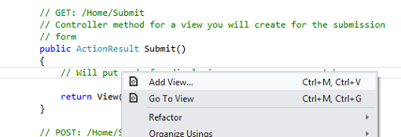

6.  Ein Dialogfeld zum Erstellen der Ansicht wird geöffnet. Wählen Sie die Klasse **OnlineOrder** in der Auswahlliste **Modellklasse** aus und **Erstellen** in der Auswahlliste **Vorlage**.

    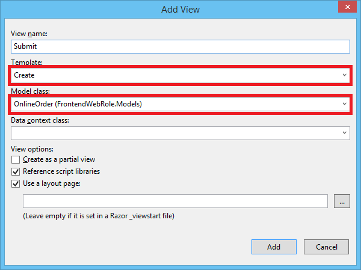

7.  Klicken Sie auf **Hinzufügen**.

8.  Nun werden Sie lernen, den angezeigten Namen Ihrer Anwendung zu ändern. Doppelklicken Sie im **Projektmappen-Explorer** auf die Datei **Views\\Shared\\\_Layout.cshtml**, um diese im Visual Studio-Editor zu öffnen.

9.  Ersetzen Sie alle Vorkommnisse von **My ASP.NET MVC Application** durch **LITWARE'S fantastische Produkte**.

10. Ersetzen Sie **"your logo here"** durch **LITWARE'S fantastische Produkte**:

    

11. Entfernen Sie die Links **Home**, **About** und **Contact**. Löschen Sie den hervorgehobenen Code:

    

12. Erweitern Sie anschließend die Übermittlungsseite um einige Informationen zur Warteschlange. Doppelklicken Sie im **Projektmappen-Explorer** auf die Datei **Views\\Home\\Submit.cshtml**, um diese im Visual Studio-Editor zu öffnen. Fügen Sie die folgende Zeile nach **&lt;h2\>Submit&lt;/h2\>** hinzu: **ViewBag.MessageCount** ist momentan leer. Sie werden diesen Bereich später ausfüllen.

        
Aktuell in der Warteschlange befindliche Elemente: @ViewBag.MessageCount

13. Sie haben nun Ihre GUI implementiert. Drücken Sie **F5**, um Ihre Anwendung auszuführen und zu prüfen, ob diese korrekt angezeigt wird.

    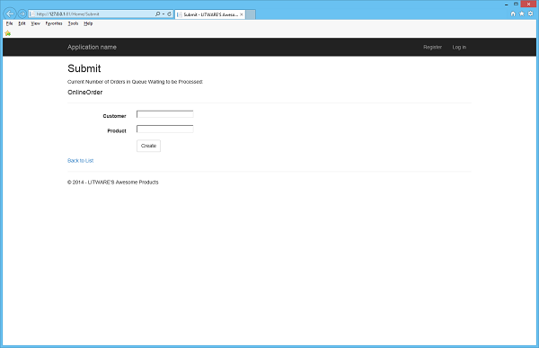

### Schreiben des Codes für die Übermittlung von Elementen an die Servicebus-Warteschlange

Sie werden nun den Code für die Übermittlung von Elementen in die Warteschlange hinzufügen. Erstellen Sie zunächst die Klasse mit den Verbindungsinformationen für die Servicebus-Warteschlange. Anschließend initialisieren Sie Ihre Verbindung in der Klasse **Global.aspx.cs**. Zuletzt aktualisieren Sie den zuvor in **HomeController.cs** erstellten Code, um die Elemente in die Servicebus-Warteschlange zu übermitteln.

1.  Klicken Sie im Projektmappen-Explorer mit der rechten Maustaste auf **FrontendWebRole** (klicken Sie auf das Projekt, nicht auf die Rolle). Klicken Sie auf **Hinzufügen** und anschließend auf **Klasse**.

2.  Geben Sie der Klasse den Namen **QueueConnector.cs**. Klicken Sie auf **Hinzufügen**, um die Klasse zu erstellen.

3.  Sie werden nun den Code einfügen, der Ihre Verbindungsinformationen kapselt und Methoden zum Initialisieren der Verbindung zur Servicebus-Warteschlange enthält. Fügen Sie in QueueConnector.cs den folgenden Code ein und geben Sie die Werte für **Namespace**, **IssuerName** und **IssuerKey** ein. Sie finden diese Werte entweder im [Verwaltungsportal](http://manage.windowsazure.com) oder im Visual Studio Server-Explorer unter dem Knoten **Servicebus**.

        using System;
                using System.Collections.Generic;
                using System.Linq;
                using System.Web;
                using Microsoft.ServiceBus.Messaging;
                using Microsoft.ServiceBus;
                
                namespace FrontendWebRole
                {
                    public static class QueueConnector
                    {
                        // Thread-sicher. Sollte nach Möglichkeit zwischengespeichert werden,
                        // anstatt bei jeder Anforderung neu zu erstellen.
                public static QueueClient OrdersQueueClient;
                
                        // Abrufen der Werte aus dem Verwaltungsportal
                        public const string Namespace = "your service bus namespace";
                        public const string IssuerName = "issuer name";
                        public const string IssuerKey = "issuer key";
                
                        // Der Name Ihrer Warteschlange
                        public const string QueueName = "OrdersQueue";
                
                        public static NamespaceManager CreateNamespaceManager()
                        {
                            // Erstellen des NamespaceManagers, mit dem Sie
                            // Zugriff auf Verwaltungsoperationen erhalten
                            var uri = ServiceBusEnvironment.CreateServiceUri(
                                "sb", Namespace, String.Empty);
                            var tP = TokenProvider.CreateSharedSecretTokenProvider(
                                IssuerName, IssuerKey);
                            return new NamespaceManager(uri, tP);
                        }
                
                        public static void Initialize()
                        {
                            // Verwenden von HTTP für ausgehende Firewalls
                            ServiceBusEnvironment.SystemConnectivity.Mode = 
                                ConnectivityMode.Http;
                
                            // Erstellen des NamespaceManagers, mit dem Sie
                            // Zugriff auf Verwaltungsoperationen erhalten
                            var namespaceManager = CreateNamespaceManager();
                
                            // Erstellen der Warteschlange, falls diese noch nicht existiert
                            if (!namespaceManager.QueueExists(QueueName))
                            {
                                namespaceManager.CreateQueue(QueueName);
                            }
                
                            // Abrufen eines Clients für die Warteschlange
                            var messagingFactory = MessagingFactory.Create(
                                namespaceManager.Address, 
                                namespaceManager.Settings.TokenProvider);
                            OrdersQueueClient = messagingFactory.CreateQueueClient(
                                "OrdersQueue");
                        }
                    }
                }

4.  Nun werden Sie sicherstellen, dass Ihre **Initialize**-Methode aufgerufen wird. Doppelklicken Sie im **Projektmappen-Explorer** auf **Global.asax\\Global.asax.cs**.

5.  Fügen Sie die folgende Zeile am Ende der Methode **Application\_Start** hinzu:

        FrontendWebRole.QueueConnector.Initialize();

6.  Zuletzt aktualisieren Sie den zuvor erstellten Webcode, um die Elemente in die Warteschlange zu übermitteln. Doppelklicken Sie im **Projektmappen-Explorer** auf die zuvor erstellte Datei **Controllers\\HomeController.cs**.

7.  Aktualisieren Sie die **Submit()**-Methode wie folgt, um die Anzahl der Nachrichten in der Warteschlange abzurufen:

        public ActionResult Submit()
            {            
                // Erstellen des NamespaceManagers, mit dem Sie Wartungs-
                // und Diagnoseoperationen für Ihre Servicebus-Warteschlangen ausführen können
            var namespaceManager = QueueConnector.CreateNamespaceManager();
            
                // Abrufen der Warteschlange und der Anzahl der Nachrichten.
            var queue = namespaceManager.GetQueue(QueueConnector.QueueName);
                ViewBag.MessageCount = queue.MessageCount;
            
                return View();
            }

8.  Aktualisieren Sie die **Submit(OnlineOrder order)**-Methode wie folgt, um Informationen an die Warteschlange zu übermitteln:

        public ActionResult Submit(OnlineOrder order)
        {
            if (ModelState.IsValid)
            {
                // Erstellen einer Nachricht für die Bestellung
                var message = new BrokeredMessage(order);
                    
                // Übermitteln der Bestellung
                QueueConnector.OrdersQueueClient.Send(message);
                return RedirectToAction("Submit");
            }
            else
            {
                return View(order);
            }
        }

9.  Führen Sie Ihre Anwendung nun erneut aus. Bei jeder Übermittlung einer Bestellung steigt der Nachrichtenzähler an.

    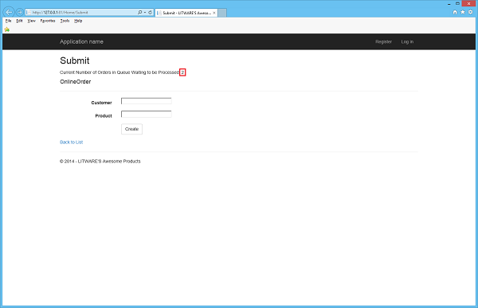

Konfigurations-ManagerCloud-Konfigurations-Manager
--------------------------------------------------

Azure unterstützt verschiedene verwaltete APIs, mit denen Sie neue Instanzen von Azure-Serviceclients (z. B. den Servicebus) in verschiedenen Microsoft Cloud Services erstellen können. Mit diesen APIs können Sie diese Clients (z. B. **CloudBlobClient**, **QueueClient**, **TopicClient**) unabhängig davon instanziieren, wo die Anwendung gehostet wird: vor Ort, in einem Microsoft Cloud Service, in Websites oder in einer persistenten VM-Rolle. Mit diesen APIs können Sie außerdem die Konfigurationsdaten für die Instanziierung dieser Clients abrufen und diese Konfiguration ändern, ohne die aufrufende Anwendung erneut bereitzustellen. Die APIs befinden sich in der Klasse [Microsoft.WindowsAzure.Configuration.CloudConfigurationManager][]. Für die Clientseite existieren ebenfalls APIs.

### Verbindungszeichenfolge

Sie können die Konfigurationsdaten als Verbindungszeichenfolge angeben, um einen Client zu instanziieren (z. B. einen Service Bus-**QueueClient**). Auf der Clientseite existiert die Methode **CreateFromConnectionString()**, die diesen Clienttyp anhand der Verbindungszeichenfolge instanziiert. Als Beispiel dient der folgende Konfigurationsabschnitt:

    <ConfigurationSettings>
        ...
        <Setting name="Microsoft.ServiceBus.ConnectionString" value="Endpoint=sb://[yourServiceNamespace].servicebus.windows.net/;SharedSecretIssuer=[issuerName];SharedSecretValue=[yourDefaultKey]" />
        </ConfigurationSettings>

Der folgende Code ruft die Verbindungszeichenfolge ab, erstellt eine Warteschlange und initialisiert die Verbindung zur Warteschlange:

    QueueClient Client; 

    string connectionString =
     CloudConfigurationManager.GetSetting("Microsoft.ServiceBus.ConnectionString");

    var namespaceManager =
     NamespaceManager.CreateFromConnectionString(connectionString); 

    if (!namespaceManager.QueueExists(QueueName))
    {
        namespaceManager.CreateQueue(QueueName);
    }

    // Initialisieren der Verbindung zur Servicebus-Warteschlange
    Client = QueueClient.CreateFromConnectionString(connectionString, QueueName);

Der Code im folgenden Abschnitt verwendet diese APIs für die Konfigurationsverwaltung.

Erstellen einer WorkerrolleErstellen einer Workerrolle
------------------------------------------------------

Sie werden nun die Workerrolle zur Verarbeitung der übermittelten Nachrichten erstellen. Dieses Beispiel verwendet die Visual Studio-Projektvorlage **Workerrolle mit Servicebus-Warteschlange**. Verwenden Sie zunächst den Server-Explorer in Visual Studio, um die benötigten Anmeldeinformationen zu erhalten.

1.  Falls Sie Visual Studio bereits wie im Abschnitt **Einrichten des Namespace im Visual Studio Server-Explorer** beschrieben mit Ihrem Azure-Benutzerkonto verknüpft haben, können Sie direkt zu Schritt 5 springen.

2.  Offnen Sie in der Menüleiste in Visual Studio das Menü **Ansicht** und klicken Sie auf **Server-Explorer**. Ein **Service Bus**-Knoten erscheint unter **Azure** in der Server-Explorer-Hierarchie, wie in der folgenden Abbildung gezeigt.

    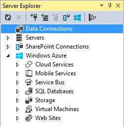

3.  Erweitern Sie den Knoten **Azure** im Server-Explorer und klicken Sie mit der rechten Maustaste auf **Servicebus** und anschließend auf **Neue Verbindung hinzufügen**.

4.  Geben Sie im Dialogfeld **Verbindung hinzufügen** den Namen des Dienstnamespace sowie Namen und Schlüssel des Ausstellers ein. Klicken Sie anschließend auf **OK**, um die Verbindung herzustellen.

    

5.  Klicken Sie in Visual Studio im **Projektmappen-Explorer** mit der rechten Maustaste auf den Ordner **Rollen** im Projekt **MultiTierApp**.

6.  Klicken Sie auf **Hinzufügen** und anschließend auf **Neues Workerrollenprojekt**. Das Dialogfeld **Neues Workerrollenprojekt hinzufügen** wird geöffnet.

    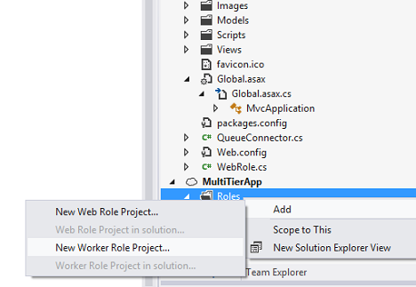

7.  Klicken Sie im Dialogfeld **Neues Workerrollenprojekt hinzufügen** auf **Workerrolle mit Servicebus-Warteschlange**, wie in der folgenden Abbildung gezeigt:

    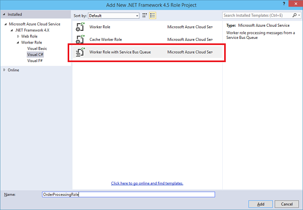

8.  Geben Sie in das Feld **Name** den Namen **OrderProcessingRole** für das Projekt ein. Klicken Sie anschließend auf **Hinzufügen**.

9.  Klicken Sie im Server-Explorer mit der rechten Maustaste auf den Namen Ihres Dienstnamespace und anschließend auf **Eigenschaften**. Der erste Eintrag im Bereich **Eigenschaften** in Visual Studio enthält eine Verbindungszeichenfolge, die mit dem Dienstnamespace-Endpunkt und den benötigten Anmeldeinformationen ausgefüllt ist. Als Beispiel dient die folgende Abbildung. Doppelklicken Sie auf **Verbindungszeichenfolge** und drücken Sie **Strg+C**, um die Zeichenfolge in die Zwischenablage zu kopieren.

    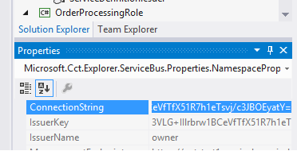

10. Klicken Sie im Projektmappen-Explorer mit der rechten Maustaste auf die in Schritt 7 erstellte **OrderProcessingRole** (klicken Sie auf **OrderProcessingRole** unter **Rollen**, nicht auf die Klasse). Klicken Sie anschließend auf **Eigenschaften**.

11. Klicken Sie in der Registerkarte **Einstellungen** im Dialogfeld **Eigenschaften** in das Textfeld **Wert** für **Microsoft.ServiceBus.ConnectionString** und fügen Sie den in Schritt 8 kopierten Endpunktwert ein.

<!-- -->

    ![][25]

1.  Erstellen Sie die **OnlineOrder**-Klasse, um die Nachrichten abzubilden, während diese aus der Warteschlange verarbeitet werden. Sie können dabei eine zuvor erstellte Klasse wiederverwenden. Klicken Sie im Projektmappen-Explorer mit der rechten Maustaste auf das Projekt **OrderProcessingRole** (klicken Sie auf das Projekt, nicht auf die Rolle). Klicken Sie auf **Hinzufügen** und anschließend auf **Vorhandenes Element**.

2.  Durchsuchen Sie den Unterordner nach **FrontendWebRole\\Models** und doppelklicken Sie auf **OnlineOrder.cs**, um die Klasse zum Projekt hinzuzufügen.

3.  Ändern Sie in WorkerRole.cs den Wert der Variable **QueueName** in **WorkerRole.cs** von `"ProcessingQueue"` zu `"OrdersQueue"`, wie im folgenden Code gezeigt:

        // Der Name Ihrer Warteschlange
        const string QueueName = "OrdersQueue";

4.  Fügen Sie die folgende using-Anweisung am Anfang der Datei WorkerRole.cs hinzu:

        using FrontendWebRole.Models;

5.  Fügen Sie in der `Run()`-Funktion im `OnMessage`-Aufruf den folgenden Code in der `try`-Klausel hinzu:

        Trace.WriteLine("Verarbeitung läuft", receivedMessage.SequenceNumber.ToString());
        // Anzeige der Nachricht als OnlineOrder
        OnlineOrder order = receivedMessage.GetBody<OnlineOrder>();
        Trace.WriteLine(order.Customer + ": " + order.Product, "ProcessingMessage");
        receivedMessage.Complete();

6.  Ihre Anwendung ist nun fertig. Sie können die fertige Anwendung nun wie zuvor durch Drücken von F5 testen. Beachten Sie, dass die Nachrichtenzahl nicht ansteigt, da die Workerrolle die Elemente in der Warteschlange verarbeitet und als abgeschlossen markiert. Sie können die Ausgabe Ihrer Workerrolle in der Azure-Serveremulator-GUI anzeigen. Klicken Sie dazu mit der rechten Maustaste in den Infobereich Ihrer Taskleiste und wählen Sie **Serveremulator-GUI anzeigen**.

<!-- -->

    ![][19]

    ![][20]

Nächste SchritteNächste Schritte
--------------------------------

Weitere Informationen zum Servicebus finden Sie in den folgenden Ressourcen:

-   [Azure-Servicebus](http://msdn.microsoft.com/de-de/library/windowsazure/ee732537.aspx)
-   [Servicebus-Anleitungen](/de-de/manage/services/service-bus/)
-   [Einsatz von Servicebus-Warteschlangen](/de-de/develop/net/how-to-guides/service-bus-queues/)

Weitere Informationen über Szenarien mit mehreren Ebenen und die Bereitstellung von Anwendungen in Cloud-Diensten finden Sie unter:

-   [.NET-Anwendungen mit mehreren Ebenen mithilfe von Speichertabellen, Warteschlangen und Blobs](/de-de/develop/net/tutorials/multi-tier-web-site/1-overview/)

Sie können das Front-End einer Anwendung mit mehreren Ebenen anstelle eines Azure-Cloud-Dienstes auch als Azure-Website implementieren. Weitere Informationen zum Unterschied zwischen Websites und Cloud-Diensten finden Sie unter [Azure-Ausführungsmodelle](http://www.windowsazure.com/de-de/develop/net/fundamentals/compute/).

Um die Anwendung aus diesem Lernprogramm als Standard-Webprojekt anstelle einer Cloud-Dienst-Webrolle zu erstellen, führen Sie die Schritte in diesem Lernprogramm mit den folgenden Unterschieden aus:

1.  Wählen Sie bei der Projekterstellung die Projektvorlage **ASP.NET MVC 4-Webanwendung** in der Kategorie **Web** anstelle der Vorlage **Cloud-Dienst** in der Kategorie **Cloud**. Führen Sie anschließend dieselben Schritte zur Erstellung der MVC-Anwendung durch, bis Sie zum Abschnitt **Cloud-Konfigurations-Manager** gelangen.

2.  Erstellen Sie die Workerrolle in einer neuen, separaten Lösung, analog zu den ursprünglichen Anweisungen für die Webrolle. Nun erstellen Sie jedoch nur die Workerrolle im Cloud-Dienst-Projekt. Befolgen Sie anschließend dieselben Anweisungen für die Erstellung der Workerrolle.

3.  Sie können Front-End und Back-End entweder separat testen oder beide simultan in separaten Visual Studio-Instanzen ausführen.

Informationen zur Bereitstellung des Front-Ends in einer Azure-Website finden Sie unter [Bereitstellung einer ASP.NET-Webanwendung für eine Azure-Website](http://www.windowsazure.com/de-de/develop/net/tutorials/get-started/). Informationen zur Bereitstellung des Back-Ends für einen Azure-Cloud-Dienst finden Sie unter [.NET-Anwendungen mit mehreren Ebenen mithilfe von Speichertabellen, Warteschlangen und Blobs](/de-de/develop/net/tutorials/multi-tier-web-site/1-overview/).

