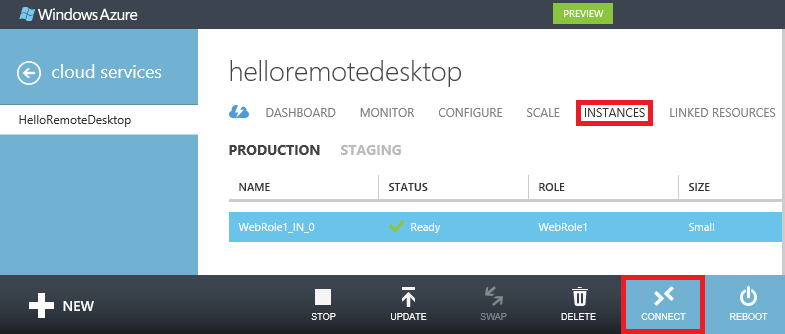
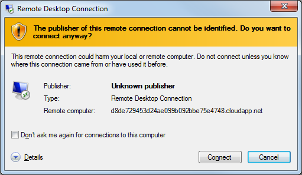

<properties linkid="dev-node-remotedesktop" urlDisplayName="Enable Remote Desktop" pageTitle="Enable remote desktop for cloud services (Node.js)" metaKeywords="Azure Node.js remote access, Azure Node.js remote connection, Azure Node.js VM access, Azure Node.js virtual machine access" description="Learn how to enable remote-desktop access for the virtual machines hosting your Azure Node.js application. " metaCanonical="" services="cloud-services" documentationCenter="Node.js" title="Enabling Remote Desktop in Azure" authors="" solutions="" manager="" editor="" />

Aktivieren von Remotedesktop in Azure
=====================================

Mit Remotedesktop können Sie auf den Desktop einer Rolleninstanz zugreifen, die in Azure ausgeführt wird. Sie können eine Remotedesktop-Verbindung zur Konfiguration eines virtuellen Computers oder zur Lösung von Problemen mit Ihrer Anwendung verwenden.

**Hinweis**

Die Schritte in diesem Beitrag gelten nur für Node-Anwendungen, die als Azure-Clouddienst gehostet werden.

Die vorliegende Aufgabe umfasst die folgenden Schritte:

-   [Schritt 1: Konfigurieren des Dienstes für Remotedesktop-Zugriff mit Azure PowerShell](#step1)
-   [Schritt 2: Verbinden mit der Rolleninstanz](#step2)
-   [Schritt 3: Konfigurieren des Dienstes zur Deaktivierung des Remotedesktop-Zugriffs mit Azure PowerShell](#step3)

Schritt 1: Konfigurieren des Dienstes für Remotedesktop-Zugriff mit Azure PowerShell
------------------------------------------------------------------------------------

Um Remotedesktop verwenden zu können, müssen Sie Ihre Dienstdefinition und -konfiguration mit einem Benutzernamen, einem Kennwort und einem Zertifikat für die Authentifizierung von Rolleninstanzen in der Cloud konfigurieren. [Azure PowerShell](http://go.microsoft.com/?linkid=9790229&clcid=0x409) enthält das cmdlet **Enable-AzureServiceProjectRemoteDesktop**, das diese Konfiguration für Sie durchführt.

Führen Sie am Computer, an dem die Dienstdefinition erstellt wurde, die folgenden Schritte aus.

1.  Klicken Sie im Menü **Start** auf **Azure PowerShell**.

    

2.  Wechseln Sie zum Dienstverzeichnis, geben Sie **Enable-AzureServiceProjectRemoteDesktop** ein, und geben Sie dann einen Benutzernamen und ein Kennwort zur Authentifizierung von Rolleninstanzen in der Cloud ein.

    

3.  Veröffentlichen Sie die Änderungen an der Dienstkonfiguration in der Cloud. Geben Sie an der Eingabeaufforderung für **Azure PowerShell** den Text **Publish-AzureServiceProject** ein.

    

Wenn diese Schritte ausgeführt sind, werden die Rolleninstanzen des Dienstes in der Cloud für Remotedesktop-Zugriff konfiguriert.

Schritt 2: Verbinden mit der Rolleninstanz
------------------------------------------

Wenn Ihre Bereitstellung in Azure ausgeführt wird, können Sie die Verbindung zur Rolleninstanz herstellen.

1.  Wählen Sie im [Azure-Verwaltungsportal](http://manage.windowsazure.com) die Option **Clouddienste** und den oben in Schritt 1 bereitgestellten Dienst aus

    

2.  Klicken Sie auf **Instanzen** und anschließend auf **Produktion** oder **Staging**, um die Instanzen für Ihren Dienst anzuzeigen. Wählen Sie eine Instanz aus, und klicken Sie unten auf der Seite auf **Verbinden**.

    

3.  Wenn Sie auf **Verbinden** klicken, werden Sie vom Webbrowser aufgefordert, eine .rdp-Datei zu speichern. Wenn Sie Internet Explorer verwenden, klicken Sie auf **Öffnen**.

    

4.  Wenn die Datei geöffnet wird, erscheint der folgende Sicherheitshinweis:

    

5.  Klicken Sie auf **Verbinden**. Ein Sicherheitshinweis wird angezeigt, mit dem gemeldet wird, dass Sie Ihre Anmeldedaten eingeben müssen, um auf die Instanz zuzugreifen. Geben Sie das Kennwort ein, das Sie in [Schritt 1](#step1) erstellt haben, und klicken Sie auf **OK**.

    

Wenn die Verbindung hergestellt ist, zeigt die Remotedesktopverbindung den Desktop der Instanz in Azure an. Sie haben nun erfolgreich Fernzugriff auf Ihre Instanz erlangt und können alle zur Verwaltung Ihrer Anwendung nötigen Aufgaben ausführen.

Schritt 3: Konfigurieren des Dienstes zur Deaktivierung des Remotedesktop-Zugriffs mit Azure PowerShell
-------------------------------------------------------------------------------------------------------

Wenn Sie die Remotedesktop-Verbindung zu den Rolleninstanzen in der Cloud nicht mehr benötigen, deaktivieren Sie den Remotedesktop-Zugriff über die [Azure PowerShell](http://go.microsoft.com/?linkid=9790229&clcid=0x409)

1.  Klicken Sie im Menü **Start** auf **Azure PowerShell**.

2.  Wechseln Sie ins Dienstverzeichnis, und geben Sie **Disable-AzureServiceProjectRemoteDesktop** ein:

3.  Veröffentlichen Sie die Änderungen an der Dienstkonfiguration in der Cloud. Geben Sie an der Eingabeaufforderung für **Azure PowerShell** den Text **Publish-AzureServiceProject** ein:

Zusätzliche Ressourcen
----------------------

-   [Fernzugriff auf Rolleninstanzen in Azure](http://msdn.microsoft.com/de-de/library/windowsazure/hh124107.aspx)
-   [Verwendung von Remotedesktop mit Azure-Rollen](http://msdn.microsoft.com/de-de/library/windowsazure/gg443832.aspx)

  [Step 1: Configure the service for Remote Desktop access using Azure PowerShell]: #step1
  [Step 2: Connect to the role instance]: #step2
  [Step 3: Configure the service to disable Remote Desktop access using Azure PowerShell]: #step3
  [Azure PowerShell]: http://go.microsoft.com/?linkid=9790229&clcid=0x409

[Azure Management Portal]: http://manage.windowsazure.com
[powershell-menu]: ./media/cloud-services-nodejs-enable-remote-desktop/azure-powershell-menu.png
[publish-project]: ./media/cloud-services-nodejs-enable-remote-desktop/publish-rdp.png
[enable-rdp]: ./media/cloud-services-nodejs-enable-remote-desktop/enable-rdp.png
[cloud-services]: ./media/cloud-services-nodejs-enable-remote-desktop/cloud-services-remote.png
  [3]: ./media/cloud-services-nodejs-enable-remote-desktop/cloud-service-instance.png
  [4]: ./media/cloud-services-nodejs-enable-remote-desktop/rdp-open.png
  [5]: ./media/cloud-services-nodejs-enable-remote-desktop/remote-desktop-12.png
  [6]: ./media/cloud-services-nodejs-enable-remote-desktop/remote-desktop-13.png
  [7]: ./media/cloud-services-nodejs-enable-remote-desktop/remote-desktop-14.png
  
  [Remotely Accessing Role Instances in Azure]: http://msdn.microsoft.com/de-de/library/windowsazure/hh124107.aspx
  [Using Remote Desktop with Azure Roles]: http://msdn.microsoft.com/de-de/library/windowsazure/gg443832.aspx
