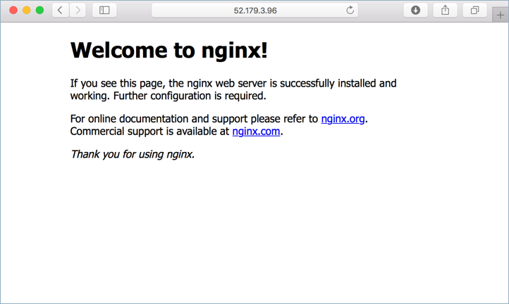

# <a name="deploy-a-dcos-cluster"></a>Bereitstellen eines DC/OS-Clusters

DC/OS stellt eine verteilte Plattform zum Ausführen moderner Containeranwendungen bereit. Mit Azure Container Service ist die Bereitstellung eines produktionsfertigen DC/OS-Clusters schnell und einfach. In diesem Schnellstart werden die grundlegenden Schritte zum Bereitstellen eines DC/OS-Clusters und Ausführen der grundlegenden Arbeitsauslastung erläutert.

Wenn Sie kein Azure-Abonnement besitzen, können Sie ein [kostenloses Konto](https://azure.microsoft.com/free/?WT.mc_id=A261C142F) erstellen, bevor Sie beginnen.

Für dieses Tutorial ist mindestens Version 2.0.4 der Azure CLI erforderlich. Führen Sie `az --version` aus, um die Version zu finden. Wenn Sie ein Upgrade ausführen müssen, finden Sie unter [Installieren von Azure CLI 2.0]( /cli/azure/install-azure-cli) Informationen dazu. 

## <a name="log-in-to-azure"></a>Anmelden an Azure 

Melden Sie sich mit dem Befehl [az login](/cli/azure/#login) bei Ihrem Azure-Abonnement an, und befolgen Sie die Anweisungen auf dem Bildschirm.

```azurecli
az login
```

## <a name="create-a-resource-group"></a>Erstellen einer Ressourcengruppe

Erstellen Sie mit dem Befehl [az group create](/cli/azure/group#create) eine Ressourcengruppe. Eine Azure-Ressourcengruppe ist ein logischer Container, in dem Azure-Ressourcen bereitgestellt und verwaltet werden. 

Das folgende Beispiel erstellt eine Ressourcengruppe mit dem Namen *myResourceGroup* am Standort *eastus*.

```azurecli
az group create --name myResourceGroup --location eastus
```

## <a name="create-dcos-cluster"></a>Erstellen eines DC/OS-Clusters

Erstellen Sie mit dem Befehl [az acs create](/cli/azure/acs#create) ein DC/OS-Cluster.

Im folgenden Beispiel werden ein DC/OS-Cluster namens *myDCOSCluster* und SSH-Schlüssel erstellt, wenn sie nicht bereits vorhanden sind. Um einen bestimmten Satz von Schlüsseln zu verwenden, nutzen Sie die Option `--ssh-key-value`.  

```azurecli
az acs create \
  --orchestrator-type dcos \
  --resource-group myResourceGroup \
  --name myDCOSCluster \
  --generate-ssh-keys
```

Nach einigen Minuten ist der Befehl abgeschlossen, und gibt Informationen zu der Bereitstellung zurück.

## <a name="connect-to-dcos-cluster"></a>Herstellen einer Verbindung mit dem Cluster DC/OS

Sobald ein DC/OS-Cluster erstellt wurde, kann darauf über einen SSH-Tunnel zugegriffen werden. Führen Sie den folgenden Befehl aus, um die öffentliche IP-Adresse des DC/OS-Masters zurückzugeben. Diese IP-Adresse wird in einer Variablen gespeichert und im nächsten Schritt verwendet.

```azurecli
ip=$(az network public-ip list --resource-group myResourceGroup --query "[?contains(name,'dcos-master')].[ipAddress]" -o tsv)
```

Um den SSH-Tunnel zu erstellen, führen Sie den folgenden Befehl aus, und befolgen Sie die Anweisungen auf dem Bildschirm. Wenn Port 80 bereits verwendet wird, löst der Befehl einen Fehler aus. Aktualisieren Sie den getunnelten Port auf einen wie `85:localhost:80`, der aktuell nicht verwendet wird. 

```azurecli
sudo ssh -i ~/.ssh/id_rsa -fNL 80:localhost:80 -p 2200 azureuser@$ip
```

Der SSH-Tunnel kann durch Navigieren zu `http://localhost` getestet werden. Wenn ein anderer Port als Port 80 verwendet wurde, passen Sie den Speicherort entsprechend an. 

Wenn der SSH-Tunnel erfolgreich erstellt wurde, wird das DC/OS-Portal zurückgegeben.


## <a name="install-dcos-cli"></a>Installieren der DC/OS-CLI

Die DC/OS-Befehlszeilenschnittstelle wird dazu verwendet, ein DC/OS-Cluster über die Befehlszeile zu verwalten. Installieren Sie die DC/OS-CLI mithilfe des Befehls [az acs dcos install-cli](/azure/acs/dcos#install-cli). Wenn Sie Azure CloudShell verwenden, ist die DC/OS-CLI bereits installiert. 

Wenn Sie die Azure CLI unter macOS oder Linux ausführen, müssen Sie den Befehl möglicherweise mit „sudo“ ausführen.

```azurecli
az acs dcos install-cli
```

Bevor die CLI mit dem Cluster verwendet werden kann, muss sie für die Verwendung des SSH-Tunnels konfiguriert werden. Führen Sie hierzu den folgenden Befehl aus, und passen Sie gegebenenfalls den Port an.

```azurecli
dcos config set core.dcos_url http://localhost
```

## <a name="run-an-application"></a>Ausführen einer Anwendung

Der Standardplanungsmechanismus für einen Cluster mit ACS-DC/OS-Cluster ist Marathon. Marathon wird verwendet, um eine Anwendung zu starten und den Status der Anwendung auf dem DC/OS-Cluster zu verwalten. Um eine Anwendung über Marathon zu planen, erstellen Sie eine Datei mit dem Namen *marathon-app.json*, und kopieren Sie den folgenden Inhalt hinein. 

```json
{
  "id": "demo-app",
  "cmd": null,
  "cpus": 1,
  "mem": 32,
  "disk": 0,
  "instances": 1,
  "container": {
    "docker": {
      "image": "nginx",
      "network": "BRIDGE",
      "portMappings": [
        {
          "containerPort": 80,
          "hostPort": 80,
          "protocol": "tcp",
          "name": "80",
          "labels": null
        }
      ]
    },
    "type": "DOCKER"
  },
  "acceptedResourceRoles": [
    "slave_public"
  ]
}
```

Führen Sie den folgenden Befehl aus, um die Ausführung der Anwendung auf dem DC/OS-Cluster zu planen.

```azurecli
dcos marathon app add marathon-app.json
```

Um den Bereitstellungsstatus der App anzuzeigen, führen Sie den folgenden Befehl aus.

```azurecli
dcos marathon app list
```

Wenn der Spaltenwert **Warten** von *TRUE* auf *FALSE* wechselt, wurde die Anwendungsbereitstellung abgeschlossen.

```azurecli
ID     MEM  CPUS  TASKS  HEALTH  DEPLOYMENT  WAITING  CONTAINER  CMD   
/test   32   1     1/1    ---       ---      False      DOCKER   None
```

Rufen Sie die öffentliche IP-Adresse der DC/OS-Cluster-Agents ab.

```azurecli
az network public-ip list --resource-group myResourceGroup --query "[?contains(name,'dcos-agent')].[ipAddress]" -o tsv
```

Wenn Sie zu dieser Adresse navigieren, wird die Standard-NGINX-Website zurückgegeben.



## <a name="delete-dcos-cluster"></a>Löschen des DC/OS-Clusters

Mit dem Befehl [az group delete](/cli/azure/group#delete) können Sie die Ressourcengruppe, das DC/OS-Cluster und alle dazugehörigen Ressourcen entfernen, wenn sie nicht mehr benötigt werden.

```azurecli
az group delete --name myResourceGroup --no-wait
```

## <a name="next-steps"></a>Nächste Schritte

In diesem Schnellstart haben Sie ein DC/OS-Cluster entwickelt und einen einfachen Docker-Container auf dem Cluster ausgeführt. Weitere Informationen zu Azure Container Service erhalten Sie in den ACS-Tutorials.

> [!div class="nextstepaction"]
> [Verwalten eines ACS-DC/OS-Clusters](container-service-dcos-manage-tutorial.md)
