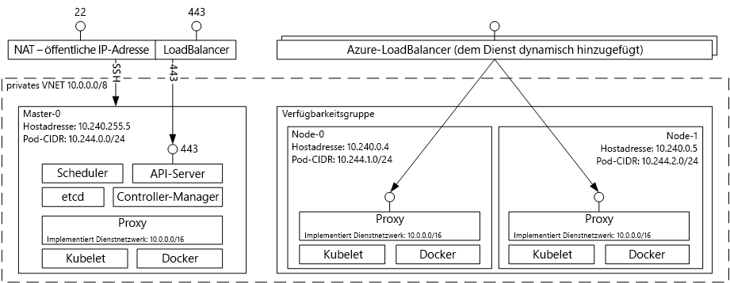

# (VERALTET) Einführung in Azure Container Service für Kubernetes

> [!TIP]
> Die aktualisierte Version dieses Artikels, in dem Azure Kubernetes Service verwendet wird, finden Sie unter [Azure Kubernetes Service (AKS)](../../aks/intro-kubernetes.md).

[!INCLUDE [ACS deprecation](../../../includes/container-service-kubernetes-deprecation.md)]

Azure Container Service für Kubernetes vereinfacht das Erstellen, Konfigurieren und Verwalten eines Clusters mit virtuellen Computern, die für die Ausführung von Anwendungen in Containern vorkonfiguriert sind. So können Sie Ihre vorhandenen Kenntnisse nutzen, bzw. auf einen großen und wachsenden Pool von Communityfachkenntnissen zur Bereitstellung und Verwaltung von containerbasierten Anwendungen in Microsoft Azure zurückgreifen.

Mit Azure Container Service können Sie die professionellen Features von Azure nutzen und müssen dank Kubernetes und Docker-Imageformat trotzdem nicht auf Anwendungsportabilität verzichten.

## Verwenden von Azure Container Service für Kubernetes
Mit dem Azure Container Service verfolgen wir das Ziel, mit Open Source-Tools und -Technologien, die heutzutage bei unseren Kunden beliebt sind, eine Umgebung für das Containerhosting bereitzustellen. Zu diesem Zweck machen wir die standardmäßigen Kubernetes-API-Endpunkte verfügbar. Mithilfe dieser Standardendpunkte können Sie jede Software nutzen, die mit einem Kubernetes-Cluster kommunizieren kann. Zur Auswahl stehen beispielsweise [kubectl](https://kubernetes.io/docs/user-guide/kubectl-overview/), [helm](https://helm.sh/) und [draft](https://github.com/Azure/draft).

## Erstellen eines Kubernetes-Clusters mithilfe von Azure Container Service
Stellen Sie zum Verwenden von Azure Container Service zunächst mithilfe der [Azure-Befehlszeilenschnittstelle](container-service-kubernetes-walkthrough.md) oder über das Portal einen Azure Container Service-Cluster bereit. (Suchen Sie im Marketplace nach **Azure Container Service**.) Erfahrene Benutzer, die mehr Kontrolle über Azure Resource Manager-Vorlagen benötigen, können mithilfe des Open-Source-Projekts [acs-engine](https://github.com/Azure/acs-engine) einen eigenen benutzerdefinierten Kubernetes-Cluster erstellen und über die `az`-Befehlszeilenschnittstelle bereitstellen.

### Verwenden von Kubernetes
Kubernetes automatisiert die Bereitstellung, Skalierung und Verwaltung von Anwendungen in Containern. Das Tool bietet zahlreiche Funktionen, darunter:
* Automatisches Bin Packing
* Selbstreparatur
* Horizontale Skalierung
* Dienstermittlung und Lastenausgleich
* Automatisierte Rollouts und Rollbacks
* Geheimnis- und Konfigurationsverwaltung
* Speicherorchestrierung
* Batchausführung

Architekturdiagramm für Azure Container Service-basierte Kubernetes-Bereitstellung:

## Videos

Kubernetes-Unterstützung in Azure Container Service (Azure Friday, Januar 2017):

> [!VIDEO https://channel9.msdn.com/Shows/Azure-Friday/Kubernetes-Support-in-Azure-Container-Services/player]
>
>

Tools für die Entwicklung und Bereitstellung von Anwendungen in Kubernetes (Azure OpenDev, Juni 2017):

> [!VIDEO https://channel9.msdn.com/Events/AzureOpenDev/June2017/Tools-for-Developing-and-Deploying-Applications-on-Kubernetes/player]
>
>

## Nächste Schritte

Machen Sie sich in der [Kubernetes-Schnellstartanleitung](container-service-kubernetes-walkthrough.md) mit Azure Container Service vertraut.
