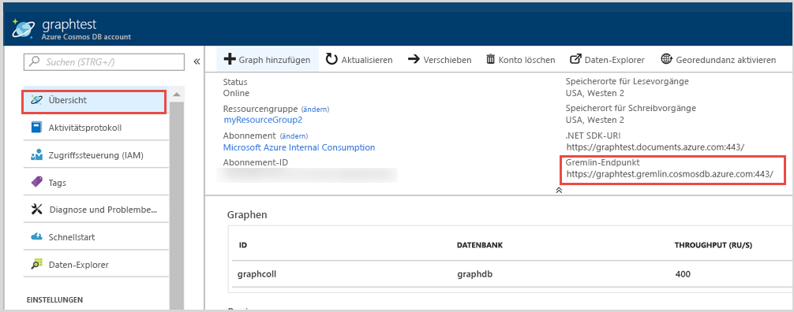
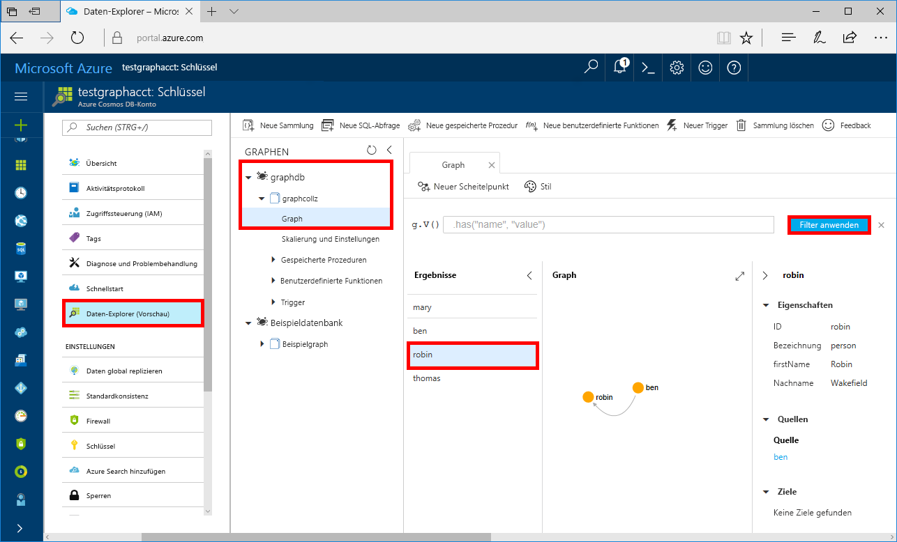

# <a name="quickstart-build-a-net-framework-or-core-application-using-the-azure-cosmos-db-gremlin-api-account"></a>Schnellstart: Erstellen einer .NET Framework- oder Core-Anwendung mithilfe des Gremlin-API-Kontos für Azure Cosmos DB

> [!div class="op_single_selector"]
> * [Gremlin-Konsole](create-graph-gremlin-console.md)
> * [.NET](create-graph-dotnet.md)
> * [Java](create-graph-java.md)
> * [Node.js](create-graph-nodejs.md)
> * [Python](create-graph-python.md)
> * [PHP](create-graph-php.md)
>  

Azure Cosmos DB ist ein global verteilter Datenbankdienst von Microsoft mit mehreren Modellen. Sie können schnell Dokument-, Schlüssel/Wert- und Graph-Datenbanken erstellen und abfragen und dabei stets die Vorteile der globalen Verteilung und der horizontalen Skalierung nutzen, die Azure Cosmos DB zugrunde liegen. 

In dieser Schnellstartanleitung wird veranschaulicht, wie Sie mithilfe des Azure-Portals ein [Gremlin-API](graph-introduction.md)-Konto, eine Datenbank und einen Graph (Container) für Azure Cosmos DB erstellen. Anschließend erstellen Sie eine Konsolenanwendung mithilfe des Open-Source-Treibers [Gremlin.Net](https://tinkerpop.apache.org/docs/3.2.7/reference/#gremlin-DotNet) und führen diese aus.  

## <a name="prerequisites"></a>Voraussetzungen

Falls Sie Visual Studio 2017 noch nicht installiert haben, können Sie die **kostenlose** [Visual Studio 2017 Community-Edition](https://www.visualstudio.com/downloads/) herunterladen und verwenden. Aktivieren Sie beim Setup von Visual Studio die Option **Azure-Entwicklung**.

Falls Sie Visual Studio 2017 bereits installiert haben, stellen Sie sicher, dass alle Updates bis [Visual Studio 2017 Update 3](https://www.visualstudio.com/en-us/news/releasenotes/vs2017-relnotes) installiert sind.

[!INCLUDE [quickstarts-free-trial-note](../../includes/quickstarts-free-trial-note.md)]

## <a name="create-a-database-account"></a>Erstellen eines Datenbankkontos

[!INCLUDE [cosmos-db-create-dbaccount-graph](../../includes/cosmos-db-create-dbaccount-graph.md)]

## <a name="add-a-graph"></a>Hinzufügen eines Graphs

[!INCLUDE [cosmos-db-create-graph](../../includes/cosmos-db-create-graph.md)]

## <a name="clone-the-sample-application"></a>Klonen der Beispielanwendung

Klonen Sie eine Gremlin-API-App aus GitHub, legen Sie die Verbindungszeichenfolge fest, und führen Sie sie aus. Sie werden feststellen, wie einfach Sie programmgesteuert mit Daten arbeiten können. 

1. Öffnen Sie eine Eingabeaufforderung, erstellen Sie einen neuen Ordner namens „git-samples“, und schließen Sie die Eingabeaufforderung.

    ```bash
    md "C:\git-samples"
    ```

2. Öffnen Sie ein Git-Terminalfenster (z.B. git bash), und verwenden Sie den Befehl `cd`, um in den neuen Ordner zu gelangen und dort die Beispiel-App zu installieren.

    ```bash
    cd "C:\git-samples"
    ```

3. Führen Sie den folgenden Befehl aus, um das Beispielrepository zu klonen. Dieser Befehl erstellt eine Kopie der Beispiel-App auf Ihrem Computer.

    ```bash
    git clone https://github.com/Azure-Samples/azure-cosmos-db-graph-gremlindotnet-getting-started.git
    ```

4. Öffnen Sie anschließend Visual Studio und die Projektmappendatei.

5. Stellen Sie die NuGet-Pakete im Projekt wieder her. Diese sollten den Treiber „Gremlin.Net“ und das Paket „Newtonsoft.Json“ umfassen.


6. Sie können den Treiber „Gremlin.Net“ aber auch manuell mithilfe des NuGet-Paket-Managers oder des [NuGet-Befehlszeilentools](https://docs.microsoft.com/nuget/install-nuget-client-tools) installieren: 

    ```bash
    nuget install Gremlin.Net
    ```

## <a name="review-the-code"></a>Überprüfen des Codes

Dieser Schritt ist optional. Wenn Sie erfahren möchten, wie die Datenbankressourcen im Code erstellt werden, können Sie sich die folgenden Codeausschnitte ansehen. Andernfalls können Sie mit [Aktualisieren der Verbindungszeichenfolge](#update-your-connection-string) fortfahren. 

Die folgenden Codeausschnitte stammen alle aus der Datei „Program.cs“.

* Legen Sie Ihre Verbindungsparameter auf der Grundlage des weiter oben erstellten Kontos fest (Zeile 19): 

    ```csharp
    private static string hostname = "your-endpoint.gremlin.cosmosdb.azure.com";
    private static int port = 443;
    private static string authKey = "your-authentication-key";
    private static string database = "your-database";
    private static string collection = "your-graph-container";
    ```

* Die auszuführenden Gremlin-Befehle sind in einem Wörterbuch aufgeführt (Zeile 26):

    ```csharp
    private static Dictionary<string, string> gremlinQueries = new Dictionary<string, string>
    {
        { "Cleanup",        "g.V().drop()" },
        { "AddVertex 1",    "g.addV('person').property('id', 'thomas').property('firstName', 'Thomas').property('age', 44)" },
        { "AddVertex 2",    "g.addV('person').property('id', 'mary').property('firstName', 'Mary').property('lastName', 'Andersen').property('age', 39)" },
        { "AddVertex 3",    "g.addV('person').property('id', 'ben').property('firstName', 'Ben').property('lastName', 'Miller')" },
        { "AddVertex 4",    "g.addV('person').property('id', 'robin').property('firstName', 'Robin').property('lastName', 'Wakefield')" },
        { "AddEdge 1",      "g.V('thomas').addE('knows').to(g.V('mary'))" },
        { "AddEdge 2",      "g.V('thomas').addE('knows').to(g.V('ben'))" },
        { "AddEdge 3",      "g.V('ben').addE('knows').to(g.V('robin'))" },
        { "UpdateVertex",   "g.V('thomas').property('age', 44)" },
        { "CountVertices",  "g.V().count()" },
        { "Filter Range",   "g.V().hasLabel('person').has('age', gt(40))" },
        { "Project",        "g.V().hasLabel('person').values('firstName')" },
        { "Sort",           "g.V().hasLabel('person').order().by('firstName', decr)" },
        { "Traverse",       "g.V('thomas').out('knows').hasLabel('person')" },
        { "Traverse 2x",    "g.V('thomas').out('knows').hasLabel('person').out('knows').hasLabel('person')" },
        { "Loop",           "g.V('thomas').repeat(out()).until(has('id', 'robin')).path()" },
        { "DropEdge",       "g.V('thomas').outE('knows').where(inV().has('id', 'mary')).drop()" },
        { "CountEdges",     "g.E().count()" },
        { "DropVertex",     "g.V('thomas').drop()" },
    };
    ```


* Erstellen Sie ein `GremlinServer`-Verbindungsobjekt mit den weiter oben angegebenen Parametern (Zeile 52):

    ```csharp
    var gremlinServer = new GremlinServer(hostname, port, enableSsl: true, 
                                                    username: "/dbs/" + database + "/colls/" + collection, 
                                                    password: authKey);
    ```

* Erstellen Sie ein neues `GremlinClient`-Objekt (Zeile 56):

    ```csharp
    var gremlinClient = new GremlinClient(gremlinServer);
    ```

* Führen Sie die einzelnen Gremlin-Abfragen mit dem `GremlinClient`-Objekt mit einer asynchronen Aufgabe aus (Zeile 63). Dadurch werden die Gremlin-Abfragen aus dem weiter oben definierten Wörterbuch gelesen (Zeile 26):

    ```csharp
    var results = await gremlinClient.SubmitAsync<dynamic>(query.Value);
    ```

* Rufen Sie die Ergebnisse ab, und lesen Sie die als Wörterbuch formatierten Werte unter Verwendung der Klasse `JsonSerializer` aus „Newtonsoft.Json“:

    ```csharp
    foreach (var result in results)
    {
        // The vertex results are formed as dictionaries with a nested dictionary for their properties
        string output = JsonConvert.SerializeObject(result);
        Console.WriteLine(String.Format("\tResult:\n\t{0}", output));
    }
    ```

## <a name="update-your-connection-string"></a>Aktualisieren der Verbindungszeichenfolge

Wechseln Sie nun zurück zum Azure-Portal, um die Informationen der Verbindungszeichenfolge abzurufen und in die App zu kopieren.

1. Navigieren Sie im [Azure-Portal](https://portal.azure.com/) zu Ihrem Graphdatenbankkonto. Auf der Registerkarte **Übersicht** werden zwei Endpunkte angezeigt: 
 
   **.NET SDK-URI**: Dieser Wert wird verwendet, wenn Sie unter Verwendung der Bibliothek „Microsoft.Azure.Graphs“ eine Verbindung mit dem Graphkonto herstellen. 

   **Gremlin-Endpunkt**: Dieser Wert wird verwendet, wenn Sie unter Verwendung der Bibliothek „Gremlin.Net“ eine Verbindung mit dem Graphkonto herstellen.

    

   Kopieren Sie zum Ausführen dieses Beispiels den Wert für **Gremlin-Endpunkt**, und löschen Sie die Portnummer am Ende. Der URI sieht dann wie folgt aus: `https://<your cosmos db account name>.gremlin.cosmosdb.azure.com`

2. Fügen Sie den Wert in Zeile 19 von „Program.cs“ ein, sodass er `your-endpoint` in der Variablen `hostname` ersetzt. 

    `"private static string hostname = "<your cosmos db account name>.gremlin.cosmosdb.azure.com";`

    Der Endpunktwert sollte nun wie folgt aussehen:

    `"private static string hostname = "testgraphacct.gremlin.cosmosdb.azure.com";`

3. Navigieren Sie als Nächstes zur Registerkarte **Schlüssel**, kopieren Sie den Wert für **PRIMÄRSCHLÜSSEL** aus dem Portal, und fügen Sie ihn in die Variable `authkey` ein, sodass er den Platzhalter `"your-authentication-key"` in Zeile 21 ersetzt. 

    `private static string authKey = "your-authentication-key";`

4. Fügen Sie den Datenbanknamen aus den Informationen der weiter oben erstellten Datenbank in die Variable `database` ein (Zeile 22). 

    `private static string database = "your-database";`

5. Fügen Sie den Namen der Sammlung (der gleichzeitig der Graphname ist) aus den Informationen des weiter oben erstellten Containers in die Variable `collection` ein (Zeile 23). 

    `private static string collection = "your-collection-or-graph";`

6. Speichern Sie die Datei "Program.cs". 

Sie haben die App nun mit allen erforderlichen Informationen für die Kommunikation mit Azure Cosmos DB aktualisiert. 

## <a name="run-the-console-app"></a>Ausführen der Konsolenanwendung

Drücken Sie STRG+F5, um die Anwendung auszuführen. Die Anwendung gibt sowohl die Gremlin-Abfragebefehle als auch die Ergebnisse in der Konsole aus.

   Im Konsolenfenster werden die Scheitelpunkte und Ränder angezeigt, die dem Graph hinzugefügt werden. Drücken Sie nach Abschluss des Skripts die EINGABETASTE, um das Konsolenfenster zu schließen.

## <a name="browse-using-the-data-explorer"></a>Durchsuchen mit dem Daten-Explorer

Sie können nun zum Daten-Explorer im Azure-Portal zurückkehren und die neuen Graph-Daten durchsuchen und abfragen.

1. Im Daten-Explorer wird die neue Datenbank im Diagrammbereich angezeigt. Erweitern Sie den Datenbank- und den Containerknoten, und klicken Sie anschließend auf **Graph**.

2. Klicken Sie auf die Schaltfläche **Filter anwenden**, um die Standardabfrage zum Anzeigen aller Scheitelpunkte im Diagramm zu verwenden. Die von der Beispiel-App generierten Daten werden im Graphen-Bereich angezeigt.

    Sie können die Diagrammansicht vergrößern und verkleinern, den Anzeigebereich des Diagramms erweitern, zusätzliche Scheitelpunkte hinzufügen und Scheitelpunkte auf der Anzeigeoberfläche verschieben.

    

## <a name="review-slas-in-the-azure-portal"></a>Überprüfen von SLAs im Azure-Portal

[!INCLUDE [cosmosdb-tutorial-review-slas](../../includes/cosmos-db-tutorial-review-slas.md)]

## <a name="clean-up-resources"></a>Bereinigen von Ressourcen

[!INCLUDE [cosmosdb-delete-resource-group](../../includes/cosmos-db-delete-resource-group.md)]

## <a name="next-steps"></a>Nächste Schritte

In diesem Schnellstart haben Sie gelernt, wie Sie ein Azure Cosmos DB-Konto erstellen, einen Graph mit dem Daten-Explorer erstellen und eine App ausführen. Nun können Sie komplexere Abfragen erstellen und leistungsfähige Logik zum Traversieren von Graphen mit Gremlin implementieren. 

> [!div class="nextstepaction"]
> [Query using Gremlin (Abfragen mithilfe von Gremlin)](tutorial-query-graph.md)

