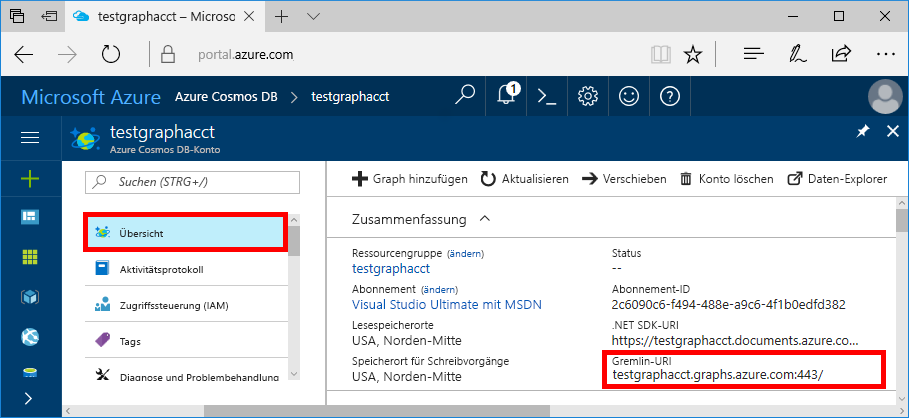
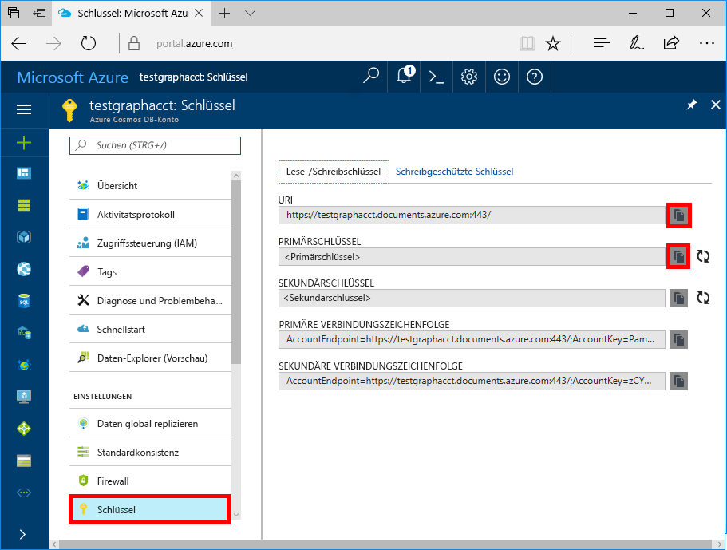

# <a name="azure-cosmos-db-create-query-and-traverse-a-graph-in-the-gremlin-console"></a>Azure Cosmos DB: Erstellen, Abfragen und Traversieren in der Gremlin-Konsole

Azure Cosmos DB ist der global verteilte Microsoft-Datenbankdienst mit mehreren Modellen. Sie können schnell Dokument-, Schlüssel/Wert- und Graph-Datenbanken erstellen und abfragen und dabei stets die Vorteile der globalen Verteilung und der horizontalen Skalierung nutzen, die Azure Cosmos DB zugrunde liegen. 

In dieser Schnellstartanleitung erfahren Sie, wie Sie mithilfe des Azure-Portals ein Konto, eine Datenbank und einen Graph (Container) in Azure Cosmos DB erstellen und anschließend über die [Gremlin-Konsole](https://tinkerpop.apache.org/docs/current/reference/#gremlin-console) von [Apache TinkerPop](http://tinkerpop.apache.org) mit Daten der Graph-API arbeiten. In diesem Tutorial erstellen Sie Scheitelpunkte und Kanten und fragen diese ab. Außerdem führen Sie eine Aktualisierung einer Scheitelpunkteigenschaft durch sowie eine Abfrage von Scheitelpunkten, eine Übertragung eines Graphen und das Löschen eines Scheitelpunkts.


Die Gremlin-Konsole basiert auf Groovy bzw. Java und kann unter Linux, Mac und Windows ausgeführt werden. Sie können die Konsole von der [Seite „Apache TinkerPop“](http://tinkerpop.apache.org/downloads.html) herunterladen.

## <a name="prerequisites"></a>Voraussetzungen

Zum Erstellen eines Azure Cosmos DB-Kontos für diesen Schnellstart benötigen Sie ein Azure-Abonnement.

[!INCLUDE [quickstarts-free-trial-note](../../includes/quickstarts-free-trial-note.md)]

Außerdem müssen Sie die [Gremlin-Konsole](http://tinkerpop.apache.org/) installieren. Verwenden Sie Version 3.2.5 oder höher.

## <a name="create-a-database-account"></a>Erstellen eines Datenbankkontos

[!INCLUDE [cosmos-db-create-dbaccount-graph](../../includes/cosmos-db-create-dbaccount-graph.md)]

## <a name="add-a-graph"></a>Hinzufügen eines Graphs

[!INCLUDE [cosmos-db-create-graph](../../includes/cosmos-db-create-graph.md)]

## <a id="ConnectAppService"></a>Verbindung mit App Service herstellen
1. Erstellen bzw. ändern Sie die Konfigurationsdatei „remote-secure.yaml“ im Verzeichnis `apache-tinkerpop-gremlin-console-3.2.5/conf`, bevor Sie die Gremlin-Konsole starten.
2. Füllen Sie die Konfigurationen *Host*, *Port*, *Benutzername*, *Kennwort*, *connectionPool* und *Serialisierungsprogramm* aus:

    Einstellung|Empfohlener Wert|BESCHREIBUNG
    ---|---|---
    hosts|[***.graphs.azure.com]|Siehe Screenshot unten. Dies ist der Wert für den Gremlin-URI auf der Seite „Übersicht“ des Azure-Portals (in Winkelklammern mit entferntem Zusatz „:443/“).<br><br>Sie können diesen Wert auch über die Registerkarte „Schlüssel“ abrufen, indem Sie den URI-Wert verwenden und „https://“ entfernen, „documents“ in „graphs“ ändern und den Zusatz „:443/“ entfernen.
    port|443|Legen Sie den Wert 443 fest.
    username|*Ihr Benutzername*|Die Ressource im Format `/dbs/<db>/colls/<coll>`, wobei `<db>` der Datenbankname und `<coll>` der Sammlungsname ist.
    password|*Ihr Primärschlüssel*| Siehe zweiten Screenshot unten. Dies ist Ihr Primärschlüssel, den Sie von der Seite „Schlüssel“ des Azure-Portals im Feld „Primärschlüssel“ abrufen können. Verwenden Sie die Schaltfläche „Kopieren“ links vom Feld, um den Wert zu kopieren.
    connectionPool|{enableSsl: true}|Ihre Verbindungspooleinstellung für SSL.
    serializer|{ className: org.apache.tinkerpop.gremlin.<br>driver.ser.GraphSONMessageSerializerV1d0,<br> config: { serializeResultToString: true }}|Legen Sie diesen Wert fest, und löschen Sie alle `\n`-Zeilenumbrüche, wenn Sie den Wert einfügen.

    Kopieren Sie für den hosts-Wert den **Gremlin-URI**-Wert von der Seite **Übersicht**: 

    Kopieren Sie für den password-Wert den **Primärschlüssel** von der Seite **Schlüssel**: 

Die Datei „remote-secure.yaml“ sollte wie folgt aussehen:

```
hosts: [your_database_server.graphs.azure.com]
port: 443
username: /dbs/your_database_account/colls/your_collection
password: your_primary_key
connectionPool: {
  enableSsl: true
}
serializer: { className: org.apache.tinkerpop.gremlin.driver.ser.GraphSONMessageSerializerV1d0, config: { serializeResultToString: true }}
```

3. Führen Sie in Ihrem Terminal `bin/gremlin.bat` oder `bin/gremlin.sh` aus, um die [Gremlin-Konsole](http://tinkerpop.apache.org/docs/3.2.5/tutorials/getting-started/) zu starten.
4. Führen Sie in Ihrem Terminal `:remote connect tinkerpop.server conf/remote-secure.yaml` aus, um eine Verbindung mit Ihrer App Service-Instanz herzustellen.

    > [!TIP]
    > Sollte die Fehlermeldung `No appenders could be found for logger` angezeigt werden, vergewissern Sie sich, dass der Serialisierungsmodulwert in der Datei „remote-secure.yaml“ wie in Schritt 2 beschrieben aktualisiert wurde. 

Prima. Damit ist die Einrichtung abgeschlossen. Jetzt können Sie mit dem Ausführen von Konsolenbefehlen beginnen.

Probieren Sie einen einfachen count()-Befehl aus. Geben Sie an der Eingabeaufforderung in der Konsole Folgendes ein:
```
:> g.V().count()
```

> [!TIP]
> Fallen Ihnen die Zeichen `:>` vor dem Text `g.V().count()` auf? 
>
> Dies ist Teil des Befehls, den Sie eingeben müssen. Dies ist wichtig bei der Verwendung der Gremlin-Konsole mit Azure Cosmos DB.  
>
> Wenn Sie das Präfix `:>` weglassen, wird die Konsole angewiesen, den Befehl lokal auszuführen. Dies wird häufig für einen In-Memory-Graphen durchgeführt.
> Mit `:>` weisen Sie die Konsole an, einen Remotebefehl auszuführen – in diesem Fall für Cosmos DB (entweder der localhost-Emulator oder eine Azure-Instanz).


## <a name="create-vertices-and-edges"></a>Erstellen von Scheitelpunkten und Kanten

Fügen Sie zunächst fünf Scheitelpunkte für Personen hinzu: *Thomas*, *Mary Kay*, *Robin*, *Ben* und *Jack*.

Eingabe (Thomas):

```
:> g.addV('person').property('firstName', 'Thomas').property('lastName', 'Andersen').property('age', 44).property('userid', 1)
```

Ausgabe:

```
==>[id:796cdccc-2acd-4e58-a324-91d6f6f5ed6d,label:person,type:vertex,properties:[firstName:[[id:f02a749f-b67c-4016-850e-910242d68953,value:Thomas]],lastName:[[id:f5fa3126-8818-4fda-88b0-9bb55145ce5c,value:Andersen]],age:[[id:f6390f9c-e563-433e-acbf-25627628016e,value:44]],userid:[[id:796cdccc-2acd-4e58-a324-91d6f6f5ed6d|userid,value:1]]]]
```
Eingabe (Mary Kay):

```
:> g.addV('person').property('firstName', 'Mary Kay').property('lastName', 'Andersen').property('age', 39).property('userid', 2)

```

Ausgabe:

```
==>[id:0ac9be25-a476-4a30-8da8-e79f0119ea5e,label:person,type:vertex,properties:[firstName:[[id:ea0604f8-14ee-4513-a48a-1734a1f28dc0,value:Mary Kay]],lastName:[[id:86d3bba5-fd60-4856-9396-c195ef7d7f4b,value:Andersen]],age:[[id:bc81b78d-30c4-4e03-8f40-50f72eb5f6da,value:39]],userid:[[id:0ac9be25-a476-4a30-8da8-e79f0119ea5e|userid,value:2]]]]

```

Eingabe (Robin):

```
:> g.addV('person').property('firstName', 'Robin').property('lastName', 'Wakefield').property('userid', 3)
```

Ausgabe:

```
==>[id:8dc14d6a-8683-4a54-8d74-7eef1fb43a3e,label:person,type:vertex,properties:[firstName:[[id:ec65f078-7a43-4cbe-bc06-e50f2640dc4e,value:Robin]],lastName:[[id:a3937d07-0e88-45d3-a442-26fcdfb042ce,value:Wakefield]],userid:[[id:8dc14d6a-8683-4a54-8d74-7eef1fb43a3e|userid,value:3]]]]
```

Eingabe (Ben):

```
:> g.addV('person').property('firstName', 'Ben').property('lastName', 'Miller').property('userid', 4)

```

Ausgabe:

```
==>[id:ee86b670-4d24-4966-9a39-30529284b66f,label:person,type:vertex,properties:[firstName:[[id:a632469b-30fc-4157-840c-b80260871e9a,value:Ben]],lastName:[[id:4a08d307-0719-47c6-84ae-1b0b06630928,value:Miller]],userid:[[id:ee86b670-4d24-4966-9a39-30529284b66f|userid,value:4]]]]
```

Eingabe (Jack):

```
:> g.addV('person').property('firstName', 'Jack').property('lastName', 'Connor').property('userid', 5)
```

Ausgabe:

```
==>[id:4c835f2a-ea5b-43bb-9b6b-215488ad8469,label:person,type:vertex,properties:[firstName:[[id:4250824e-4b72-417f-af98-8034aa15559f,value:Jack]],lastName:[[id:44c1d5e1-a831-480a-bf94-5167d133549e,value:Connor]],userid:[[id:4c835f2a-ea5b-43bb-9b6b-215488ad8469|userid,value:5]]]]
```


Fügen Sie als Nächstes Kanten für die Personenbeziehungen hinzu.

Eingabe (Thomas -> Mary Kay):

```
:> g.V().hasLabel('person').has('firstName', 'Thomas').addE('knows').to(g.V().hasLabel('person').has('firstName', 'Mary Kay'))
```

Ausgabe:

```
==>[id:c12bf9fb-96a1-4cb7-a3f8-431e196e702f,label:knows,type:edge,inVLabel:person,outVLabel:person,inV:0d1fa428-780c-49a5-bd3a-a68d96391d5c,outV:1ce821c6-aa3d-4170-a0b7-d14d2a4d18c3]
```

Eingabe (Thomas -> Robin):

```
:> g.V().hasLabel('person').has('firstName', 'Thomas').addE('knows').to(g.V().hasLabel('person').has('firstName', 'Robin'))
```

Ausgabe:

```
==>[id:58319bdd-1d3e-4f17-a106-0ddf18719d15,label:knows,type:edge,inVLabel:person,outVLabel:person,inV:3e324073-ccfc-4ae1-8675-d450858ca116,outV:1ce821c6-aa3d-4170-a0b7-d14d2a4d18c3]
```

Eingabe (Robin -> Ben):

```
:> g.V().hasLabel('person').has('firstName', 'Robin').addE('knows').to(g.V().hasLabel('person').has('firstName', 'Ben'))
```

Ausgabe:

```
==>[id:889c4d3c-549e-4d35-bc21-a3d1bfa11e00,label:knows,type:edge,inVLabel:person,outVLabel:person,inV:40fd641d-546e-412a-abcc-58fe53891aab,outV:3e324073-ccfc-4ae1-8675-d450858ca116]
```

## <a name="update-a-vertex"></a>Aktualisieren eines Scheitelpunkts

Aktualisieren Sie den Scheitelpunkt *Thomas* mit dem neuen Alter *45*.

Eingabe:
```
:> g.V().hasLabel('person').has('firstName', 'Thomas').property('age', 45)
```
Ausgabe:

```
==>[id:ae36f938-210e-445a-92df-519f2b64c8ec,label:person,type:vertex,properties:[firstName:[[id:872090b6-6a77-456a-9a55-a59141d4ebc2,value:Thomas]],lastName:[[id:7ee7a39a-a414-4127-89b4-870bc4ef99f3,value:Andersen]],age:[[id:a2a75d5a-ae70-4095-806d-a35abcbfe71d,value:45]]]]
```

## <a name="query-your-graph"></a>Abfragen des Graphs

Jetzt können Sie einige Abfragen mit dem Graph durchführen.

Führen Sie zunächst eine Abfrage mit einem Filter durch, um nur Personen zurückzugeben, die älter als 40 sind.

Eingabe (Filterabfrage):

```
:> g.V().hasLabel('person').has('age', gt(40))
```

Ausgabe:

```
==>[id:ae36f938-210e-445a-92df-519f2b64c8ec,label:person,type:vertex,properties:[firstName:[[id:872090b6-6a77-456a-9a55-a59141d4ebc2,value:Thomas]],lastName:[[id:7ee7a39a-a414-4127-89b4-870bc4ef99f3,value:Andersen]],age:[[id:a2a75d5a-ae70-4095-806d-a35abcbfe71d,value:45]]]]
```

Projizieren Sie als Nächstes die Vornamen aller Personen, die älter als 40 sind.

Eingabe (Filter + Abfrage zur Projektion):

```
:> g.V().hasLabel('person').has('age', gt(40)).values('firstName')
```

Ausgabe:

```
==>Thomas
```

## <a name="traverse-your-graph"></a>Traversieren des Graphs

Traversieren Sie den Graph, um alle Freunde von Thomas zurückzugeben.

Eingabe (Freunde von Thomas):

```
:> g.V().hasLabel('person').has('firstName', 'Thomas').outE('knows').inV().hasLabel('person')
```

Ausgabe: 

```
==>[id:f04bc00b-cb56-46c4-a3bb-a5870c42f7ff,label:person,type:vertex,properties:[firstName:[[id:14feedec-b070-444e-b544-62be15c7167c,value:Mary Kay]],lastName:[[id:107ab421-7208-45d4-b969-bbc54481992a,value:Andersen]],age:[[id:4b08d6e4-58f5-45df-8e69-6b790b692e0a,value:39]]]]
==>[id:91605c63-4988-4b60-9a30-5144719ae326,label:person,type:vertex,properties:[firstName:[[id:f760e0e6-652a-481a-92b0-1767d9bf372e,value:Robin]],lastName:[[id:352a4caa-bad6-47e3-a7dc-90ff342cf870,value:Wakefield]]]]
```

Gehen Sie dann zur nächsten Scheitelpunktebene über. Traversieren Sie den Graph, um alle Freunde von Freunden von Thomas zurückzugeben.

Eingabe (Freunde von Freunden von Thomas):

```
:> g.V().hasLabel('person').has('firstName', 'Thomas').outE('knows').inV().hasLabel('person').outE('knows').inV().hasLabel('person')
```
Ausgabe:

```
==>[id:a801a0cb-ee85-44ee-a502-271685ef212e,label:person,type:vertex,properties:[firstName:[[id:b9489902-d29a-4673-8c09-c2b3fe7f8b94,value:Ben]],lastName:[[id:e084f933-9a4b-4dbc-8273-f0171265cf1d,value:Miller]]]]
```

## <a name="drop-a-vertex"></a>Löschen eines Scheitelpunkts

Löschen Sie jetzt einen Scheitelpunkt aus der Graphdatenbank.

Eingabe (Löschen des Scheitelpunkts „Jack“):

```
:> g.V().hasLabel('person').has('firstName', 'Jack').drop()
```

## <a name="clear-your-graph"></a>Bereinigen des Graphs

Löschen Sie zum Schluss alle Scheitelpunkte und Kanten aus der Datenbank.

Eingabe:

```
:> g.E().drop()
:> g.V().drop()
```

Glückwunsch! Sie haben das Tutorial zu Azure Cosmos DB: Graph-API erfolgreich abgeschlossen.

## <a name="review-slas-in-the-azure-portal"></a>Überprüfen von SLAs im Azure-Portal

[!INCLUDE [cosmosdb-tutorial-review-slas](../../includes/cosmos-db-tutorial-review-slas.md)]

## <a name="clean-up-resources"></a>Bereinigen von Ressourcen

Wenn Sie diese App nicht weiter verwenden möchten, löschen Sie alle von diesem Schnellstart erstellten Ressourcen im Azure-Portal. Führen Sie dazu folgende Schritte durch:  

1. Klicken Sie im Azure-Portal im Menü auf der linken Seite auf **Ressourcengruppen**, und klicken Sie auf den Namen der erstellten Ressource. 
2. Klicken Sie auf der Seite mit Ihrer Ressourcengruppe auf **Löschen**, geben Sie im Textfeld den Namen der zu löschenden Ressource ein, und klicken Sie dann auf **Löschen**.

## <a name="next-steps"></a>Nächste Schritte

In diesem Schnellstart haben Sie erfahren, wie Sie ein Konto für Azure Cosmos DB und einen Graph mit dem Daten-Explorer erstellen können. Außerdem wissen Sie nun, wie Sie Scheitelpunkte und Kanten erstellen können, und wie Sie den Graph mit der Gremlin-Konsole traversieren können. Nun können Sie komplexere Abfragen erstellen und leistungsfähige Logik zum Traversieren von Graphen mit Gremlin implementieren. 

> [!div class="nextstepaction"]
> [Query using Gremlin (Abfragen mithilfe von Gremlin)](tutorial-query-graph.md)
