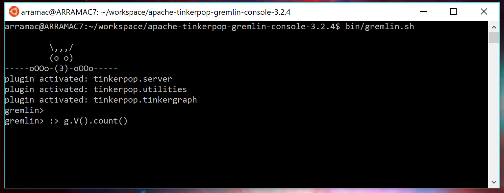

# <a name="azure-cosmos-db-create-query-and-traverse-a-graph-in-the-gremlin-console"></a>Azure Cosmos DB: Erstellen, Abfragen und Traversieren in der Gremlin-Konsole

Azure Cosmos DB ist der global verteilte Datenbankdienst von Microsoft mit mehreren Modellen. Sie können schnell Dokument-, Schlüssel/Wert- und Graph-Datenbanken erstellen und abfragen und dabei stets von den Vorteilen der globalen Verteilung und der horizontalen Skalierung profitieren, die Azure Cosmos DB zugrunde liegen. 

In diesem Schnellstart wird veranschaulicht, wie Sie ein Konto, eine Datenbank und einen Graph (Container) in Azure Cosmos DB mithilfe des Azure-Portals erstellen und anschließend mit Daten der Graph-API (Vorschau) in der [Gremlin-Konsole](https://tinkerpop.apache.org/docs/current/reference/#gremlin-console) arbeiten können. In diesem Tutorial erstellen Sie Scheitelpunkte und Kanten und fragen diese ab. Außerdem führen Sie eine Aktualisierung einer Scheitelpunkteigenschaft durch sowie eine Abfrage von Scheitelpunkten, eine Übertragung eines Graphs und das Löschen eines Scheitelpunkts.



Die Gremlin-Konsole basiert auf Groovy bzw. Java und kann unter Linux, Mac und Windows ausgeführt werden. Sie können die Konsole von der [Seite „Apache TinkerPop“](https://www.apache.org/dyn/closer.lua/tinkerpop/3.2.4/apache-tinkerpop-gremlin-console-3.2.4-bin.zip) herunterladen.

## <a name="prerequisites"></a>Voraussetzungen

Zum Erstellen eines Azure Cosmos DB-Kontos für diesen Schnellstart benötigen Sie ein Azure-Abonnement.

[!INCLUDE [quickstarts-free-trial-note](../../includes/quickstarts-free-trial-note.md)]

Außerdem müssen Sie die [Gremlin-Konsole](http://tinkerpop.apache.org/) installieren. Verwenden Sie Version 3.2.4 oder höher.

## <a name="create-a-database-account"></a>Erstellen eines Datenbankkontos

[!INCLUDE [cosmosdb-create-dbaccount-graph](../../includes/cosmosdb-create-dbaccount-graph.md)]

## <a name="add-a-graph"></a>Hinzufügen eines Graphs

[!INCLUDE [cosmosdb-create-graph](../../includes/cosmosdb-create-graph.md)]

## <a id="ConnectAppService"></a>Verbindung mit App Service herstellen
1. Erstellen Sie die Konfigurationsdatei *remote-secure.yaml* im Verzeichnis *apache-tinkerpop-gremlin-console-3.2.4/conf*, bevor Sie die Gremlin-Konsole starten.
2. Füllen Sie die Konfigurationen *Host*, *Port*, *Benutzername*, *Kennwort*, *connectionPool* und *Serialisierungsprogramm* aus:

    Einstellung|Empfohlener Wert|Beschreibung
    ---|---|---
    Host|***.graphs.azure.com|Ihr URI des Graph-Dienst, den Sie aus dem Azure-Portal abrufen können
    Port|443|Auf 443 festlegen
    Benutzername|*Ihr Benutzername*|Die Ressource in der Form `/dbs/<db>/colls/<coll>`
    Kennwort|*Ihr primärer Hauptschlüssel*|Ihr primärer Hauptschlüssel für Azure Cosmos DB
    ConnectionPool|{enableSsl: true}|Die Verbindungspooleinstellung für SSL
    serializer|{ className:org.apache.tinkerpop.gremlin.<br>driver.ser.GraphSONMessageSerializerV1d0,<br> config: { serializeResultToString: true }}|Auf diesen Wert festlegen

3. Führen Sie *bin/gremlin.bat* oder *bin/gremlin.sh* im Terminal aus, um die [Gremlin-Konsole](http://tinkerpop.apache.org/docs/3.2.4/tutorials/getting-started/) zu starten.
4. Führen Sie *:remote connect tinkerpop.server conf/remote-secure.yaml* im Terminal aus, um eine Verbindung mit App Service herzustellen.

Prima. Damit ist die Einrichtung abgeschlossen. Jetzt können Sie mit dem Ausführen von Konsolenbefehlen beginnen.

## <a name="create-vertices-and-edges"></a>Erstellen von Scheitelpunkten und Kanten

Fügen Sie zunächst vier Scheitelpunkte für Personen hinzu: *Thomas*, *Mary Kay*, *Robin* und *Ben*.

Eingabe (Thomas):

```
:> g.addV('person').property('firstName', 'Thomas').property('lastName', 'Andersen').property('age', 44)
```

Ausgabe:

```
==>[id:1eb91f79-94d7-4fd4-b026-18f707952f21,label:person,type:vertex,properties:[firstName:[[id:ec5fcfbe-040e-48c3-b961-31233c8b1801,value:Thomas]],lastName:[[id:86e5b580-0bca-4bc2-bc53-a46f92c1a182,value:Andersen]],age:[[id:2caeab3c-c66d-4098-b673-40a8101bb72a,value:44]]]]
```
Eingabe (Mary Kay):

```
:> g.addV('person').property('firstName', 'Mary Kay').property('lastName', 'Andersen').property('age', 39)
```

Ausgabe:

```
==>[id:899a9d37-6701-48fc-b0a1-90950be7e0f4,label:person,type:vertex,properties:[firstName:[[id:c79c5599-8646-47d1-9a49-3456200518ce,value:Mary Kay]],lastName:[[id:c1362095-9dcc-479d-ab21-86c1b6d4ffc1,value:Andersen]],age:[[id:0b530408-bfae-4e8f-98ad-c160cd6e6a8f,value:39]]]]
```

Eingabe (Robin):

```
:> g.addV('person').property('firstName', 'Robin').property('lastName', 'Wakefield')
```

Ausgabe:

```
==>[id:953aefd9-5a54-4033-9b3a-d4dc3049f720,label:person,type:vertex,properties:[firstName:[[id:bbda02e0-8a96-4ca1-943e-621acbb26824,value:Robin]],lastName:[[id:f0291ad3-05a3-40ec-aabb-6538a7c331e3,value:Wakefield]]]]
```

Eingabe (Ben):

```
:> g.addV('person').property('firstName', 'Ben').property('lastName', 'Miller')
```

Ausgabe:

```
==>[id:81c891d9-beca-4c87-9009-13a826c9ed9a,label:person,type:vertex,properties:[firstName:[[id:3a3b53d3-888c-46da-bb54-1c42194b1e18,value:Ben]],lastName:[[id:48c6dd50-79c4-4585-ab71-3bf998061958,value:Miller]]]]
```

Fügen Sie als Nächstes Kanten für die Personenbeziehungen hinzu.

Eingabe (Thomas -> Mary Kay):

```
:> g.V().hasLabel('person').has('firstName', 'Thomas').addE('knows').to(g.V().hasLabel('person').has('firstName', 'Mary Kay'))
```

Ausgabe:

```
==>[id:c12bf9fb-96a1-4cb7-a3f8-431e196e702f,label:knows,type:edge,inVLabel:person,outVLabel:person,inV:0d1fa428-780c-49a5-bd3a-a68d96391d5c,outV:1ce821c6-aa3d-4170-a0b7-d14d2a4d18c3]
```

Eingabe (Thomas -> Robin):

```
:> g.V().hasLabel('person').has('firstName', 'Thomas').addE('knows').to(g.V().hasLabel('person').has('firstName', 'Robin'))
```

Ausgabe:

```
==>[id:58319bdd-1d3e-4f17-a106-0ddf18719d15,label:knows,type:edge,inVLabel:person,outVLabel:person,inV:3e324073-ccfc-4ae1-8675-d450858ca116,outV:1ce821c6-aa3d-4170-a0b7-d14d2a4d18c3]
```

Eingabe (Robin -> Ben):

```
:> g.V().hasLabel('person').has('firstName', 'Robin').addE('knows').to(g.V().hasLabel('person').has('firstName', 'Ben'))
```

Ausgabe:

```
==>[id:889c4d3c-549e-4d35-bc21-a3d1bfa11e00,label:knows,type:edge,inVLabel:person,outVLabel:person,inV:40fd641d-546e-412a-abcc-58fe53891aab,outV:3e324073-ccfc-4ae1-8675-d450858ca116]
```

## <a name="update-a-vertex"></a>Aktualisieren eines Scheitelpunkts

Aktualisieren Sie den Scheitelpunkt *Thomas* mit dem neuen Alter *45*.

Eingabe:
```
:> g.V().hasLabel('person').has('firstName', 'Thomas').property('age', 45)
```
Ausgabe:

```
==>[id:ae36f938-210e-445a-92df-519f2b64c8ec,label:person,type:vertex,properties:[firstName:[[id:872090b6-6a77-456a-9a55-a59141d4ebc2,value:Thomas]],lastName:[[id:7ee7a39a-a414-4127-89b4-870bc4ef99f3,value:Andersen]],age:[[id:a2a75d5a-ae70-4095-806d-a35abcbfe71d,value:45]]]]
```

## <a name="query-your-graph"></a>Abfragen des Graphs

Jetzt können Sie einige Abfragen mit dem Graph durchführen.

Führen Sie zunächst eine Abfrage mit einem Filter durch, um nur Personen zurückzugeben, die älter als 40 sind.

Eingabe (Filterabfrage):

```
:> g.V().hasLabel('person').has('age', gt(40))
```

Ausgabe:

```
==>[id:ae36f938-210e-445a-92df-519f2b64c8ec,label:person,type:vertex,properties:[firstName:[[id:872090b6-6a77-456a-9a55-a59141d4ebc2,value:Thomas]],lastName:[[id:7ee7a39a-a414-4127-89b4-870bc4ef99f3,value:Andersen]],age:[[id:a2a75d5a-ae70-4095-806d-a35abcbfe71d,value:45]]]]
```

Projizieren Sie als Nächstes die Vornamen aller Personen, die älter als 40 sind.

Eingabe (Filter + Abfrage zur Projektion):

```
:> g.V().hasLabel('person').has('age', gt(40)).values('firstName')
```

Ausgabe:

```
==>Thomas
```

## <a name="traverse-your-graph"></a>Traversieren des Graphs

Traversieren Sie den Graph, um alle Freunde von Thomas zurückzugeben.

Eingabe (Freunde von Thomas):

```
:> g.V().hasLabel('person').has('firstName', 'Thomas').outE('knows').inV().hasLabel('person')
```

Ausgabe: 

```
==>[id:f04bc00b-cb56-46c4-a3bb-a5870c42f7ff,label:person,type:vertex,properties:[firstName:[[id:14feedec-b070-444e-b544-62be15c7167c,value:Mary Kay]],lastName:[[id:107ab421-7208-45d4-b969-bbc54481992a,value:Andersen]],age:[[id:4b08d6e4-58f5-45df-8e69-6b790b692e0a,value:39]]]]
==>[id:91605c63-4988-4b60-9a30-5144719ae326,label:person,type:vertex,properties:[firstName:[[id:f760e0e6-652a-481a-92b0-1767d9bf372e,value:Robin]],lastName:[[id:352a4caa-bad6-47e3-a7dc-90ff342cf870,value:Wakefield]]]]
```

Gehen Sie dann zur nächsten Scheitelpunktebene über. Traversieren Sie den Graph, um alle Freunde von Freunden von Thomas zurückzugeben.

Eingabe (Freunde von Freunden von Thomas):

```
:> g.V().hasLabel('person').has('firstName', 'Thomas').outE('knows').inV().hasLabel('person').outE('knows').inV().hasLabel('person')
```
Ausgabe:

```
==>[id:a801a0cb-ee85-44ee-a502-271685ef212e,label:person,type:vertex,properties:[firstName:[[id:b9489902-d29a-4673-8c09-c2b3fe7f8b94,value:Ben]],lastName:[[id:e084f933-9a4b-4dbc-8273-f0171265cf1d,value:Miller]]]]
```

## <a name="drop-a-vertex"></a>Löschen eines Scheitelpunkts

Löschen Sie jetzt einen Scheitelpunkt aus der Graphdatenbank.

Eingabe (Scheitelpunkt „Robin“ löschen):

```
:> g.V().hasLabel('person').has('firstName', 'Robin').drop()
```

## <a name="clear-your-graph"></a>Bereinigen des Graphs

Löschen Sie zum Schluss alle Scheitelpunkte und Kanten aus der Datenbank.

Eingabe:

```
:> g.V().drop()
```

Glückwunsch! Sie haben das Tutorial zu Azure Cosmos DB: Graph-API erfolgreich abgeschlossen.

## <a name="review-slas-in-the-azure-portal"></a>Überprüfen von SLAs im Azure-Portal

[!INCLUDE [cosmosdb-tutorial-review-slas](../../includes/cosmosdb-tutorial-review-slas.md)]

## <a name="clean-up-resources"></a>Bereinigen von Ressourcen

Wenn Sie diese App nicht weiter verwenden möchten, löschen Sie alle von diesem Schnellstart erstellten Ressourcen im Azure-Portal. Führen Sie dazu folgende Schritte durch:  

1. Klicken Sie im Azure-Portal im Menü auf der linken Seite auf **Ressourcengruppen**, und klicken Sie auf den Namen der erstellten Ressource. 
2. Klicken Sie auf der Seite mit Ihrer Ressourcengruppe auf **Löschen**, geben Sie im Textfeld den Namen der zu löschenden Ressource ein, und klicken Sie dann auf **Löschen**.

## <a name="next-steps"></a>Nächste Schritte

In diesem Schnellstart haben Sie erfahren, wie Sie ein Konto für Azure Cosmos DB und einen Graph mit dem Daten-Explorer erstellen können. Außerdem wissen Sie nun, wie Sie Scheitelpunkte und Kanten erstellen können, und wie Sie den Graph mit der Gremlin-Konsole traversieren können. Nun können Sie komplexere Abfragen erstellen und leistungsfähige Logik zum Traversieren von Graphen mit Gremlin implementieren. 

> [!div class="nextstepaction"]
> [Abfragen mithilfe von Gremlin](tutorial-query-graph.md)

