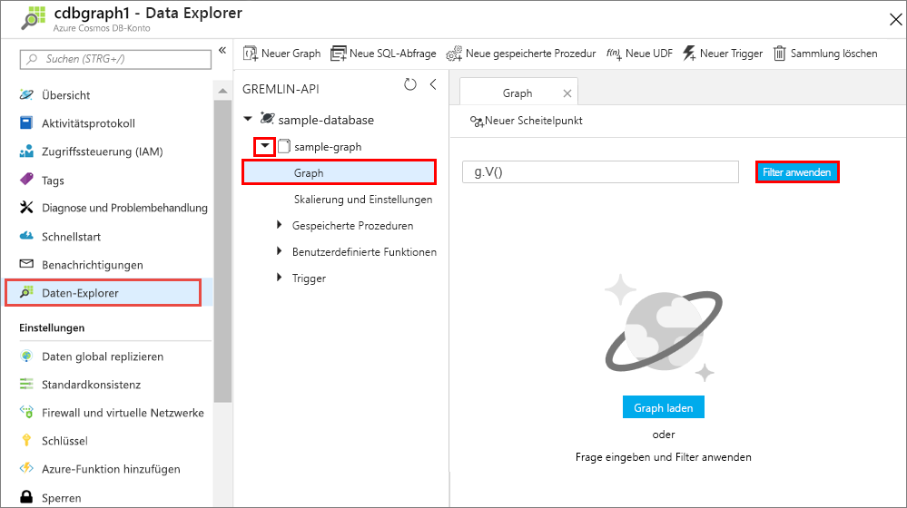
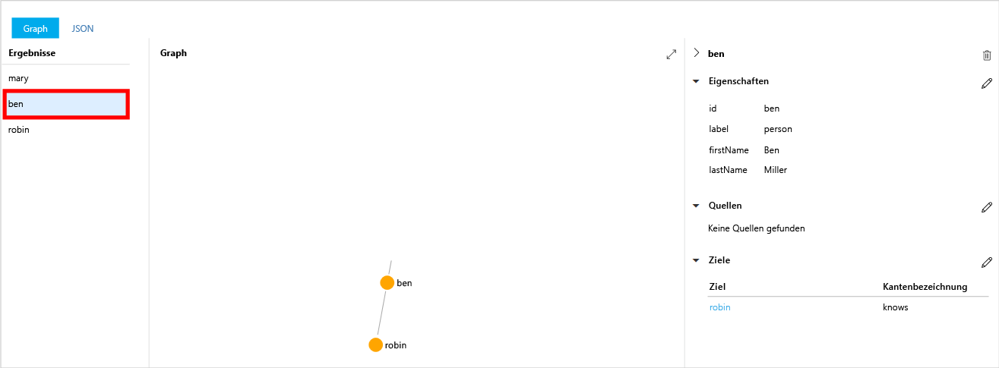
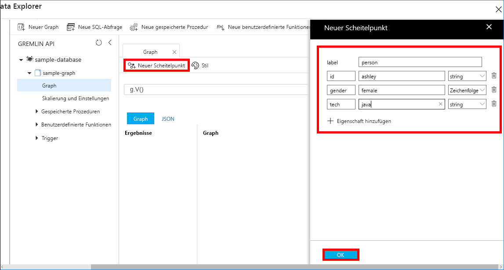
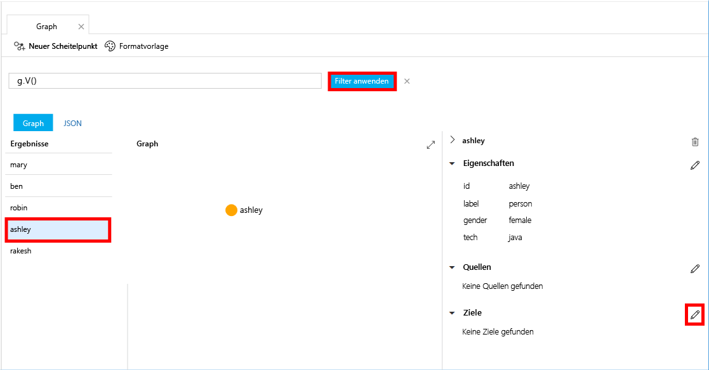

# <a name="azure-cosmos-db-create-a-graph-database-using-java-and-the-azure-portal"></a>Azure Cosmos DB: Erstellen einer Graphdatenbank mit Java und dem Azure-Portal

Azure Cosmos DB ist der global verteilte Microsoft-Datenbankdienst mit mehreren Modellen. Sie können schnell Dokument-, Schlüssel/Wert- und Graph-Datenbanken erstellen und abfragen und dabei stets die Vorteile der globalen Verteilung und der horizontalen Skalierung nutzen, die Azure Cosmos DB zugrunde liegen. 

In dieser Schnellstartanleitung wird mithilfe der Tools des Azure-Portals für Azure Cosmos DB eine Graphdatenbank erstellt. Darüber hinaus erfahren Sie hier, wie Sie unter Verwendung des OSS-Treibers [Gremlin Java](https://mvnrepository.com/artifact/org.apache.tinkerpop/gremlin-driver) schnell eine Java-Konsolen-App erstellen, die eine Graphdatenbank verwendet. Die Anweisungen in dieser Schnellstartanleitung gelten für alle Betriebssysteme, unter denen Java ausgeführt werden kann. In dieser Schnellstartanleitung erfahren Sie, wie Sie Graphressourcen über die Benutzeroberfläche oder programmgesteuert erstellen und ändern. 

## <a name="prerequisites"></a>Voraussetzungen

* [Java Development Kit (JDK) 1.7+](http://www.oracle.com/technetwork/java/javase/downloads/jdk8-downloads-2133151.html)
    * Führen Sie unter Ubuntu `apt-get install default-jdk` aus, um das JDK zu installieren.
    * Achten Sie darauf, dass die Umgebungsvariable „JAVA_HOME“ auf den Ordner verweist, in dem das JDK installiert ist.
* Ein binäres [Maven](http://maven.apache.org/)-Archiv ([Download](http://maven.apache.org/download.cgi)/[Installationsanleitung](http://maven.apache.org/install.html))
    * Unter Ubuntu können Sie `apt-get install maven` ausführen, um Maven zu installieren.
* [Git](https://www.git-scm.com/)
    * Unter Ubuntu können Sie `sudo apt-get install git` ausführen, um Git zu installieren.

[!INCLUDE [quickstarts-free-trial-note](../../includes/quickstarts-free-trial-note.md)]

## <a name="create-a-database-account"></a>Erstellen eines Datenbankkontos

Vor dem Erstellen einer Graphdatenbank müssen Sie ein Gremlin (Graph)-Datenbankkonto mit Azure Cosmos DB erstellen.

[!INCLUDE [cosmos-db-create-dbaccount-graph](../../includes/cosmos-db-create-dbaccount-graph.md)]

## <a name="add-a-graph"></a>Hinzufügen eines Graphs

Sie können nun das Daten-Explorer-Tool im Azure-Portal verwenden, um eine Graphdatenbank zu erstellen. 

1. Klicken Sie im Azure-Portal im linken Navigationsmenü auf **Daten-Explorer (Vorschau)**. 
2. Klicken Sie auf dem Blatt **Daten-Explorer (Vorschau)** auf **Neues Diagramm**, und füllen Sie dann die Seite mit den folgenden Informationen aus:

    

    Einstellung|Empfohlener Wert|Beschreibung
    ---|---|---
    Datenbank-ID|sample-database|Die ID Ihrer neuen Datenbank. Datenbanknamen müssen zwischen 1 und 255 Zeichen lang sein und dürfen weder `/ \ # ?` noch nachgestellte Leerzeichen enthalten.
    Graph-ID|sample-graph|Die ID Ihres neuen Diagramms. Für Diagrammnamen gelten dieselben Zeichenanforderungen wie für Datenbank-IDs.
    Speicherkapazität| 10 GB|Behalten Sie den Standardwert bei. Dies ist die Speicherkapazität der Datenbank.
    Durchsatz|400 RUs|Behalten Sie den Standardwert bei. Sie können den Durchsatz später zentral hochskalieren, wenn Sie Latenzen reduzieren möchten.
    Partitionsschlüssel|Nicht ausfüllen|Lassen Sie für diese Schnellstartanleitung den Partitionsschlüssel leer.

3. Wenn das Formular ausgefüllt ist, klicken Sie auf **OK**.

## <a name="clone-the-sample-application"></a>Klonen der Beispielanwendung

Klonen Sie nun eine Graph-App aus GitHub, legen Sie die Verbindungszeichenfolge fest, und führen Sie sie aus. Sie werden feststellen, wie einfach Sie programmgesteuert mit Daten arbeiten können. 

1. Öffnen Sie ein Git-Terminalfenster, z.B. ein Git Bash, und `cd` in einem Arbeitsverzeichnis.  

2. Führen Sie den folgenden Befehl aus, um das Beispielrepository zu klonen. 

    ```bash
    git clone https://github.com/Azure-Samples/azure-cosmos-db-graph-java-getting-started.git
    ```

## <a name="review-the-code"></a>Überprüfen des Codes

Es folgt ein kurzer Überblick zu dem, was in der App geschieht. Öffnen Sie die Datei `Program.java` aus dem Ordner „\src\GetStarted“, und suchen Sie nach den folgenden Codezeilen: 

* `Client` von Gremlin wird aus der Konfiguration in `src/remote.yaml` initialisiert.

    ```java
    cluster = Cluster.build(new File("src/remote.yaml")).create();
    ...
    client = cluster.connect();
    ```

* Eine Reihe von Gremlin-Schritten wird mit mithilfe der `client.submit`-Methode ausgeführt.

    ```java
    ResultSet results = client.submit(gremlin);

    CompletableFuture<List<Result>> completableFutureResults = results.all();
    List<Result> resultList = completableFutureResults.get();

    for (Result result : resultList) {
        System.out.println(result.toString());
    }
    ```

## <a name="update-your-connection-string"></a>Aktualisieren der Verbindungszeichenfolge

1. Öffnen Sie die Datei „src/remote.yaml“. 

3. Geben Sie in der Datei „src/remote.yaml“ Ihre Werte für *Hosts*, *Benutzername* und *Kennwort* an. Die übrigen Einstellungen müssen nicht geändert werden.

    Einstellung|Empfohlener Wert|Beschreibung
    ---|---|---
    Hosts|[***.graphs.azure.com]|Sehen Sie sich den Screenshot im Anschluss an diese Tabelle an. Dies ist der Wert für den Gremlin-URI auf der Seite „Übersicht“ des Azure-Portals (in eckigen Klammern ohne den Zusatz „:443/“).<br><br>Sie können diesen Wert auch über die Registerkarte „Schlüssel“ abrufen, indem Sie den URI-Wert verwenden und „https://“ entfernen, „documents“ in „graphs“ ändern und den Zusatz „:443/“ entfernen.
    Benutzername|/dbs/sample-database/colls/sample-graph|Die Ressource im Format `/dbs/<db>/colls/<coll>`, wobei `<db>` der vorhandene Datenbankname und `<coll>` der vorhandene Sammlungsname ist.
    Kennwort|*Ihr primärer Hauptschlüssel*|Sehen Sie sich den zweiten Screenshot im Anschluss an diese Tabelle an. Dieser Wert ist Ihr Primärschlüssel, der im Azure-Portal auf der Seite „Schlüssel“ im Feld „Primärschlüssel“ angegeben ist. Kopieren Sie den Wert mithilfe der Schaltfläche „Kopieren“ (rechts neben dem Feld).

    Kopieren Sie zur Angabe des Werts „Hosts“ den **Gremlin-URI** auf der Seite **Übersicht**. Sollte kein Wert angegeben sein, lesen Sie in der vorherigen Tabelle die Anweisungen in der Zeile „Hosts“, um zu erfahren, wie Sie den Gremlin-URI über das Blatt „Schlüssel“ erstellen.


    Kopieren Sie für den Wert „Password“ den **Primärschlüssel** vom Blatt **Schlüssel**: 

## <a name="run-the-console-app"></a>Ausführen der Konsolenanwendung

1. Wechseln Sie im Terminalfenster von Git mithilfe von `cd` zum Ordner „azure-cosmos-db-graph-java-getting-started“.

2. Geben Sie im Terminalfenster von Git `mvn package` ein, um die erforderlichen Java-Pakete zu installieren.

3. Führen Sie im Terminalfenster von Git `mvn exec:java -D exec.mainClass=GetStarted.Program` aus, um Ihre Java-Anwendung zu starten.

Im Terminalfenster werden die Scheitelpunkte angezeigt, die dem Graph hinzugefügt werden. Wechseln Sie in Ihrem Internetbrowser nach Abschluss des Programms wieder zum Azure-Portal. 

<a id="add-sample-data"></a>
## <a name="review-and-add-sample-data"></a>Überprüfen und Hinzufügen von Beispieldaten

Nun können Sie wieder zum Daten-Explorer zurückkehren, um sich die dem Graph hinzugefügten Scheitelpunkte anzusehen und weitere Datenpunkte hinzuzufügen.

1. Erweitern Sie im Daten-Explorer **sample-database**/**sample-graph**, klicken Sie auf **Graph**, und klicken Sie anschließend auf **Filter anwenden**. 

   

2. Beachten Sie in der Liste **Ergebnisse** die Benutzer, die dem Graph neu hinzugefügt wurden. Wählen Sie **ben** aus, und beachten Sie, dass er mit „robin“ verbunden ist. Sie können die Scheitelpunkte im Graph-Tester verschieben, die Ansicht vergrößern und verkleinern sowie die Größe der Graph-Tester-Oberfläche erweitern. 

   

3. Fügen Sie dem Graph mithilfe des Daten-Explorers einige neue Benutzer hinzu. Klicken Sie auf die Schaltfläche **New Vertex** (Neuer Scheitelpunkt), um dem Graph Daten hinzuzufügen.

   

4. Geben Sie die Bezeichnung *person* und anschließend die folgenden Schlüssel und Werte ein, um den ersten Scheitelpunkt im Graph zu erstellen. Beachten Sie, dass Sie für jede Person in Ihrem Graph eindeutige Eigenschaften erstellen können. Nur der id-Schlüssel ist erforderlich.

    key|value|Hinweise
    ----|----|----
    id|ashley|Der eindeutige Bezeichner für den Scheitelpunkt. Wenn Sie keine ID angeben, wird automatisch eine ID generiert.
    gender|female| 
    tech | java | 

    > [!NOTE]
    > In dieser Schnellstartanleitung wird eine nicht partitionierte Sammlung erstellt. Wenn Sie hingegen eine partitionierte Sammlung erstellen, indem Sie bei der Sammlungserstellung einen Partitionsschlüssel angeben, muss der Partitionsschlüssel jedem neuen Scheitelpunkt als Schlüssel hinzugefügt werden. 

5. Klicken Sie auf **OK**. Der Bildschirm muss möglicherweise erweitert werden, damit **OK** am unteren Bildschirmrand zu sehen ist.

6. Klicken Sie erneut auf **New Vertex** (Neuer Scheitelpunkt), und fügen Sie einen weiteren neuen Benutzer hinzu. Geben Sie den Bezeichner *person* und anschließend die folgenden Schlüssel und Werte ein:

    key|value|Hinweise
    ----|----|----
    id|rakesh|Der eindeutige Bezeichner für den Scheitelpunkt. Wenn Sie keine ID angeben, wird automatisch eine ID generiert.
    gender|male| 
    school|MIT| 

7. Klicken Sie auf **OK**. 

8. Klicken Sie auf **Filter anwenden**, um den Standardfilter `g.V()` anzuwenden. Daraufhin werden alle Benutzer in der Liste **Ergebnisse** angezeigt. Wenn Sie weitere Daten hinzufügen, können Sie Ihre Ergebnisse mithilfe von Filtern eingrenzen. Der Daten-Explorer verwendet standardmäßig `g.V()`, um alle Scheitelpunkte in einem Graph abzurufen. Sie können als Filter jedoch eine andere [Graphabfrage](tutorial-query-graph.md) verwenden (beispielsweise `g.V().count()`, um die Anzahl aller Scheitelpunkte im Graph im JSON-Format zu erhalten).

9. Als Nächstes verbinden wir „rakesh“ und „ashley“. Vergewissern Sie sich, dass **ashley** in der Liste **Ergebnisse** ausgewählt ist, und klicken Sie anschließend rechts unten neben **Ziele** auf die Bearbeitungsschaltfläche. Möglicherweise müssen Sie Ihr Fenster verbreitern, damit der Bereich **Eigenschaften** zu sehen ist.

   

10. Geben Sie im Feld **Ziel** die Zeichenfolge *rakesh* und im Feld **Edge label** (Edgebezeichner) die Zeichenfolge *knows* ein, und klicken Sie anschließend auf das Häkchen.

   

11. Wählen Sie nun in der Ergebnisliste den Eintrag **rakesh** aus. Wie Sie sehen, sind „ashley“ und „rakesh“ miteinander verbunden. 

   

    Der Daten-Explorer kann auch zum Erstellen von gespeicherten Prozeduren, UDFs und Triggern verwendet werden, um sowohl serverseitige Geschäftslogik als auch einen Skalierungsdurchsatz auszuführen. Der Daten-Explorer stellt den gesamten integrierten programmgesteuerten Datenzugriff in den APIs zur Verfügung, bietet jedoch einfachen Zugriff auf Ihre Daten im Azure-Portal.


## <a name="review-slas-in-the-azure-portal"></a>Überprüfen von SLAs im Azure-Portal

[!INCLUDE [cosmosdb-tutorial-review-slas](../../includes/cosmos-db-tutorial-review-slas.md)]

## <a name="clean-up-resources"></a>Bereinigen von Ressourcen

Wenn Sie diese App nicht weiter verwenden möchten, löschen Sie alle von diesem Schnellstart erstellten Ressourcen im Azure-Portal. Führen Sie dazu folgende Schritte durch: 

1. Klicken Sie im Azure-Portal im Menü auf der linken Seite auf **Ressourcengruppen**, und klicken Sie auf den Namen der erstellten Ressource. 
2. Klicken Sie auf der Seite mit Ihrer Ressourcengruppe auf **Löschen**, geben Sie im Textfeld den Namen der zu löschenden Ressource ein, und klicken Sie dann auf **Löschen**.

## <a name="next-steps"></a>Nächste Schritte

In diesem Schnellstart haben Sie gelernt, wie Sie ein Azure Cosmos DB-Konto erstellen, einen Graph mit dem Daten-Explorer erstellen und eine App ausführen. Nun können Sie komplexere Abfragen erstellen und leistungsfähige Logik zum Traversieren von Diagrammen mit Gremlin implementieren. 

> [!div class="nextstepaction"]
> [Query using Gremlin (Abfragen mithilfe von Gremlin)](tutorial-query-graph.md)

