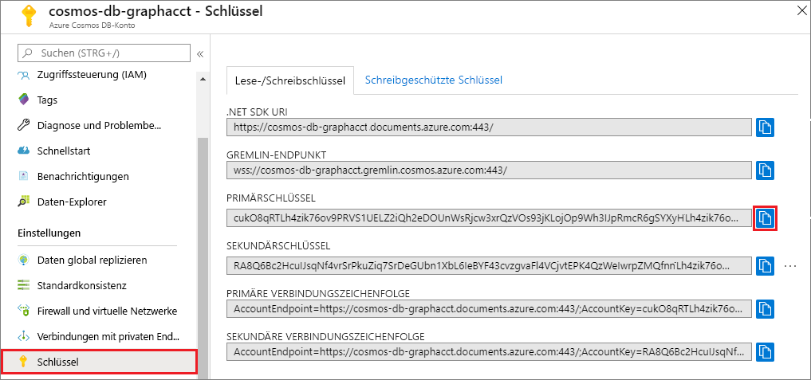

# <a name="azure-cosmos-db-build-a-nodejs-application-by-using-gremlin-api"></a>Azure Cosmos DB: Erstellen einer Node.js-Anwendung mit der Gremlin-API

> [!div class="op_single_selector"]
> * [Gremlin-Konsole](create-graph-gremlin-console.md)
> * [.NET](create-graph-dotnet.md)
> * [Java](create-graph-java.md)
> * [Node.js](create-graph-nodejs.md)
> * [Python](create-graph-python.md)
> * [PHP](create-graph-php.md)
>  

Azure Cosmos DB ist der global verteilte Datenbankdienst von Microsoft mit mehreren Modellen. Sie können schnell Dokument-, Schlüssel/Wert- und Graph-Datenbanken erstellen und abfragen und dabei stets die Vorteile der globalen Verteilung und der horizontalen Skalierung nutzen, die Azure Cosmos DB zugrunde liegen. 

In dieser Schnellstartanleitung wird veranschaulicht, wie Sie mithilfe des Azure-Portals ein [Gremlin-API](graph-introduction.md)-Konto, eine Datenbank und einen Graph für Azure Cosmos DB erstellen. Anschließend erstellen Sie eine Konsolenanwendung mithilfe des Open-Source-Treibers [Gremlin Node.js](https://www.npmjs.com/package/gremlin) und führen diese aus.

## <a name="prerequisites"></a>Voraussetzungen

Bevor Sie dieses Beispiel ausführen können, müssen folgende Voraussetzungen erfüllt sein:
* [Node.js](https://nodejs.org/en/) Version v0.10.29 oder höher
* [Git](https://git-scm.com/)

[!INCLUDE [quickstarts-free-trial-note](../../includes/quickstarts-free-trial-note.md)]

## <a name="create-a-database-account"></a>Erstellen eines Datenbankkontos

[!INCLUDE [cosmos-db-create-dbaccount-graph](../../includes/cosmos-db-create-dbaccount-graph.md)]

## <a name="add-a-graph"></a>Hinzufügen eines Graphs

[!INCLUDE [cosmos-db-create-graph](../../includes/cosmos-db-create-graph.md)]

## <a name="clone-the-sample-application"></a>Klonen der Beispielanwendung

Klonen Sie eine Gremlin-API-App aus GitHub, legen Sie die Verbindungszeichenfolge fest, und führen Sie sie aus. Sie werden feststellen, wie einfach Sie programmgesteuert mit Daten arbeiten können. 

1. Öffnen Sie eine Eingabeaufforderung, erstellen Sie einen neuen Ordner namens „git-samples“, und schließen Sie die Eingabeaufforderung.

    ```bash
    md "C:\git-samples"
    ```

2. Öffnen Sie ein Git-Terminalfenster (z.B. git bash), und verwenden Sie den Befehl `cd`, um in den neuen Ordner zu gelangen und dort die Beispiel-App zu installieren.

    ```bash
    cd "C:\git-samples"
    ```

3. Führen Sie den folgenden Befehl aus, um das Beispielrepository zu klonen. Dieser Befehl erstellt eine Kopie der Beispiel-App auf Ihrem Computer.

    ```bash
    git clone https://github.com/Azure-Samples/azure-cosmos-db-graph-nodejs-getting-started.git
    ```

3. Öffnen Sie die Projektmappendatei in Visual Studio. 

## <a name="review-the-code"></a>Überprüfen des Codes

Dieser Schritt ist optional. Wenn Sie erfahren möchten, wie die Datenbankressourcen im Code erstellt werden, können Sie sich die folgenden Codeausschnitte ansehen. Andernfalls können Sie mit [Aktualisieren der Verbindungszeichenfolge](#update-your-connection-string) fortfahren. 

Die folgenden Codeausschnitte stammen alle aus der Datei „app.js“.

* Der Gremlin-Client wird erstellt.

    ```javascript
    const client = Gremlin.createClient(
        443, 
        config.endpoint, 
        { 
            "session": false, 
            "ssl": true, 
            "user": `/dbs/${config.database}/colls/${config.collection}`,
            "password": config.primaryKey
        });
    ```

  Die Konfigurationen befinden sich alle in `config.js`. Diese Datei wird im [folgenden Abschnitt](#update-your-connection-string) bearbeitet.

* Eine Reihe von Funktionen wird definiert, um verschiedene Gremlin-Vorgänge auszuführen. Hierzu zählt beispielsweise Folgendes:

    ```javascript
    function addVertex1(callback)
    {
        console.log('Running Add Vertex1'); 
        client.execute("g.addV('person').property('id', 'thomas').property('firstName', 'Thomas').property('age', 44).property('userid', 1)", { }, (err, results) => {
          if (err) callback(console.error(err));
          console.log("Result: %s\n", JSON.stringify(results));
          callback(null)
        });
    }
    ```

* Jede Funktion führt eine Methode vom Typ `client.execute` mit einem Gremlin-Abfragezeichenfolgenparameter aus. Beispiel für die Ausführung von `g.V().count()`:

    ```javascript
    console.log('Running Count'); 
    client.execute("g.V().count()", { }, (err, results) => {
        if (err) return console.error(err);
        console.log(JSON.stringify(results));
        console.log();
    });
    ```

* Am Ende der Datei werden dann alle Methoden mithilfe der Methode `async.waterfall()` aufgerufen. So werden sie nacheinander ausgeführt:

    ```javascript
    try{
        async.waterfall([
            dropGraph,
            addVertex1,
            addVertex2,
            addEdge,
            countVertices
            ], finish);
    } catch(err) {
        console.log(err)
    }
    ```


## <a name="update-your-connection-string"></a>Aktualisieren der Verbindungszeichenfolge

1. Öffnen Sie die Datei „config.js“. 

2. Fügen Sie in der Datei „config.js“ den Schlüssel `config.endpoint` mit dem Wert für den **Gremlin-URI** von der Seite **Übersicht** des Azure-Portals ein. 

    `config.endpoint = "GRAPHENDPOINT";`

    

   Wenn der Wert **Gremlin-URI** leer ist, können Sie den Wert auf der Seite **Schlüssel** im Portal generieren. Verwenden Sie den **URI**-Wert, entfernen Sie „https://“, und ändern Sie „documents“ in „gremlin.cosmosdb“. Falls Ihr Graphkonto vor dem 20. Dezember 2017 erstellt wurde, ändern Sie „documents“ in „graphs“. 

   Als Gremlin-Endpunkt muss nur der Hostname ohne Protokoll/Portnummer wie `mygraphdb.gremlin.cosmosdb.azure.com` (nicht `https://mygraphdb.gremlin.cosmosdb.azure.com` oder `mygraphdb.gremlin.cosmosdb.azure.com:433`) angegeben werden.

3. Fügen Sie in der Datei „config.js“ den config.primaryKey-Wert mit dem Wert für **Primärschlüssel** von der Seite **Schlüssel** des Azure-Portals ein. 

    `config.primaryKey = "PRIMARYKEY";`

   

4. Geben Sie den Datenbanknamen und den Graphnamen (Container) für den Wert von „config.database“ und „config.collection“ ein. 

Hier sehen Sie ein Beispiel dafür, wie Ihre fertige Datei „config.js“ aussehen sollte:

```javascript
var config = {}

// Note that this must not have HTTPS or the port number
config.endpoint = "testgraphacct.gremlin.cosmosdb.azure.com";
config.primaryKey = "Pams6e7LEUS7LJ2Qk0fjZf3eGo65JdMWHmyn65i52w8ozPX2oxY3iP0yu05t9v1WymAHNcMwPIqNAEv3XDFsEg==";
config.database = "graphdb"
config.collection = "Persons"

module.exports = config;
```

## <a name="run-the-console-app"></a>Ausführen der Konsolenanwendung

1. Öffnen Sie ein Terminalfenster, und wechseln Sie (über den `cd`-Befehl) zum Installationsverzeichnis der Datei „package.json“, die im Projekt enthalten ist.

2. Führen Sie `npm install` aus, um die erforderlichen npm-Module zu installieren, einschließlich `gremlin`.

3. Führen Sie `node app.js` in einem Terminal aus, um Ihre Node-Anwendung zu starten.

## <a name="browse-with-data-explorer"></a>Durchsuchen mit dem Daten-Explorer

Sie können nun zum Daten-Explorer im Azure-Portal zurückkehren, um mit den neuen Graph-Daten zu arbeiten und um diese anzuzeigen, abzufragen und zu ändern.

Im Daten-Explorer wird die neue Datenbank im **Diagrammbereich** angezeigt. Erweitern Sie die Datenbank und den Container, und wählen Sie anschließend **Graph** aus.

Die von der Beispiel-App generierten Daten werden im nächsten Bereich auf der Registerkarte **Graph** angezeigt, wenn Sie **Filter anwenden** auswählen.

Vervollständigen Sie `g.V()` mit `.has('firstName', 'Thomas')`, um den Filter zu testen. Halten Sie sich dabei an die Groß-/Kleinschreibung des Werts.

## <a name="review-slas-in-the-azure-portal"></a>Überprüfen von SLAs im Azure-Portal

[!INCLUDE [cosmosdb-tutorial-review-slas](../../includes/cosmos-db-tutorial-review-slas.md)]

## <a name="clean-up-your-resources"></a>Bereinigen von Ressourcen

[!INCLUDE [cosmosdb-delete-resource-group](../../includes/cosmos-db-delete-resource-group.md)]

## <a name="next-steps"></a>Nächste Schritte

In diesem Artikel haben Sie gelernt, wie Sie ein Azure Cosmos DB-Konto erstellen, einen Graph mit dem Daten-Explorer erstellen und eine App ausführen. Nun können Sie komplexere Abfragen erstellen und leistungsfähige Logik zum Durchlaufen von Diagrammen mit Gremlin implementieren. 

> [!div class="nextstepaction"]
> [Abfragen mit Gremlin](tutorial-query-graph.md)
