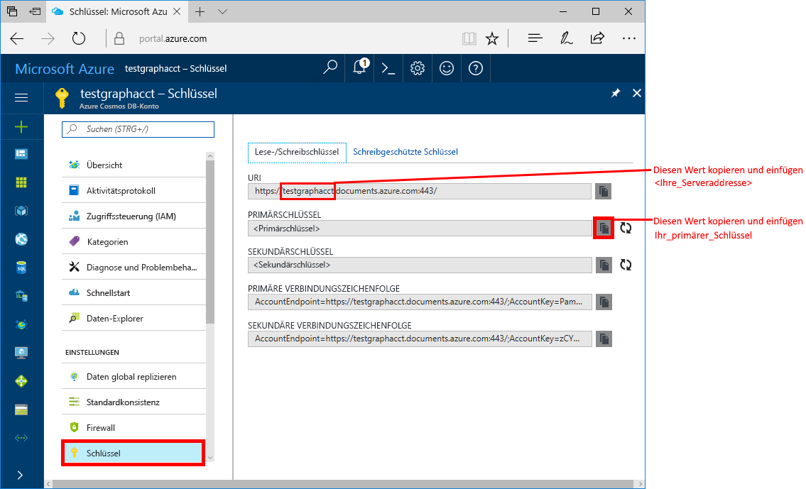
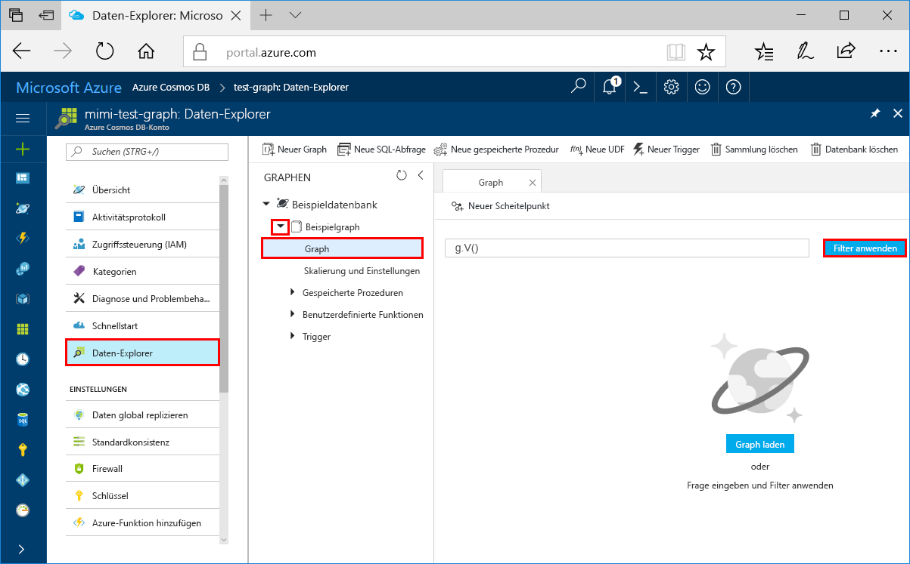
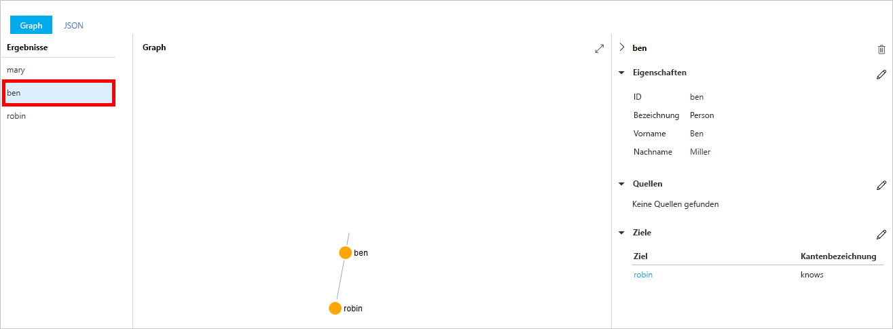
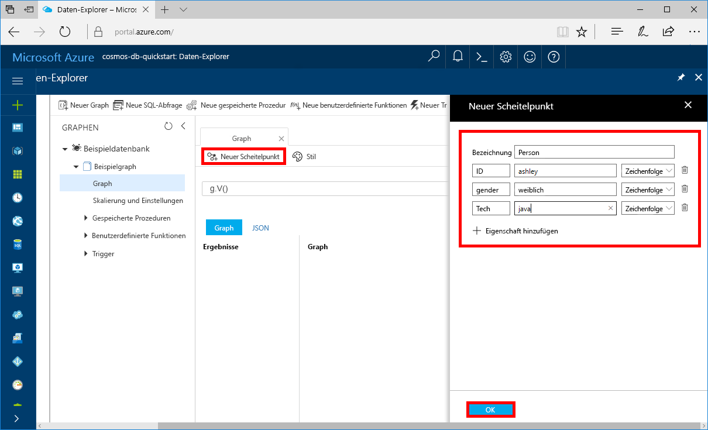
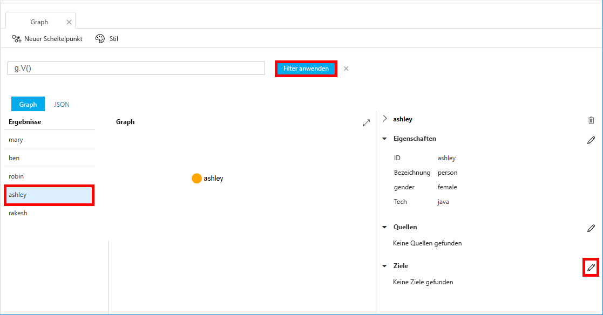
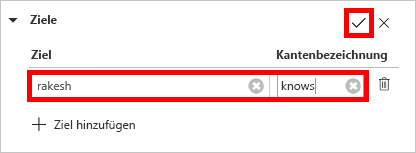

# <a name="azure-cosmos-db-create-a-graph-database-using-php-and-the-azure-portal"></a>Azure Cosmos DB: Erstellen einer Graph-Datenbank mit PHP und dem Azure-Portal

In diesem Schnellstart wird gezeigt, wie Sie mithilfe von PHP und der [Graph-API](graph-introduction.md) von Azure Cosmos DB eine Konsolen-App erstellen, indem Sie ein Beispiel aus GitHub klonen. Außerdem wird in dieser Schnellstartanleitung die Erstellung eines Azure Cosmos DB-Kontos über das webbasierte Azure-Portal gezeigt.   

Azure Cosmos DB ist ein global verteilter Datenbankdienst von Microsoft mit mehreren Modellen. Sie können schnell Dokument-, Tabellen-, Schlüssel-Wert- und Graph-Datenbanken erstellen und abfragen und dabei stets die Vorteile der globalen Verteilung und der horizontalen Skalierung nutzen, die Azure Cosmos DB bietet.  

## <a name="prerequisites"></a>Voraussetzungen

[!INCLUDE [quickstarts-free-trial-note](../../includes/quickstarts-free-trial-note.md)] Alternativ können Sie [Azure Cosmos DB ohne Azure-Abonnement testen](https://azure.microsoft.com/try/cosmosdb/) – kostenlos und ohne Verpflichtung.

Außerdem haben Sie folgende Möglichkeiten:
* [PHP](http://php.net/) 5.6 oder höher
* [Composer](https://getcomposer.org/download/)

## <a name="create-a-database-account"></a>Erstellen eines Datenbankkontos

Vor dem Erstellen einer Graphdatenbank müssen Sie ein Gremlin (Graph)-Datenbankkonto mit Azure Cosmos DB erstellen.

[!INCLUDE [cosmos-db-create-dbaccount-graph](../../includes/cosmos-db-create-dbaccount-graph.md)]

## <a name="add-a-graph"></a>Hinzufügen eines Graphs

Sie können nun mithilfe des Daten-Explorer-Tools im Azure-Portal eine Diagrammdatenbank erstellen. 

1. Klicken Sie auf **Daten-Explorer** > **New Graph** (Neuer Graph).

    Der Bereich **Add Graph** (Graph hinzufügen) wird rechts angezeigt. Möglicherweise müssen Sie nach rechts scrollen, damit Sie ihn sehen.

    

2. Geben Sie auf der Seite **Graph hinzufügen** die Einstellungen für den neuen Graphen ein.

    Einstellung|Empfohlener Wert|BESCHREIBUNG
    ---|---|---
    Datenbank-ID|sample-database|Geben Sie *sample-database* als Namen für die neue Datenbank ein. Datenbanknamen müssen zwischen 1 und 255 Zeichen lang sein und dürfen weder `/ \ # ?` noch nachgestellte Leerzeichen enthalten.
    Graph-ID|sample-graph|Geben Sie *sample-graph* als Namen für die neue Sammlung ein. Für Diagrammnamen gelten dieselben Zeichenanforderungen wie für Datenbank-IDs.
    Speicherkapazität|Fixed (10 GB)|Übernehmen Sie den Standardwert **Fest (10 GB)**. Dieser Wert gibt die Speicherkapazität der Datenbank an.
    Throughput|400 RUs|Ändern Sie den Durchsatz in 400 Anforderungseinheiten pro Sekunde (RU/s). Sie können den Durchsatz später zentral hochskalieren, wenn Sie Wartezeiten reduzieren möchten.

3. Wenn das Formular ausgefüllt ist, klicken Sie auf **OK**.

## <a name="clone-the-sample-application"></a>Klonen der Beispielanwendung

Beginnen wir nun mit der Verwendung von Code. Klonen Sie eine Graph-API-App aus GitHub, legen Sie die Verbindungszeichenfolge fest, und führen Sie diese aus. Sie werden feststellen, wie einfach Sie programmgesteuert mit Daten arbeiten können.  

1. Öffnen Sie eine Eingabeaufforderung, erstellen Sie einen neuen Ordner namens „git-samples“, und schließen Sie die Eingabeaufforderung.

    ```bash
    md "C:\git-samples"
    ```

2. Öffnen Sie ein Terminalfenster von Git (z. B. Git Bash), und verwenden Sie den Befehl `cd`, um den Ordner zu ändern, in den die Beispiel-App gespeichert wird.  

    ```bash
    cd "C:\git-samples"
    ```

3. Führen Sie den folgenden Befehl aus, um das Beispielrepository zu klonen. Dieser Befehl erstellt eine Kopie der Beispiel-App auf Ihrem Computer. 

    ```bash
    git clone https://github.com/Azure-Samples/azure-cosmos-db-graph-php-getting-started.git
    ```

## <a name="review-the-code"></a>Überprüfen des Codes

Dieser Schritt ist optional. Wenn Sie erfahren möchten, wie die Datenbankressourcen im Code erstellt werden, können Sie sich die folgenden Codeausschnitte ansehen. Die Ausschnitte stammen alle aus der Datei `connect.php` im Ordner „C:\git-samples\azure-cosmos-db-graph-php-getting-started\“. Andernfalls können Sie mit [Aktualisieren der Verbindungszeichenfolge](#update-your-connection-information) fortfahren. 

* Die `connection` mit Gremlin wird am Anfang der Datei `connect.php` mit dem `$db`-Objekt initialisiert.

    ```php
    $db = new Connection([
        'host' => '<your_server_address>.graphs.azure.com',
        'username' => '/dbs/<db>/colls/<coll>',
        'password' => 'your_primary_key'
        ,'port' => '443'

        // Required parameter
        ,'ssl' => TRUE
    ]);
    ```

* Eine Reihe von Gremlin-Schritten wird mit mithilfe der `$db->send($query);`-Methode ausgeführt.

    ```php
    $query = "g.V().drop()";
    ...
    $result = $db->send($query);
    $errors = array_filter($result);
    }
    ```

## <a name="update-your-connection-information"></a>Aktualisieren der Verbindungsinformationen

Wechseln Sie nun zurück zum Azure-Portal, um die Verbindungsinformationen abzurufen und in die App zu kopieren. Durch diese Einstellungen kann Ihre App mit Ihrer gehosteten Datenbank kommunizieren.

1. Klicken Sie im [Azure-Portal](http://portal.azure.com/) auf **Schlüssel**. 

    Kopieren Sie den ersten Teil des URI-Werts.

    
2. Öffnen Sie die Datei `your_server_address`, und fügen Sie in Zeile 8 den URI-Wert über `connect.php` ein.

    Die Verbindungsobjektinitialisierung sollte jetzt in etwa wie folgt aussehen:

    ```php
    $db = new Connection([
        'host' => 'testgraphacct.graphs.azure.com',
        'username' => '/dbs/<db>/colls/<coll>',
        'password' => 'your_primary_key'
        ,'port' => '443'

        // Required parameter
        ,'ssl' => TRUE
    ]);
    ```

3. Falls Ihr Graphdatenbankkonto am oder nach dem 20. Dezember 2017 erstellt wurde, ändern Sie `graphs.azure.com` im Hostnamen in `gremlin.cosmosdb.azure.com`.

4. Ändern Sie den `username`-Parameter im Verbindungsobjekt mit Ihrem Graph- und Datenbanknamen ab. Wenn Sie die empfohlenen Werte `sample-database` und `sample-graph` verwendet haben, sollte der Parameter wie folgt aussehen:

    `'username' => '/dbs/sample-database/colls/sample-graph'`

    Das gesamte Verbindungsobjekt sollte zum jetzigen Zeitpunkt so aussehen:

    ```php
    $db = new Connection([
        'host' => 'testgraphacct.graphs.azure.com',
        'username' => '/dbs/sample-database/colls/sample-graph',
        'password' => 'your_primary_key',
        'port' => '443'

        // Required parameter
        ,'ssl' => TRUE
    ]);
    ```

5. Verwenden Sie die Schaltfläche zum Kopieren im Azure-Portal, um den PRIMÄRSCHLÜSSEL zu kopieren und ihn über `your_primary_key` in den Kennwortparameter einzufügen.

    Die Verbindungsobjektinitialisierung sollte jetzt so aussehen:

    ```php
    $db = new Connection([
        'host' => 'testgraphacct.graphs.azure.com',
        'username' => '/dbs/sample-database/colls/sample-graph',
        'password' => '2Ggkr662ifxz2Mg==',
        'port' => '443'

        // Required parameter
        ,'ssl' => TRUE
    ]);
    ```

6. Speichern Sie die Datei `connect.php`.

## <a name="run-the-console-app"></a>Ausführen der Konsolenanwendung

1. Wechseln Sie im Terminalfenster von Git mithilfe von `cd` zum Ordner „azure-cosmos-db-graph-php-getting-started“.

    ```git
    cd "C:\git-samples\azure-cosmos-db-graph-php-getting-started"
    ```

2. Verwenden Sie im Git-Terminalfenster den folgenden Befehl, um die erforderlichen PHP-Abhängigkeiten zu installieren.

   ```
   composer install
   ```

3. Verwenden Sie im Git-Terminalfenster den folgenden Befehl, um die PHP-Anwendung zu starten.
    
    ```
    php connect.php
    ```

    Im Terminalfenster werden die Scheitelpunkte angezeigt, die dem Graph hinzugefügt werden. 
    
    Wenn Timeoutfehler auftreten, überprüfen Sie, ob Sie die Verbindungsinformationen unter [Aktualisieren der Verbindungsinformationen](#update-your-connection-information) richtig aktualisiert haben, und versuchen Sie auch, den letzten Befehl erneut auszuführen. 
    
    Drücken Sie nach Abschluss des Programms die EINGABETASTE, und wechseln Sie dann in Ihrem Internetbrowser wieder zum Azure-Portal. 

<a id="add-sample-data"></a>
## <a name="review-and-add-sample-data"></a>Überprüfen und Hinzufügen von Beispieldaten

Nun können Sie wieder zum Daten-Explorer zurückkehren, um sich die dem Graph hinzugefügten Scheitelpunkte anzusehen und weitere Datenpunkte hinzuzufügen.

1. Erweitern Sie im **Daten-Explorer** **sample-graph**, klicken Sie auf **Graph**, und klicken Sie anschließend auf **Filter anwenden**. 

   

2. Beachten Sie in der Liste **Ergebnisse** die Benutzer, die dem Graph neu hinzugefügt wurden. Wählen Sie **ben** aus, und beachten Sie, dass er mit „robin“ verbunden ist. Sie können die Scheitelpunkte bewegen, indem Sie sie ziehen und loslassen, zoomen, indem Sie das Mausrad verwenden, und die Größe des Graphen verändern, indem Sie auf den Doppelpfeil klicken. 

   

3. Fügen Sie nun einige neue Benutzer hinzu. Klicken Sie auf die Schaltfläche **New Vertex** (Neuer Scheitelpunkt), um dem Graph Daten hinzuzufügen.

   

4. Geben Sie als Bezeichnung *Person* ein.

5. Klicken Sie auf **Eigenschaft hinzufügen**, um die folgenden Eigenschaften hinzuzufügen: Beachten Sie, dass Sie für jede Person in Ihrem Graph eindeutige Eigenschaften erstellen können. Nur der id-Schlüssel ist erforderlich.

    key|value|Notizen
    ----|----|----
    id|ashley|Der eindeutige Bezeichner für den Scheitelpunkt. Wenn Sie keine ID angeben, wird automatisch eine ID generiert.
    gender|female| 
    tech | java | 

    > [!NOTE]
    > In dieser Schnellstartanleitung wird eine nicht partitionierte Sammlung erstellt. Wenn Sie hingegen eine partitionierte Sammlung erstellen, indem Sie bei der Sammlungserstellung einen Partitionsschlüssel angeben, muss der Partitionsschlüssel jedem neuen Scheitelpunkt als Schlüssel hinzugefügt werden. 

6. Klicken Sie auf **OK**. Der Bildschirm muss möglicherweise erweitert werden, damit **OK** am unteren Bildschirmrand zu sehen ist.

7. Klicken Sie erneut auf **New Vertex** (Neuer Scheitelpunkt), und fügen Sie einen weiteren neuen Benutzer hinzu. 

8. Geben Sie als Bezeichnung *Person* ein.

9. Klicken Sie auf **Eigenschaft hinzufügen**, um die folgenden Eigenschaften hinzuzufügen:

    key|value|Notizen
    ----|----|----
    id|rakesh|Der eindeutige Bezeichner für den Scheitelpunkt. Wenn Sie keine ID angeben, wird automatisch eine ID generiert.
    gender|male| 
    school|MIT| 

10. Klicken Sie auf **OK**. 

11. Klicken Sie auf die Schaltfläche **Filter anwenden** mit dem Standardfilter `g.V()`, um alle Werte des Graphen anzuzeigen. Daraufhin werden alle Benutzer in der Liste **Ergebnisse** angezeigt. 

    Wenn Sie weitere Daten hinzufügen, können Sie Ihre Ergebnisse mithilfe von Filtern eingrenzen. Daten-Explorer verwendet standardmäßig `g.V()`, um alle Scheitelpunkte eines Graphen abzurufen. Sie können ihn in eine andere [Graphabfrage](tutorial-query-graph.md) wie z.B. `g.V().count()` ändern, um die Anzahl aller Scheitelpunkte eines Graphen im JSON-Format zurückzugeben. Wenn Sie den Filter geändert haben, ändern Sie den Filter zurück in `g.V()`, und klicken Sie auf **Filter anwenden**, um wieder alle Ergebnisse anzuzeigen.

12. Als Nächstes verbinden wir „rakesh“ und „ashley“. Vergewissern Sie sich, dass **ashley** in der Liste **Ergebnisse** ausgewählt ist, und klicken Sie anschließend rechts unten neben **Ziele** auf die Bearbeitungsschaltfläche. Möglicherweise müssen Sie Ihr Fenster verbreitern, damit der Bereich **Eigenschaften** zu sehen ist.

   

13. Geben Sie im Feld **Ziel** die Zeichenfolge *rakesh* und im Feld **Edge label** (Edgebezeichner) die Zeichenfolge *knows* ein, und klicken Sie anschließend auf das Häkchen.

   

14. Wählen Sie nun in der Ergebnisliste den Eintrag **rakesh** aus. Wie Sie sehen, sind „ashley“ und „rakesh“ miteinander verbunden. 

   

   Damit haben Sie den Teil des Tutorials, in dem die Ressourcen erstellt werden, abgeschlossen. Sie können weiter Scheitelpunkte zu Ihrem Graphen hinzufügen, die vorhandenen Scheitelpunkte anpassen oder die Abfragen ändern. Sehen Sie sich nun die von Azure Cosmos DB bereitgestellten Metriken an, und bereinigen Sie anschließend die Ressourcen. 

## <a name="review-slas-in-the-azure-portal"></a>Überprüfen von SLAs im Azure-Portal

[!INCLUDE [cosmosdb-tutorial-review-slas](../../includes/cosmos-db-tutorial-review-slas.md)]

## <a name="clean-up-resources"></a>Bereinigen von Ressourcen

[!INCLUDE [cosmosdb-delete-resource-group](../../includes/cosmos-db-delete-resource-group.md)]

## <a name="next-steps"></a>Nächste Schritte

In diesem Schnellstart haben Sie gelernt, wie Sie ein Azure Cosmos DB-Konto erstellen, einen Graph mit dem Daten-Explorer erstellen und eine App ausführen. Nun können Sie komplexere Abfragen erstellen und leistungsfähige Logik zum Traversieren von Graphen mit Gremlin implementieren. 

> [!div class="nextstepaction"]
> [Query using Gremlin (Abfragen mithilfe von Gremlin)](tutorial-query-graph.md)

