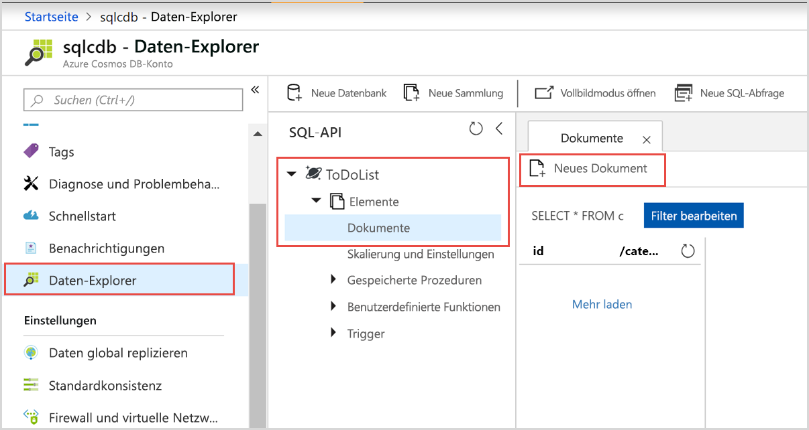
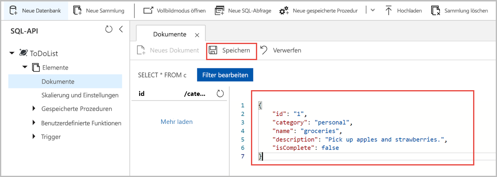

# <a name="quickstart-build-a-net-web-app-using-azure-cosmos-db-sql-api-account"></a>Schnellstart: Erstellen einer .NET-Web-App mit einem Azure Cosmos DB-SQL-API-Konto

> [!div class="op_single_selector"]
> * [.NET](create-sql-api-dotnet.md)
> * [.NET (Vorschauversion)](create-sql-api-dotnet-preview.md)
> * [Java](create-sql-api-java.md)
> * [Node.js](create-sql-api-nodejs.md)
> * [Python](create-sql-api-python.md)
> * [Xamarin](create-sql-api-xamarin-dotnet.md)
>  
> 

Azure Cosmos DB ist der global verteilte Microsoft-Datenbankdienst mit mehreren Modellen. Sie können schnell Dokument-, Schlüssel/Wert- und Graph-Datenbanken erstellen und abfragen und dabei stets die Vorteile der globalen Verteilung und der horizontalen Skalierung nutzen, die Azure Cosmos DB zugrunde liegen. 

In diesem Schnellstart wird veranschaulicht, wie Sie mithilfe des Azure-Portals ein [SQL-API](sql-api-introduction.md)-Konto, eine Dokumentdatenbank und eine Sammlung für Azure Cosmos DB erstellen und der Sammlung Beispieldaten hinzufügen. Anschließend erstellen Sie mithilfe des [SQL .NET SDK](sql-api-sdk-dotnet.md) eine Web-App für To-Do-Listen und stellen diese dann bereit, um in der Sammlung mehr verwaltete Daten hinzuzufügen. 

## <a name="prerequisites"></a>Voraussetzungen

Falls Sie Visual Studio 2017 noch nicht installiert haben, können Sie die **kostenlose** [Visual Studio 2017 Community-Edition](https://www.visualstudio.com/downloads/) herunterladen und verwenden. Aktivieren Sie beim Setup von Visual Studio die Option **Azure-Entwicklung**.

[!INCLUDE [quickstarts-free-trial-note](../../includes/quickstarts-free-trial-note.md)] 
[!INCLUDE [cosmos-db-emulator-docdb-api](../../includes/cosmos-db-emulator-docdb-api.md)]  

<a id="create-account"></a>
## <a name="create-an-account"></a>Erstellen eines Kontos

[!INCLUDE [cosmos-db-create-dbaccount](../../includes/cosmos-db-create-dbaccount.md)]

<a id="create-collection-database"></a>
## <a name="add-a-database-and-a-collection"></a>Hinzufügen einer Datenbank und einer Sammlung

Sie können nun mithilfe des Daten-Explorer-Tools im Azure-Portal eine Datenbank und eine Sammlung erstellen. 

1. Klicken Sie auf **Daten-Explorer** > **Neue Sammlung**. 
    
    Der Bereich **Sammlung hinzufügen** wird ganz rechts angezeigt. Möglicherweise müssen Sie nach rechts scrollen, damit Sie ihn sehen.

    

2. Geben Sie auf der Seite **Sammlung hinzufügen** die Einstellungen für die neue Sammlung ein.

    Einstellung|Empfohlener Wert|BESCHREIBUNG
    ---|---|---
    **Datenbank-ID**|ToDoList|Geben Sie *ToDoList* als Namen für die neue Datenbank ein. Datenbanknamen müssen zwischen 1 und 255 Zeichen lang sein und dürfen weder `/, \\, #, ?` noch nachgestellte Leerzeichen enthalten.
    **Sammlungs-ID**|Items|Geben Sie *Items* als Namen für die neue Sammlung ein. Für Sammlungs-IDs gelten dieselben Zeichenanforderungen wie für Datenbanknamen.
    **Partitionsschlüssel**| `<your_partition_key>`| Geben Sie einen Partitionsschlüssel ein. Das in diesem Artikel beschriebene Beispiel verwendet */category* als Partitionsschlüssel.
    **Durchsatz**|400 RU|Ändern Sie den Durchsatz in 400 Anforderungseinheiten pro Sekunde (RU/s). Sie können den Durchsatz später zentral hochskalieren, wenn Sie Wartezeiten reduzieren möchten. 
    
    Zusätzlich zu den zuvor beschriebenen Einstellungen können Sie optional auch **eindeutige Schlüssel** für die Sammlung hinzufügen. In diesem Beispiel lassen wir das Feld leer. Eindeutige Schlüssel bieten Entwicklern die Möglichkeit, ihrer Datenbank eine zusätzliche Datenintegritätsebene hinzuzufügen. Durch das Erstellen einer Richtlinie für eindeutige Schlüssel beim Erstellen einer Sammlung wird die Eindeutigkeit von einem oder mehreren Werten pro Partitionsschlüssel gewährleistet. Weitere Informationen finden Sie im Artikel [Eindeutige Schlüssel in Azure Cosmos DB](unique-keys.md).
    
    Klicken Sie auf **OK**.

    Im Daten-Explorer werden die neue Datenbank und die neue Sammlung angezeigt.

    

<a id="add-sample-data"></a>
## <a name="add-sample-data"></a>Hinzufügen von Beispieldaten

Sie können nun mithilfe des Daten-Explorers Daten zu einer neuen Sammlung hinzufügen.

1. Im Daten-Explorer wird die neue Datenbank im Bereich „Sammlungen“ angezeigt. Erweitern Sie die Datenbank **Aufgaben** und die Sammlung **Elemente**, und klicken Sie auf **Dokumente** und anschließend auf **Neue Dokumente**. 

   
  
2. Fügen Sie nun der Sammlung ein Dokument mit folgender Struktur hinzu.

     ```json
     {
         "id": "1",
         "category": "personal",
         "name": "groceries",
         "description": "Pick up apples and strawberries.",
         "isComplete": false
     }
     ```

3. Nachdem Sie den JSON-Code auf der Registerkarte **Dokumente** hinzugefügt haben, klicken Sie auf **Speichern**.

    

4. Erstellen und speichern Sie ein weiteres Dokument, in das Sie einen eindeutigen Wert für die Eigenschaft `id` einfügen, und ändern Sie die anderen Eigenschaften nach Bedarf. Ihre neuen Dokumente können jede gewünschte Struktur aufweisen, da Azure Cosmos DB kein Schema für Ihre Daten vorgibt.

## <a name="query-your-data"></a>Abfragen Ihrer Daten

[!INCLUDE [cosmos-db-create-sql-api-query-data](../../includes/cosmos-db-create-sql-api-query-data.md)]

## <a name="clone-the-sample-application"></a>Klonen der Beispielanwendung

Beginnen wir nun mit der Verwendung von Code. Klonen Sie zunächst eine [SQL-API-App von GitHub](https://github.com/Azure-Samples/documentdb-dotnet-todo-app), legen Sie die Verbindungszeichenfolge fest, und führen Sie sie aus. Sie werden feststellen, wie einfach Sie programmgesteuert mit Daten arbeiten können. 

1. Öffnen Sie eine Eingabeaufforderung, erstellen Sie einen neuen Ordner namens „git-samples“, und schließen Sie die Eingabeaufforderung.

    ```bash
    md "C:\git-samples"
    ```

2. Öffnen Sie ein Git-Terminalfenster (z.B. git bash), und verwenden Sie den Befehl `cd`, um in den neuen Ordner zu gelangen und dort die Beispiel-App zu installieren.

    ```bash
    cd "C:\git-samples"
    ```

3. Führen Sie den folgenden Befehl aus, um das Beispielrepository zu klonen. Dieser Befehl erstellt eine Kopie der Beispiel-App auf Ihrem Computer.

    ```bash
    git clone https://github.com/Azure-Samples/documentdb-dotnet-todo-app.git
    ```

4. Öffnen Sie anschließend die Projektmappendatei für die Aufgabenliste in Visual Studio. 

## <a name="review-the-code"></a>Überprüfen des Codes

Dieser Schritt ist optional. Wenn Sie erfahren möchten, wie die Datenbankressourcen im Code erstellt werden, können Sie sich die folgenden Codeausschnitte ansehen. Andernfalls können Sie mit [Aktualisieren der Verbindungszeichenfolge](#update-your-connection-string) fortfahren. In dieser Schnellstartanleitung erstellen Sie eine Datenbank und eine Sammlung mithilfe des Azure-Portals und fügen unter Verwendung des .NET-Beispiels Beispieldaten hinzu. Sie können die Datenbank und die Sammlung aber auch mithilfe des .NET-Beispiels erstellen. 

Die folgenden Codeausschnitte stammen alle aus der Datei „DocumentDBRepository.py“.

* Der Dokumentclient (DocumentClient) wird wie im folgenden Code gezeigt initialisiert:

    ```csharp
    client = new DocumentClient(new Uri(ConfigurationManager.AppSettings["endpoint"]), ConfigurationManager.AppSettings["authKey"]);
    ```

* Eine neue Datenbank wird mithilfe der `CreateDatabaseAsync`-Methode erstellt, wie im folgenden Code gezeigt:

    ```csharp
    await client.CreateDatabaseAsync(new Database { Id = DatabaseId });
    ```

* Eine neue Sammlung wird mithilfe von `CreateDocumentCollectionAsync` erstellt, wie im folgenden Code gezeigt:

    ```csharp
    private static async Task CreateCollectionIfNotExistsAsync()
    {
        try
        {
           await client.ReadDocumentCollectionAsync(UriFactory.CreateDocumentCollectionUri(DatabaseId, CollectionId));
        }
        catch (DocumentClientException e)
        {
           if (e.StatusCode == System.Net.HttpStatusCode.NotFound)
           {
              await client.CreateDocumentCollectionAsync(
              UriFactory.CreateDatabaseUri(DatabaseId),
              new DocumentCollection
              {
                  Id = CollectionId
              },
              new RequestOptions { OfferThroughput = 400 });
           }
           else
           {
             throw;
           }
        }
    }
    ```

## <a name="update-your-connection-string"></a>Aktualisieren der Verbindungszeichenfolge

Wechseln Sie nun zurück zum Azure-Portal, um die Informationen der Verbindungszeichenfolge abzurufen und in die App zu kopieren.

1. Wählen Sie im [Azure-Portal](https://portal.azure.com/) in Ihrem Azure Cosmos DB-Konto im linken Navigationsbereich die Option **Schlüssel** und anschließend **Lese-/Schreibschlüssel** aus. Mithilfe der Schaltflächen zum Kopieren auf der rechten Seite des Bildschirms kopieren Sie im nächsten Schritt die URI und den Primärschlüssel in die Datei „web.config“.

    

2. Öffnen Sie in Visual Studio 2017 die Datei „web.config“. 

3. Kopieren Sie den URI-Wert aus dem Portal (mithilfe der Schaltfläche zum Kopieren), und legen Sie ihn in „web.config“ als Wert des Endpunktschlüssels fest. 

    `<add key="endpoint" value="FILLME" />`

4. Kopieren Sie anschließend den Wert für PRIMARY KEY aus dem Portal, und legen Sie ihn in „web.config“ als Wert des authKey fest. 

    `<add key="authKey" value="FILLME" />`
    
5. Aktualisieren Sie dann die Datenbank- und Sammlungswerte, damit sie mit dem Namen der Datenbank übereinstimmen, die Sie zuvor erstellt haben. Sie haben die App nun mit allen erforderlichen Informationen für die Kommunikation mit Azure Cosmos DB aktualisiert. 

   ```csharp
   <add key="database" value="ToDoList"/>
   <add key="collection" value="Items"/>
   ```
 
## <a name="run-the-web-app"></a>Ausführen der Web-App
1. Klicken Sie in Visual Studio mit der rechten Maustaste auf das Projekt im **Projektmappen-Explorer**, und wählen Sie anschließend **NuGet-Pakete verwalten** aus. 

2. Geben Sie im NuGet-Feld **Durchsuchen** den Suchbegriff *DocumentDB* ein.

3. Installieren Sie die in den Ergebnissen enthaltene Bibliothek **Microsoft.Azure.DocumentDB**. Dadurch wird das Paket „Microsoft.Azure.DocumentDB“ mit all seinen Abhängigkeiten installiert.

4. Drücken Sie STRG+F5, um die Anwendung auszuführen. Ihre App wird im Browser angezeigt. 

5. Wählen Sie im Browser **Neu erstellen**, und erstellen Sie einige neue Aufgaben in Ihrer To-Do-App.

   

Jetzt können Sie zum Daten-Explorer zurückkehren, um diese neue Daten anzuzeigen, abzufragen, anzupassen und mit ihnen zu arbeiten. 

## <a name="review-slas-in-the-azure-portal"></a>Überprüfen von SLAs im Azure-Portal

[!INCLUDE [cosmosdb-tutorial-review-slas](../../includes/cosmos-db-tutorial-review-slas.md)]

## <a name="clean-up-resources"></a>Bereinigen von Ressourcen

[!INCLUDE [cosmosdb-delete-resource-group](../../includes/cosmos-db-delete-resource-group.md)]

## <a name="next-steps"></a>Nächste Schritte

In diesem Schnellstart haben Sie gelernt, wie Sie ein Azure Cosmos DB-Konto erstellen, eine Sammlung mit dem Daten-Explorer erstellen und eine Web-App ausführen. Jetzt können Sie zusätzliche Daten in Ihr Cosmos DB-Konto importieren. 

> [!div class="nextstepaction"]
> [Import data into Azure Cosmos DB (Importieren von Daten in Azure Cosmos DB)](import-data.md)


