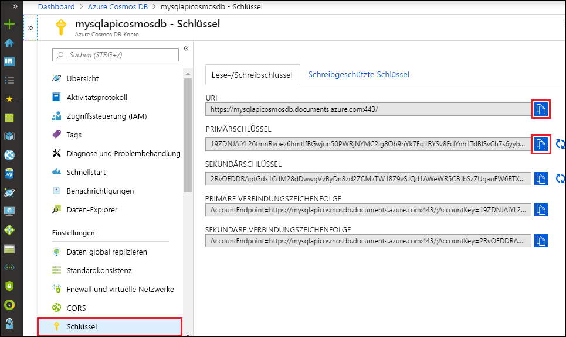
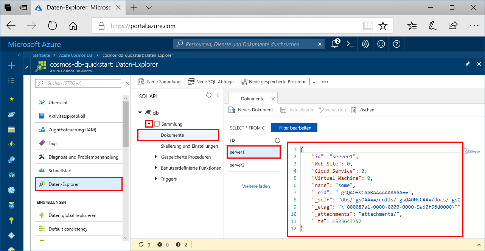

# <a name="quickstart-build-a-python-application-using-an-azure-cosmos-db-sql-api-account"></a>Schnellstart: Erstellen einer Python-Anwendung mithilfe eines SQL-API-Kontos für Azure Cosmos DB

> [!div class="op_single_selector"]
> * [.NET](create-sql-api-dotnet.md)
> * [Java](create-sql-api-java.md)
> * [Node.js](create-sql-api-nodejs.md)
> * [Python](create-sql-api-python.md)
> * [Xamarin](create-sql-api-xamarin-dotnet.md)
>  

In dieser Schnellstartanleitung wird veranschaulicht, wie Sie mithilfe des Azure-Portals ein [SQL-API-Konto](sql-api-introduction.md), eine Dokumentdatenbank und einen Container für Azure Cosmos DB erstellen. Anschließend erstellen Sie eine auf dem Python SDK für [SQL-API](sql-api-sdk-python.md) basierende Konsolen-App und führen sie aus.

Azure Cosmos DB ist der global verteilte Microsoft-Datenbankdienst mit mehreren Modellen. Sie können Dokumente, Schlüssel/Werte, Datenbanken mit breiten Spalten und Graphdatenbanken schnell erstellen und abfragen. Alle diese Vorgänge profitieren von den Verteilungs- und Skalierungsoptionen von Azure Cosmos DB.

In diesem Schnellstart wird Version 3.0 des [Python SDK](https://pypi.org/project/azure-cosmos) verwendet.

[!INCLUDE [quickstarts-free-trial-note](../../includes/quickstarts-free-trial-note.md)][!INCLUDE [cosmos-db-emulator-docdb-api](../../includes/cosmos-db-emulator-docdb-api.md)]

## <a name="prerequisites"></a>Voraussetzungen

* [Python 3.6](https://www.python.org/downloads/) mit der ausführbaren `python`-Datei unter Ihrem Pfad (`PATH`).
* [Visual Studio Code](https://code.visualstudio.com/)
* [Python-Erweiterung für Visual Studio Code](https://marketplace.visualstudio.com/items?itemName=ms-python.python#overview)

## <a name="create-a-database-account"></a>Erstellen eines Datenbankkontos

[!INCLUDE [cosmos-db-create-dbaccount](../../includes/cosmos-db-create-dbaccount.md)]

## <a name="add-a-container"></a>Hinzufügen eines Containers

[!INCLUDE [cosmos-db-create-collection](../../includes/cosmos-db-create-collection.md)]

## <a name="add-sample-data"></a>Hinzufügen von Beispieldaten

[!INCLUDE [cosmos-db-create-sql-api-add-sample-data](../../includes/cosmos-db-create-sql-api-add-sample-data.md)]

## <a name="query-your-data"></a>Abfragen Ihrer Daten

[!INCLUDE [cosmos-db-create-sql-api-query-data](../../includes/cosmos-db-create-sql-api-query-data.md)]

## <a name="clone-the-sample-application"></a>Klonen der Beispielanwendung

Klonen Sie zunächst eine SQL-API-App aus GitHub, legen Sie die Verbindungszeichenfolge fest, und führen Sie sie aus.

1. Öffnen Sie eine Eingabeaufforderung, erstellen Sie einen neuen Ordner namens „git-samples“, und schließen Sie die Eingabeaufforderung.

    ```cmd
    md "git-samples"
    ```
   Bei einer Bash-Eingabeaufforderung sollten Sie stattdessen den folgenden Befehl verwenden:

   ```bash
   mkdir "git-samples"
   ```

2. Öffnen Sie ein Git-Terminalfenster (z.B. git bash), und verwenden Sie den Befehl `cd`, um in den neuen Ordner zu gelangen und dort die Beispiel-App zu installieren.

    ```bash
    cd "git-samples"
    ```

3. Führen Sie den folgenden Befehl aus, um das Beispielrepository zu klonen. Dieser Befehl erstellt eine Kopie der Beispiel-App auf Ihrem Computer. 

    ```bash
    git clone https://github.com/Azure-Samples/azure-cosmos-db-python-getting-started.git
    ```  

## <a name="update-your-connection-string"></a>Aktualisieren der Verbindungszeichenfolge

Wechseln Sie nun zurück zum Azure-Portal, um die Informationen der Verbindungszeichenfolge abzurufen und in die App zu kopieren.

1. Wählen Sie im [Azure-Portal](https://portal.azure.com/) unter Ihrem Azure Cosmos-Konto im Navigationsbereich auf der linken Seite **Schlüssel** aus. Mithilfe der Schaltflächen zum Kopieren auf der rechten Seite des Bildschirms kopieren Sie im nächsten Schritt den **URI** und den **Primärschlüssel** in die Datei `CosmosGetStarted.py`.

    

2. Öffnen Sie die Datei `CosmosGetStarted.py` in „\git-samples\azure-cosmos-db-python-getting-started“ in Visual Studio Code.

3. Kopieren Sie den **URI**-Wert aus dem Portal (mithilfe der Schaltfläche zum Kopieren), und legen Sie ihn in ``CosmosGetStarted.py`` als Wert des **Endpunktschlüssels** fest. 

    `'ENDPOINT': 'https://FILLME.documents.azure.com',`

4. Kopieren Sie anschließend den Wert für **PRIMARY KEY** aus dem Portal, und legen Sie ihn in ``CosmosGetStarted.py`` als Wert für **config.PRIMARYKEY** fest. Sie haben die App nun mit allen erforderlichen Informationen für die Kommunikation mit Azure Cosmos DB aktualisiert. 

    `'PRIMARYKEY': 'FILLME',`

5. Speichern Sie die Datei ``CosmosGetStarted.py``.

## <a name="review-the-code"></a>Überprüfen des Codes

Dieser Schritt ist optional. Informieren Sie sich über die im Code erstellten Datenbankressourcen, oder springen Sie weiter zu [Aktualisieren der Verbindungszeichenfolge](#update-your-connection-string).

Hinweis: Wenn Sie mit der vorherigen Version des Python SDK vertraut sind, kennen Sie unter Umständen bereits die Begriffe „Sammlung“ und „Dokument“. Azure Cosmos DB unterstützt mehrere API-Modelle. Daher werden in Version 3.0 und höheren Versionen des Python SDK die generischen Begriffe „Container“ (für eine Sammlung, einen Graph oder eine Tabelle) und „Element“ zum Beschreiben des Containerinhalts verwendet.

Die folgenden Codeausschnitte stammen alle aus der Datei `CosmosGetStarted.py`.

* Der CosmosClient wird initialisiert. Achten Sie darauf, die Werte für „Endpoint“ und „master key“ zu aktualisieren, wie im Abschnitt [Aktualisieren der Verbindungszeichenfolge](#update-your-connection-string) beschrieben. 

    ```python
    # Initialize the Cosmos client
    client = cosmos_client.CosmosClient(url_connection=config['ENDPOINT'], auth={'masterKey': config['MASTERKEY']})
    ```

* Es wird eine neue Datenbank erstellt.

    ```python
    # Create a database
    db = client.CreateDatabase({ 'id': config['DATABASE'] })
    ```

* Es wird ein neuer Container erstellt.

    ```python
    # Create container options
    options = {
        'offerThroughput': 400
    }

    # Create a container
    container = client.CreateContainer(db['_self'], container_definition, options)
    ```

* Einige Elemente werden dem Container hinzugefügt.

    ```python
    # Create and add some items to the container
    item1 = client.CreateItem(container['_self'], {
        'serverId': 'server1',
        'Web Site': 0,
        'Cloud Service': 0,
        'Virtual Machine': 0,
        'message': 'Hello World from Server 1!'
        }
    )

    item2 = client.CreateItem(container['_self'], {
        'serverId': 'server2',
        'Web Site': 1,
        'Cloud Service': 0,
        'Virtual Machine': 0,
        'message': 'Hello World from Server 2!'
        }
    )
    ```

* Eine Abfrage wird mit SQL ausgeführt.

    ```python
    query = {'query': 'SELECT * FROM server s'}

    options = {}
    options['enableCrossPartitionQuery'] = True
    options['maxItemCount'] = 2

    result_iterable = client.QueryItems(container['_self'], query, options)
    for item in iter(result_iterable):
        print(item['message'])
    ```
   
## <a name="run-the-app"></a>Ausführen der App

1. Klicken Sie in Visual Studio Code auf **Ansicht** > **Befehlspalette**. 

2. Geben Sie an der Eingabeaufforderung **Python: Select Interpreter** ein, und wählen Sie die gewünschte Python-Version aus.

    Die Fußzeile in Visual Studio Code wird mit dem ausgewählten Interpreter aktualisiert. 

3. Klicken Sie auf **Ansicht** > **Integriertes Terminal**, um das in Visual Studio Code integrierte Terminal zu öffnen.

4. Vergewissern Sie sich im Fenster des integrierten Terminals, dass Sie sich im Ordner „azure-cosmos-db-python-getting-started“ befinden. Wechseln Sie andernfalls mithilfe des folgenden Befehls zum Beispielordner: 

    ```cmd
    cd "\git-samples\azure-cosmos-db-python-getting-started"`
    ```

5. Führen Sie den folgenden Befehl aus, um das Paket „azure-cosmos“ zu installieren: 

    ```python
    pip3 install azure-cosmos
    ```

    Sollte beim Installieren von „azure-cosmos“ eine Fehlermeldung mit dem Hinweis angezeigt werden, dass der Zugriff verweigert wurde, müssen Sie [Visual Studio Code als Administrator ausführen](https://stackoverflow.com/questions/37700536/visual-studio-code-terminal-how-to-run-a-command-with-administrator-rights).

6. Führen Sie den folgenden Befehl aus, um das Beispiel auszuführen und neue Dokumente in Azure Cosmos DB zu erstellen und zu speichern:

    ```python
    python CosmosGetStarted.py
    ```

7. Vergewissern Sie sich, dass die neuen Elemente erstellt und gespeichert wurden. Klicken Sie hierzu im Azure-Portal auf **Daten-Explorer**, erweitern Sie **coll**, erweitern Sie **Dokumente**, und wählen Sie anschließend das Dokument **server1** aus. Der Inhalt des Dokuments „server1“ entspricht dem Inhalt, der im Fenster des integrierten Terminals zurückgegeben wurde. 

    

## <a name="review-slas-in-the-azure-portal"></a>Überprüfen von SLAs im Azure-Portal

[!INCLUDE [cosmosdb-tutorial-review-slas](../../includes/cosmos-db-tutorial-review-slas.md)]

## <a name="clean-up-resources"></a>Bereinigen von Ressourcen

[!INCLUDE [cosmosdb-delete-resource-group](../../includes/cosmos-db-delete-resource-group.md)]

## <a name="next-steps"></a>Nächste Schritte

In diesem Schnellstart haben Sie gelernt, wie Sie ein Azure Cosmos-Konto erstellen, einen Container mit dem Daten-Explorer erstellen und eine App ausführen. Jetzt können Sie zusätzliche Daten in Ihr Cosmos DB-Konto importieren. 

> [!div class="nextstepaction"]
> [Importieren von Daten in Azure Cosmos DB für die SQL-API](import-data.md)


