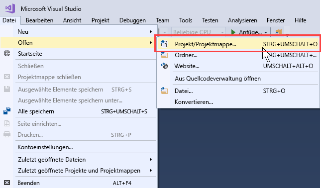
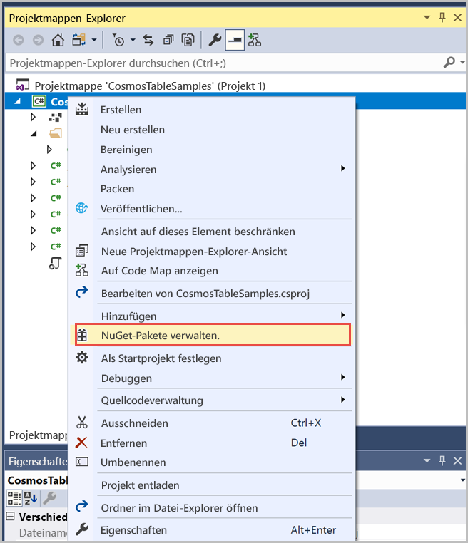
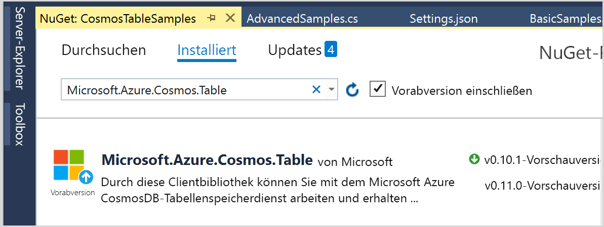
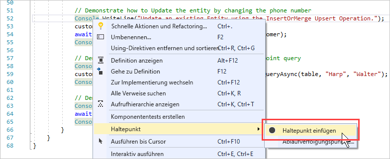
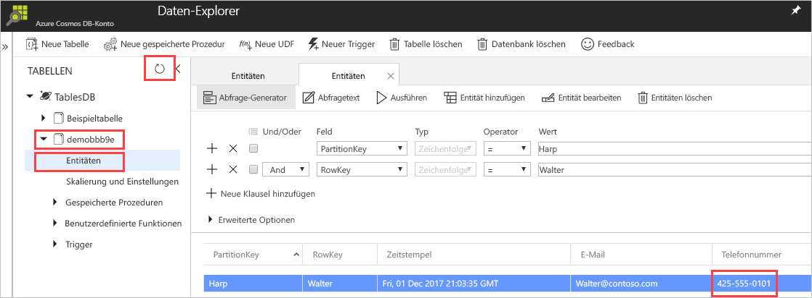

# <a name="quickstart-build-a-table-api-app-with-net-and-azure-cosmos-db"></a>Schnellstartanleitung: Erstellen einer Table-API-App mit .NET und Azure Cosmos DB 

In dieser Schnellstartanleitung erfahren Sie, wie Sie mithilfe von .NET und der [Tabellen-API](table-introduction.md) von Azure Cosmos DB eine App erstellen, indem Sie ein Beispiel von GitHub klonen. Außerdem wird in dieser Schnellstartanleitung gezeigt, wie Sie ein Azure Cosmos DB-Konto erstellen und mithilfe des Daten-Explorers Tabellen und Entitäten im webbasierten Azure-Portal erstellen.

Azure Cosmos DB ist der global verteilte Microsoft-Datenbankdienst mit mehreren Modellen. Sie können schnell Dokument-, Schlüssel/Wert- und Graph-Datenbanken erstellen und abfragen und dabei stets die Vorteile der globalen Verteilung und der horizontalen Skalierung nutzen, die Azure Cosmos DB zugrunde liegen. 

## <a name="prerequisites"></a>Voraussetzungen

Falls Sie Visual Studio 2017 noch nicht installiert haben, können Sie die **kostenlose** [Visual Studio 2017 Community-Edition](https://www.visualstudio.com/downloads/) herunterladen und verwenden. Aktivieren Sie beim Setup von Visual Studio die Option **Azure-Entwicklung**.

[!INCLUDE [quickstarts-free-trial-note](../../includes/quickstarts-free-trial-note.md)]

## <a name="create-a-database-account"></a>Erstellen eines Datenbankkontos

> [!IMPORTANT] 
> Zur Verwendung der allgemein verfügbaren Tabellen-API-SDKs müssen Sie ein neues Tabellen-API-Konto erstellen. Tabellen-API-Konten, die während der Vorschau erstellt wurden, werden von den allgemein verfügbaren SDKs nicht unterstützt.
>

[!INCLUDE [cosmos-db-create-dbaccount-table](../../includes/cosmos-db-create-dbaccount-table.md)]

## <a name="add-a-table"></a>Hinzufügen einer Tabelle

[!INCLUDE [cosmos-db-create-table](../../includes/cosmos-db-create-table.md)]

## <a name="add-sample-data"></a>Hinzufügen von Beispieldaten

Sie können nun mithilfe des Daten-Explorers Daten zu einer neuen Tabelle hinzufügen.

1. Erweitern Sie im Daten-Explorer **sample-database**, klicken Sie auf **Entitäten**, und klicken Sie anschließend auf **Entität hinzufügen**.

   
2. Geben Sie nun Daten in das Wertfeld „PartitionKey“ und „RowKey“ ein, und klicken Sie auf **Entität hinzufügen**.

   
  
    Jetzt können Sie weitere Entitäten in Ihre Tabelle hinzufügen, diese Entitäten bearbeiten und Ihre Daten im Daten-Explorer abfragen. Im Daten-Explorer können Sie zudem Ihren Durchsatz skalieren und der Tabelle gespeicherte Prozeduren, benutzerdefinierte Funktionen und Trigger hinzufügen.

## <a name="clone-the-sample-application"></a>Klonen der Beispielanwendung

Klonen Sie jetzt eine Tabellen-App aus GitHub, legen Sie die Verbindungszeichenfolge fest, und führen Sie die App aus. Sie werden feststellen, wie einfach Sie programmgesteuert mit Daten arbeiten können. 

1. Öffnen Sie ein Git-Terminalfenster (beispielsweise Git Bash), und wechseln Sie mithilfe des Befehls `cd` in einen Installationsordner für die Beispiel-App. 

    ```bash
    cd "C:\git-samples"
    ```

2. Führen Sie den folgenden Befehl aus, um das Beispielrepository zu klonen. Dieser Befehl erstellt eine Kopie der Beispiel-App auf Ihrem Computer. 

    ```bash
    git clone https://github.com/Azure-Samples/storage-table-dotnet-getting-started.git
    ```
## <a name="open-the-sample-application-in-visual-studio"></a>Öffnen der Beispielanwendung in Visual Studio

1. Klicken Sie in Visual Studio im Menü **Datei** auf **Öffnen** > **Projekt/Projektmappe**. 

    

2. Navigieren Sie zu dem Ordner, in dem Sie die Beispielanwendung geklont haben, und öffnen Sie die Datei „TableStorage.sln“.

    

## <a name="update-your-connection-string"></a>Aktualisieren der Verbindungszeichenfolge

Wechseln Sie nun zurück zum Azure-Portal, um die Informationen der Verbindungszeichenfolge abzurufen und in die App zu kopieren. Dadurch kann Ihre App mit Ihrer gehosteten Datenbank kommunizieren. 

1. Klicken Sie im [Azure-Portal](http://portal.azure.com/) auf **Verbindungszeichenfolge**. 

    Kopieren Sie mithilfe der Kopierschaltfläche im rechten Fensterbereich die **PRIMÄRE VERBINDUNGSZEICHENFOLGE**.

    

2. Öffnen Sie in Visual Studio die Datei „App.config“. 

3. Da der Azure SDK-Speicheremulator in diesem Tutorial nicht verwendet wird, heben Sie die Auskommentierung von „StorageConnectionString“ in Zeile 8 auf, und kommentieren Sie „StorageConnectionString“ in Zeile 7 aus. Die Zeilen 7 und 8 sollten jetzt wie folgt aussehen:

    ```
    <!--key="StorageConnectionString" value="UseDevelopmentStorage=true;" />-->
    <add key="StorageConnectionString" value="DefaultEndpointsProtocol=https;AccountName=[AccountName];AccountKey=[AccountKey]" />
    ```

4. Fügen Sie die **PRIMÄRE VERBINDUNGSZEICHENFOLGE** aus dem Portal in Zeile 8 in den StorageConnectionString-Wert ein. Fügen Sie die Zeichenfolge innerhalb der Anführungszeichen ein. 

    > [!IMPORTANT]
    > Wenn Ihr Endpunkt „documents.azure.com“ verwendet, bedeutet das, dass Sie über ein Vorschaukonto verfügen und ein [neues Tabellen-API-Konto](#create-a-database-account) erstellen müssen, um das allgemein verfügbare Tabellen-API-SDK verwenden zu können. 
    > 

    Zeile 8 sollte nun in etwa wie folgt aussehen:

    ```
    <add key="StorageConnectionString" value="DefaultEndpointsProtocol=https;AccountName=<account name>;AccountKey=txZACN9f...==;TableEndpoint=https://<account name>.table.cosmosdb.azure.com;" />
    ```

5. Drücken Sie STRG+S, um die Datei „App.config“ zu speichern.

Sie haben die App nun mit allen erforderlichen Informationen für die Kommunikation mit Azure Cosmos DB aktualisiert. 

## <a name="build-and-deploy-the-app"></a>Erstellen und Bereitstellen der App

1. Klicken Sie in Visual Studio im **Projektmappen-Explorer** mit der rechten Maustaste auf das Projekt **TableStorage**, und klicken Sie anschließend auf **NuGet-Pakete verwalten**. 

   
2. Geben Sie im NuGet-Feld **Durchsuchen** die Zeichenfolge *Microsoft.Azure.CosmosDB.Table* ein. Dadurch wird die Clientbibliothek „Cosmos DB-Tabellen-API“ gefunden.
   
   

3. Klicken Sie auf **Installieren**, um die Bibliothek **Microsoft.Azure.CosmosDB.Table** zu installieren. Dadurch werden das Paket der Azure Cosmos DB-Tabellen-API sowie sämtliche Abhängigkeiten installiert.

    

4. Öffnen Sie „BasicSamples.cs“. Klicken Sie mit der rechten Maustaste auf die Zeile 52, wählen Sie **Haltepunkt** aus, und wählen Sie anschließend **Haltepunkt einfügen** aus. Fügen Sie in Zeile 55 einen weiteren Haltepunkt ein.

    

5. Drücken Sie die Taste F5, um die Anwendung auszuführen.

    Im Konsolenfenster wird der Name der neuen Tabellendatenbank in Azure Cosmos DB angezeigt (in diesem Fall: demo91ab4). 
    
    

    Wenn ein Fehler in Bezug auf Abhängigkeiten angezeigt wird, finden Sie weitere Informationen unter [Troubleshooting](table-sdk-dotnet.md#troubleshooting) (Problembehandlung).

    Kehren Sie bei Erreichen des ersten Haltepunkts wieder zum Daten-Explorer im Azure-Portal zurück. Klicken Sie auf die Schaltfläche **Aktualisieren**, erweitern Sie die Demo-Tabelle, und klicken Sie auf **Entitäten**. Die Registerkarte **Entitäten** auf der rechten Seite zeigt die neue Entität, die für Walter Harp hinzugefügt wurde. Die Telefonnummer für die neue Entität lautet 425-555-0101.

    
    
6. Schließen Sie im Daten-Explorer die Registerkarte **Entitäten**.
    
7. Drücken Sie F5, um die App bis zum nächsten Haltepunkt auszuführen. 

    Kehren Sie bei Erreichen des Haltepunkts wieder zum Azure-Portal zurück, und klicken Sie erneut auf **Entitäten**, um die Registerkarte **Entitäten** zu öffnen. Beachten Sie, dass die Telefonnummer aktualisiert wurde und nun 425-555-0105 lautet.

8. Drücken Sie F5, um die App auszuführen. 
 
   Die App fügt Entitäten für die Verwendung in einer erweiterten Beispiel-App hinzu, die von der Tabellen-API momentan nicht unterstützt wird. Anschließend löscht die App die von der Beispiel-App erstellten Tabellen.

9. Drücken Sie im Konsolenfenster die EINGABETASTE, um die Ausführung der App zu beenden. 
  

## <a name="review-slas-in-the-azure-portal"></a>Überprüfen von SLAs im Azure-Portal

[!INCLUDE [cosmosdb-tutorial-review-slas](../../includes/cosmos-db-tutorial-review-slas.md)]

## <a name="clean-up-resources"></a>Bereinigen von Ressourcen

[!INCLUDE [cosmosdb-delete-resource-group](../../includes/cosmos-db-delete-resource-group.md)]

## <a name="next-steps"></a>Nächste Schritte

In diesem Schnellstart haben Sie gelernt, wie Sie ein Azure Cosmos DB-Konto erstellen, eine Tabelle mit dem Daten-Explorer erstellen und eine App ausführen.  Jetzt können Sie Ihre Daten mit der Table-API abfragen.  

> [!div class="nextstepaction"]
> [Importieren von Daten in die Table-API](table-import.md)

