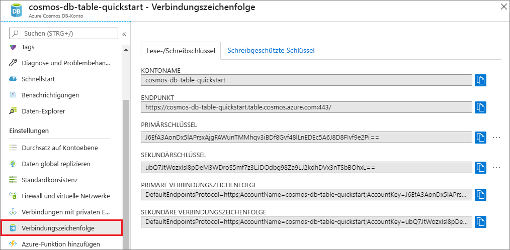

# <a name="quickstart-build-a-table-api-app-with-python-and-azure-cosmos-db"></a>Schnellstart: Erstellen einer Tabellen-API-App mit Python und Azure Cosmos DB

> [!div class="op_single_selector"]
> * [.NET](create-table-dotnet.md)
> * [Java](create-table-java.md)
> * [Node.js](create-table-nodejs.md)
> * [Python](create-table-python.md)
> 

In dieser Schnellstartanleitung erstellen und verwalten Sie ein Azure Cosmos DB-Tabellen-API-Konto im Azure-Portal und über Visual Studio mit einer über GitHub geklonten Python-App. Azure Cosmos DB ist ein Multimodell-Datenbankdienst, mit dem Sie mithilfe der Funktionen für globale Verteilung und horizontale Skalierung schnell Dokument-, Tabellen-, Schlüssel-Wert- und Graph-Datenbanken erstellen und abfragen können.

## <a name="prerequisites"></a>Voraussetzungen

- Ein Azure-Konto mit einem aktiven Abonnement. [Erstellen Sie ein kostenloses Konto.](https://azure.microsoft.com/free/?ref=microsoft.com&utm_source=microsoft.com&utm_medium=docs&utm_campaign=visualstudio) Oder [testen Sie Azure Cosmos DB kostenlos](https://azure.microsoft.com/try/cosmosdb/) ohne ein Azure-Abonnement. Sie können auch den [Azure Cosmos DB-Emulator](https://aka.ms/cosmosdb-emulator) mit dem URI `https://localhost:8081` und dem Schlüssel `C2y6yDjf5/R+ob0N8A7Cgv30VRDJIWEHLM+4QDU5DE2nQ9nDuVTqobD4b8mGGyPMbIZnqyMsEcaGQy67XIw/Jw==` verwenden.
- [Visual Studio 2019](https://www.visualstudio.com/downloads/). Wählen Sie bei der Einrichtung die Workloads **Azure-Entwicklung** und **Python-Entwicklung** aus. 
- [Git](https://git-scm.com/downloads).

## <a name="create-a-database-account"></a>Erstellen eines Datenbankkontos

> [!IMPORTANT] 
> Zum Arbeiten mit den allgemein verfügbaren Tabellen-API-SDKs müssen Sie ein neues Tabellen-API-Konto erstellen. Tabellen-API-Konten, die während der Vorschau erstellt wurden, werden von den allgemein verfügbaren SDKs nicht unterstützt.
>

[!INCLUDE [cosmos-db-create-dbaccount-table](../../includes/cosmos-db-create-dbaccount-table.md)]

## <a name="add-a-table"></a>Hinzufügen einer Tabelle

[!INCLUDE [cosmos-db-create-table](../../includes/cosmos-db-create-table.md)]

## <a name="add-sample-data"></a>Hinzufügen von Beispieldaten

[!INCLUDE [cosmos-db-create-table-add-sample-data](../../includes/cosmos-db-create-table-add-sample-data.md)]

## <a name="clone-the-sample-application"></a>Klonen der Beispielanwendung

Klonen Sie jetzt eine Tabellen-App aus GitHub, legen Sie die Verbindungszeichenfolge fest, und führen Sie die App aus. Sie werden feststellen, wie einfach Sie programmgesteuert mit Daten arbeiten können. 

1. Öffnen Sie eine Eingabeaufforderung, erstellen Sie einen neuen Ordner namens „git-samples“, und schließen Sie die Eingabeaufforderung.

    ```bash
    md "C:\git-samples"
    ```

2. Öffnen Sie ein Git-Terminalfenster (z.B. git bash), und verwenden Sie den Befehl `cd`, um in den neuen Ordner zu gelangen und dort die Beispiel-App zu installieren.

    ```bash
    cd "C:\git-samples"
    ```

3. Führen Sie den folgenden Befehl aus, um das Beispielrepository zu klonen. Dieser Befehl erstellt eine Kopie der Beispiel-App auf Ihrem Computer. 

    ```bash
    git clone https://github.com/Azure-Samples/storage-python-getting-started.git
    ```

3. Öffnen Sie anschließend die Projektmappendatei in Visual Studio. 

> ![TIPP] Eine ausführlichere exemplarische Vorgehensweise finden Sie im Artikel mit dem [Beispiel für die Cosmos DB-Tabellen-API](table-storage-how-to-use-python.md).

## <a name="update-your-connection-string"></a>Aktualisieren der Verbindungszeichenfolge

Wechseln Sie nun zurück zum Azure-Portal, um die Informationen der Verbindungszeichenfolge abzurufen und in die App zu kopieren. Dadurch kann Ihre App mit Ihrer gehosteten Datenbank kommunizieren. 

1. Wählen Sie im [Azure-Portal](https://portal.azure.com/) in Ihrem Azure Cosmos DB-Konto die Option **Verbindungszeichenfolge** aus. 

    

2. Kopieren Sie den Kontonamen mithilfe der Schaltfläche auf der rechten Seite.

3. Öffnen Sie die Datei *config.py*, und fügen Sie den Wert unter „KONTONAME“ aus dem Portal in den Wert „STORAGE_ACCOUNT_NAME“ in Zeile 19 ein.

4. Kehren Sie zum Portal zurück, und kopieren Sie den Primärschlüssel.

5. Fügen Sie den Primärschlüssel aus dem Portal in den STORAGE_ACCOUNT_KEY-Wert in Zeile 20 ein.

6. Speichern Sie die Datei *config.py*.

## <a name="run-the-app"></a>Ausführen der App

1. Klicken Sie in Visual Studio im **Projektmappen-Explorer** mit der rechten Maustaste auf das Projekt.

2. Wählen Sie die aktuelle Python-Umgebung aus, und klicken Sie mit der rechten Maustaste darauf.

2. Wählen Sie **Python-Paket installieren** aus, und geben Sie anschließend *azure-storage-table* ein.

3. Drücken Sie die Taste F5, um die Anwendung auszuführen. Ihre App wird im Browser angezeigt. 

Jetzt können Sie zum Daten-Explorer zurückkehren, um diese neuen Daten anzuzeigen, abzufragen, anzupassen und mit ihnen zu arbeiten. 

## <a name="review-slas-in-the-azure-portal"></a>Überprüfen von SLAs im Azure-Portal

[!INCLUDE [cosmosdb-tutorial-review-slas](../../includes/cosmos-db-tutorial-review-slas.md)]

## <a name="clean-up-resources"></a>Bereinigen von Ressourcen

[!INCLUDE [cosmosdb-delete-resource-group](../../includes/cosmos-db-delete-resource-group.md)]

## <a name="next-steps"></a>Nächste Schritte

In dieser Schnellstartanleitung haben Sie gelernt, wie Sie ein Azure Cosmos DB-Konto erstellen, eine Tabelle mit dem Daten-Explorer erstellen und eine Python-App in Visual Studio Code ausführen, um Tabellendaten hinzuzufügen.  Jetzt können Sie Ihre Daten mit der Table-API abfragen.  

> [!div class="nextstepaction"]
> [Importieren von Daten in die Table-API](table-import.md)
