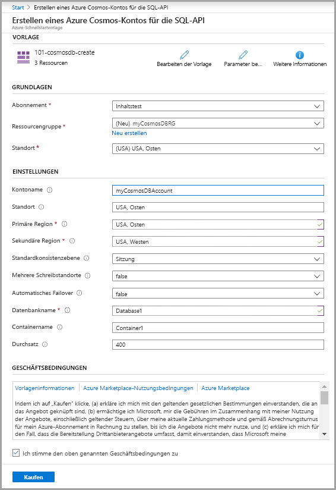
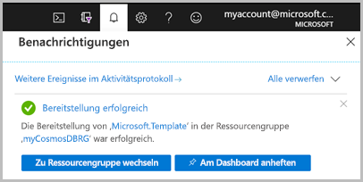

# <a name="quickstart-create-an-azure-cosmos-db-and-a-container-by-using-azure-resource-manager-template"></a>Schnellstart: Erstellen einer Azure Cosmos DB-Instanz und eines Containers mit einer Azure Resource Manager-Vorlage

Azure Cosmos DB ist der global verteilte Microsoft-Datenbankdienst mit mehreren Modellen. Mit Azure Cosmos DB können Sie schnell Schlüssel/Wert-, Dokument- und Graphdatenbanken erstellen und abfragen. In dieser Schnellstartanleitung wird in erster Linie die Bereitstellung einer Resource Manager-Vorlage zur Erstellung einer Azure Cosmos-Datenbank und eines Containers in dieser Datenbank behandelt. In diesem Container können später Daten gespeichert werden.

Die [Resource Manager-Vorlage](../azure-resource-manager/templates/overview.md) ist eine JSON-Datei (JavaScript Object Notation), in der die Infrastruktur und die Konfiguration für Ihr Projekt definiert sind. Für die Vorlage wird deklarative Syntax verwendet. Hiermit können Sie angeben, was Sie bereitstellen möchten, ohne dass Sie die Folge der Programmierbefehle für die Erstellung schreiben müssen. Weitere Informationen zur Entwicklung von Resource Manager-Vorlagen finden Sie in der [Resource Manager-Dokumentation](/azure/azure-resource-manager/) und der [Vorlagenreferenz](/azure/templates/microsoft.DocumentDB/allversions).

Wenn Sie kein Azure-Abonnement besitzen, können Sie ein [kostenloses Konto](https://azure.microsoft.com/free/?WT.mc_id=A261C142F) erstellen, bevor Sie beginnen.

## <a name="prerequisites"></a>Voraussetzungen

Azure-Abonnement oder kostenloses Azure Cosmos DB-Testkonto

- [!INCLUDE [quickstarts-free-trial-note](../../includes/quickstarts-free-trial-note.md)] 

- [!INCLUDE [cosmos-db-emulator-docdb-api](../../includes/cosmos-db-emulator-docdb-api.md)]  

## <a name="create-an-azure-cosmos-account-database-container"></a>Erstellen eines Azure Cosmos-Kontos, einer Datenbank und eines Containers

Die in dieser Schnellstartanleitung verwendete Vorlage stammt von der Seite mit den [Azure-Schnellstartvorlagen](https://azure.microsoft.com/resources/templates/101-cosmosdb-create/).

:::code language="json" source="~/quickstart-templates/101-cosmosdb-create/azuredeploy.json":::

In der Vorlage sind drei Azure-Ressourcen definiert:

* [Microsoft.DocumentDB/databaseAccounts](/azure/templates/microsoft.documentdb/databaseaccounts): Dient zum Erstellen eines Azure Cosmos-Kontos.

* [Microsoft.DocumentDB/databaseAccounts/sqlDatabases](/azure/templates/microsoft.documentdb/databaseaccounts/sqldatabases): Dient zum Erstellen einer Azure Cosmos-Datenbank.

* [Microsoft.DocumentDB/databaseAccounts/sqlDatabases/containers](/azure/templates/microsoft.documentdb/databaseaccounts/sqldatabases/containers): Dient zum Erstellen eines Azure Cosmos-Containers.

Weitere Azure Cosmos DB-Vorlagenbeispiele finden Sie im [Schnellstart-Vorlagenkatalog](https://azure.microsoft.com/resources/templates/?resourceType=Microsoft.Documentdb).

1. Klicken Sie auf das folgende Bild, um sich bei Azure anzumelden und eine Vorlage zu öffnen. Die Vorlage erstellt ein Azure Cosmos-Konto, eine Datenbank und einen Container.

   <a href="https://portal.azure.com/#create/Microsoft.Template/uri/https%3A%2F%2Fraw.githubusercontent.com%2FAzure%2Fazure-quickstart-templates%2Fmaster%2F101-cosmosdb-create%2Fazuredeploy.json"></a>

2. Wählen Sie die folgenden Werte aus, bzw. geben Sie sie ein.

   

    Sofern nicht anders angegeben, verwenden Sie die Standardwerte, um die Azure Cosmos-Ressourcen zu erstellen.

    * **Abonnement**: Wählen Sie ein Azure-Abonnement aus.
    * **Ressourcengruppe**: Wählen Sie die Option **Neu erstellen** aus, geben Sie einen eindeutigen Namen für die Ressourcengruppe ein, und klicken Sie dann auf **OK**.
    * **Standort**: Wählen Sie einen Standort aus.  Beispiel: **USA, Mitte**.
    * **Kontoname**: Geben Sie einen Namen für das Azure Cosmos-Konto ein. Der Wert muss global eindeutig sein. 
    * **Standort**: Geben Sie den Standort ein, an dem Sie Ihr Azure Cosmos-Konto erstellen möchten. Das Azure Cosmos-Konto kann sich am gleichen Standort befinden wie die Ressourcengruppe. 
    * **Primäre Region**: Die primäre Replikatregion für das Azure Cosmos-Konto.
    * **Sekundäre Region**: Die sekundäre Replikatregion für das Azure Cosmos-Konto.
    * **Datenbankname**: Der Name der Azure Cosmos-Datenbank.
    * **Containername**: Der Name des Azure Cosmos-Containers.
    * **Durchsatz**:  Der Durchsatz für den Container (Mindestwert: 400 RU/s). 
    * **Ich stimme den oben genannten Geschäftsbedingungen zu**: Aktivieren Sie dieses Kontrollkästchen.

3. Wählen Sie die Option **Kaufen**. Nach erfolgreicher Bereitstellung des Azure Cosmos-Kontos erhalten Sie eine Benachrichtigung:

   

Zum Bereitstellen der Vorlage wird das Azure-Portal verwendet. Neben dem Azure-Portal können Sie auch Azure PowerShell, die Azure-Befehlszeilenschnittstelle (Azure CLI) und die REST-API verwenden. Informationen zu anderen Bereitstellungsmethoden finden Sie unter [Bereitstellen von Vorlagen](../azure-resource-manager/templates/deploy-powershell.md).

## <a name="validate-the-deployment"></a>Überprüfen der Bereitstellung

Zur Überprüfung des Azure Cosmos-Kontos, der Datenbank und des Containers können Sie entweder das Azure-Portal verwenden oder mithilfe des im Anschluss bereitgestellten Skripts für die Azure-Befehlszeilenschnittstelle bzw. für Azure PowerShell das erstellte Geheimnis auflisten.

# <a name="cli"></a>[BEFEHLSZEILENSCHNITTSTELLE (CLI)](#tab/CLI)

```azurecli-interactive
echo "Enter your Azure Cosmos account name:" &&
read cosmosAccountName &&
echo "Enter the resource group where the Azure Cosmos account exists:" &&
read resourcegroupName &&
az cosmosdb show -g $resourcegroupName -n $cosmosAccountName
```

# <a name="powershell"></a>[PowerShell](#tab/PowerShell)

```azurepowershell-interactive
$resourceGroupName = Read-Host -Prompt "Enter the resource group name where your Azure Cosmos account exists"
(Get-AzResource -ResourceType "Microsoft.DocumentDB/databaseAccounts" -ResourceGroupName $resourceGroupName).Name 
 Write-Host "Press [ENTER] to continue..."
```

---

## <a name="clean-up-resources"></a>Bereinigen von Ressourcen

Falls Sie mit weiteren Schnellstartanleitungen und Tutorials fortfahren möchten, empfiehlt es sich ggf., die Ressourcen nicht zu bereinigen.
Wenn Sie die Ressourcen nicht mehr benötigen, löschen Sie die Ressourcengruppe. Dadurch werden das Azure Cosmos-Konto und die dazugehörigen Ressourcen gelöscht. Löschen Sie die Ressourcengruppe wie folgt mit der Azure CLI oder mit Azure Powershell:

# <a name="cli"></a>[BEFEHLSZEILENSCHNITTSTELLE (CLI)](#tab/CLI)

```azurecli-interactive
echo "Enter the Resource Group name:" &&
read resourceGroupName &&
az group delete --name $resourceGroupName &&
echo "Press [ENTER] to continue ..."
```

# <a name="powershell"></a>[PowerShell](#tab/PowerShell)

```azurepowershell-interactive
$resourceGroupName = Read-Host -Prompt "Enter the Resource Group name"
Remove-AzResourceGroup -Name $resourceGroupName
Write-Host "Press [ENTER] to continue..."
```

---

## <a name="next-steps"></a>Nächste Schritte

In dieser Schnellstartanleitung haben Sie mithilfe einer Azure Resource Manager-Vorlage ein Azure Cosmos-Konto, eine Datenbank und einen Container erstellt und die Bereitstellung überprüft. Weitere Informationen zu Azure Cosmos DB und Azure Resource Manager finden Sie in den folgenden Artikeln:

- [Willkommen bei Azure Cosmos DB](introduction.md)
- Lesen Sie weitere Informationen zu [Azure Resource Manager](../azure-resource-manager/management/overview.md).
- [Azure Resource Manager-Vorlagen für Azure Cosmos DB](resource-manager-samples.md)