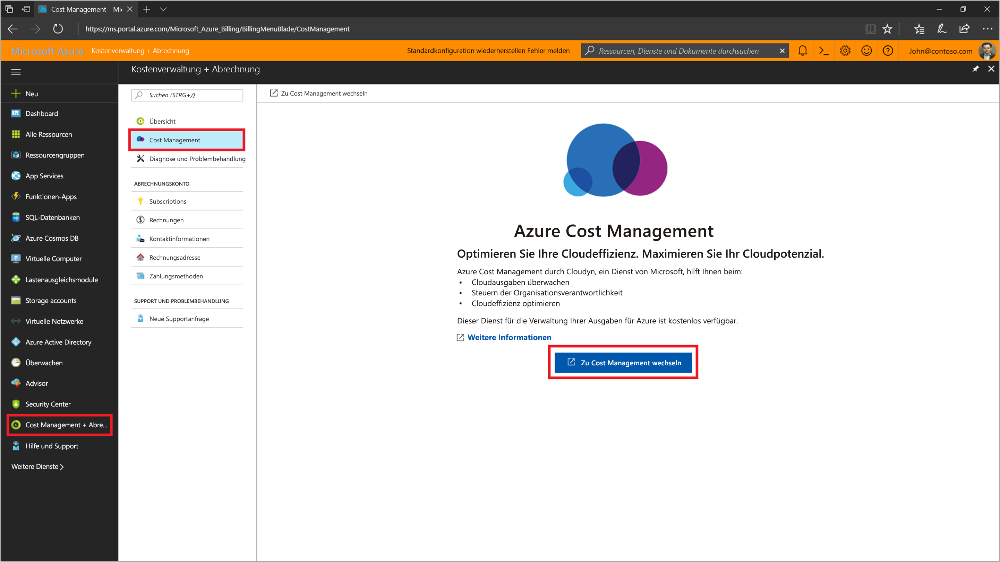
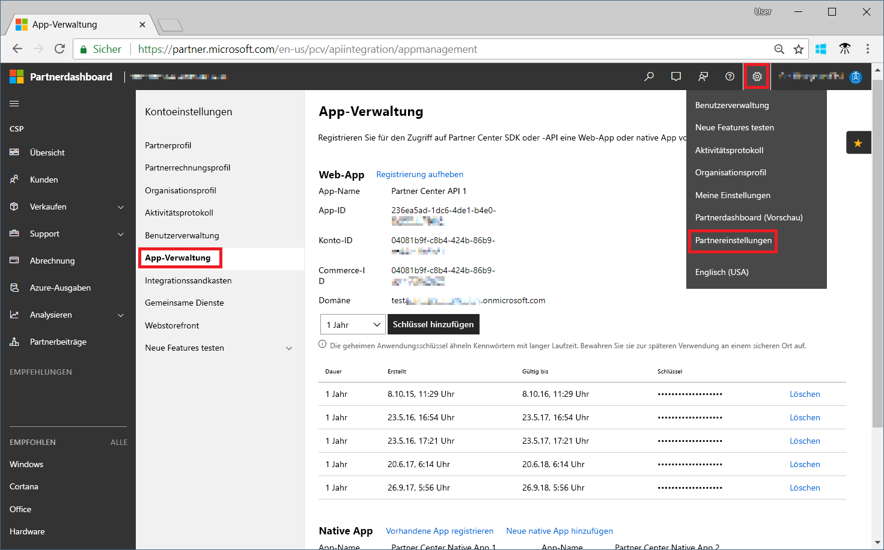
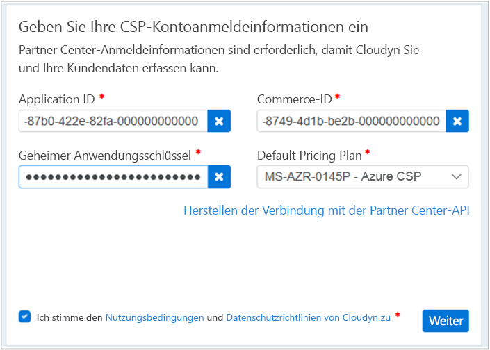

# Registrieren beim CSP-Partnerprogramm und Anzeigen von Kostendaten

Als CSP-Partner können Sie sich bei Cloudyn registrieren. Durch die Registrierung erhalten Sie Zugriff auf das Cloudyn-Portal. In diesem Schnellstart wird der Registrierungsvorgang ausführlich erläutert, der zum Erstellen eines Cloudyn-Testabonnements und zum Anmelden beim Cloudyn-Portal erforderlich ist. Es wird auch gezeigt, wie die Anzeige von Kostendaten sofort gestartet werden kann.

> [!NOTE]
>
> Die Cloudyn-Registrierung kann nur von direkten CSP-Partnern und indirekten CSP-Anbietern ausgeführt werden.
>
> Die Konfiguration der Partner Center-API ist für die Authentifizierung und den Datenzugriff erforderlich. Für die Bereitstellung des API-Zugriffs ist ein globales Partner Center-Administratorkonto erforderlich.
> Weitere Informationen finden Sie unter [Herstellen einer Verbindung mit der Partner Center-API](https://msdn.microsoft.com/library/partnercenter/mt709136.aspx).
>
> Indirekten CSP-Resellern kann der Zugriff auf Cloudyn erteilt werden, nachdem sich ihr indirekter CSP-Anbieter bei Cloudyn registriert hat. Indirekte CSP-Reseller können anschließend Azure-Kunden und -Abonnements den Cloudyn-Zugriff gewähren.
>
>Cloudyn ist mit dem sicheren Anwendungsmodell von Microsoft kompatibel. Weitere Informationen finden Sie unter [Aktivieren des Frameworks für das sichere Anwendungsmodell](/partner-center/develop/enable-secure-app-model).

## Anmelden bei Azure

- Melden Sie sich unter https://portal.azure.com beim Azure-Portal an.

## Registrieren bei Cloudyn

1. Klicken Sie im Azure-Portal in der Liste der Dienste auf **Kostenverwaltung und Abrechnung**.
2. Klicken Sie unter **Übersicht** auf **Cloudyn**.  
    
3. Klicken Sie auf der Seite **Cloudyn** auf **Zu Cloudyn wechseln**, um die Cloudyn-Registrierungsseite in einem neuen Fenster zu öffnen.
4. Geben Sie im Cloudyn-Portal auf der Registrierungsseite für die Testversion den Namen Ihres Unternehmens ein, wählen Sie **Microsoft CSP Partner Program Administrator** (Administrator des Microsoft CSP-Partnerprogramms) aus, und klicken Sie dann auf **Weiter**.  
5. Geben Sie eine **Anwendungs-ID**, **Commerce-ID** und den **geheimen Anwendungsschlüssel** ein, und wählen Sie den **Default Pricing Plan** (Standardpreisplan) aus. Wenn Ihnen diese Informationen nicht vorliegen, melden Sie sich beim Partner Center-Portal unter [https://partnercenter.microsoft.com](https://partnercenter.microsoft.com) mit Ihrem primären Administratorkonto an, und führen Sie folgende Schritte aus:
   1. Wechseln Sie zum **Dashboard**, und klicken Sie auf das Symbol **Einstellungen**, auf **Partner settings** (Partnereinstellungen) und dann auf **App-Verwaltung**.
   2. Wenn Sie zuvor eine Web-App erstellt haben, überspringen Sie diesen Schritt. Klicken Sie andernfalls auf **Add new web app** (Neue Web-App hinzufügen) im Abschnitt **Web-App**.
   3. Kopieren Sie die GUID Ihrer **App-ID** aus Ihrer Webanwendung.
   4. Kopieren Sie die GUID Ihrer **Commerce-ID** aus Ihrer Webanwendung.
   5. Legen Sie die Gültigkeitsdauer des Schlüssels bei Bedarf auf ein oder zwei Jahre fest. Klicken Sie auf **Schlüssel hinzufügen**, und kopieren und speichern Sie den geheimen Schlüsselwert anschließend.  
    
   6. Navigieren Sie zurück zur Cloudyn-Registrierungsseite, und fügen Sie die Informationen ein.  
      
6. Stimmen Sie den Nutzungsbedingungen zu, und überprüfen Sie dann Ihre Informationen. Klicken Sie auf **Weiter**, um Cloudyn für das Erfassen von Azure-Ressourcendaten zu autorisieren. Die erfassten Daten beziehen sich auf Nutzungs-, Leistungs- und Abrechnungs- sowie Tagdaten aus Ihren Abonnements.  
7. Unter **Invite other stakeholders** (Andere Beteiligte einladen) können Sie Benutzer hinzufügen, indem Sie ihre E-Mail-Adressen eingeben. Klicken Sie auf **Weiter**, wenn Sie fertig sind. Es dauert ungefähr zwei Stunden, bis alle Ihre Abrechnungsdaten Cloudyn hinzugefügt wurden.
8. Klicken Sie auf **Zu Cloudyn wechseln**, um das Cloudyn-Portal zu öffnen. Auf der Seite **Cloudkontenverwaltung** sollten Ihre registrierten CSP-Kontoinformationen angezeigt werden.

## Konfigurieren des indirekten CSP-Zugriffs in Cloudyn

Standardmäßig ist der Zugriff auf Partner Center-APIs nur für direkte CSPs möglich. Allerdings können direkte CSP-Anbieter den Zugriff für ihre indirekten CSP-Kunden oder -Partner über Entitätsgruppen in Cloudyn konfigurieren.

Zum Aktivieren des Zugriffs für indirekte CSP-Kunden oder -Partner führen Sie die Schritte unter [Registrieren bei Cloudyn](#register-with-cloudyn) aus, um eine Testregistrierung einzurichten. Führen Sie als Nächstes die folgenden Schritte aus, um indirekte CSP-Daten mithilfe von Cloudyn-Entitätsgruppen zu segmentieren. Weisen Sie anschließend die entsprechenden Benutzerberechtigungen den Entitätsgruppen zu.

1. Erstellen Sie eine Entitätsgruppe mit den Informationen unter [Erstellen von Entitäten](tutorial-user-access.md#create-and-manage-entities).
2. Führen Sie die Schritte unter [Assigning subscriptions to Cost Entities](https://www.youtube.com/watch?v=d9uTWSdoQYo) (Zuweisen von Abonnements zu Kostenentitäten) aus. Verknüpfen Sie die Konten der indirekten CSP-Kunden und ihre Azure-Abonnements mit der Entität, die Sie zuvor erstellt haben.
3. Führen Sie die Schritte unter [Erstellen eines Benutzers mit Administratorzugriff](tutorial-user-access.md#create-a-user-with-admin-access) aus, um ein Benutzerkonto mit Administratorzugriff zu erstellen. Stellen Sie außerdem sicher, dass das Benutzerkonto über Administratorzugriff auf die bestimmten Entitäten verfügt, die Sie zuvor für das indirekte Konto erstellt haben.

Indirekte CSP-Partner melden sich beim Cloudyn-Portal unter Verwendung der Konten an, die Sie für sie erstellt haben.

[!INCLUDE [cost-management-create-account-view-data](../../../includes/cost-management-create-account-view-data.md)]

## Nächste Schritte

In diesem Schnellstart haben Sie Ihre CSP-Informationen verwendet, um sich bei Cloudyn zu registrieren. Außerdem haben Sie sich beim Cloudyn-Portal angemeldet und die Anzeige von Kostendaten gestartet. Weitere Informationen zu Cloudyn finden Sie im Tutorial für Cloudyn.

> [!div class="nextstepaction"]
> [Überprüfen der Nutzung und der Kosten](tutorial-review-usage.md)
