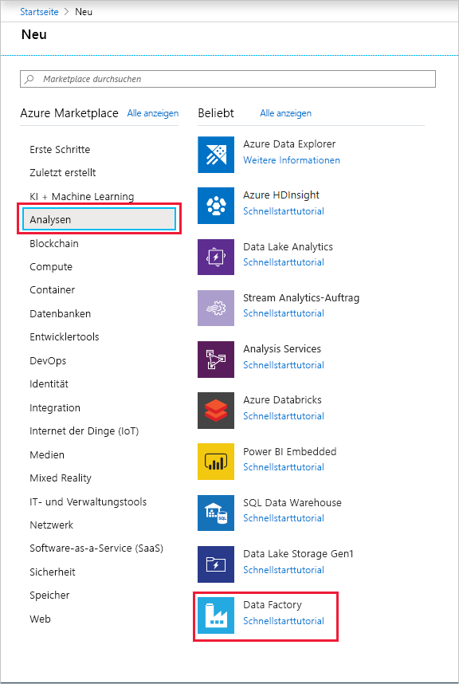
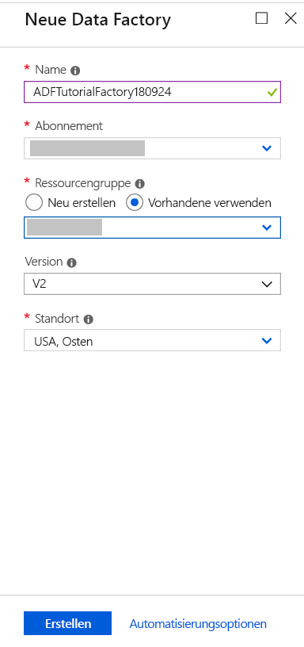
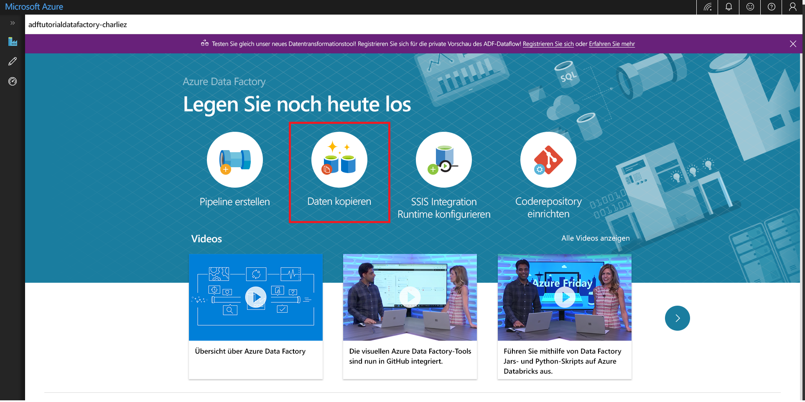
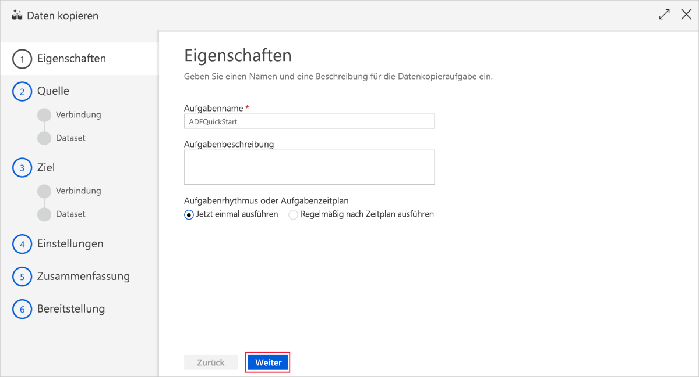
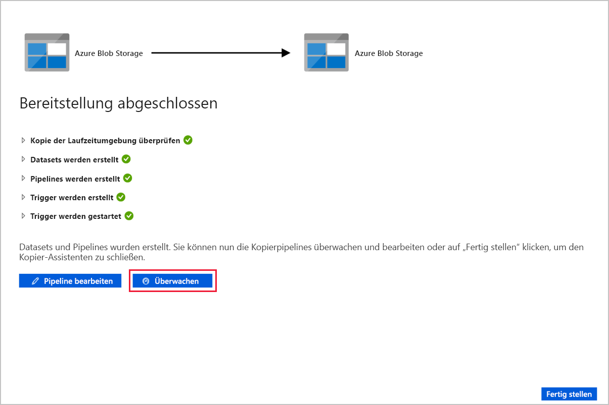

# Kopieren von Daten mithilfe des Tools zum Kopieren von Daten 
> [!div class="op_single_selector" title1="Select the version of Data Factory service that you are using:"]
> * [Version 1: allgemein verfügbar](v1/data-factory-copy-data-from-azure-blob-storage-to-sql-database.md)
> * [Version 2 – Vorschauversion](quickstart-create-data-factory-copy-data-tool.md)

In dieser Schnellstartanleitung verwenden Sie das Azure-Portal, um eine Data Factory zu erstellen. Anschließend erstellen Sie mithilfe des Tools zum Kopieren von Daten eine Pipeline, die Daten aus einem Ordner in Azure Blob Storage in einen anderen Ordner kopiert. 

> [!NOTE]
> Wenn Sie mit Azure Data Factory nicht vertraut sind, lesen Sie vor der Durchführung dieses Schnellstarts die Informationen unter [Einführung in Azure Data Factory](data-factory-introduction.md). 
>
> Dieser Artikel bezieht sich auf Version 2 von Data Factory, die zurzeit als Vorschau verfügbar ist. Wenn Sie die allgemein verfügbare Version 1 des Diensts verwenden, hilft Ihnen das Tutorial [Kopieren von Daten aus Blob Storage in SQL-Datenbank mithilfe von Data Factory](v1/data-factory-copy-data-from-azure-blob-storage-to-sql-database.md) weiter.

[!INCLUDE [data-factory-quickstart-prerequisites](../../includes/data-factory-quickstart-prerequisites.md)] 

## Erstellen einer Data Factory

1. Klicken Sie im linken Menü auf **Neu** und anschließend auf **Daten + Analysen** und **Data Factory**. 
   
   
2. Geben Sie auf der Seite **Neue Data Factory** unter **Name** den Namen **ADFTutorialDataFactory** ein. 
      
   
 
   Der Name der Azure Data Factory muss *global eindeutig*sein. Sollte der folgende Fehler auftreten, ändern Sie den Namen der Data Factory (beispielsweise in **&lt;IhrName&gt;ADFTutorialDataFactory**), und wiederholen Sie den Vorgang. Benennungsregeln für Data Factory-Artefakte finden Sie im Artikel [Azure Data Factory – Benennungsregeln](naming-rules.md).
  
   
3. Wählen Sie unter **Abonnement** Ihr Azure-Abonnement aus, in dem die Data Factory erstellt werden soll. 
4. Führen Sie unter **Ressourcengruppe** einen der folgenden Schritte aus:
     
   - Wählen Sie die Option **Use existing** (Vorhandene verwenden) und dann in der Dropdownliste eine vorhandene Ressourcengruppe. 
   - Wählen Sie **Neu erstellen**, und geben Sie den Namen einer Ressourcengruppe ein.   
         
   Weitere Informationen über Ressourcengruppen finden Sie unter [Verwenden von Ressourcengruppen zum Verwalten von Azure-Ressourcen](../azure-resource-manager/resource-group-overview.md).  
4. Wählen Sie **V2 (Vorschau)** als **Version** aus.
5. Wählen Sie unter **Standort** den Standort für die Data Factory aus. 

   In der Liste werden nur unterstützte Standorte angezeigt. Die von Data Factory verwendeten Datenspeicher (etwa Azure Storage und Azure SQL-Datenbank) und Computedienste (etwa Azure HDInsight) können sich an anderen Standorten bzw. in anderen Regionen befinden.

6. Wählen Sie die Option **An Dashboard anheften** aus.     
7. Klicken Sie auf **Erstellen**.
8. Auf dem Dashboard sehen Sie die folgende Kachel mit dem Status **Deploying Data Factory** (Data Factory wird bereitgestellt...): 

    
9. Nach Abschluss der Erstellung wird die Seite **Data Factory** angezeigt. Klicken Sie auf die Kachel **Erstellen und überwachen**, um die Anwendung für die Azure Data Factory-Benutzeroberfläche (User Interface, UI) auf einer separaten Registerkarte zu starten.
   
   

## Starten des Tools zum Kopieren von Daten

1. Klicken Sie auf der Seite **Erste Schritte** auf die Kachel **Daten kopieren**, um das Tool zum Kopieren von Daten zu starten. 

   
2. Klicken Sie auf der Seite **Eigenschaften** des Tools zum Kopieren von Daten auf **Weiter**. Auf dieser Seite können Sie einen Namen für die Pipeline und ihre Beschreibung angeben. 

   
3. Wählen Sie auf der Seite **Quelldatenspeicher** die Option **Azure Blob Storage** aus, und klicken Sie auf **Weiter**.

   
4. Wählen Sie auf der Seite **Azure Blob Storage-Konto angeben** in der Dropdownliste **Speicherkontoname** Ihr Speicherkonto aus, und klicken Sie auf **Weiter**. 

   
5. Führen Sie auf der Seite **Choose the input file or folder** (Eingabedatei oder -ordner auswählen) die folgenden Schritte aus:

   a. Wechseln Sie zum Ordner **adftutorial/input**.

   b. Wählen Sie die Datei **emp.txt** aus.

   c. Klicken Sie auf **Auswählen**. Doppelklicken Sie auf **emp.txt**, um diesen Schritt zu überspringen.

   d. Klicken Sie auf **Weiter**. 

   
6. Auf der Seite **Dateiformateinstellungen** können Sie sehen, dass das Tool die Spalten- und Zeilentrennzeichen automatisch erkennt. Klicken Sie auf **Weiter**. Auf dieser Seite können Sie außerdem eine Vorschau der Daten und Schemas der Eingabedaten anzeigen. 

   
7. Wählen Sie auf der Seite **Zieldatenspeicher** die Option **Azure Blob Storage** aus, und klicken Sie dann auf **Weiter**. 

       
8. Wählen Sie auf der Seite **Azure Blob Storage-Konto angeben** Ihr Azure Blob Storage-Konto aus, und klicken Sie dann auf **Weiter**. 

   
9. Führen Sie auf der Seite **Choose the output file or folder** (Ausgabedatei oder -ordner auswählen) die folgenden Schritte aus: 

   a. Geben Sie als Ordnerpfad **adftutorial/output** ein.

   b. Geben Sie als Dateiname den Namen **emp.txt** ein.

   c. Klicken Sie auf **Weiter**. 

    
10. Klicken Sie auf der Seite **Dateiformateinstellungen** auf **Weiter**. 

    
11. Klicken Sie auf der Seite **Einstellungen** auf **Weiter**. 

    
12. Überprüfen Sie auf der Seite **Zusammenfassung** alle Einstellungen, und klicken Sie auf **Weiter**. 

    
13. Klicken Sie auf der Seite **Deployment complete** (Bereitstellung abgeschlossen) auf **Überwachen**, um die erstellte Pipeline zu überwachen. 

    
14. Die Anwendung wechselt zur Registerkarte **Überwachen**. Der Status der Pipeline wird auf dieser Registerkarte angezeigt. Klicken Sie zum Aktualisieren der Liste auf **Aktualisieren**. 
    
    
15. Klicken Sie in der Spalte **Aktionen** auf den Link **View Activity Runs** (Aktivitätsausführungen anzeigen). Die Pipeline verfügt nur über eine Aktivität vom Typ **Copy**. 

    
16. Wenn Sie Details zum Kopiervorgang anzeigen möchten, klicken Sie in der Spalte **Aktionen** auf den Link **Details** (Brillensymbol). Einzelheiten zu den Eigenschaften finden Sie unter [Kopieraktivität in Azure Data Factory](copy-activity-overview.md). 

    
17. Vergewissern Sie sich, dass im Ordner **output** des Containers **adftutorial** die Datei **emp.txt** erstellt wird. Ist der Ausgabeordner nicht vorhanden, wird er vom Data Factory-Dienst automatisch erstellt. 
18. Wechseln Sie zur Registerkarte **Bearbeiten**, um verknüpfte Dienste, Datasets und Pipelines zu bearbeiten. Informationen zum Bearbeiten dieser Elemente über die Data Factory-Benutzeroberfläche finden Sie unter [Erstellen einer Data Factory über die Azure Data Factory-Benutzeroberfläche](quickstart-create-data-factory-portal.md).

    

## Nächste Schritte
Die Pipeline in diesem Beispiel kopiert Daten in Azure Blob Storage von einem Speicherort in einen anderen. Arbeiten Sie die [Tutorials](tutorial-copy-data-portal.md) durch, um zu erfahren, wie Sie Data Factory in anderen Szenarien verwenden können. 