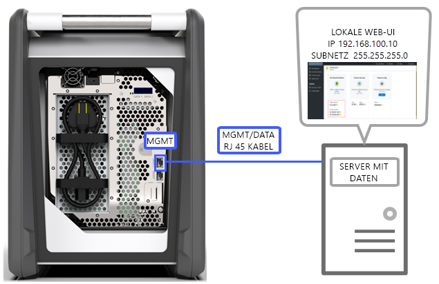
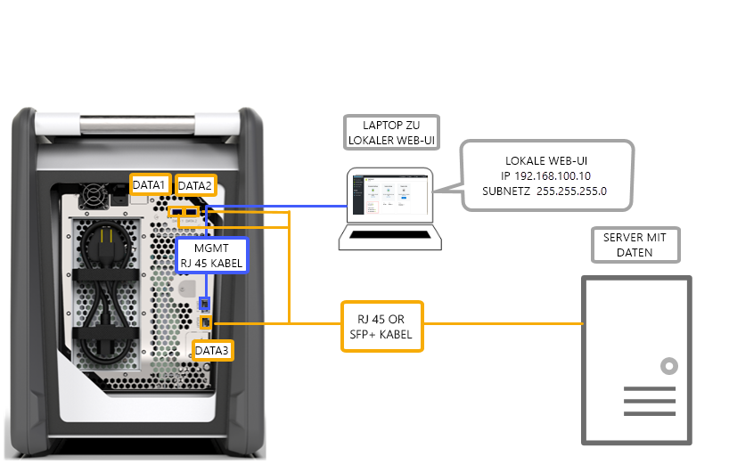
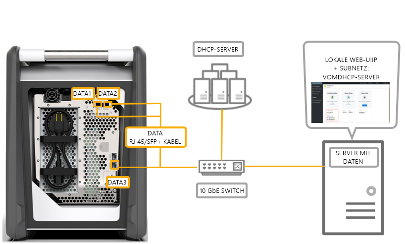

# Verkabelungsoptionen für Azure Data Box

In diesem Artikel werden verschiedene Möglichkeiten beschrieben, um Azure Data Box für die Datenübertragung zu verkabeln.

## Übertragung über den MGMT-Anschluss

Diese Option ist die absolute Mindestkonfiguration für Data Box. Sie haben die Möglichkeit, nur den MGMT-Anschluss für die Verwaltung und für Daten zu konfigurieren.

Vergewissern Sie sich zunächst, dass Sie über Folgendes verfügen:

- Ein RJ45-Ethernetkabel für den MGMT-Anschluss
- Eine Datenquelle mit einem [unterstützten Betriebssystem](data-box-system-requirements.md#supported-operating-systems-for-clients)

Gehen Sie zur Verkabelung Ihres Geräts wie folgt vor:

1. Verbinden Sie den MGMT-Anschluss über ein RJ45-Kabel mit dem Server, auf dem sich die Daten befinden.

    

2. Legen Sie auf dem Server Folgendes fest:

    - **IP-Adresse** auf 192.168.100.5
    - **Subnetz** auf 255.255.255.0

3. Greifen Sie über die folgende IP-Adresse auf die lokale Webbenutzeroberfläche des Geräts zu: 192.168.100.10. Melden Sie sich an, und entsperren Sie Data Box mithilfe des Entsperrkennworts aus dem Azure-Portal.

## Übertragung über den DATA-Anschluss mit statischen IP-Adressen

Sie haben die Möglichkeit, zwei Anschlüsse für Data Box zu konfigurieren: den MGMT-Anschluss für Verwaltungsdatenverkehr und einen der DATA-Anschlüsse für Daten. Als Datenanschlüsse stehen DATA 1, DATA 2 und DATA 3 zur Verfügung.

Falls Sie nur einen einzelnen Datenanschluss konfigurieren, empfehlen wir dringend, einen 10-GbE-Anschluss (etwa DATA 1 oder DATA 2) zu verwenden. Bei Verwendung eines 1-GbE-Anschlusses dauert die Datenübertragung erheblich länger.

Vergewissern Sie sich zunächst, dass Sie über Folgendes verfügen:

- Ein RJ45-Ethernetkabel für den MGMT-Anschluss
- Ein 10-GbE-SFP+ Twinax-Kupferkabel für jeden 10-GbE-Datenanschluss, den Sie verwenden möchten
- Mindestens eine Datenquelle mit einem [unterstützten Betriebssystem](data-box-system-requirements.md#supported-operating-systems-for-clients)

### Option 1: Erstmalige Einrichtung per Server

Gehen Sie zur Verkabelung Ihres Geräts wie folgt vor:

1. Verbinden Sie den Server für die Konfiguration direkt über ein RJ45-Ethernetkabel mit dem MGMT-Anschluss.
2. Verwenden Sie ein RJ45-Kabel für DATA 3 oder ein SFP+-Kabel, um DATA 1 oder DATA 2 mit dem Server zu verbinden, der als Datenquelle fungiert. Aus Leistungsgründen empfiehlt sich die Verwendung eines der 10-GbE-Anschlüsse (DATA 1 oder DATA 2).
3. Legen Sie auf dem Server Folgendes fest:

   - **IP-Adresse** auf 192.168.100.5
   - **Subnetz** auf 255.255.255.0

     

3. Greifen Sie über die folgende IP-Adresse auf die lokale Webbenutzeroberfläche des Geräts zu: 192.168.100.10. Melden Sie sich an, und entsperren Sie Data Box mithilfe des Entsperrkennworts aus dem Azure-Portal.
4. Weisen Sie den konfigurierten Datenanschlüssen statische IP-Adressen zu.

### Option 2: Erstmalige Einrichtung über einen separaten Computer

Gehen Sie zur Verkabelung Ihres Geräts wie folgt vor:

1. Verbinden Sie den Server für die Konfiguration direkt über ein RJ45-Ethernetkabel mit dem MGMT-Anschluss.
2. Verwenden Sie ein RJ45-Kabel für DATA 3 oder ein SFP+-Kabel, um DATA 1 oder DATA 2 mit dem Server zu verbinden. Aus Leistungsgründen empfiehlt sich die Verwendung eines der 10-GbE-Anschlüsse (DATA 1 oder DATA 2). Die Datenanschlüsse werden über einen 10-GbE-Switch mit dem Datenserver verbunden.
3. Konfigurieren Sie den Ethernet-Adapter des Laptops, über den Sie eine Verbindung mit dem Gerät herstellen, wie folgt:

   - **IP-Adresse:** 192.168.100.5
   - **Subnetz:** 255.255.255.0

     

3. Greifen Sie über die folgende IP-Adresse auf die lokale Webbenutzeroberfläche des Geräts zu: 192.168.100.10. Melden Sie sich an, und entsperren Sie Data Box mithilfe des Entsperrkennworts aus dem Azure-Portal.
4. Ermitteln Sie die durch den DHCP-Server zugewiesenen IP-Adressen.

## Übertragung über den DATA-Anschluss mit statischen IP-Adressen und einem Switch 

Verwenden Sie diese Konfiguration für mehrere Datenquellen in 1-GbE- und 10-GbE-Netzwerken.

Vergewissern Sie sich zunächst, dass Sie über Folgendes verfügen:

- Ein RJ45-Ethernetkabel für den MGMT-Anschluss
- Ein 10-GbE-SFP+ Twinax-Kupferkabel für jeden 10-GbE-Datenanschluss, den Sie verwenden möchten
- Mindestens eine Datenquelle mit einem [unterstützten Betriebssystem](data-box-system-requirements.md#supported-operating-systems-for-clients) Diese Datenquellen können sich in verschiedenen Netzwerken (etwa in 1-GbE- und 10-GbE-Netzwerken) befinden.

Gehen Sie zur Verkabelung Ihres Geräts wie folgt vor:

1. Verbinden Sie den Server für die Konfiguration direkt über ein RJ45-Ethernetkabel mit dem MGMT-Anschluss.
2. Verwenden Sie ein RJ45-Kabel für DATA 3 oder ein SFP+-Kabel, um DATA 1 oder DATA 2 mit dem Server zu verbinden. Aus Leistungsgründen empfiehlt sich die Verwendung eines der 10-GbE-Anschlüsse (DATA 1 oder DATA 2).
3. Konfigurieren Sie den Ethernet-Adapter des Laptops, über den Sie eine Verbindung mit dem Gerät herstellen, wie folgt:

   - **IP-Adresse:** 192.168.100.5
   - **Subnetz:** 255.255.255.0

     

3. Greifen Sie über die folgende IP-Adresse auf die lokale Webbenutzeroberfläche des Geräts zu: 192.168.100.10. Melden Sie sich an, und entsperren Sie Data Box mithilfe des Entsperrkennworts aus dem Azure-Portal.
4. Weisen Sie den konfigurierten Datenanschlüssen statische IP-Adressen zu.

## Übertragung über den DATA-Anschluss in einer DHCP-Umgebung

Verwenden Sie diese Konfiguration, wenn Ihr Gerät für eine DHCP-Umgebung vorgesehen ist.

Vergewissern Sie sich zunächst, dass Sie über Folgendes verfügen:

- Ein RJ45-Kabel, sofern Sie DATA 1 verwenden möchten
- Ein 10-GbE-SFP+ Twinax-Kupferkabel für jeden 10-GbE-Datenanschluss, den Sie verwenden möchten
- Mindestens eine Datenquelle mit einem [unterstützten Betriebssystem](data-box-system-requirements.md#supported-operating-systems-for-clients) Diese Datenquellen können sich in verschiedenen Netzwerken (etwa in 1-GbE- und 10-GbE-Netzwerken) befinden.

Gehen Sie zur Verkabelung Ihres Geräts wie folgt vor:

1. Verwenden Sie ein RJ45- oder SFP+-Kabel, und verbinden Sie es über einen Switch (mit Zugang zum DHCP-Server) mit dem Server.

    
2. Verwenden Sie den DHCP- oder DNS-Server, um die IP-Adresse zu ermitteln.
3. Greifen Sie über einen Server im gleichen Netzwerk unter Verwendung der durch den DHCP-Server zugewiesenen IP-Adresse auf die lokale Webbenutzeroberfläche des Geräts zu. Melden Sie sich an, und entsperren Sie Data Box mithilfe des Entsperrkennworts aus dem Azure-Portal.

## Nächste Schritte

- Nachdem Sie das Gerät verkabelt haben, können Sie mit dem [Kopieren von Daten auf die Azure Data Box](data-box-deploy-copy-data.md) fortfahren.
