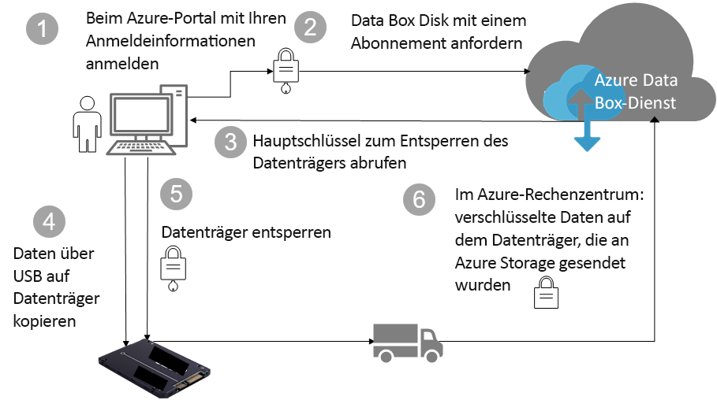

# Azure Data Box Disk: Sicherheit und Schutz von Daten

In diesem Artikel werden die Sicherheitsfunktionen von Azure Data Box-Datenträgern beschrieben, mit denen die einzelnen Komponenten der Data Box-Lösung und die darauf gespeicherten Daten geschützt werden. 

## Datenfluss über Komponenten

Die Microsoft Azure Data Box-Lösung besteht aus vier Hauptkomponenten, die miteinander interagieren:

- **In Azure gehosteter Azure Data Box-Dienst**: Der Verwaltungsdienst, den Sie zum Erstellen des Datenträgerauftrags, Konfigurieren der Datenträger und anschließenden Nachverfolgen des Auftrags bis zum Abschluss verwenden.
- **Data Box-Datenträger**: Die physischen Datenträger, die an Sie gesendet werden, um Ihre lokalen Daten in Azure zu importieren. 
- **Mit den Datenträgern verbundene Clients/Hosts** – Die Clients in Ihrer Infrastruktur, die per USB mit dem Data Box-Datenträger verbunden werden und zu schützende Daten enthalten.
- **Cloud-Speicher** – Der Speicherort in der Azure-Cloud, an dem die Daten gespeichert werden. Dies ist normalerweise das Speicherkonto, das mit der von Ihnen erstellten Azure Data Box-Ressource verknüpft ist.

Im folgenden Diagramm ist der Datenfluss durch die Azure Data Box-Datenträgerlösung vom lokalen Standort zu Azure angegeben.

## Sicherheitsfeatures

Data Box-Datenträger sind eine sichere Lösung für den Schutz der Daten, indem dafür gesorgt wird, dass nur autorisierte Entitäten Ihre Daten anzeigen, ändern oder löschen können. Die Sicherheitsfunktionen für diese Lösung gelten für den Datenträger und den zugeordneten Dienst, um sicherzustellen, dass die darauf gespeicherten Daten geschützt sind. 

### Schutz des Data Box-Datenträgers

Data Box-Datenträger werden mithilfe der folgenden Features geschützt:

- Ununterbrochene BitLocker AES-128-Bit-Verschlüsselung für Datenträger.
- Sichere Updatefunktion für die Datenträger.
- Datenträger werden in einem gesperrten Zustand gesendet und können nur mit einem Tool zum Entsperren von Data Box-Datenträgern entsperrt werden. Das Tool zum Entsperren ist über das Portal für den Data Box-Datenträgerdienst verfügbar.

### Schutz der Daten von Data Box-Datenträgern

Die Daten, die für Data Box-Datenträger übertragen werden (ein- und ausgehend), werden mithilfe der folgenden Features geschützt:

- Ununterbrochene BitLocker-Verschlüsselung der Daten. 
- Sicheres Löschen der Daten vom Datenträger, nachdem der Datenupload in Azure abgeschlossen ist. Das Löschen der Daten wird gemäß NIST-Standards (800-88r1) durchgeführt.

### Schutz des Data Box-Diensts

Der Data Box-Dienst wird mithilfe der folgenden Features geschützt.

- Für den Zugriff auf den Data Box-Datenträgerdienst muss Ihre Organisation über ein Azure-Abonnement verfügen, das den Dienst für Data Box-Datenträger umfasst. Ihr Abonnement bestimmt die Features, auf die Sie im Azure-Portal zugreifen können.
- Da der Data Box-Dienst in Azure gehostet wird, ist er durch die Azure-Sicherheitsfeatures geschützt. Weitere Informationen zu den Sicherheitsfeatures von Microsoft Azure finden Sie im [Microsoft Azure Trust Center](https://www.microsoft.com/TrustCenter/Security/default.aspx). 
- Für Data Box-Datenträger wird ein Datenträger-Hauptschlüssel gespeichert, der zum Entsperren von Datenträgern des Diensts verwendet wird. 
- Beim Data Box-Datenträgerdienst werden die Auftragsdetails und der Status im Dienst gespeichert. Diese Informationen werden später dann zusammen mit dem Auftrag gelöscht. 

## Verwalten von personenbezogenen Daten

[!INCLUDE [GDPR-related guidance](../../includes/gdpr-intro-sentence.md)]

Für den Azure Data Box-Datenträger werden persönliche Informationen im Dienst in den folgenden Hauptinstanzen angezeigt:

- **Benachrichtigungseinstellungen**: Beim Erstellen eines Auftrags konfigurieren Sie die E-Mail-Adresse von Benutzern unter den Benachrichtigungseinstellungen. Diese Informationen können vom Administrator angezeigt werden. Diese Informationen werden vom Dienst gelöscht, wenn der Auftrag abgeschlossen wurde oder wenn er von Ihnen gelöscht wird.

- **Auftragsdetails**: Nach der Erstellung des Auftrags werden die Versandadresse, die E-Mail-Adresse und die Kontaktinformationen von Benutzern im Azure-Portal gespeichert. Zu den gespeicherten Informationen gehört Folgendes:

  - Kontaktname
  - Telefonnummer
  - Email
  - Anschrift
  - City
  - Postleitzahl
  - State
  - Land/Provinz/Region
  - Laufwerk-ID
  - Kontonummer des Versanddienstleisters
  - Nachverfolgungsnummer für den Versand

    Die Auftragsdetails werden vom Data Box-Dienst gelöscht, wenn der Auftrag abgeschlossen ist oder wenn er von Ihnen gelöscht wird.

- **Lieferanschrift**: Nach dem Aufgeben der Bestellung gibt der Data Box-Dienst die Lieferanschrift an Drittanbieter-Kurierdienste, z.B. UPS oder DHL, weiter. 

Weitere Informationen finden Sie im [Trust Center](https://www.microsoft.com/trustcenter) in der Microsoft-Datenschutzrichtlinie.

## Nächste Schritte

- Informieren Sie sich über die [Anforderungen für Data Box-Datenträger](data-box-disk-system-requirements.md).
- Machen Sie sich mit den [Einschränkungen für Data Box-Datenträger](data-box-disk-limits.md) vertraut.
- Informieren Sie sich über die schnelle Bereitstellung von [Azure Data Box-Datenträgern](data-box-disk-quickstart-portal.md) im Azure-Portal.
