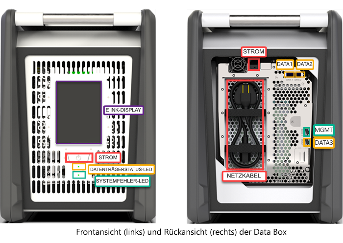
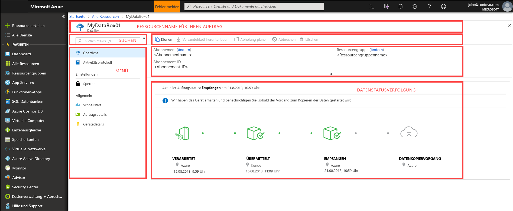
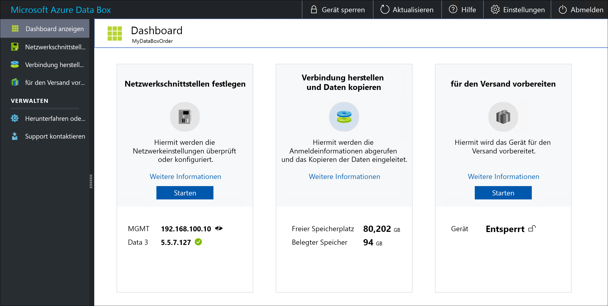

# Was ist Azure Data Box?

Mit der Cloudlösung Microsoft Azure Data Box können Sie Daten in Terabyte-Größe schnell, kostengünstig und zuverlässig in Azure übertragen. Die sichere Datenübertragung wird beschleunigt, indem Sie ein spezielles Data Box-Speichergerät erhalten. Jedes Speichergerät verfügt über eine maximal nutzbare Speicherkapazität von 80 TB und wird von einem regionalen Zustelldienst zu Ihrem Rechenzentrum transportiert. Das Gerät verfügt über ein widerstandsfähiges Gehäuse zum Schützen und Absichern von Daten während des Transports.

Sie können das Data Box-Gerät im Azure-Portal bestellen. Nach Empfang des Geräts können Sie es auf der lokalen Webbenutzeroberfläche schnell einrichten. Kopieren Sie die Daten von Ihren Servern auf das Gerät, und senden Sie es zurück an Azure. Im Azure-Rechenzentrum werden Ihre Daten dann automatisch vom Gerät in Azure hochgeladen. Der gesamte Prozess wird im Azure-Portal vom Data Box-Dienst von Anfang bis Ende nachverfolgt.

## Anwendungsfälle

Data Box eignet sich ideal für die Übertragung von Datenmengen von mehr als 40 TB in Szenarien ohne oder mit eingeschränkter Netzwerkkonnektivität. Die Datenverschiebung kann eine einmalige, eine periodische oder eine erste Massenübertragung von Daten sein, auf die regelmäßige Übertragungen folgen. Es folgen die verschiedenen Szenarien, in denen Data Box für die Datenübertragung verwendet werden kann.

 - **Einmalige Migration**: Wird verwendet, wenn eine große Menge von lokalen Daten in Azure verschoben wird. 
     - Verschieben einer Medienbibliothek von Offlinebändern in Azure, um eine Onlinemedienbibliothek zu erstellen
     - Migrieren Ihrer VM-Farm, SQL-Server und Anwendungen in Azure
     - Verschieben von Verlaufsdaten in Azure für eine detaillierte Analyse und Berichterstellung mithilfe von HDInsight

 - **Erste Massenübertragung**: Die Ausführung einer ersten Massenübertragung mithilfe von Data Box (Seeding) gefolgt von inkrementellen Übertragungen über das Netzwerk. 
     - Beispielsweise werden Partner im Bereich Sicherungslösungen wie Commvault und Data Box herangezogen, um die erste große Sicherung von Verlaufsdaten in Azure zu verschieben. Im Anschluss werden die inkrementellen Daten über das Netzwerk in Azure Storage übertragen.

- **Periodische Uploads**: Werden verwendet, wenn regelmäßig große Datenmengen generiert werden und in Azure verschoben werden müssen. Ein Beispiel hierfür ist die Exploration in der Energiebranche, bei der Videodaten auf Bohrinseln und für Windfarmen generiert werden.      

## Vorteile

Data Box ist so ausgelegt, dass große Datenmengen ohne bzw. geringfügigen negativen Auswirkungen auf das Netzwerk in Azure verschoben werden können. Diese Lösung hat die folgenden Vorteile:

- **Geschwindigkeit**: Data Box nutzt eine Netzwerkschnittstelle mit 1 oder 10 GBit/s, um bis zu 80 TB in Azure zu verschieben.

- **Sicherheit**: Data Box bietet einen integrierten Sicherheitsschutz für Geräte, Daten und den Dienst.
    - Das Gerät verfügt über ein widerstandsfähiges Gehäuse, das durch manipulationssichere Schrauben und Etiketten gesichert ist. 
    - Die Daten auf dem Gerät sind jederzeit durch AES-256-Bit-Verschlüsselung geschützt.
    - Das Gerät kann nur mit einem Kennwort entsperrt werden, das über das Azure-Portal bereitgestellt wird.
    - Der Dienst ist durch Azure-Sicherheitsfunktionen geschützt.
    - Nachdem Ihre Daten in Azure hochgeladen wurden, werden die Datenträger auf dem Gerät gemäß NIST-Standards (800-88r1) vollständig bereinigt.
    
    Weitere Informationen finden Sie unter [Azure Data Box – Sicherheit und Schutz von Daten](data-box-security.md).

## Funktionen und Spezifikationen

Das Data Box-Gerät weist in dieser Version folgende Merkmale auf.

| Spezifikationen                                          | BESCHREIBUNG              |
|---------------------------------------------------------|--------------------------|
| Weight                                                  | Weniger als 23 kg                |
| Dimensionen                                              | Gerät – Breite: 309,0 mm, Höhe: 430,4 mm, Tiefe: 502,0 mm |            
| Platzbedarf im Rack                                              | 7 HE bei seitlicher Platzierung im Rack (kann nicht im Rack montiert werden)|
| Erforderliche Kabel                                         | 1 Netzkabel (inbegriffen)   2 RJ45-Kabel   2 SFP+-Twinax-Kupferkabel|
| Speicherkapazität                                        | Das Gerät mit 100 TB hat nach der Aktivierung von RAID-5-Schutz 80 TB nutzbare Kapazität.|
| Netzwerkschnittstellen                                      | 2 1-GbE-Schnittstellen: MGMT, DATA 3.   MGMT: Zur Verwaltung, nicht vom Benutzer konfigurierbar, dient zur erstmaligen Einrichtung   DATA3: Für Daten, vom Benutzer konfigurierbar und standardmäßig dynamisch   MGMT und DATA 3 sind auch in der 10-GbE-Ausführung möglich   2 10-GbE-Schnittstellen: DATA 1, DATA 2   Beide für Daten vorgesehen, als dynamisch (Standard) oder statisch konfigurierbar |
| Datenübertragungsmedien                                     | RJ45, SFP+-Kupferkabel (10 GbE)  |
| Sicherheit                                                | Widerstandsfähiges Gerätegehäuse mit manipulationssicheren Spezialschrauben   Manipulationsgeschütztes Etikett auf der Unterseite des Geräts|
| Datenübertragungsrate                                      | Bis zu 80 TB am Tag über 10-GbE-Netzwerkschnittstelle        |
| Verwaltung                                              | Lokale Webbenutzeroberfläche für einmalige anfängliche Einrichtung und Konfiguration   Azure-Portal für die sonstige Geräteverwaltung        |

## Data Box-Komponenten

Data Box umfasst die folgenden Komponenten:

* **Data Box-Gerät**: Ein physisches Gerät, das folgende Aufgaben hat: Primäres Speichermedium, Verwaltung der Kommunikation mit dem Cloudspeicher und Gewährleistung der Sicherheit und Vertraulichkeit aller Daten, die auf dem Gerät gespeichert sind. Das Data Box-Gerät bietet eine nutzbare Speicherkapazität von 80 TB. 

    

    
* **Data Box-Dienst:** Eine Erweiterung des Azure-Portals, mit der Sie ein Data Box-Gerät auf einer zentralen Webbenutzeroberfläche verwalten können, auf die an verschiedenen geografischen Standorten zugegriffen werden kann. Sie verwenden den Data Box-Dienst für die tägliche Verwaltung Ihres Data Box-Geräts. Zu den Aufgaben des Diensts gehören das Erstellen und Verwalten von Aufträgen, das Anzeigen und Verwalten von Warnmeldungen und das Verwalten von Freigaben.  

    

    Weitere Informationen finden Sie unter [Verwalten Ihres Data Box-Geräts mithilfe des Data Box-Diensts](data-box-portal-ui-admin.md).

* **Lokale Webbenutzeroberfläche:** Eine webbasierte Benutzeroberfläche zum Konfigurieren des Geräts für das Herstellen der Verbindung mit dem lokalen Netzwerk und anschließende Registrieren des Geräts beim Data Box-Dienst. Auf der lokalen Webbenutzeroberfläche können Sie auch das Data Box-Gerät herunterfahren und neu starten, Kopierprotokolle anzeigen und den Microsoft-Support kontaktieren, um eine Serviceanfrage zu stellen.

    

    Informationen zur Verwendung der webbasierten Benutzeroberfläche finden Sie unter [Verwenden der webbasierten Benutzeroberfläche zum Verwalten Ihrer Data Box](data-box-portal-ui-admin.md).

## Workflow

Der Workflow umfasst üblicherweise die folgenden Schritte:

1. **Auftrag**: Erstellen Sie im Azure-Portal einen Auftrag, und geben Sie die Versandinformationen und das Azure-Zielspeicherkonto für Ihre Daten an. Wenn das Gerät verfügbar ist, wird es von Azure vorbereitet und mit einer Sendungsverfolgungs-ID versendet.

2. **Empfang**: Nach Erhalt des Geräts verbinden Sie es mit den vorgesehenen Kabeln mit dem Netzwerk und der Stromversorgung. Schalten Sie das Gerät ein, und verbinden Sie sich damit. Konfigurieren Sie die Netzwerk- und Bereitstellungsfreigaben auf dem Hostcomputer, von dem aus Sie die Daten kopieren möchten.

3. **Kopieren von Daten**: Kopieren Sie Daten auf die Data Box-Freigaben.

4. **Rücksendung**: Bereiten Sie das Gerät vor, schalten Sie es aus, und senden Sie es an das Azure-Rechenzentrum zurück.

5. **Hochladen**: Daten werden automatisch vom Gerät in Azure kopiert. Die Datenträger des Geräts werden gemäß NIST-Richtlinien (National Institute of Standards and Technology) auf sichere Weise gelöscht.

Bei diesem Prozess werden Sie per E-Mail über alle Statusänderungen informiert. Weitere Informationen zum detaillierten Ablauf finden Sie unter [Bereitstellen von Data Box im Azure-Portal](data-box-deploy-ordered.md).

## Regionale Verfügbarkeit

Data Box kann Daten basierend auf der Region, in der der Dienst bereitgestellt wird, dem Land, in das das Gerät versendet wird, und dem Azure Storage-Zielkonto übertragen, in das Sie die Daten übertragen. 

- **Verfügbarkeit des Diensts**: Bei dieser Version ist der Data Box-Dienst in den folgenden Regionen verfügbar:
    - Alle Regionen in den USA: USA, Westen-Mitte; USA, Westen 2; USA, Westen; USA, Süden-Mitte; USA, Mitte; USA, Norden-Mitte; USA, Osten 2.
    - Europa: Europa, Westen und Europa, Norden.
    - Vereinigtes Königreich: Vereinigtes Königreich, Süden und Vereinigtes Königreich, Westen.
    - Frankreich: Frankreich, Mitte und Frankreich, Süden.

- **Zielspeicherkonten**: Die Speicherkonten, in denen die Daten gespeichert werden, sind in allen Azure-Regionen verfügbar, in denen der Dienst verfügbar ist.  

## Nächste Schritte

- Sehen Sie sich die [Data Box-Systemanforderungen](data-box-system-requirements.md) an.
- Machen Sie sich mit den [Data Box-Einschränkungen](data-box-limits.md) vertraut.
- Erfahren Sie mehr zur schnellen Bereitstellung von [Azure Data Box](data-box-quickstart-portal.md) im Azure-Portal.

