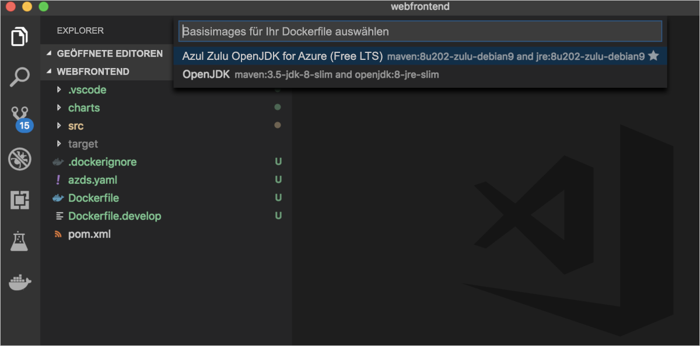
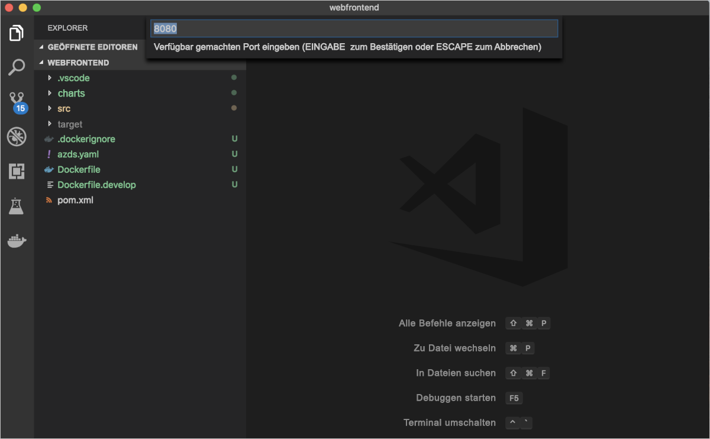

# <a name="quickstart-debug-and-iterate-on-kubernetes-with-visual-studio-code-and-java---azure-dev-spaces"></a>Schnellstart: Debuggen und iteratives Entwickeln unter Kubernetes mit Visual Studio Code und Java: Azure Dev Spaces

In dieser Schnellstartanleitung richten Sie Azure Dev Spaces mit einem Managed Kubernetes-Cluster ein und verwenden eine Java-App in Visual Studio Code, um Code in Containern iterativ zu entwickeln und zu debuggen. Azure Dev Spaces ermöglicht es Ihnen, alle Komponenten Ihrer Anwendung mit minimalem Einrichtungsaufwand für Entwicklungscomputer in Azure Kubernetes Service (AKS) zu debuggen und zu testen. 

## <a name="prerequisites"></a>Voraussetzungen

- Ein Azure-Konto mit einem aktiven Abonnement. Sie können [kostenlos ein Konto erstellen](https://azure.microsoft.com/free/?ref=microsoft.com&utm_source=microsoft.com&utm_medium=docs&utm_campaign=visualstudio). 
- [Java Development Kit (JDK) 1.8.0 oder höher](https://aka.ms/azure-jdks)
- [Maven 3.5.0 oder höher](https://maven.apache.org/download.cgi)
- [Visual Studio Code](https://code.visualstudio.com/download)
- Die Erweiterungen [Azure Dev Spaces](https://marketplace.visualstudio.com/items?itemName=azuredevspaces.azds) und [Java-Debugger für Azure Dev Spaces](https://marketplace.visualstudio.com/items?itemName=vscjava.vscode-java-debugger-azds) für Visual Studio Code
- [Azure-Befehlszeilenschnittstelle](/cli/azure/install-azure-cli?view=azure-cli-latest).
- [Git](https://www.git-scm.com/downloads).

## <a name="create-an-azure-kubernetes-service-cluster"></a>Erstellen eines Azure Kubernetes Service-Clusters

Sie müssen einen AKS-Cluster in einer [unterstützten Region][supported-regions] erstellen. Mit den folgenden Befehlen werden eine Ressourcengruppe mit dem Namen *MyResourceGroup* und der AKS-Cluster *MyAKS* erstellt:

```azurecli
az group create --name MyResourceGroup --location eastus
az aks create -g MyResourceGroup -n MyAKS --location eastus --generate-ssh-keys
```

## <a name="enable-azure-dev-spaces-on-your-aks-cluster"></a>Aktivieren von Azure Dev Spaces in Ihrem AKS-Cluster

Verwenden Sie den Befehl `use-dev-spaces`, um Dev Spaces in Ihrem AKS-Cluster zu aktivieren, und befolgen Sie die angezeigten Anweisungen. Mit dem folgenden Befehl wird Dev Spaces im Cluster *MyAKS* in der Gruppe *MyResourceGroup* aktiviert und der Entwicklerbereich *default* erstellt.

> [!NOTE]
> Mit dem Befehl `use-dev-spaces` wird außerdem die Azure Dev Spaces-Befehlszeilenschnittstelle installiert, falls diese nicht bereits installiert ist. Die Azure Dev Spaces-Befehlszeilenschnittstelle kann nicht in Azure Cloud Shell installiert werden.

```azurecli
az aks use-dev-spaces -g MyResourceGroup -n MyAKS
```

```output
'An Azure Dev Spaces Controller' will be created that targets resource 'MyAKS' in resource group 'MyResourceGroup'. Continue? (y/N): y

Creating and selecting Azure Dev Spaces Controller 'MyAKS' in resource group 'MyResourceGroup' that targets resource 'MyAKS' in resource group 'MyResourceGroup'...2m 24s

Select a dev space or Kubernetes namespace to use as a dev space.
 [1] default
Type a number or a new name: 1

Kubernetes namespace 'default' will be configured as a dev space. This will enable Azure Dev Spaces instrumentation for new workloads in the namespace. Continue? (Y/n): Y

Configuring and selecting dev space 'default'...3s

Managed Kubernetes cluster 'MyAKS' in resource group 'MyResourceGroup' is ready for development in dev space 'default'. Type `azds prep` to prepare a source directory for use with Azure Dev Spaces and `azds up` to run.
```

## <a name="get-sample-application-code"></a>Abrufen des Codes für die Beispielanwendung

In diesem Artikel verwenden Sie die [Azure Dev Spaces-Beispielanwendung](https://github.com/Azure/dev-spaces), um die Nutzung von Azure Dev Spaces zu veranschaulichen.

Klonen Sie die Anwendung von GitHub.

```cmd
git clone https://github.com/Azure/dev-spaces
```

## <a name="prepare-the-sample-application-in-visual-studio-code"></a>Vorbereiten der Beispielanwendung in Visual Studio Code

Öffnen Sie Visual Studio Code, wählen Sie **Datei** und dann **Öffnen** aus, navigieren Sie zum Verzeichnis *dev-spaces/samples/java/getting-started/webfrontend*, und wählen Sie **Öffnen** aus.

Das Projekt *webfrontend* ist nun in Visual Studio Code geöffnet. Um die Anwendung in Ihrem Entwicklungsbereich auszuführen, generieren Sie in der Befehlspalette mithilfe der Azure Dev Spaces-Erweiterung die Docker- und die Helm-Chart-Ressourcen.

Wählen Sie zum Öffnen der Befehlspalette in Visual Studio Code **Ansicht** und dann **Befehlspalette** aus. Beginnen Sie mit der Eingabe von `Azure Dev Spaces`, und wählen Sie **Azure Dev Spaces: Vorbereiten von Konfigurationsdateien für Azure Dev Spaces** aus.


Wenn Sie von Visual Studio Code auch zum Konfigurieren Ihres Basisimages, Ihres verfügbar gemachten Ports und Ihres öffentlichen Endpunkts aufgefordert werden, wählen Sie `Azul Zulu OpenJDK for Azure (Free LTS)` als Basisimage, `8080` als verfügbar gemachten Port und `Yes` zum Aktivieren eines öffentlichen Endpunkts aus.






Dieser Befehl generiert ein Dockerfile und ein Helm-Chart, um Ihr Projekt für die Ausführung in Azure Dev Spaces vorzubereiten. Außerdem wird das Verzeichnis *.vscode* mit der grundlegenden Debugkonfiguration Ihres Projekts generiert.

> [!TIP]
> Azure Dev Spaces nutzt das [Dockerfile und das Helm-Chart](how-dev-spaces-works.md#prepare-your-code) Ihres Projekts zum Erstellen und Ausführen Ihres Codes. Sie können diese Dateien aber ändern, wenn Sie anpassen möchten, wie das Projekt erstellt und ausgeführt wird.

## <a name="build-and-run-code-in-kubernetes-from-visual-studio-code"></a>Erstellen und Ausführen von Code in Kubernetes über Visual Studio Code

Wählen Sie links das Symbol **Debuggen** und dann oben **Launch Java Program (AZDS)** (Java-Programm starten (AZDS)) aus.


Mit diesem Befehl wird Ihr Dienst in Azure Dev Spaces erstellt und ausgeführt. Im Fenster **Terminal** am unteren Rand werden die Buildausgabe und die URLs zur Ausführung von Azure Dev Spaces für Ihren Dienst angezeigt. In der **Debugging-Konsole** wird die Protokollausgabe angezeigt.

> [!Note]
> Falls in der **Befehlspalette** keine Azure Dev Spaces-Befehle angezeigt werden, sollten Sie überprüfen, ob die [Visual Studio Code-Erweiterung für Azure Dev Spaces](https://marketplace.visualstudio.com/items?itemName=azuredevspaces.azds) installiert wurde. Vergewissern Sie sich auch, dass Sie das Verzeichnis *dev-spaces/samples/java/getting-started/webfrontend* in Visual Studio Code geöffnet haben.

Wenn Sie die öffentliche URL öffnen, sehen Sie, dass der Dienst ausgeführt wird.

Wählen Sie **Debuggen** und dann **Debuggen beenden** aus, um den Debugger zu beenden.

## <a name="update-code"></a>Aktualisieren des Codes

Zum Bereitstellen einer aktualisierten Version Ihres Diensts können Sie Dateien in Ihrem Projekt aktualisieren und **Launch Java Program (AZDS)** (Java-Programm starten (AZDS)) erneut ausführen. Beispiel:

1. Falls Ihre Anwendung noch ausgeführt wird, wählen Sie **Debuggen** und anschließend **Debuggen beenden** aus, um sie zu beenden.
1. Aktualisieren Sie [Zeile 19 unter `src/main/java/com/ms/sample/webfrontend/Application.java`](https://github.com/Azure/dev-spaces/blob/master/samples/java/getting-started/webfrontend/src/main/java/com/ms/sample/webfrontend/Application.java#L19) in:
    
    ```java
    return "Hello from webfrontend in Azure!";
    ```

1. Speichern Sie die Änderungen.
1. Führen Sie **Launch Java Program (AZDS)** (Java-Programm starten (AZDS)) erneut aus.
1. Navigieren Sie zu Ihrem ausgeführten Dienst, und sehen Sie sich Ihre Änderungen an.
1. Wählen Sie **Debuggen** und anschließend **Debuggen beenden** aus, um Ihre Anwendung zu beenden.

## <a name="setting-and-using-breakpoints-for-debugging"></a>Festlegen und Verwenden von Haltepunkten für das Debuggen

Starten Sie Ihren Dienst mit **Launch Java Program (AZDS)** (Java-Programm starten (AZDS)). Dadurch wird Ihr Dienst auch im Debugmodus ausgeführt.

Navigieren Sie zurück zur Ansicht **Explorer**, indem Sie **Ansicht** und dann **Explorer** auswählen. Öffnen Sie *src/main/java/com/ms/sample/webfrontend/Application.java*, und klicken Sie auf die Zeile 19, um den Cursor darin zu platzieren. Drücken Sie zum Festlegen eines Breakpoints **F9**, oder wählen Sie **Debuggen** und dann **Haltepunkt ein/aus** aus.

Öffnen Sie Ihren Dienst in einem Browser. Sie sehen, dass keine Meldung angezeigt wird. Wechseln Sie zurück zu Visual Studio Code. Sie sehen, dass Zeile 19 hervorgehoben ist. Durch den von Ihnen festgelegten Haltepunkt wurde der Dienst in Zeile 19 angehalten. Drücken Sie zum Fortsetzen des Diensts **F5**, oder wählen Sie **Debuggen** und dann **Weiter** aus. Wechseln Sie zurück zum Browser. Sie sehen, dass die Meldung jetzt angezeigt wird.

Beim Ausführen Ihres Diensts in Kubernetes mit einem angefügten Debugger haben Sie Vollzugriff auf Debuginformationen, z. B. Aufrufliste, lokale Variablen und Ausnahmeninformationen.

Entfernen Sie den Breakpoint, indem Sie in *src/main/java/com/ms/sample/webfrontend/Application.java* den Cursor in der Zeile 19 platzieren und **F9** drücken.

## <a name="update-code-from-visual-studio-code"></a>Aktualisieren von Code aus Visual Studio Code

Aktualisieren Sie die Zeile 19 in *src/main/java/com/ms/sample/webfrontend/Application.java*, während der Dienst im Debugmodus ausgeführt wird. Beispiel:
```java
return "Hello from webfrontend in Azure while debugging!";
```

Speichern Sie die Datei . Wählen Sie **Debuggen** und dann **Debugging erneut starten** aus, oder klicken Sie in der **Debug-Symbolleiste** auf die Schaltfläche **Debugging erneut starten**.


Öffnen Sie Ihren Dienst in einem Browser. Sie sehen, dass Ihre aktualisierte Meldung angezeigt wird.

Anstatt bei jeder vorgenommenen Codeänderung erneut ein neues Containerimage zu erstellen und bereitzustellen, wird Code von Azure Dev Spaces im vorhandenen Container inkrementell kompiliert, um den Bearbeitungs-/Debugkreislauf zu beschleunigen.

## <a name="clean-up-your-azure-resources"></a>Bereinigen Ihrer Azure-Ressourcen

```azurecli
az group delete --name MyResourceGroup --yes --no-wait
```

## <a name="next-steps"></a>Nächste Schritte

Informieren Sie sich darüber, wie Azure Dev Spaces Sie bei der Entwicklung komplexerer containerübergreifender Anwendungen unterstützt und wie Sie die gemeinsame Entwicklung vereinfachen können, indem Sie in verschiedenen Bereichen mit verschiedenen Versionen oder Branches Ihres Codes arbeiten.

> [!div class="nextstepaction"]
> [Arbeiten mit mehreren Containern und Teamentwicklung](multi-service-java.md)


[supported-regions]: https://azure.microsoft.com/global-infrastructure/services/?products=kubernetes-service
