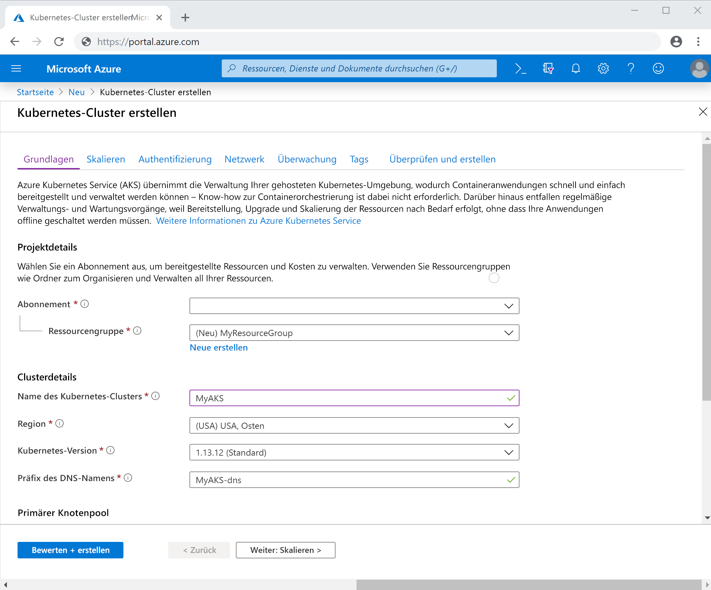
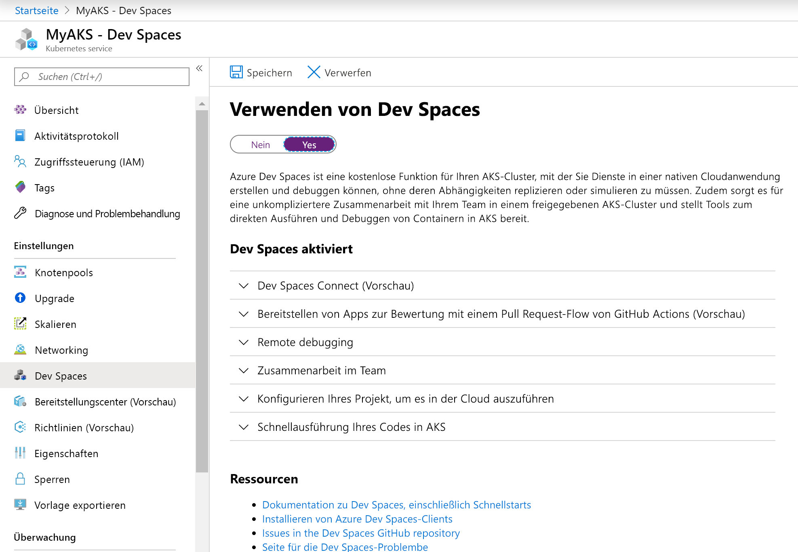

# <a name="quickstart-debug-and-iterate-with-visual-studio-and-net-core-on-kubernetes-with-azure-dev-spaces"></a>Schnellstart: Debuggen und Iterieren mit Visual Studio und .NET Core in Kubernetes mit Azure Dev Spaces

In diesem Leitfaden lernen Sie Folgendes:

- Einrichten von Azure Dev Spaces mit einem verwalteten Kubernetes-Cluster in Azure
- Iteratives Entwickeln von Code in Containern mit Visual Studio
- Debuggen von Code in Ihrem Cluster mit Visual Studio

## <a name="prerequisites"></a>Voraussetzungen

- Ein Azure-Abonnement. Falls Sie über keins verfügen, können Sie ein [kostenloses Konto](https://azure.microsoft.com/free) erstellen.
- Visual Studio 2019 unter Windows mit installierter Workload für die Azure-Entwicklung. Außerdem wird die Verwendung von Visual Studio 2017 mit der Workload für die Webentwicklung und installierten [Visual Studio-Tools für Kubernetes](https://aka.ms/get-vsk8stools) unterstützt. Wenn Sie Visual Studio nicht installiert haben, können Sie es [hier](https://aka.ms/vsdownload?utm_source=mscom&utm_campaign=msdocs) herunterladen.

## <a name="create-an-azure-kubernetes-service-cluster"></a>Erstellen eines Azure Kubernetes Service-Clusters

Sie müssen in einer [unterstützten Region][supported-regions] einen AKS-Cluster erstellen. Erstellen Sie wie folgt einen Cluster:

1. Melden Sie sich beim [Azure-Portal](https://portal.azure.com)
1. Wählen Sie *+ Ressource erstellen > Kubernetes-Dienst*. 
1. Geben Sie Folgendes ein: _Abonnement_, _Ressourcengruppe_, _Name des Kubernetes-Clusters_, _Region_, _Kubernetes-Version_ und _DNS-Namenspräfix_.

    

1. Klicken Sie auf *Überprüfen + erstellen*.
1. Klicken Sie auf *Create*.

## <a name="enable-azure-dev-spaces-on-your-aks-cluster"></a>Aktivieren von Azure Dev Spaces in Ihrem AKS-Cluster

Navigieren Sie im Azure-Portal zu Ihrem AKS-Cluster, und klicken Sie auf *Dev Spaces*. Ändern Sie *Azure Dev Spaces aktivieren* in *Ja*, und klicken Sie auf *Speichern*.



## <a name="create-a-new-aspnet-web-app"></a>Erstellen einer neuen ASP.NET-Web-App

1. Öffnen Sie Visual Studio.
1. Erstellen eines neuen Projekts
1. Wählen Sie *ASP.NET Core-Webanwendung*, und geben Sie Ihrem Projekt den Namen*webfrontend*.
1. Klicken Sie auf *OK*.
1. Wählen Sie bei entsprechender Aufforderung die Option *Webanwendung (Model-View-Controller)* für die Vorlage.
1. Wählen Sie oben die Optionen *.NET Core* und *ASP.NET Core 2.0*.
1. Klicken Sie auf *OK*.

## <a name="connect-your-project-to-your-dev-space"></a>Verbinden Ihres Projekts mit Ihrem Entwicklerbereich

Wählen Sie in Ihrem Projekt wie nachfolgend gezeigt im Dropdownmenü mit den Starteinstellungen die Option **Azure Dev Spaces**.


Wählen Sie im Azure Dev Spaces-Dialogfeld Ihr *Abonnement* und Ihren *Azure Kubernetes-Cluster* aus. Behalten Sie für *Space* (Bereich) die Einstellung *default* bei, und aktivieren Sie das Kontrollkästchen *Öffentlich zugänglich*. Klicken Sie auf *OK*.


Mit diesem Prozess wird Ihr Dienst im Entwicklerbereich *default* mit einer öffentlich zugänglichen URL bereitgestellt. Wenn Sie einen Cluster auswählen, der nicht für die Verwendung mit Azure Dev Spaces konfiguriert wurde, wird eine Meldung mit der Frage angezeigt, ob Sie ihn konfigurieren möchten. Klicken Sie auf *OK*.


Die öffentliche URL für den Dienst, die im Entwicklerbereich *default* ausgeführt wird, wird im Fenster *Ausgabe* angezeigt:

```cmd
Starting warmup for project 'webfrontend'.
Waiting for namespace to be provisioned.
Using dev space 'default' with target 'MyAKS'
...
Successfully built 1234567890ab
Successfully tagged webfrontend:devspaces-11122233344455566
Built container image in 39s
Waiting for container...
36s

Service 'webfrontend' port 'http' is available at http://webfrontend.1234567890abcdef1234.eus.azds.io/
Service 'webfrontend' port 80 (http) is available at http://localhost:62266
Completed warmup for project 'webfrontend' in 125 seconds.
```

Im obigen Beispiel lautet die öffentliche URL http://webfrontend.1234567890abcdef1234.eus.azds.io/. Navigieren Sie zur öffentlichen URL Ihres Diensts, und interagieren Sie mit dem Dienst, der in Ihrem Entwicklerbereich ausgeführt wird.

Dieser Prozess kann den öffentlichen Zugriff auf Ihren Dienst deaktiviert haben. Um den öffentlichen Zugriff zu aktivieren, können Sie den [eingehenden Wert in der Datei *values.yaml*][ingress-update] aktualisieren.

## <a name="update-code"></a>Aktualisieren des Codes

Klicken Sie auf die Schaltfläche „Beenden“, wenn Visual Studio noch mit Ihrem Entwicklerbereich verbunden ist. Ändern Sie Zeile 20 in `Controllers/HomeController.cs` in:
    
```csharp
ViewData["Message"] = "Your application description page in Azure.";
```

Speichern Sie Ihre Änderungen, und starten Sie Ihren Dienst, indem Sie in der Dropdownliste mit den Starteinstellungen die Option **Azure Dev Spaces** auswählen. Öffnen Sie die öffentliche URL Ihres Diensts in einem Browser, und klicken Sie auf *Info*. Sie sehen, dass Ihre aktualisierte Meldung angezeigt wird.

Anstatt bei jeder vorgenommenen Codeänderung erneut ein neues Containerimage zu erstellen und bereitzustellen, wird Code von Azure Dev Spaces im vorhandenen Container inkrementell kompiliert, um den Bearbeitungs-/Debugkreislauf zu beschleunigen.

## <a name="setting-and-using-breakpoints-for-debugging"></a>Festlegen und Verwenden von Haltepunkten für das Debuggen

Klicken Sie auf die Schaltfläche „Beenden“, wenn Visual Studio noch mit Ihrem Entwicklerbereich verbunden ist. Öffnen Sie `Controllers/HomeController.cs`, und klicken Sie in Zeile 20, um den Cursor darin zu platzieren. Drücken Sie zum Festlegen eines Haltepunkts *F9*, oder klicken Sie auf *Debuggen* und dann auf *Haltepunkt umschalten*. Drücken Sie zum Starten des Diensts im Debugmodus in Ihrem Entwicklerbereich *F5*, oder klicken Sie auf *Debuggen* und dann auf *Debuggen starten*.

Öffnen Sie Ihren Dienst in einem Browser. Sie sehen, dass keine Meldung angezeigt wird. Wechseln Sie zurück zu Visual Studio. Sie sehen, dass Zeile 20 hervorgehoben ist. Durch den von Ihnen festgelegten Haltepunkt wurde der Dienst in Zeile 20 angehalten. Drücken Sie zum Fortsetzen des Diensts *F5*, oder klicken Sie auf *Debuggen* und dann auf *Weiter*. Wechseln Sie zurück zum Browser. Sie sehen, dass die Meldung jetzt angezeigt wird.

Beim Ausführen Ihres Diensts in Kubernetes mit einem angefügten Debugger haben Sie Vollzugriff auf Debuginformationen, z. B. Aufrufliste, lokale Variablen und Ausnahmeninformationen.

Entfernen Sie den Haltepunkt, indem Sie Ihren Cursor in `Controllers/HomeController.cs` in Zeile 20 platzieren und *F9* drücken.

## <a name="clean-up-your-azure-resources"></a>Bereinigen Ihrer Azure-Ressourcen

Navigieren Sie im Azure-Portal zu Ihrer Ressourcengruppe, und klicken Sie auf *Ressourcengruppe löschen*. Alternativ hierzu können Sie auch den Befehl [az aks delete](/cli/azure/aks#az-aks-delete) verwenden:

```cmd
az group delete --name MyResourceGroup --yes --no-wait
```

## <a name="next-steps"></a>Nächste Schritte

> [!div class="nextstepaction"]
> [Arbeiten mit mehreren Containern und Teamentwicklung](multi-service-netcore-visualstudio.md)

[ingress-update]: how-dev-spaces-works.md#how-running-your-code-is-configured
[supported-regions]: about.md#supported-regions-and-configurations
