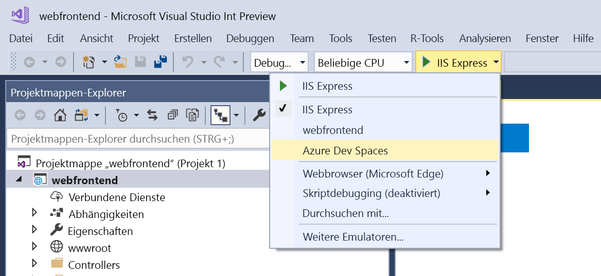
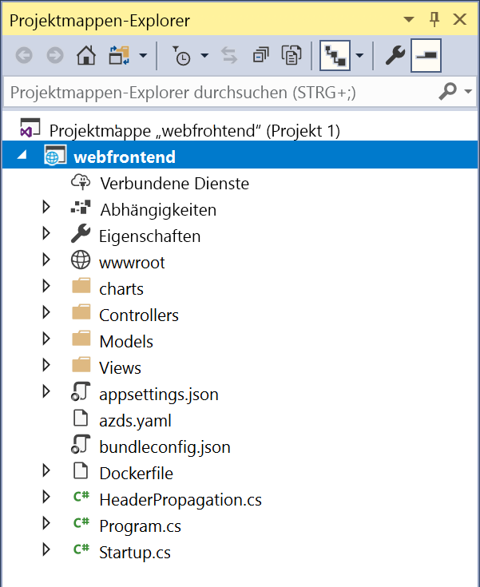

# Schnellstart: Erstellen eines Kubernetes-Entwicklungsbereichs mit Azure Dev Spaces (.NET Core und Visual Studio)

In diesem Leitfaden lernen Sie Folgendes:

- Einrichten von Azure Dev Spaces mit einem verwalteten Kubernetes-Cluster in Azure
- Iteratives Entwickeln von Code in Containern mit Visual Studio
- Debuggen von Code, der in Ihrem Cluster ausgeführt wird

> [!Note]
> **Sollten Sie einmal nicht weiterkommen**, lesen Sie den Abschnitt [Problembehandlung](troubleshooting.md), oder hinterlassen Sie einen Kommentar auf dieser Seite. Ein ausführlicheres Tutorial finden Sie [hier](get-started-netcore-visualstudio.md).

## Voraussetzungen

- Ein Kubernetes-Cluster mit Kubernetes 1.9.6 oder höher in der Region „USA, Osten“, „USA, Mitte“, „USA, Westen 2“, „Europa, Westen“, „Kanada, Mitte“ oder „Kanada, Osten“ mit aktiviertem HTTP-Anwendungsrouting.

  

- Visual Studio 2017 mit installierter Workload für Webentwicklung. Ist diese Version nicht installiert, können Sie sie [hier](https://aka.ms/vsdownload?utm_source=mscom&utm_campaign=msdocs) herunterladen.

## Einrichten von Azure Dev Spaces

Installieren von [Visual Studio-Tools für Kubernetes](https://aka.ms/get-vsk8stools)

## Herstellen der Verbindung zu einem Cluster

Als Nächstes erstellen und konfigurieren Sie ein Projekt für Azure Dev Spaces.

### Erstellen einer ASP.NET-Web-App

Erstellen Sie in Visual Studio 2017 ein neues Projekt. Derzeit muss das Projekt eine **ASP.NET Core-Webanwendung** sein. Nennen Sie das Projekt **webfrontend**.

Wählen Sie die Vorlage **Webanwendung (Model-View-Controller)** aus, und legen Sie **.NET Core** und **ASP.NET Core 2.0** als Ziel fest.

### Aktivieren von Dev Spaces für einen AKS-Cluster

Wählen Sie für das soeben erstellte Projekt wie nachfolgend gezeigt im Dropdownmenü mit den Starteinstellungen die Option **Azure Dev Spaces**.

Vergewissern Sie sich im nächsten angezeigten Dialogfeld, dass Sie mit dem entsprechenden Konto angemeldet sind, und wählen Sie dann einen vorhandenen Cluster aus.

Übernehmen Sie für die Dropdownliste **Space** (Bereich) vorerst `default`. Aktivieren Sie das Kontrollkästchen **Publicly Accessible** (Öffentlich zugänglich), damit auf die Web-App über einen öffentlichen Endpunkt zugegriffen werden kann.

Klicken Sie auf **OK**, um den Cluster auszuwählen oder zu erstellen.

Wenn Sie einen Cluster auswählen, der nicht für die Verwendung mit Azure Dev Spaces konfiguriert wurde, wird eine Meldung mit der Frage angezeigt, ob Sie ihn konfigurieren möchten.

Klicken Sie auf **OK**. 

### Anzeigen der zum Projekt hinzugefügten Dateien
Während Sie auf die Erstellung des Entwicklungsbereichs warten, sehen Sie sich die Dateien an, die Ihrem Projekt hinzugefügt wurden, als Sie sich für die Verwendung von Azure Dev Spaces entschieden haben.

- Ein Ordner namens `charts` wurde hinzugefügt. In diesem Ordner wurde ein [Helm-Diagramm](https://docs.helm.sh) für Ihre Anwendung erstellt. Diese Dateien werden zum Bereitstellen der Anwendung im Entwicklungsbereich verwendet.
- `Dockerfile` enthält Informationen, die zum Packen Ihrer Anwendung im Docker-Standardformat erforderlich sind.
- `azds.yaml` enthält die Konfiguration der Entwicklungszeit, die für den Entwicklungsbereich erforderlich ist.

## Debuggen eines Containers in Kubernetes
Wenn der Entwicklungsbereich erstellt wurde, können Sie die Anwendung debuggen. Legen Sie einen Breakpoint im Code fest, etwa in Zeile 20 in der Datei `HomeController.cs`, in der die Variable `Message` festgelegt wird. Drücken Sie **F5**, um das Debuggen zu starten. 

Visual Studio kommuniziert zum Erstellen und Bereitstellen der Anwendung mit dem Entwicklungsbereich und öffnet dann einen Browser mit der ausgeführten Web-App. Es sieht unter Umständen so aus, als würde der Container lokal ausgeführt, tatsächlich wird er jedoch im Entwicklungsbereich in Azure ausgeführt. Die localhost-Adresse wird verwendet, da Azure Dev Spaces einen temporären SSH-Tunnel zu dem in AKS ausgeführten Container erstellt.

Klicken Sie oben auf der Seite auf den Link **Info**, um den Breakpoint auszulösen. Sie besitzen wie bei der lokalen Ausführung des Codes Vollzugriff auf Debuginformationen, etwa Aufrufliste, lokale Variablen, Ausnahmeinformationen usw.

## Iteratives Entwickeln von Code

Bei Azure Dev Spaces geht es nicht nur um die Ausführung von Code in Kubernetes: Mit diesem Dienst sollen Codeänderungen in einer Kubernetes-Umgebung in der Cloud schnell und iterativ sichtbar gemacht werden.

### Aktualisieren einer Inhaltsdatei
1. Navigieren Sie zur Datei `./Views/Home/Index.cshtml`, und ändern Sie die HTML. Beispiel: Ändern Sie Zeile 70 (`<h2>Application uses</h2>`) ungefähr wie folgt: `<h2>Hello k8s in Azure!</h2>`
1. Speichern Sie die Datei .
1. Aktualisieren Sie die Anzeige im Browser. Daraufhin sollte auf der Webseite die aktualisierte HTML angezeigt werden.

Was ist passiert? Für Änderungen an Inhaltsdateien (z.B. HTML und CSS) ist keine erneute Kompilierung in einer .NET Core-Web-App erforderlich. Eine aktive F5-Sitzung synchronisiert daher automatisch alle geänderten Inhaltsdateien im ausgeführten Container in AKS, sodass alle Inhaltsänderungen direkt angezeigt werden.

### Aktualisieren einer Codedatei
Die Aktualisierung von Codedateien ist etwas aufwendiger, da eine .NET Core-App aktualisierte Anwendungsbinärdateien neu erstellen und generieren muss.

1. Beenden Sie den Debugger in Visual Studio.
1. Öffnen Sie die Codedatei mit dem Namen `Controllers/HomeController.cs`, und bearbeiten Sie die Nachricht, die auf der Seite „Info“ angezeigt wird: `ViewData["Message"] = "Your application description page.";`.
1. Speichern Sie die Datei .
1. Drücken Sie **F5**, um das Debuggen wieder zu starten. 

Das Neuerstellen und erneute Bereitstellen eines neuen Containerimages bei jeder vorgenommenen Codeänderung kann geraume Zeit in Anspruch nehmen. Daher kompiliert Azure Dev Spaces Code im vorhandenen Container inkrementell, um den Bearbeitungs-/Debugging-Kreislauf zu beschleunigen.

Aktualisieren Sie die Web-App im Browser, und wechseln Sie zur Seite „Info“. Daraufhin sollte Ihre benutzerdefinierte Meldung auf der Benutzeroberfläche angezeigt werden.

## Nächste Schritte

> [!div class="nextstepaction"]
> [Arbeiten mit mehreren Containern und Teamentwicklung](team-development-netcore-visualstudio.md)
