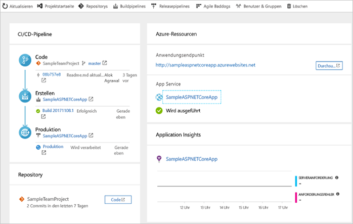
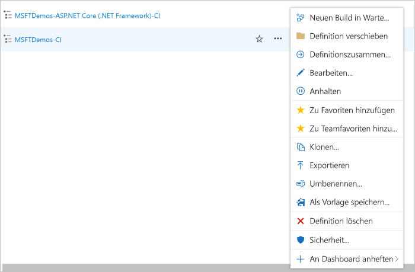

# Erstellen einer CI/CD-Pipeline für .NET mit dem Azure DevOps-Projekt

Konfigurieren Sie mit dem **Azure DevOps-Projekt** für Ihre .NET Core- oder ASP.NET-Anwendung Continuous Integration (CI) und Continuous Delivery (CD).  Das Azure DevOps-Projekt erleichtert die Erstkonfiguration einer Azure DevOps Services-Build- und -Releasepipeline.

Wenn Sie kein Azure-Abonnement haben, erhalten Sie über [Visual Studio Dev Essentials](https://visualstudio.microsoft.com/dev-essentials/) ein kostenloses Abonnement.

## Melden Sie sich auf dem Azure-Portal an.

Mit dem Azure DevOps-Projekt wird in Azure DevOps Services eine CI/CD-Pipeline erstellt.  Sie können eine **neue Azure DevOps Services**-Organisation erstellen oder eine **bestehende Organisation** verwenden.  Außerdem werden mit dem Azure DevOps-Projekt **Azure-Ressourcen** im **Azure-Abonnement** Ihrer Wahl erstellt.

1. Melden Sie sich beim [Microsoft Azure-Portal](https://portal.azure.com) an.

1. Wählen Sie in der linken Navigationsleiste das Symbol **Ressource erstellen** aus, und suchen Sie anschließend nach **DevOps-Projekt**.  Wählen Sie **Erstellen**.

    

## Auswählen einer Beispielanwendung und eines Azure-Diensts

1. Wählen Sie die **.NET**-Beispielanwendung aus.  Die Beispiele für .NET enthalten eine Auswahl von Anwendungen des ASP.NET Open Source-Frameworks oder des plattformübergreifenden .NET Core-Frameworks.

    

1. Wählen Sie das **.NET Core**-Anwendungsframework.  Bei diesem Beispiel handelt es sich um eine ASP.NET Core MVC-Anwendung. Wählen Sie **Weiter** aus, wenn Sie fertig sind.

1. **Web-App unter Windows** ist das Standardziel für die Bereitstellung.  Optional können Sie Azure Web App on Linux oder Web-App für Container auswählen.  Das Anwendungsframework, das Sie im vorherigen Schritt ausgewählt haben, bestimmt den Typ des hier verfügbaren Bereitstellungsziels für den Azure-Dienst.  Übernehmen Sie den Standarddienst, und wählen Sie **Weiter** aus.

## Konfigurieren von Azure DevOps Services und eines Azure-Abonnements 

1. Erstellen Sie eine kostenlose **neue** Azure DevOps Services-Organisation, oder verwenden Sie eine **bestehende** Organisation.  Wählen Sie einen **Namen** für das Azure DevOps-Projekt.  Wählen Sie Ihr **Azure-Abonnement**, den **Speicherort** und einen **Namen** für Ihre Anwendung aus.  Klicken Sie auf **Fertig**, wenn Sie fertig sind.

1. In wenigen Minuten wird das **DevOps-Projektdashboard** im Azure-Portal geladen.  Eine Beispielanwendung wird in einem Repository in Ihrer Azure DevOps Services-Organisation eingerichtet. Ein Build wird ausgeführt, und Ihre Anwendung wird in Azure bereitgestellt.  Dieses Dashboard bietet Einblick in Ihr **Coderepository**, Ihre **Azure DevOps Services-CI/CD-Pipeline** und Ihre **Anwendung in Azure**.  Wählen Sie auf der rechten Seite des Dashboards **Durchsuchen**, um Ihre aktive Anwendung anzuzeigen.

     

## Ausführen eines Commits für Codeänderungen und Ausführen von CI/CD

Mit dem Azure DevOps-Projekt wurde in Ihrer Azure DevOps Services-Organisation oder Ihrem GitHub-Konto ein Git-Repository erstellt.  Gehen Sie wie folgt vor, um das Repository anzuzeigen und Codeänderungen an Ihrer Anwendung vorzunehmen.

1. Wählen Sie auf der linken Seite des DevOps-Projektdashboards den Link für Ihren **Masterbranch** aus.  Über diesen Link wird die Ansicht des neu erstellten Git-Repositorys geöffnet.

1. Wählen Sie oben rechts im Browser die Option **Klonen** aus, um die Repository-Klon-URL anzuzeigen. Sie können Ihr Git-Repository in Ihrer bevorzugten IDE klonen.  Bei den nächsten Schritten können Sie den Webbrowser verwenden, um Codeänderungen direkt am Masterbranch vorzunehmen und für Codeänderungen einen Commit auszuführen.

1. Navigieren Sie auf der linken Seite des Browsers zur Datei **Views/Home/index.cshtml**.

1. Wählen Sie **Bearbeiten** aus, und ändern Sie die h2-Überschrift ab.  Geben Sie z.B. **Direkt mit Azure DevOps-Projekt loslegen** ein, oder nehmen Sie eine andere Änderung vor.

    

1. Wählen Sie **Commit** aus. Speichern Sie anschließend die Änderungen.

1. Navigieren Sie in Ihrem Browser zum **Azure DevOps-Projektdashboard**.  Nun wird angezeigt, dass ein Build erstellt wird.  Die Änderungen, die Sie vorgenommen haben, werden automatisch erstellt und über eine Azure DevOps Services-CI/CD-Pipeline bereitgestellt.

## Überprüfen der Azure DevOps Services-CI/CD-Pipeline

Mit dem Azure DevOps-Projekt wird in Ihrer Azure DevOps Services-Organisation automatisch eine vollständige Azure DevOps Services-CI/CD-Pipeline erstellt.  Untersuchen Sie die Pipeline, und passen Sie sie bei Bedarf an.  Gehen Sie folgendermaßen vor, um sich mit den Build- und Releasepipelines von Azure DevOps Services vertraut zu machen.

1. Wählen Sie **oben** im Azure DevOps-Projektdashboard **Pipelines erstellen** aus.  Dieser Link öffnet eine Browserregisterkarte und die Azure DevOps Services-Buildpipeline für Ihr neues Projekt.

1. Wählen Sie die **Auslassungspunkte** aus.  Mit dieser Aktion wird ein Menü geöffnet, über das Sie verschiedene Aktivitäten starten können. So können Sie beispielsweise einen neuen Build zur Warteschlange hinzufügen, einen Build anhalten und die Buildpipeline bearbeiten.

1. Wählen Sie **Bearbeiten** aus.

    

1. In dieser Ansicht können Sie sich **die verschiedenen Aufgaben ansehen**, die Sie für Ihre Buildpipeline durchführen können.  Vom Build werden verschiedene Aufgaben durchgeführt. So werden beispielsweise Quellen aus dem Azure Repos-Git-Repository abgerufen, Abhängigkeiten wiederhergestellt und für Bereitstellungen verwendete Ausgaben veröffentlicht.

1. Wählen Sie oben in der Buildpipeline den **Buildpipelinenamen**.

1. Ersetzen Sie den **Namen** Ihrer Buildpipeline durch einen aussagekräftigeren Namen.  Wählen Sie **Speichern und in Warteschlange einreihen** und dann **Speichern** aus.

1. Wählen Sie unter dem Buildpipelinenamen **Verlauf** aus.  Es wird ein Überwachungspfad mit den letzten Änderungen für den Build angezeigt.  An der Buildpipeline vorgenommene Änderungen werden von Azure DevOps Services überwacht, sodass Sie verschiedene Versionen vergleichen können.

1. Wählen Sie **Trigger** aus.  Mit dem Azure DevOps-Projekt wurde automatisch ein CI-Trigger erstellt, und mit jedem Commit, der für das Repository ausgeführt wird, wird ein neuer Build erstellt.  Optional können Sie Branches aus dem CI-Prozess einbeziehen oder ausschließen.

1. Wählen Sie **Aufbewahrung** aus.  Je nach Szenario können Sie Richtlinien zum Aufbewahren oder Entfernen einer bestimmten Anzahl von Builds festlegen.

1. Wählen Sie **Build und Release** und anschließend **Releases** aus.  Mit dem Azure DevOps-Projekt wurde eine Azure DevOps Services-Releasepipeline zum Verwalten von Bereitstellungen für Azure erstellt.

1. Wählen Sie links im Browser die **Auslassungspunkte** neben Ihrer Releasepipeline und anschließend **Bearbeiten** aus.

1. Die Releasepipeline enthält eine **Pipeline**, die den Releaseprozess definiert.  Wählen Sie unter **Artefakte** die Option **Ablegen** aus.  Die in den vorherigen Schritten untersuchte Buildpipeline erzeugt die für das Artefakt verwendete Ausgabe. 

1. Wählen Sie die Option **Continuous Deployment-Trigger** rechts neben dem Symbol **Ablegen** aus.  Diese Releasepipeline enthält einen aktivierten CD-Trigger. Jedes Mal, wenn ein neues Buildartefakt verfügbar ist, wird von diesem CD-Trigger eine Bereitstellung ausgeführt.  Optional können Sie den Trigger deaktivieren, sodass Ihre Bereitstellungen manuell ausgeführt werden müssen. 

1. Wählen Sie links im Browser die Option **Aufgaben** aus.  Bei den Aufgaben handelt es sich um die Aktivitäten, die beim Bereitstellungsprozess durchgeführt werden.  In diesem Beispiel wurde für die Bereitstellung für **Azure App Service** eine Aufgabe erstellt.

1. Wählen Sie rechts im Browser **Releases anzeigen** aus.  In dieser Ansicht wird der Verlauf von Releases angezeigt.

1. Wählen Sie die **Auslassungsp** neben einem Ihrer Releases und dann die Option **Öffnen** aus.  In dieser Ansicht finden Sie verschiedene Menüs, wie etwa eine Releasezusammenfassung, zugeordnete Arbeitsaufgaben und Tests.

1. Wählen Sie **Commits** aus.  In dieser Ansicht werden die der jeweiligen Bereitstellung zugeordneten Codecommits angezeigt. 

1. Wählen Sie **Protokolle** aus.  Die Protokolle enthalten nützliche Informationen zum Bereitstellungsprozess.  Sie können während und nach Bereitstellungen angezeigt werden.

## Bereinigen von Ressourcen

Sie können die mit dieser Schnellstartanleitung erstellte Azure App Service-Bereitstellung und die zugehörigen Ressourcen mithilfe der Funktion **Löschen** im Azure DevOps-Projektdashboard löschen, wenn Sie die Bereitstellung nicht mehr benötigen.

## Nächste Schritte

Weitere Informationen zum Ändern der Build- und Releasepipelines zur Erfüllung der Anforderungen Ihres Teams finden Sie in folgendem Tutorial:

> [!div class="nextstepaction"]
> [Anpassen von CD-Prozessen](https://docs.microsoft.com/azure/devops/pipelines/release/define-multistage-release-process?view=vsts)

## Videos

> [!VIDEO https://www.youtube.com/embed/itwqMf9aR0w]
