#  <a name="quickstart-create-a-cicd-pipeline-in-azure-pipelines-for-nodejs-with-azure-devops-projects"></a>Schnellstart: Erstellen einer CI/CD-Pipeline in Azure Pipelines für Node.js mit Azure DevOps Projects
In dieser Schnellstartanleitung erstellen Sie eine progressive NodeJS-Web-App (PWA), indem Sie [GatsbyJS](https://www.gatsbyjs.org/) und die vereinfachte Umgebung für die Erstellung von Azure DevOps-Projekten verwenden. Nach Abschluss des Vorgangs verfügen Sie über eine CI/CD-Pipeline (Continuous Integration/Continuous Delivery) für Ihre PWA in Azure Pipelines. Von Azure DevOps Projects werden die Komponenten eingerichtet, die Sie für die Entwicklung, Bereitstellung und Überwachung benötigen.

## <a name="prerequisites"></a>Voraussetzungen

- Ein Azure-Konto mit einem aktiven Abonnement. Sie können [kostenlos ein Konto erstellen](https://azure.microsoft.com/free/?ref=microsoft.com&utm_source=microsoft.com&utm_medium=docs&utm_campaign=visualstudio). 
- Eine [Azure DevOps](https://azure.microsoft.com/services/devops/)-Organisation.

## <a name="sign-in-to-the-azure-portal"></a>Melden Sie sich auf dem Azure-Portal an.

Mit DevOps Projects wird eine CI/CD-Pipeline in Azure Pipelines erstellt. Sie können eine neue Azure DevOps-Organisation erstellen oder eine bestehende Organisation verwenden. Ferner werden mit DevOps Projects Azure-Ressourcen im Azure-Abonnement Ihrer Wahl erstellt.

1. Melden Sie sich beim [Azure-Portal](https://portal.azure.com) an, und wählen Sie im linken Bereich **Ressource erstellen** aus. 

   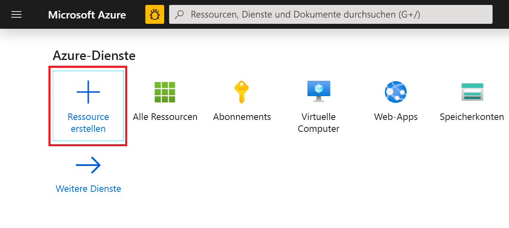

2. Suchen Sie nach **DevOps Projects**, wählen Sie die Option aus, und wählen sie dann **Erstellen** aus.

 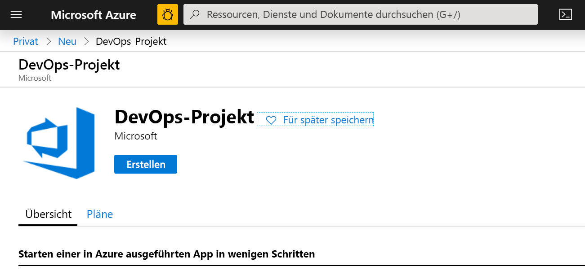 

## <a name="select-a-sample-application-and-azure-service"></a>Auswählen einer Beispielanwendung und eines Azure-Diensts

1. Wählen Sie die Node.js-Beispielanwendung aus.   

  

2. Standardmäßig wird das Beispielframework **Express.js** verwendet. Ändern Sie die Auswahl in **Simple Node.js App** (Einfache Node.js-App), und wählen Sie anschließend **Weiter** aus. 

 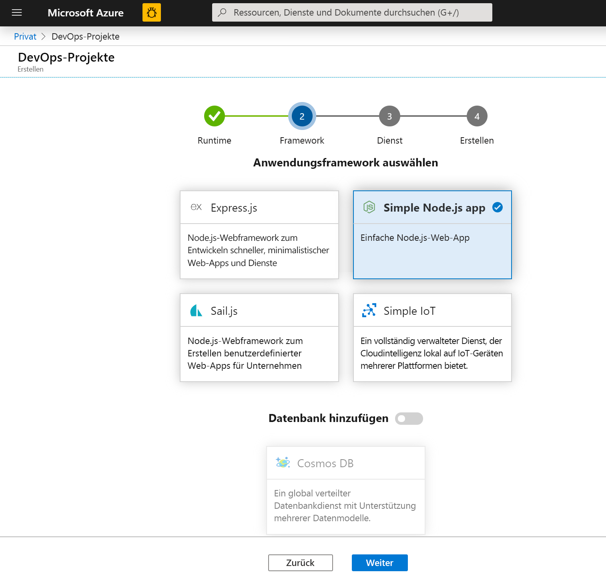 

3. Die in diesem Schritt verfügbaren Bereitstellungsziele werden durch das in Schritt 2 ausgewählte Anwendungsframework vorgegeben.  In diesem Beispiel ist **Windows-Web-App** das Standardbereitstellungsziel.  Lassen Sie die Einstellung **Web-App für Container** unverändert, und wählen Sie **Weiter** aus.

  

## <a name="configure-a-project-name-and-an-azure-subscription"></a>Konfigurieren eines Projektnamens und eines Azure-Abonnements

1. Im letzten Schritt des Workflows für die DevOps-Projekterstellung weisen Sie einen Projektnamen zu und wählen ein Azure-Abonnement und dann die Option **Fertig** aus.  

 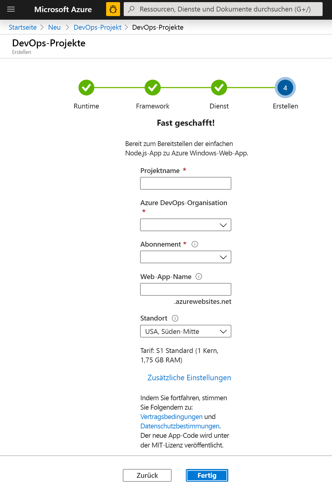 

2. Eine Zusammenfassungsseite wird angezeigt, während Ihr Projekt erstellt und Ihre Anwendung in Azure bereitgestellt wird. Nach kurzer Zeit wird in Ihrer [Azure DevOps-Organisation](https://dev.azure.com/) ein Projekt erstellt, das ein Git-Repository, ein Kanban-Board, eine Bereitstellungspipeline, Testpläne und die für Ihre App benötigen Artefakte umfasst.  

## <a name="managing-your-project"></a>Verwalten Ihres Projekts

1. Navigieren Sie zu **Alle Ressourcen**, und suchen Sie nach Ihrem DevOps-Projekt. Wählen Sie Ihr **DevOps-Projekt** aus.


2. Sie werden zu einem Dashboard weitergeleitet, das Einblick in Ihre Projekthomepage, das Coderepository und die CI/CD-Pipeline ermöglicht und einen Link zu Ihrer ausgeführten App enthält. Wählen Sie die **Projekthomepage** aus, um Ihre Anwendung in **Azure DevOps** anzuzeigen, und wählen Sie auf einem anderen Browsertab die Option **Anwendungsendpunkt** aus, um die Live-Beispiel-App anzuzeigen.  Wir ändern dieses Beispiel später so, dass die von GatsbyJS generierte PWA verwendet wird.

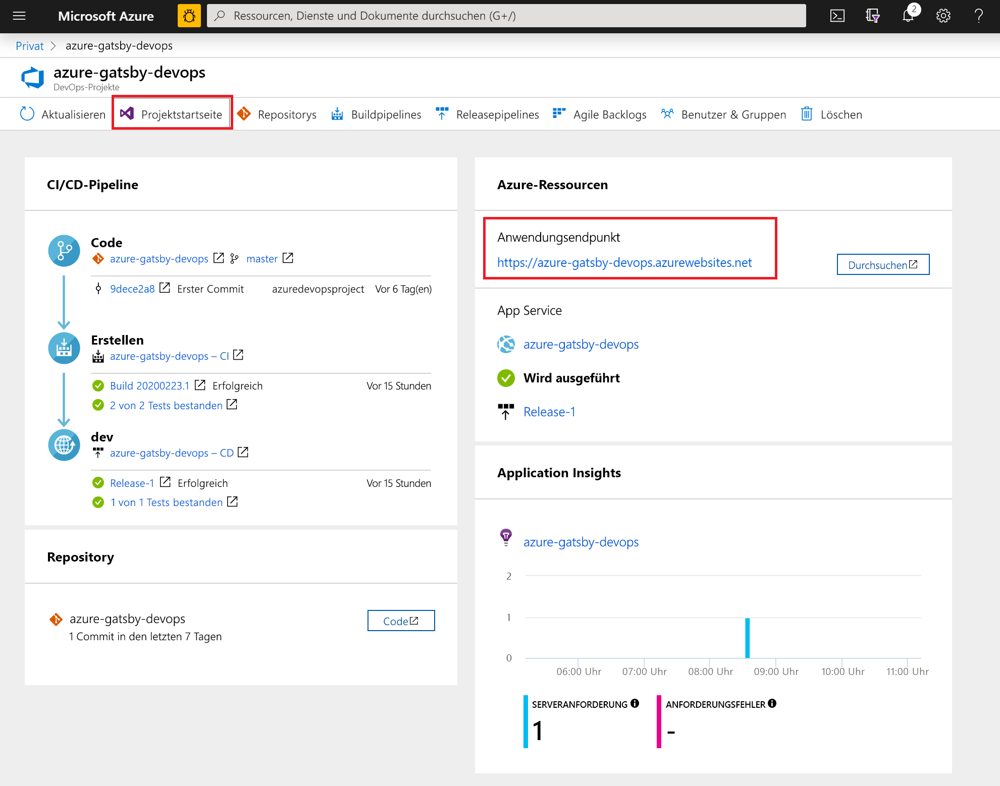 

3. Über Ihr Azure DevOps-Projekt können Sie Teammitglieder zur Zusammenarbeit einladen und ein Kanban-Board einrichten, um mit der Nachverfolgung Ihrer Arbeit zu beginnen.  Weitere Informationen finden Sie [hier](https://docs.microsoft.com/azure/devops/user-guide/what-is-azure-devops?view=azure-devops).

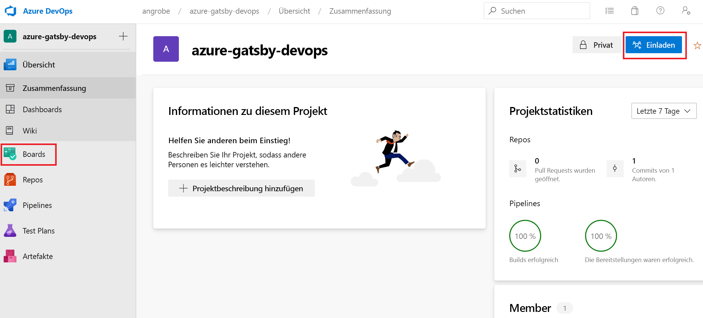

## <a name="clone-the-repo-and-install-your-gatsby-pwa"></a>Klonen des Repositorys und Installieren Ihrer Gatsby-PWA

Von DevOps Projects wird ein Git-Repository in Azure Repos oder auf GitHub erstellt. In diesem Beispiel wurde ein Azure-Repository erstellt.  Im nächsten Schritt wird das Repository geklont, und es werden Änderungen vorgenommen.

1. Wählen Sie in Ihrem **DevOps-Projekt** die Option **Repos** aus, und klicken Sie anschließend auf **Klonen**.  Es gibt verschiedene Mechanismen, um das Git-Repository auf Ihrem Desktop zu klonen.  Wählen Sie den Mechanismus aus, der zu Ihrer Entwicklungsumgebung passt.  

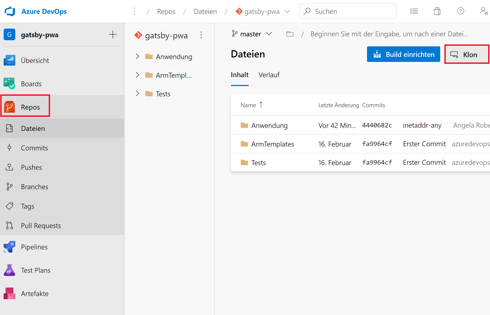

2. Nehmen Sie nach der Erstellung des Repositoryklons auf Ihrem Desktop einige Änderungen an der Startvorlage vor. Installieren Sie zunächst die GatsbyJS-CLI über Ihr Terminal.
```powershell
npm install -g gatsby
```

3. Navigieren Sie im Terminal zum Stammverzeichnis Ihres Repositorys. Es sollte die folgenden drei Ordner enthalten:
```powershell
Mode                LastWriteTime         Length Name
----                -------------         ------ ----
d-----        2/23/2020  10:42 PM                Application
d-----        2/23/2020   3:05 PM                ArmTemplates
d-----        2/23/2020   3:05 PM                Tests
```

4. Wir benötigen nicht alle Dateien im Ordner „Application“, weil wir die Ersetzung durch ein Gatsby-Startprogramm durchführen. Führen Sie nacheinander die folgenden Befehle aus, um den Umfang zu verringern.
```powershell
cp .\Application\Dockerfile .
rmdir Application
```

5. Nutzen Sie die Gatsby-CLI, um eine Beispiel-PWA zu generieren. Führen Sie `gatsby new` über das Terminal aus, um den PWA-Assistenten zu starten, und wählen Sie `gatsby-starter-blog` für Ihre Startprogrammvorlage aus. Die Informationen sollten diesem Beispiel ähneln:
```powershell
c:\myproject> gatsby new
√ What is your project called? ... my-gatsby-project
? What starter would you like to use? » - Use arrow-keys. Return to submit.
    gatsby-starter-default
    gatsby-starter-hello-world
>   gatsby-starter-blog
    (Use a different starter)
```

6. Sie verfügen über einen Ordner mit dem Namen `my-gatsby-project`. Benennen Sie ihn in `Application` um, und kopieren Sie die `Dockerfile` hinein.
```powershell
mv my-gatsby-project Application
mv Dockerfile Application
```

7. Öffnen Sie die Dockerfile in Ihrem bevorzugten Editor, und ändern Sie die erste Zeile von `FROM node:8` in `FROM node:12`. Mit dieser Änderung wird sichergestellt, dass für Ihren Container Node.js Version 12.x anstelle von 8.x genutzt wird. Für GatsbyJS sind modernere Versionen von Node.js erforderlich.

8. Öffnen Sie als Nächstes im Ordner „Application“ die Datei „package.json“, und bearbeiten Sie das [Feld „Scripts“](https://docs.npmjs.com/files/package.json#scripts), um sicherzustellen, dass Ihre Entwicklungs- und Produktionsserver über alle verfügbaren Netzwerkschnittstellen (z. B. „0.0.0.0“) und Port 80 lauschen. Ohne diese Einstellungen kann der Container-App-Dienst Datenverkehr nicht an Ihre Node.js-App leiten, die in Ihrem Container ausgeführt wird. Die Datei `scripts` sollte den unten dargestellten Informationen ähneln. Hierbei sollten Sie die Standardeinstellungen der Ziele von `develop`, `serve` und `start` ändern.
```json
  "scripts": {
    "build": "gatsby build",
    "develop": "gatsby develop  -H 0.0.0.0 -p 80",
    "format": "prettier --write \"**/*.{js,jsx,json,md}\"",
    "start": "npm run serve",
    "serve": "npm run build && gatsby serve -H 0.0.0.0 -p 80",
    "clean": "gatsby clean",
    "test": "echo \"Write tests! -> https://gatsby.dev/unit-testing\" && exit 1"
  }
```

## <a name="edit-your-cicd-pipelines"></a>Bearbeiten Ihrer CI/CD-Pipelines

1. Bevor Sie den Code des vorherigen Abschnitts committen, sollten Sie einige Änderungen an Ihren Build- und Releasepipelines vornehmen. Bearbeiten Sie Ihre „Buildpipeline“, und aktualisieren Sie die Node-Aufgabe so, dass Version 12.x von Node.js verwendet wird. Legen Sie das Feld **Aufgabenversion** auf „1.x“ und das Feld **Version** auf „12.x“ fest.
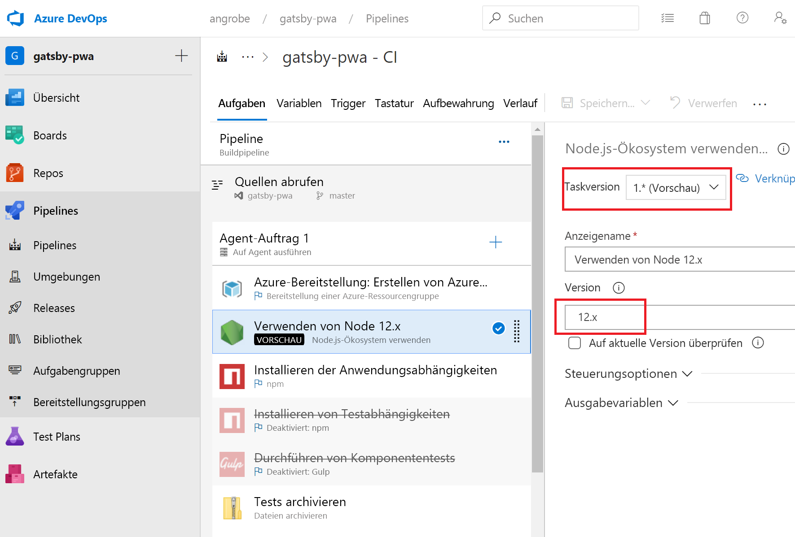

2. In dieser Schnellstartanleitung erstellen wir keine Komponententests und deaktivieren diese Schritte in unserer Buildpipeline. Beim Schreiben von Tests können Sie diese Schritte wieder aktivieren. Klicken Sie mit der rechten Maustaste auf die Aufgaben mit den Bezeichnungen **Install test dependencies** (Testabhängigkeiten installieren) und **Komponententests ausführen**, und deaktivieren Sie sie.

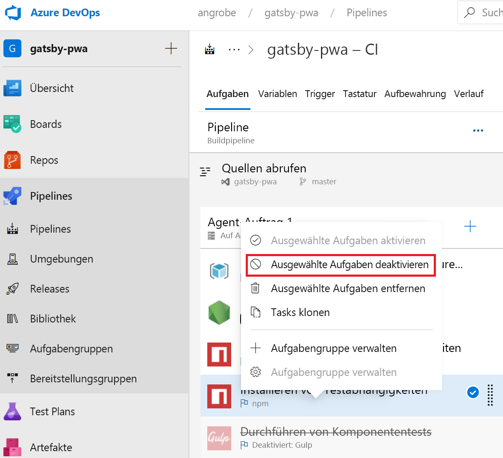

3. Bearbeiten Sie Ihre Releasepipeline.
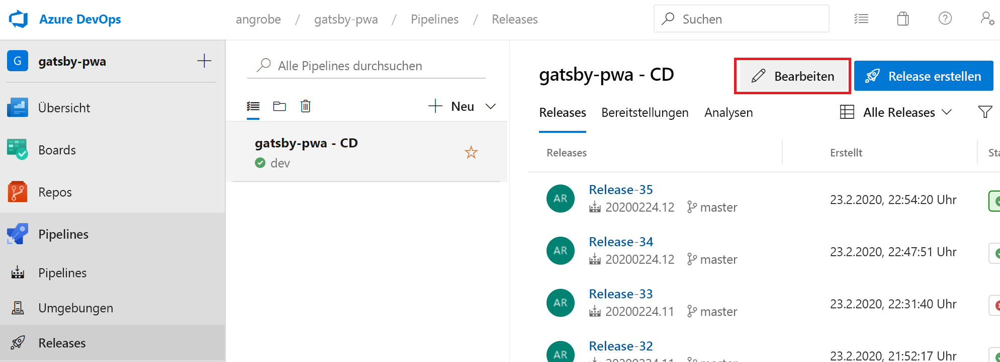

4. Ändern Sie wie bei der Buildpipeline die Node-Aufgabe so, dass 12.x genutzt wird, und deaktivieren Sie die beiden Testaufgaben. Ihr Release sollte den Informationen in diesem Screenshot ähneln.

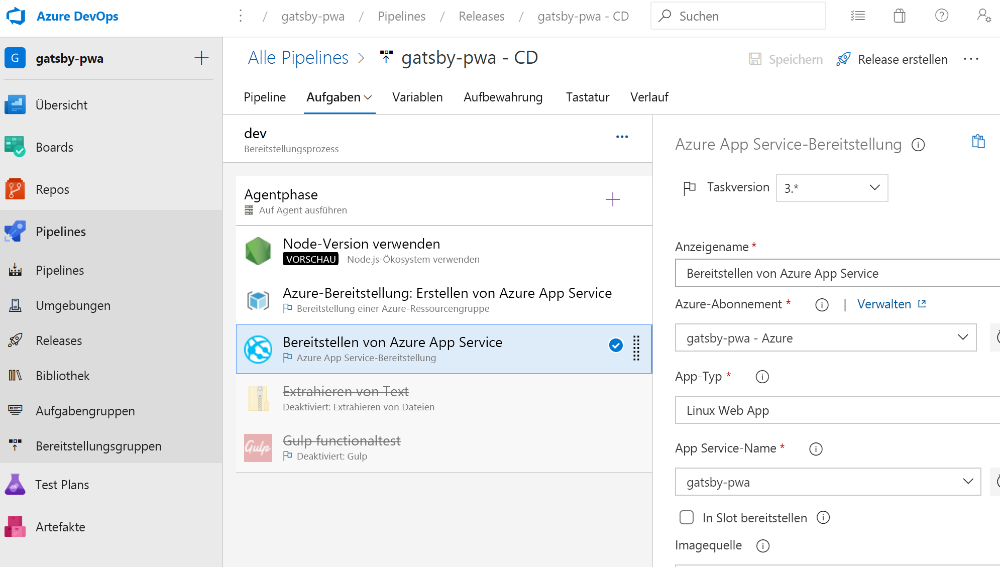

1. Navigieren Sie auf der linken Seite des Browsers zur Datei **views/index.pug**.

1. Wählen Sie **Bearbeiten** aus, und ändern Sie die h2-Überschrift.  
    Geben Sie beispielsweise **Get started right away with Azure DevOps Projects** ein, oder nehmen Sie eine andere Änderung vor.

1. Wählen Sie **Commit** aus, und speichern Sie anschließend die Änderungen.

1. Navigieren Sie in Ihrem Browser zum DevOps Projects-Dashboard.   
Nun wird angezeigt, dass ein Buildvorgang ausgeführt wird. Die von Ihnen vorgenommenen Änderungen werden automatisch erstellt und über eine CI/CD-Pipeline bereitgestellt.

## <a name="commit-your-changes-and-examine-the-azure-cicd-pipeline"></a>Committen Ihrer Änderungen und Untersuchen der Azure-CI/CD-Pipeline

In den beiden vorherigen Schritten haben Sie eine mit Gatsby generierte PWA Ihrem Git-Repository hinzugefügt und Ihre Pipelines für die Erstellung und Bereitstellung des Codes bearbeitet. Wir können den Code committen und verfolgen, wie die Build- und Releasepipeline durchlaufen wird.

1. Führen Sie im Stammverzeichnis des Git-Repositorys Ihres Projekts in einem Terminal die folgenden Befehle aus, um Ihren Code per Pushvorgang in Ihr Azure DevOps-Projekt zu übertragen:
```powershell
git add .
git commit -m "My first Gatsby PWA"
git push
```

2. Sofort nach Abschluss von `git push` wird ein Buildvorgang gestartet. Sie können den Verlauf über das **Azure DevOps-Dashboard** verfolgen.


3. Nach einigen Minuten sollte der Vorgang für Ihre Build- und Releasepipeline abgeschlossen und Ihre PWA in einem Container bereitgestellt worden sein. Wenn Sie im obigen Dashboard auf den Link **Anwendungsendpunkt** klicken, sollte ein Gatsby-Startprogrammprojekt für Blogs angezeigt werden.


## <a name="clean-up-resources"></a>Bereinigen von Ressourcen

Sie können die erstellte Azure App Service-Instanz und die zugehörigen Ressourcen löschen, wenn Sie diese nicht mehr benötigen. Verwenden Sie dazu die Funktion **Löschen** auf dem DevOps Projects-Dashboard.


## <a name="next-steps"></a>Nächste Schritte

Beim Konfigurieren des CI/CD-Prozesses werden automatisch Build- und Releasepipelines erstellt. Sie können diese Build- und Releasepipelines ändern, um sie an die Anforderungen Ihres Teams anzupassen. Weitere Informationen zur CI/CD-Pipeline finden Sie in folgendem Artikel:

> [!div class="nextstepaction"]
> [Anpassen von CD-Prozessen](https://docs.microsoft.com/azure/devops/pipelines/release/define-multistage-release-process?view=vsts)

