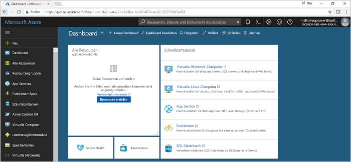
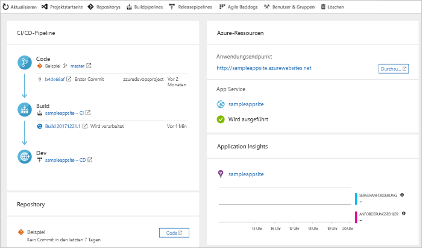

# Erstellen einer CI/CD-Pipeline für PHP mit Azure DevOps Projects

Azure DevOps Projects hat eine vereinfachte Oberfläche zum Erstellen von Azure-Ressourcen sowie zum Einrichten einer CI-Pipeline (Continuous Integration) und einer CD-Pipeline (Continuous Delivery) für Ihre PHP-App in Azure Pipelines.  

Wenn Sie kein Azure-Abonnement haben, erhalten Sie über [Visual Studio Dev Essentials](https://visualstudio.microsoft.com/dev-essentials/) ein kostenloses Abonnement.

## Melden Sie sich auf dem Azure-Portal an.

 Mit DevOps Projects wird eine CI/CD-Pipeline in Azure Pipelines erstellt. Sie können eine kostenlose neue Azure DevOps-Organisation erstellen oder eine bestehende Organisation verwenden. Ferner werden mit DevOps Projects Azure-Ressourcen im Azure-Abonnement Ihrer Wahl erstellt.

1. Melden Sie sich beim [Microsoft Azure-Portal](https://portal.azure.com)an.

1. Wählen Sie im linken Bereich das Symbol **Ressource erstellen** aus, und suchen Sie nach **DevOps Projects**.  

3. Klicken Sie auf **Erstellen**.

    

## Auswählen einer Beispielanwendung und eines Azure-Diensts

1. Wählen Sie die PHP-Beispielanwendung aus.  
        Zu den PHP-Beispielen zählen verschiedene Anwendungsframeworks. Standardmäßig wird das Beispielframework Laravel verwendet. 
        
2. Übernehmen Sie die Standardeinstellung, und wählen Sie **Weiter** aus.  

1. „Web-App für Container“ ist das Standardziel für die Bereitstellung.  
    Das Anwendungsframework, das Sie zuvor ausgewählt haben, bestimmt den Typ des hier verfügbaren Bereitstellungsziels für den Azure-Dienst.  Übernehmen Sie den Standarddienst, und wählen Sie **Weiter** aus.
 
## Konfigurieren von Azure DevOps und eines Azure-Abonnements 

1. Sie können eine neue Azure DevOps-Organisation erstellen oder eine bestehende Organisation auswählen. 

    a. Wählen Sie einen Namen für Ihr Projekt in Azure DevOps aus. 
    
    b. Wählen Sie Ihr Azure-Abonnement und den Standort aus, geben Sie einen Namen für Ihre Anwendung ein, und wählen Sie dann **Fertig** aus.   
        Nach wenigen Minuten wird das DevOps Projects-Dashboard im Azure-Portal angezeigt. Eine Beispielanwendung wird in einem Repository in Ihrer Azure DevOps-Organisation eingerichtet, ein Build wird ausgeführt, und Ihre Anwendung wird in Azure bereitgestellt. Dieses Dashboard bietet Einblick in Ihr Coderepository, in Ihre CI/CD-Pipeline und in Ihre Anwendung in Azure.  
        
2. Wählen Sie **Durchsuchen** aus, um Ihre ausgeführte Anwendung anzuzeigen.

     
    
   Mit DevOps Projects wird automatisch ein CI-Trigger für Build und Release konfiguriert.  Nun können Sie mithilfe eines CI/CD-Prozesses, mit dem Ihre aktuelle Arbeit automatisch auf Ihrer Website bereitgestellt wird, mit einem Team an einer PHP-App zusammenarbeiten.

## Ausführen eines Commits für Codeänderungen und Ausführen von CI/CD

 DevOps Projects erstellt ein Git-Repository in Azure Repos oder GitHub. Führen Sie die folgenden Schritte aus, um das Repository anzuzeigen und Codeänderungen an Ihrer Anwendung vorzunehmen:

1. Wählen Sie auf der linken Seite des DevOps Projects-Dashboards den Link für Ihren Masterbranch aus.   
    Über diesen Link wird die Ansicht des neu erstellten Git-Repositorys geöffnet.

1. Wählen Sie oben rechts im Browser die Option **Klonen** aus, um die Repository-Klon-URL anzuzeigen.   
    Sie können Ihr Git-Repository in Ihrer bevorzugten IDE klonen. Bei den nächsten Schritten können Sie den Webbrowser verwenden, um Codeänderungen vorzunehmen und direkt an den Masterbranch zu committen.

1. Navigieren Sie links zur Datei **resources/views/welcome.blade.php**.

1. Wählen Sie **Bearbeiten** aus, und ändern Sie den Text an einigen Stellen.  Ändern Sie beispielsweise einige Textstellen für eines der div-Tags.

1. Wählen Sie **Commit** aus, und speichern Sie anschließend die Änderungen.

1. Navigieren Sie in Ihrem Browser zum DevOps Projects-Dashboard.  
Nun wird angezeigt, dass ein Buildvorgang ausgeführt wird. Die Änderungen, die Sie eben vorgenommen haben, werden automatisch erstellt und über eine CI/CD-Pipeline bereitgestellt.

## Überprüfen der CI/CD-Pipeline

 Mit DevOps Projects wird automatisch eine vollständige CI/CD-Pipeline in Azure Pipelines konfiguriert. Untersuchen Sie die Pipeline, und passen Sie sie bei Bedarf an. Gehen Sie wie folgt vor, um sich mit den Build- und Releasepipelines vertraut zu machen:

1. Wählen Sie oben auf dem DevOps Projects-Dashboard die Option **Buildpipelines** aus.  
    Über diesen Link werden eine Browserregisterkarte und die Buildpipeline für Ihr neues Projekt geöffnet.

1. Zeigen Sie auf das Feld **Status**, und wählen Sie dann die **Auslassungspunkte** (...) aus.  
    In einem Menü werden verschiedene Optionen angezeigt, etwa zum Einreihen eines neuen Builds in die Warteschlange, zum Anhalten eines Builds und zum Bearbeiten der Buildpipeline.

1. Wählen Sie **Bearbeiten** aus.

1. In diesem Bereich können Sie sich die verschiedenen Aufgaben ansehen, die Sie für Ihre Buildpipeline ausführen können.  
    Vom Build werden verschiedene Aufgaben ausgeführt. Beispielsweise werden Quellen aus dem Git-Repository abgerufen, Abhängigkeiten wiederhergestellt und für Bereitstellungen verwendete Ausgaben veröffentlicht.

1. Wählen Sie oben in der Buildpipeline den Buildpipelinenamen.

1. Ersetzen Sie den Namen Ihrer Buildpipeline durch einen aussagekräftigeren Namen, und wählen Sie **Speichern und in Warteschlange einreihen** und dann **Speichern** aus.

1. Wählen Sie unter dem Buildpipelinenamen **Verlauf** aus.   
    Im Bereich **Verlauf** wird ein Überwachungsprotokoll mit den letzten Änderungen für den Build angezeigt. An der Buildpipeline vorgenommene Änderungen werden von Azure Pipelines nachverfolgt, sodass Sie verschiedene Versionen vergleichen können.

1. Wählen Sie **Trigger** aus.  
      Mit DevOps Projects wurde automatisch ein CI-Trigger erstellt, und mit jedem für das Repository ausgeführten Commit wird ein neuer Build gestartet. Optional können Sie Branches aus dem CI-Prozess einbeziehen oder ausschließen.

1. Wählen Sie **Aufbewahrung** aus.   
    Abhängig vom Szenario können Sie Richtlinien zum Aufbewahren oder Entfernen einer bestimmten Anzahl von Builds festlegen.

1. Wählen Sie **Build und Release** und anschließend **Releases** aus.  
     DevOps Projects erstellt eine Releasepipeline zum Verwalten von Bereitstellungen in Azure.

1. Wählen Sie neben Ihrer Releasepipeline die Auslassungspunkte (...) und anschließend **Bearbeiten** aus.  
    Die Releasepipeline enthält eine Pipeline, die den Releaseprozess definiert. 

12. Wählen Sie unter **Artefakte** die Option **Ablegen** aus.  
    Die in den vorherigen Schritten untersuchte Buildpipeline erzeugt die für das Artefakt verwendete Ausgabe. 

1. Wählen Sie neben dem Symbol **Ablegen** die Option **Continuous Deployment-Trigger** aus.   
    Diese Releasepipeline enthält einen aktivierten CD-Trigger. Jedes Mal, wenn ein neues Buildartefakt verfügbar ist, wird von diesem CD-Trigger eine Bereitstellung ausgeführt.  Optional können Sie den Trigger deaktivieren, sodass Ihre Bereitstellungen manuell ausgeführt werden müssen. 

1. Wählen Sie auf der linken Seite **Aufgaben** aus.  
        Bei den Aufgaben handelt es sich um die Aktivitäten, die beim Bereitstellungsprozess ausgeführt werden.  In diesem Beispiel wurde eine Aufgabe für die Bereitstellung in Azure App Service erstellt.

1. Wählen Sie auf der rechten Seite **Releases anzeigen** aus, um einen Releaseverlauf anzuzeigen.

1. Wählen Sie neben einem Ihrer Releases die Auslassungspunkte (...) und dann die Option **Öffnen** aus.  
        In dieser Ansicht finden Sie verschiedene Menüs, wie etwa eine Releasezusammenfassung, zugeordnete Arbeitselemente und Tests.

1. Wählen Sie **Commits** aus.  
        In dieser Ansicht werden die der jeweiligen Bereitstellung zugeordneten Codecommits angezeigt. 

1. Wählen Sie **Protokolle** aus.  
        Die Protokolle enthalten nützliche Informationen zum Bereitstellungsprozess. Sie können während und nach Bereitstellungen angezeigt werden.

## Bereinigen von Ressourcen

Sie können die Azure App Service-Instanz und zugehörige Ressourcen löschen, wenn Sie sie nicht mehr benötigen. Verwenden Sie dazu die Funktion **Löschen** auf dem DevOps Projects-Dashboard.

## Nächste Schritte

Beim Konfigurieren des CI/CD-Prozesses wurden automatisch Build- und Releasepipelines erstellt. Diese Build- und Releasepipelines können Sie den Anforderungen Ihres Teams anpassen. Weitere Informationen zur CI/CD-Pipeline finden Sie im folgenden Tutorial:

> [!div class="nextstepaction"]
> [Anpassen von CD-Prozessen](https://docs.microsoft.com/azure/devops/pipelines/release/define-multistage-release-process?view=vsts)
