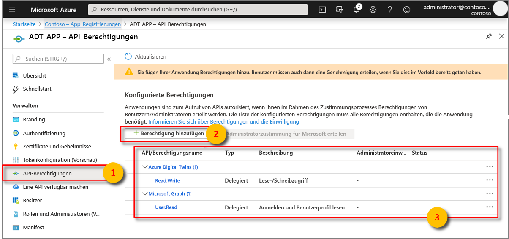

# <a name="how-to-configure-postman-for-azure-digital-twins"></a>Vorgehensweise: Konfigurieren von Postman für Azure Digital Twins

Dieser Artikel beschreibt, wie Sie den Postman-REST-Client für die Interaktion mit den Azure Digital Twins-Verwaltungs-APIs und das Testen dieser APIs konfigurieren. Insbesondere wird Folgendes beschrieben:

* Konfigurieren einer Azure Active Directory-Anwendung für die Verwendung der impliziten OAuth 2.0-Genehmigung
* Verwenden des Postman-REST-Clients, um HTTP-Anforderungen mit Token an Ihre Verwaltungs-APIs zu stellen
* Verwenden von Postman, um mehrteilige POST-Anforderungen an Ihre Verwaltungs-APIs zu stellen

## <a name="postman-summary"></a>Postman: Zusammenfassung

Führen Sie erste Schritte mit Azure Digital Twins aus, indem Sie ein REST-Clienttool wie [Postman](https://www.getpostman.com/) verwenden, um Ihre lokale Testumgebung vorzubereiten. Der Postman-Client unterstützt die schnelle Erstellung komplexer HTTP-Anforderungen. Laden Sie die Desktopversion des Postman-Clients herunter, indem Sie zu [www.getpostman.com/apps](https://www.getpostman.com/apps) navigieren.

[Postman](https://www.getpostman.com/) ist ein REST-Testtool, das wichtige HTTP-Anforderungsfunktionen in einer nützlichen desktop- und plugin-basierten grafischen Benutzeroberfläche ermittelt.

Über den Postman-Client können Lösungsentwickler die Art der HTTP-Anforderung (*POST*, *GET*, *UPDATE*, *PATCH* und *DELETE*), den aufzurufenden API-Endpunkt und die Verwendung von SSL angeben. Postman unterstützt außerdem das Hinzufügen von HTTP-Anforderungsheadern, Parametern, Formulardaten und Textkörpern.

## <a name="configure-azure-active-directory-to-use-the-oauth-20-implicit-grant-flow"></a>Konfigurieren von Azure Active Directory für die Verwendung der impliziten OAuth 2.0-Gewährung

Konfigurieren Ihrer Azure Active Directory-App für die Verwendung der impliziten OAuth 2.0-Gewährung

1. Öffnen Sie den Bereich **API-Berechtigungen** für Ihre App-Registrierung. Wählen Sie die Schaltfläche **Berechtigung hinzufügen** aus. Wählen Sie im Bereich **API-Berechtigungen anfordern**  die Registerkarte **Von meiner Organisation verwendete APIs** aus, und suchen Sie dann nach
    
    1. `Azure Digital Twins`. Wählen Sie die API **Azure Digital Twins** aus.

        [](../../includes/media/digital-twins-permissions/aad-aap-search-api-dt.png#lightbox)

    1. Oder suchen Sie nach `Azure Smart Spaces Service`. Wählen Sie die API **Azure Smart Spaces Service** aus.

        [](../../includes/media/digital-twins-permissions/aad-app-search-api.png#lightbox)

    > [!IMPORTANT]
    > Welcher Name und welche ID für die Azure AD-API angezeigt werden, richtet sich nach Ihrem Mandanten:
    > * Bei Testmandanten- und Kundenkonten sollte nach `Azure Digital Twins` gesucht werden.
    > * Bei anderen Microsoft-Konten sollte nach `Azure Smart Spaces Service` gesucht werden.

1. Die ausgewählte API wird als **Azure Digital Twins** im gleichen Bereich **API-Berechtigungen anfordern** angezeigt. Aktivieren Sie das Dropdownmenü **Lesen (1)** und dann das Kontrollkästchen **Read.Write**. Wählen Sie die Schaltfläche **Berechtigungen hinzufügen** aus.

    [](../../includes/media/digital-twins-permissions/aad-app-req-permissions.png#lightbox)

1. Je nach Einstellungen Ihrer Organisation müssen Sie möglicherweise zusätzliche Schritte unternehmen, um dem Administrator Zugriff auf diese API zu gewähren. Weitere Informationen erhalten Sie von Ihrem Administrator. Sobald der Administratorzugriff genehmigt wurde, wird die Spalte **ADMINISTRATOREINWILLIGUNG ERFORDERLICH** im Bereich **API-Berechtigungen** ähnlich wie folgt für Ihre APIs angezeigt:

    [](../../includes/media/digital-twins-permissions/aad-app-admin-consent.png#lightbox)

1. Konfigurieren Sie einen zweiten **Umleitungs-URI-** zu `https://www.getpostman.com/oauth2/callback`.

    [](media/how-to-configure-postman/authentication-redirect-uri.png#lightbox)

1. Um sicherzustellen, dass [die App als **öffentlicher Client**](https://docs.microsoft.com/azure/active-directory/develop/scenario-desktop-app-registration) registriert wird, öffnen Sie den Bereich **Authentifizierung** für Ihre App-Registrierung, und scrollen Sie in diesem Bereich nach unten. Wählen Sie im Abschnitt **Standardclienttyp** für **Anwendung als öffentlichen Client behandeln** die Option **Ja** und anschließend **Speichern** aus.

    Aktivieren Sie das Kontrollkästchen **Zugriffstoken**, um die Einstellung **oauth2AllowImplicitFlow** in der Datei „Manifest.json“ zu aktivieren.

    [](../../includes/media/digital-twins-permissions/aad-public-client.png#lightbox)

1. Kopieren Sie die **Anwendungs-ID** Ihrer Azure Active Directory-App, und bewahren Sie sie auf. Sie wird in den folgenden Schritten verwendet.

   [](../../includes/media//digital-twins-permissions/aad-app-reg-app-id.png#lightbox)


## <a name="obtain-an-oauth-20-token"></a>Abrufen eines OAuth 2.0-Tokens

[!INCLUDE [digital-twins-management-api](../../includes/digital-twins-management-api.md)]

Richten Sie Postman ein, und konfigurieren Sie das Tool so, dass ein Azure Active Directory-Token abgerufen wird. Geben Sie anschließend unter Verwendung des abgerufenen Tokens eine authentifizierte HTTP-Anforderung an Azure Digital Twins aus:

1. Navigieren Sie zu [www.getpostman.com](https://www.getpostman.com/), um die App herunterzuladen.
1. Überprüfen Sie, ob Ihre **Autorisierungs-URL** richtig ist. Sie sollte das folgende Format aufweisen:

    ```plaintext
    https://login.microsoftonline.com/YOUR_AZURE_TENANT.onmicrosoft.com/oauth2/authorize?resource=0b07f429-9f4b-4714-9392-cc5e8e80c8b0
    ```

    | NAME  | Ersetzen durch | Beispiel |
    |---------|---------|---------|
    | IHR_AZURE_MANDANT | Der Name Ihres Mandanten oder Ihrer Organisation | `microsoft` |

1. Wählen Sie die Registerkarte **Authorization** (Autorisierung) und anschließend **OAuth 2.0** und **Get New Access Token** (Neues Zugriffstoken abrufen) aus.

    | Feld  | Wert |
    |---------|---------|
    | Gewährungstyp | `Implicit` |
    | Rückruf-URL | `https://www.getpostman.com/oauth2/callback` |
    | Authentifizierungs-URL | Verwenden Sie die **Autorisierungs-URL** aus **Schritt 2**. |
    | Client-ID | Verwenden Sie die **Anwendungs-ID** für die Azure Active Directory-App, die im vorherigen Abschnitt erstellt bzw. aus diesem wiederverwendet wurde. |
    | `Scope` | Nicht ausfüllen |
    | State | Nicht ausfüllen |
    | Clientauthentifizierung | `Send as Basic Auth header` |

1. Der Client sollte jetzt folgendermaßen aussehen:

    [](media/how-to-configure-postman/postman-oauth-token.png#lightbox)

1. Wählen Sie **Request Token** (Token anfordern) aus.
  
1. Scrollen Sie nach unten, und wählen Sie **Use Token** (Token verwenden) aus.

## <a name="make-a-multipart-post-request"></a>Stellen einer mehrteiligen POST-Anforderung

Nach Abschluss der vorherigen Schritte konfigurieren Sie Postman, um eine authentifizierte mehrteilige HTTP-POST-Anforderung zu stellen:

1. Fügen Sie auf der Registerkarte **Header** einen **Content-Type**-Schlüssel für den HTTP-Anforderungsheader mit dem Wert `multipart/mixed` hinzu.

   [](media/how-to-configure-postman/content-type.png#lightbox)

1. Serialisieren Sie Nicht-Textdaten in Dateien. JSON-Daten werden als JSON-Datei gespeichert.
1. Wählen Sie auf der Registerkarte **Haupttext** die Option `form-data` aus. 
1. Fügen Sie jede Datei hinzu, indem Sie einen **Schlüssel**-Namen zuweisen und `File` auswählen.
1. Wählen Sie dann jede Datei über die Schaltfläche **Datei auswählen** aus.

   [](media/how-to-configure-postman/form-body.png#lightbox)

   >[!NOTE]
   > * Für den Postman-Client ist es nicht erforderlich, dass mehrteilige Blöcke einen manuell zugewiesenen **Content-Type** oder **Content-Disposition**-Schlüssel haben.
   > * Sie müssen diese Header nicht für jedes Teile angeben.
   > * Sie müssen `multipart/mixed` oder einen anderen geeigneten **Content-Type** für die gesamte Anforderung auswählen.

1. Wählen Sie schließlich **Senden** aus, um die mehrteilige HTTP POST-Anforderung zu übermitteln. Der Statuscode `200` oder `201` gibt an, dass die Anforderung erfolgreich war. Darüber hinaus wird die entsprechende Antwortnachricht angezeigt.

## <a name="next-steps"></a>Nächste Schritte

- Informationen zu den Digital Twins-Verwaltungs-APIs und ihrer Verwendung finden Sie unter [Verwenden der Azure Digital Twins-Verwaltungs-APIs](how-to-navigate-apis.md).

- Verwenden von mehrteiligen Anforderungen, um [Blobs zu Objekten in Azure Digital Twins hinzuzufügen](./how-to-add-blobs.md).

- Informationen dazu, wie die Authentifizierung mit den Verwaltungs-APIs erfolgt, finden Sie unter [Authentifizieren mit APIs](./security-authenticating-apis.md).
