# <a name="quickstart-create-an-instance-of-azure-database-migration-service-in-hybrid-mode-using-the-azure-portal-preview"></a>Schnellstart: Erstellen einer Instanz von Azure Database Migration Service im Hybridmodus über das Azure-Portal (Vorschau)

Der Azure Database Migration Service im Hybridmodus verwaltet Datenbankmigrationen mithilfe eines lokal gehosteten Migrationsworkers und einer in der Cloud ausgeführten Instanz von Azure Database Migration Service. Der Hybridmodus ist insbesondere in Szenarien nützlich, in denen es keine Site-to-Site-Konnektivität zwischen dem lokalen Netzwerk und Azure gibt oder die Bandbreite der Site-to-Site-Konnektivität eingeschränkt ist.

In dieser Schnellstartanleitung verwenden Sie das Azure-Portal, um eine Instanz von Azure Database Migration Service im Hybridmodus zu erstellen. Danach laden Sie den Hybrid Worker herunter, installieren ihn in Ihrem lokalen Netzwerk und richten ihn ein. Während der Vorschau können Sie den Hybridmodus von Azure Database Migration Service verwenden, um Daten von einer lokalen SQL Server-Instanz zu Azure SQL-Datenbank zu migrieren.

> [!IMPORTANT]
> Für das Azure Database Migration Service-Hybridinstallationsprogramm ist mindestens .NET 4.7.2 erforderlich. Die aktuellen .NET-Versionen finden Sie auf der Seite [Herunterladen von .NET Framework](https://dotnet.microsoft.com/download/dotnet-framework).

Wenn Sie kein Azure-Abonnement besitzen, können Sie ein [kostenloses Konto](https://azure.microsoft.com/free/) erstellen, bevor Sie beginnen.

## <a name="sign-in-to-the-azure-portal"></a>Melden Sie sich auf dem Azure-Portal an.

Öffnen Sie Ihren Webbrowser, navigieren Sie zum [Microsoft Azure-Portal](https://portal.azure.com/), und geben Sie dann Ihre Anmeldeinformationen ein, um sich am Portal anzumelden.

Die Standardansicht ist Ihr Dienstdashboard.

## <a name="register-the-resource-provider"></a>Registrieren des Ressourcenanbieters

Registrieren Sie den Microsoft.DataMigration-Ressourcenanbieter, bevor Sie Ihre erste Instanz von Azure Database Migration Service erstellen.

1. Klicken Sie im Azure-Portal auf **Abonnements**, wählen Sie das Abonnement aus, in dem Sie die Azure Database Migration Service-Instanz erstellen möchten, und klicken Sie auf **Ressourcenanbieter**.

    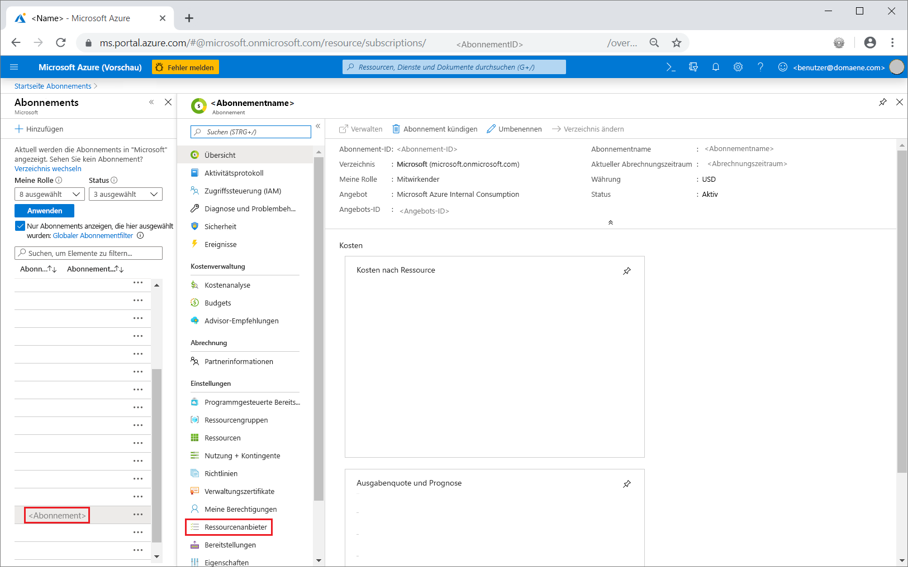

2. Suchen Sie nach „Migration“, und wählen Sie rechts neben **Microsoft.DataMigration** die Option **Registrieren** aus.

    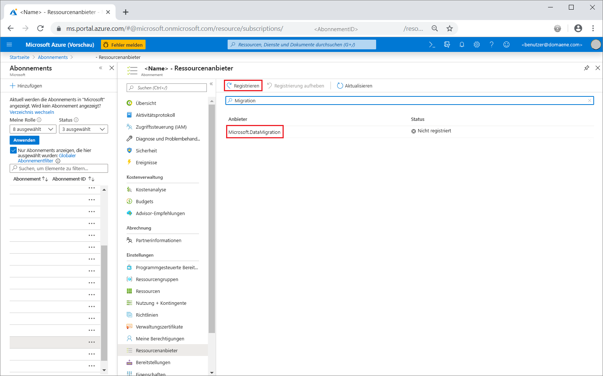

## <a name="create-an-instance-of-the-service"></a>Erstellen einer Instanz des Diensts

1. Klicken Sie auf **+ Ressource erstellen**, um eine Instanz von Azure Database Migration Service zu erstellen.

2. Suchen Sie im Marketplace nach „Migration“, wählen Sie **Azure Database Migration Service** aus, und klicken Sie dann auf dem Bildschirm **Azure Database Migration Service** auf **Erstellen**.

3. Auf dem Bildschirm **Create Migration Service** (Migrationsdienst erstellen):

    - Wählen Sie einen **Dienstnamen** aus, der einprägsam und in Ihrer Azure Database Migration Service-Instanz eindeutig ist.
    - Wählen Sie das Azure-**Abonnement** aus, in dem Sie die Instanz erstellen möchten.
    - Wählen Sie eine vorhandene **Ressourcengruppe** aus, oder erstellen Sie eine neue.
    - Wählen Sie den **Ort** aus, der die geringste Entfernung zum Quell- oder Zielserver aufweist.

    > [!IMPORTANT]
    > Während der Vorschau wird der Hybridmodus nur in der Region „USA, Osten“ unterstützt. Da der Hybrid Worker in Ihrem lokalen Netzwerk installiert ist, gibt es nur wenig oder gar keine Auswirkungen auf die Leistung, auch wenn Sie eine Migration zu einem Ziel in einer anderen Region durchführen.

    - Wählen Sie unter **Dienstmodus** die Option **Hybrid (Vorschau)** aus.

      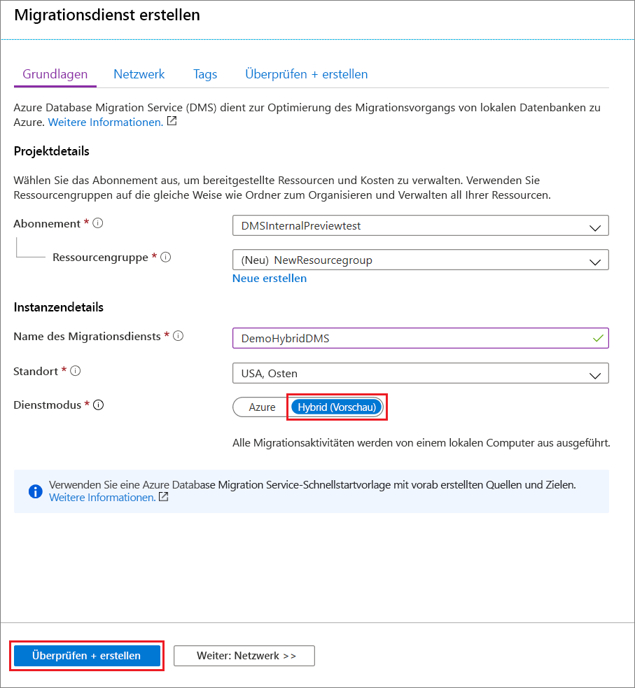

4. Klicken Sie auf **Überprüfen + erstellen**.

5. Lesen Sie auf der Registerkarte **Überprüfen + erstellen** die Bedingungen, überprüfen Sie die weiteren bereitgestellten Informationen, und klicken Sie dann auf **Erstellen**.

    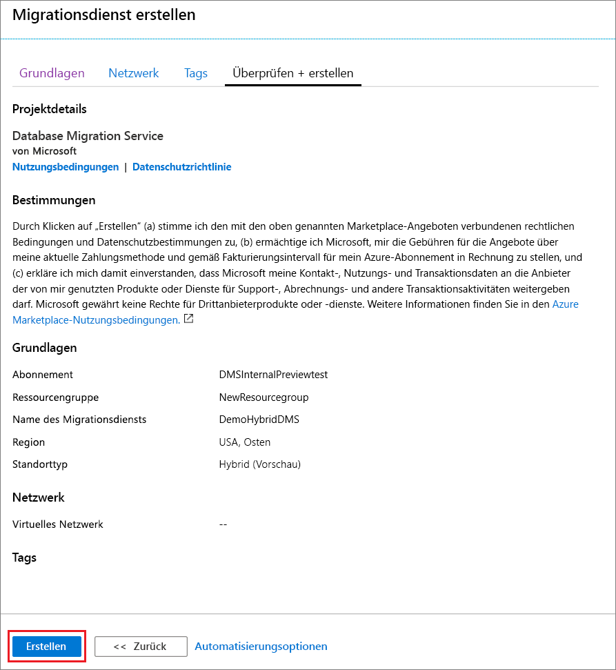

    Nach einigen Augenblicken wird Ihre Azure Database Migration Service-Instanz im Hybridmodus erstellt und kann eingerichtet werden. Die Azure Database Migration Service-Instanz wird wie in der folgenden Abbildung angezeigt:

    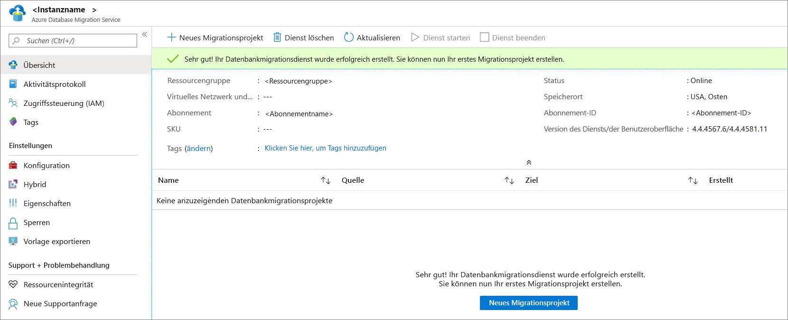

6. Nachdem der Dienst erstellt wurde, klicken Sie auf **Eigenschaften**, und kopieren Sie den im Feld **Ressourcen-ID** angezeigten Wert. Diesen Wert verwenden Sie, um den Hybrid Worker für Azure Database Migration Service zu installieren.

    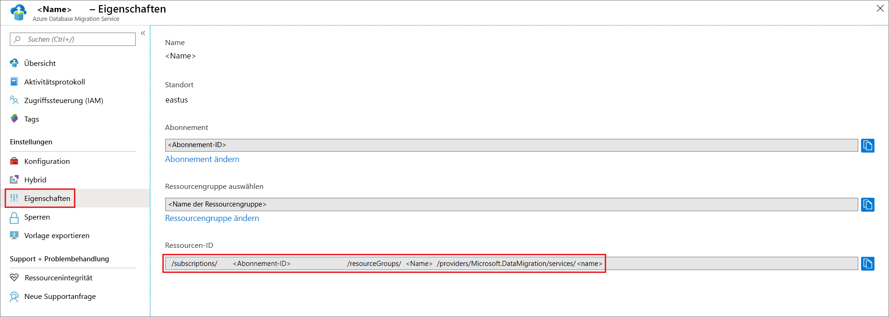

## <a name="create-azure-app-registration-id"></a>Erstellen einer Azure-App-Registrierungs-ID

Sie müssen eine Azure-App-Registrierungs-ID erstellen, die der lokale Hybrid Worker für die Kommunikation mit Azure Database Migration Service in der Cloud verwenden kann.

1. Wählen Sie im Azure-Portal **Azure Active Directory**, dann **App-Registrierungen** und dann **Neue Registrierung** aus.
2. Geben Sie einen Namen für die Anwendung an, und wählen Sie dann unter **Unterstützte Kontotypen** den zu unterstützenden Kontotyp aus, um anzugeben, wer die Anwendung verwenden darf.

    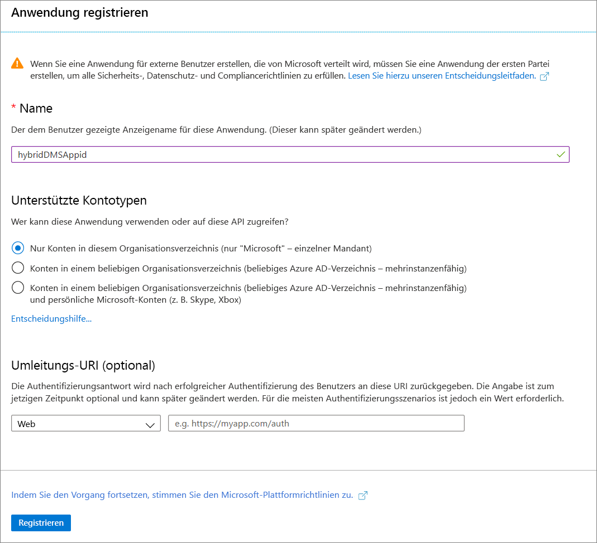

3. Verwenden Sie für die Felder **Umleitungs-URI (optional)** die Standardwerte, und klicken Sie dann auf **Registrieren**.

4. Nachdem die App-ID registriert wurde, notieren Sie sich die **Anwendungs-ID (Client)** , die Sie beim Installieren des Hybrid Workers verwenden werden.

5. Navigieren Sie im Azure-Portal zum Azure Database Migration Service, wählen Sie **Zugriffssteuerung (IAM)** aus, und klicken Sie dann auf **Rollenzuweisung hinzufügen**, um den Zugriff als Mitwirkender zur App-ID hinzuzufügen.

    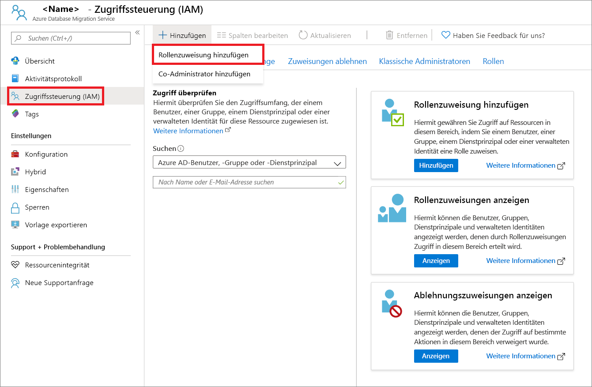

6. Wählen Sie **Mitwirkender** als Rolle aus, weisen Sie den Zugriff für **Azure AD-Benutzer oder Dienstprinzipal** zu, und wählen Sie dann den App-ID-Namen aus.

    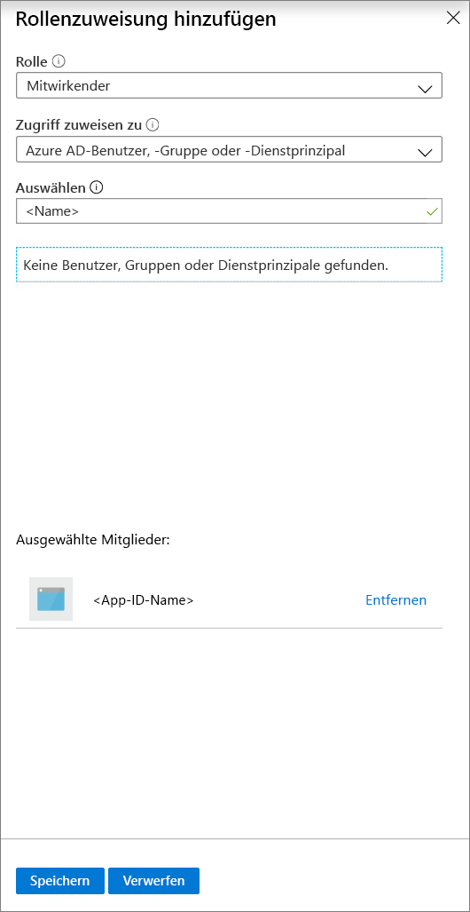

7. Klicken Sie auf **Speichern**, um die Rollenzuweisung für die App-ID in der Azure Database Migration Service-Ressource zu speichern.

## <a name="download-and-install-the-hybrid-worker"></a>Herunterladen und Installieren des Hybrid Workers

1. Navigieren Sie im Azure-Portal zu Ihrer Instanz von Azure Database Migration Service.

2. Wählen Sie unter **Einstellungen** die Option **Hybrid** aus, und klicken Sie dann auf **Installationsprogramm herunterladen**.

    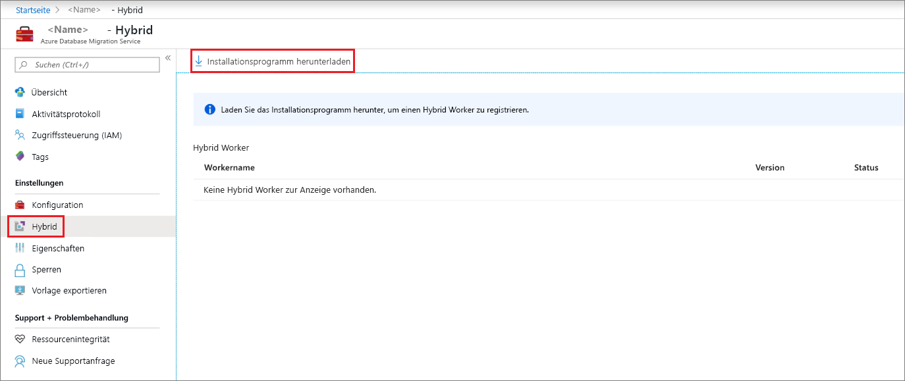

3. Extrahieren Sie die ZIP-Datei auf dem Server, der den Hybrid Worker für Azure Database Migration Service hosten soll.

    > [!IMPORTANT]
    > Für das Azure Database Migration Service-Hybridinstallationsprogramm ist mindestens .NET 4.7.2 erforderlich. Die aktuellen .NET-Versionen finden Sie auf der Seite [Herunterladen von .NET Framework](https://dotnet.microsoft.com/download/dotnet-framework).

4. Suchen und öffnen Sie im Installationsordner die Datei **dmsSettings.json**, geben Sie den Wert für **ApplicationId** und **resourceId** an, und speichern Sie dann die Datei.

    
 
5. Generieren Sie mithilfe des folgenden Befehls ein Zertifikat, mit dem Azure Database Migration Service die Kommunikation vom Hybrid Worker authentifizieren kann.

    ```
    <drive>:\<folder>\Install>DMSWorkerBootstrap.exe -a GenerateCert
    ```

    Das Zertifikat wird im Installationsordner generiert.

    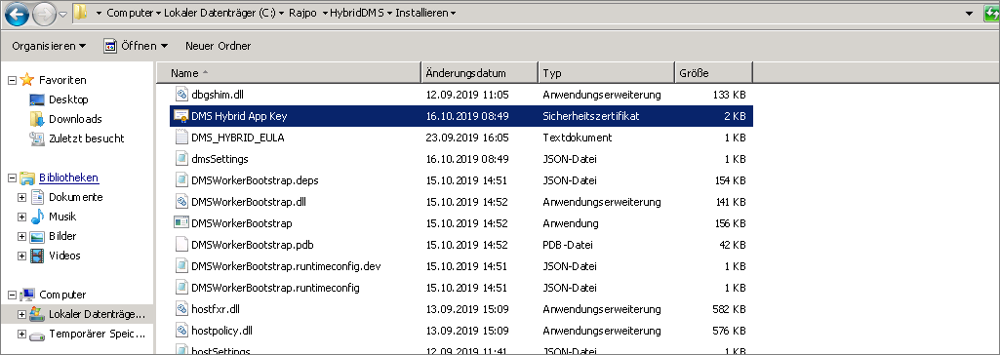

6. Navigieren Sie im Azure-Portal zur App-ID, und wählen Sie unter **Verwalten** die Option **Zertifikate & Geheimnisse** und dann **Zertifikat hochladen** aus, um das generierte öffentliche Zertifikat auszuwählen.

    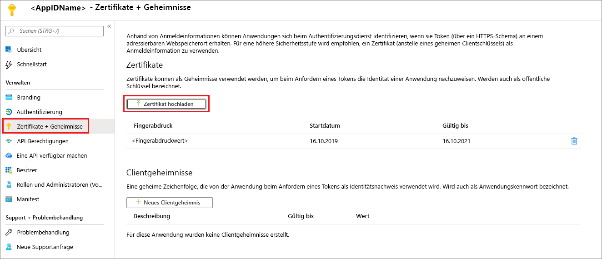

7. Installieren Sie den Hybrid Worker für Azure Database Migration Service auf Ihrem lokalen Server, indem Sie den folgenden Befehl ausführen:

    ```
    <drive>:\<folder>\Install>DMSWorkerBootstrap.exe -a Install -IAcceptDMSLicenseTerms
    ```

8. Wenn das Installationsprogramm ohne Fehler ausgeführt wird, zeigt der Dienst in Ihrer Azure Database Migration Service-Instanz den Status „Online“ an, und Sie können Ihre Datenbanken migrieren.

    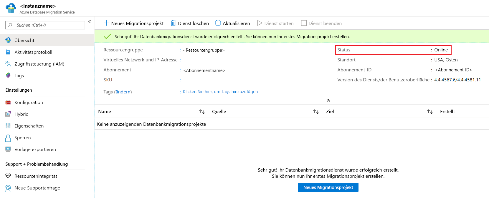

## <a name="uninstall-azure-database-migration-service-hybrid-mode"></a>Deinstallieren der Azure Database Migration Service-Instanz im Hybridmodus

Zurzeit wird das Deinstallieren einer Azure Database Migration Service-Instanz im Hybridmodus nur über das Installationsprogramm unterstützt, mit dem der Hybrid Worker für Azure Database Migration Service auf Ihrem lokalen Server installiert wird. Führen Sie den folgenden Befehl aus:

```
<drive>:\<folder>\Install>DMSWorkerBootstrap.exe -a uninstall
```

## <a name="next-steps"></a>Nächste Schritte

> [!div class="nextstepaction"]
> [Migrieren von SQL Server zu einer verwalteten Azure SQL-Datenbank-Instanz mithilfe von DMS (online)](tutorial-sql-server-managed-instance-online.md)
> [Offlinemigration von SQL Server zu einer Einzel- oder Pooldatenbank in Azure SQL-Datenbank mit DMS](tutorial-sql-server-to-azure-sql.md)
