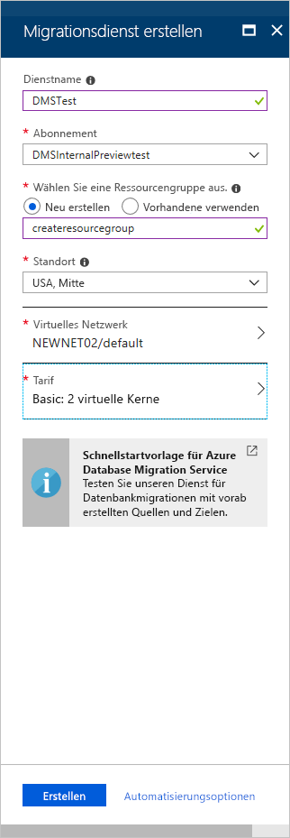

# Schnellstart: Erstellen einer Azure Database Migration Service-Instanz über das Azure-Portal

In dieser Schnellstartanleitung verwenden Sie das Azure-Portal, um eine Instanz von Azure Database Migration Service zu erstellen.  Nachdem Sie den Dienst erstellt haben, können Sie ihn zum Migrieren von Daten aus einer lokalen SQL Server-Instanz zu einer Azure SQL-Datenbank verwenden.

Wenn Sie kein Azure-Abonnement besitzen, können Sie ein [kostenloses Konto](https://azure.microsoft.com/free/) erstellen, bevor Sie beginnen.

## Melden Sie sich auf dem Azure-Portal an.

Öffnen Sie Ihren Webbrowser, navigieren Sie zum [Microsoft Azure-Portal](https://portal.azure.com/), und geben Sie dann Ihre Anmeldeinformationen ein, um sich am Portal anzumelden.

Die Standardansicht ist Ihr Dienstdashboard.

## Registrieren des Ressourcenanbieters

Sie müssen den Microsoft.DataMigration-Ressourcenanbieter registrieren, bevor Sie Ihre erste Instanz von Database Migration Service erstellen.

1. Klicken Sie im Azure-Portal auf **Alle Dienste** und anschließend auf **Abonnements**.

2. Wählen Sie das Abonnement aus, in dem Sie die Azure Database Migration Service-Instanz erstellen möchten, und klicken Sie dann auf **Ressourcenanbieter**.

3. Suchen Sie nach „Migration“, und wählen Sie rechts neben **Microsoft.DataMigration** die Option **Registrieren** aus.

    

## Erstellen einer Instanz des Diensts

1. Klicken Sie auf **+ Ressource erstellen**, um eine Instanz von Azure Database Migration Service zu erstellen.

2. Suchen Sie im Marketplace nach „Migration“, wählen Sie **Azure Database Migration Service** aus, und klicken Sie dann auf dem Bildschirm **Azure Database Migration Service** auf **Erstellen**.

3. Auf dem Bildschirm **Create Migration Service** (Migrationsdienst erstellen):

    - Wählen Sie einen **Dienstnamen** aus, der einprägsam und in Ihrer Azure Database Migration Service-Instanz eindeutig ist.
    - Wählen Sie das Azure-**Abonnement** aus, in dem Sie die Instanz erstellen möchten.
    - Wählen Sie eine vorhandene **Ressourcengruppe** aus, oder erstellen Sie eine neue.
    - Wählen Sie den **Ort** aus, der die geringste Entfernung zum Quell- oder Zielserver aufweist.
    - Wählen Sie ein vorhandenes **virtuelles Netzwerk** (VNET) aus, oder erstellen Sie eins.

        Das VNET erteilt Azure Database Migration Service Zugriff auf die Quelldatenbank und die Zielumgebung.

        Weitere Informationen zum Erstellen eines VNET im Azure-Portal finden Sie im Artikel [Erstellen eines virtuellen Netzwerks über das Azure-Portal](https://aka.ms/vnet).

    - Wählen Sie „Basic: 1 virtueller Kern“ als **Tarif** aus.

        

4. Klicken Sie auf **Erstellen**.

    Nach einigen Augenblicken wird die Azure Database Migration Service-Instanz erstellt und kann verwendet werden. Die Azure Database Migration Service-Instanz wird wie in der folgenden Abbildung angezeigt:

    

## Bereinigen von Ressourcen

Sie können alle in dieser Schnellstartanleitung erstellten Ressourcen bereinigen, indem Sie die [Azure-Ressourcengruppe](../azure-resource-manager/management/overview.md) löschen. Navigieren Sie zum Löschen der Ressourcengruppe zu der von Ihnen erstellten Azure Database Migration Service-Instanz. Klicken Sie auf den Namen der **Ressourcengruppe** und anschließend auf **Ressourcengruppe löschen**. Durch diese Aktion werden alle Ressourcen in der Ressourcengruppe sowie die Gruppe selbst gelöscht.

## Nächste Schritte

> [!div class="nextstepaction"]
> [Migrieren von SQL Server zu Azure SQL-Datenbank](tutorial-sql-server-to-azure-sql.md)