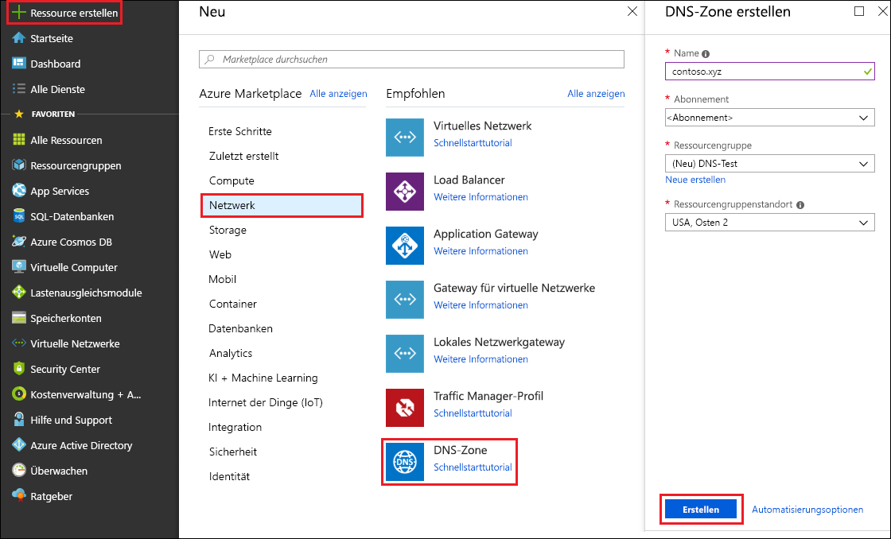

# Erste Schritte mit Azure DNS im Azure-Portal

> [!div class="op_single_selector"]
> * [Azure-Portal](dns-getstarted-portal.md)
> * [PowerShell](dns-getstarted-powershell.md)
> * [Azure CLI 1.0](dns-getstarted-cli-nodejs.md)
> * [Azure CLI 2.0](dns-getstarted-cli.md)

In diesem Artikel erfahren Sie Schritt für Schritt, wie Sie Ihre erste DNS-Zone und Ihren ersten DNS-Eintrag im Azure-Portal erstellen. Sie können diese Schritte auch mithilfe von Azure PowerShell oder der plattformübergreifenden Azure CLI ausführen.

Eine DNS-Zone wird zum Hosten der DNS-Einträge für eine bestimmte Domäne verwendet. Wenn Sie eine Domäne in Azure DNS hosten möchten, müssen Sie eine DNS-Zone für diesen Domänennamen erstellen. Jeder DNS-Eintrag für Ihre Domäne wird dann in dieser DNS-Zone erstellt. Und schließlich müssen Sie die Namenserver für die Domäne konfigurieren, um Ihre DNS-Zone im Internet zu veröffentlichen. Jeder dieser Schritte wird im Folgenden beschrieben.

## Erstellen einer DNS-Zone

1. Melden Sie sich auf dem Azure-Portal an.
2. Klicken Sie im Hubmenü auf **Neu > Netzwerk** und anschließend auf **DNS-Zone**, um das Blatt „DNS-Zone erstellen“ zu öffnen.

    

4. Geben Sie Ihrer DNS-Zone auf dem Blatt **DNS-Zone erstellen** einen Namen. Beispiel: *contoso.com*.
 
    

5. Geben Sie als nächstes die gewünschte Ressourcengruppe an. Sie können entweder eine neue Ressourcengruppe erstellen oder eine bereits vorhandene auswählen. Wenn Sie eine neue Ressourcengruppe erstellen möchten, verwenden Sie die Dropdownliste **Speicherort**, um den Speicherort der Ressourcengruppe anzugeben. Diese Einstellung bezieht sich auf den Speicherort der Ressourcengruppe und hat keine Auswirkung auf die DNS-Zone. Der Speicherort der DNS-Zone ist immer global und wird nicht angezeigt.

6. Sie können das Kontrollkästchen **An Dashboard anheften** aktiviert lassen, um Ihre neue Zone auf dem Dashboard leichter wiederzufinden. Klicken Sie dann auf **Erstellen**.

    

7. Nachdem Sie auf „Erstellen“ klicken, sehen Sie, wie Ihre neue Zone auf dem Dashboard konfiguriert wird.

    

8. Wenn Ihre neue Zone erstellt wurde, wird das Blatt Ihrer neuen Zone auf dem Dashboard geöffnet.

## Erstellen eines DNS-Eintrags

Im folgenden Beispiel werden die einzelnen Schritte zur Erstellung eines neuen A-Eintrags erläutert. Informationen zu anderen Eintragstypen und zum Ändern vorhandener Einträge finden Sie unter [Verwalten von DNS-Einträgen und - Ressourceneintragssätzen im Azure-Portal](dns-operations-recordsets-portal.md). 

1. Wählen Sie oben auf dem Blatt **DNS-Zone** die Option **+ Ressourceneintragssatz** aus, um das Blatt **Ressourceneintragssatz hinzufügen** zu öffnen.

    

4. Benennen Sie auf dem Blatt **Ressourceneintragssatz hinzufügen** Ihren Ressourceneintragssatz. Sie können dem Ressourceneintragssatz z.B. den Namen „**www**“ geben.

    

5. Wählen Sie den gewünschten Eintragstyp. Wählen Sie für dieses Beispiel die Option **A**.
6. Legen Sie die **Gültigkeitsdauer**fest. Die Gültigkeitsdauer beträgt standardmäßig eine Stunde.
7. Fügen Sie die IP-Adresse des Eintrags hinzu.
8. Wählen Sie unten auf dem Blatt **OK**, um den DNS-Eintrag zu erstellen.

## Anzeigen von Datensätzen

Im unteren Teil des Blatts der DNS-Zone finden Sie die Einträge für die DNS-Zone. Sie sehen die standardmäßigen NS- und SOA-Einträge, die in jeder Zone erstellt werden, sowie alle neuen, von Ihnen erstellen Einträge.

## Aktualisieren der Namenserver

Wenn Sie sicher sind, dass Ihre DNS-Zone und die Einträge ordnungsgemäß eingerichtet wurden, müssen Sie den Namen Ihrer Domäne für die Verwendung der Azure-DNS-Namenserver konfigurieren. Auf diese Weise können andere Benutzer im Internet Ihre DNS-Einträge finden.

Die Namenserver für Ihre Zone sind im Azure-Portal angegeben:

Diese Namenserver müssen in der Domänennamen-Registrierungsstelle konfiguriert werden (das ist die Stelle, bei der Sie den Domänennamen erworben haben). Die Registrierungsstelle bietet eine Option an, um die Namenserver für die Domäne einzurichten. Weitere Informationen finden Sie unter [Delegieren einer Domäne an Azure DNS](dns-domain-delegation.md).

## Nächste Schritte

Weitere Informationen zu Azure DNS finden Sie unter [Azure DNS – Übersicht](dns-overview.md).

Weitere Informationen zum Verwalten von DNS-Einträgen in Azure DNS finden Sie unter [Verwalten von DNS-Einträgen und - Ressourceneintragssätzen im Azure-Portal](dns-operations-recordsets-portal.md).

