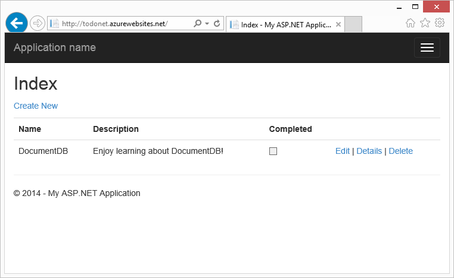
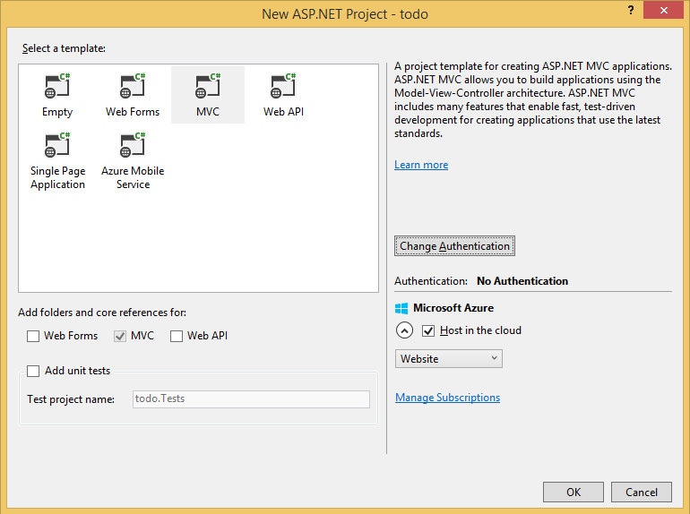
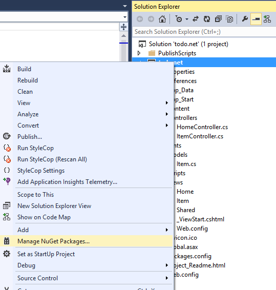
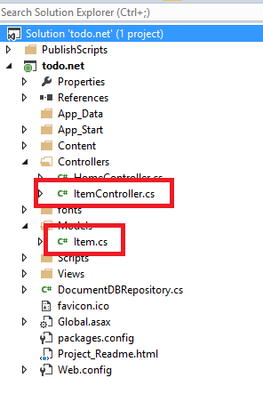
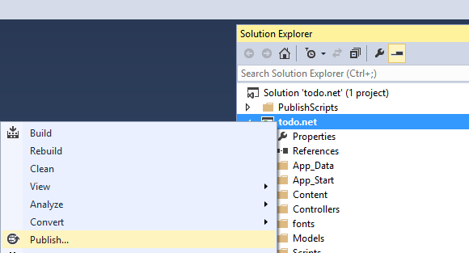

<properties title="Build a web application with ASP.NET MVC using DocumentDB" pageTitle="Erstellen einer Webanwendung mit ASP.NET MVC unter Verwendung von DocumentDB | Azure" description="Erfahren Sie, wie Sie mithilfe von DocumentDB eine To-Do-List-Webanwendung erstellen. Das Speichern von und der Zugriff auf Daten erfolgt von einer ASP.NET-MVC-Webanwendung, die in Azure gehostet wird."  metaKeywords="NoSQL, DocumentDB,  database, document-orientated database, JSON, account" services="documentdb"  solutions="data-management" documentationCenter=""  authors="ryancraw" manager="jhubbard" editor="cgronlun" videoId="" scriptId="" />

<tags ms.service="documentdb" ms.workload="data-services" ms.tgt_pltfrm="na" ms.devlang="dotnet" ms.topic="article" ms.date="08/19/2014" ms.author="ryancraw" />

<a name="_Toc395809351">Build a web application with ASP.NET MVC using DocumentDB</a>
=======================================================================================================
  <a name="_Toc389828008">Overview</a>
==============================================================================================

<a name="_Toc395637759">Scenario</a>
------------------------------------

To highlight how customers can efficiently leverage Azure DocumentDB to store and query JSON documents, this document provides an end-to-end walk-through of building a ToDo List web application using Azure Document DB.

This walk-through shows you how to use DocumentDB service provided by Azure to store and access data from an ASP.NET MVC web application hosted on Azure and presumes that you have some prior experience using ASP.NET MVC and Azure Websites.

You will learn:

1\. Creating and provisioning a DocumentDB Account

2\. Creating a ASP.NET MVC Application

3\. Connecting to and using Azure DocumentDB from your web application

4\. Deploying the Web Application to Azure Websites

By following this walk-through, you will build a simple web-based task-management application that allows creating, retrieving and completing of tasks. The tasks will be stored as JSON documents in Azure DocumentDB.

<a name="_Toc395637760">Prerequisites</a>
================================================================

Before following the instructions in this article, you should ensure that you have the following installed:

Git for Windows <http://www.git-scm.com/downloads>

Visual Studio 2013 (or [Visual Studio Express][] which is the free version)

Azure SDK for .NET version 2.3 or higher, available through [Microsoft Web Platform Installer][]

All the screen shots in this document have been taken using Visual Studio 2013 with Update 3 applied and Azure SDK for .NET version 2.4. If your system is configured with different versions it is possible that your screens and options won't match entirely, but if you meet the above prerequisites this solution should work.

<a name="_Toc395637761">Create a DocumentDB database account</a>
================================================================

To provision a DocumentDB database account in Azure, open the Azure Management Portal and either Click the Azure Gallery tile on the homepage or click "+" in the lower left hand corner of the screen.

This will open the Azure Gallery, where you can select from the many available Azure services. In the Gallery, select "Data, storage and backup" from the list of categories.

From here, select the option for Azure DocumentDB

Then select "Create" from the bottom of the screen

This will open up the "New DocumentDB" blade where you can specify the name, region, scale, resource group and other settings for your new account.

Once you're done supplying the values for your account, click "Create" and the provisioning process will begin creating your database account.
When the provisioning process is complete, you should see a notification appear in the notifications area of the portal and the tile on your start screen (if you selected to create one) will change to show the completed action.

Once provisioning is complete, clicking the DocumentDB tile from the start screen will bring up the main blade for this newly created DocumentDB account.

 

Using the "Keys" button, access your endpoint URL and the Primary Key, copy these to your clipboard and keep them handy as we will use these values in the web application we will use these values in the web application we will create next.

We will now walk through how to create a new ASP.NET MVC application from the ground-up. For your reference the complete solution can be downloaded [here].

<a name="_Toc395637762">Create a new ASP.NET MVC application</a>
================================================================

In Visual Studio, click File - New Project and select the option to create a new ASP.NET MVC Web Application.

Select where you would like to create the project, what you want the project to be called (I'm using "todo") and click Ok.

If you plan on hosting your application in Azure then select the box on the lower right to "Host in the cloud". We've selected to host in the cloud, and run the application hosted in an Azure Website. Selecting this option will pre-provision an Azure Website for you and make life a lot easier when it comes times to deploy the final working application. If you want to host this elsewhere or don't want to configure Azure upfront, then just un-check the "Host in the Cloud" option.

Select OK and let Visual Studio do its thing around scaffolding the empty ASP.NET MVC template. If you chose to host this in the Cloud you will see at least one additional screen asking you to login to your Azure account and provide some values for your new Website. Proceed to supply all these Azure values and continue. 

I haven't chosen a "Database server" here because we're not using an Azure SQL Database Server here, we're going to be creating a new Azure DocumentDB Account later on in the management portal. 

Once Visual Studio has finished creating the boilerplate MVC application you have an empty ASP.NET application that you can run locally.

We'll skip running locally because I'm sure we've all seen the ASP.NET "Hello World" application. Let's go straight to adding DocumentDB to this project and building our application.

</h1>
<a name="_Toc395637767">Adding DocumentDB to your project</a>
=============================================================

That takes care of most of the ASP.NET MVC plumbing that we need for
this solution. Now let's get to the real purpose of this tutorial, adding Azure DocumentDB to our web application.

### 

### <a name="_Toc395637764">Installing the NuGet package</a>

The DocumentDB .NET SDK is packaged and distributed as a NuGet package. Using the NuGet package manager in Visual Studio (which you can get to by Right-Clicking on the Project and choosing "Manage NuGet Packages"

Search for Online for "Azure DocumentDB" and install the package. This will download and install the DocumentDB package as well as all dependencies, like Newtonsoft.Json.

**NOTE:** While the service is still in preview, the NuGet package is marked as "Prerelease" so you need to include the option to "Include Prerelease", else you will not find the package. 

Alternatively you could use the Package Command Console to install the package by typing;

    Install-Package Microsoft.Azure.Documents.Client -Pre

Once installed your Visual Studio solution should resemble the following with two new references added;

<a name="_Toc395637763">Setting up the ASP.NET MVC application</a>
==================================================================

### 

### <a name="_Toc395637764">Add a Model</a>

Let's begin by creating the **M** in MVC, the model. In Solution Explorer, right-click the *Models* folder and then click **Add**, then **Class**

Name your new Class, **Item** and then add the following code in to this new Class

    public class Item
    {
        [JsonProperty(PropertyName="id")]
        public string Id { get; set; }
		
        [JsonProperty(PropertyName="name")]
        public string Name { get; set; }
		
        [JsonProperty(PropertyName = "desc")]
        public string Description { get; set; }
		
        [JsonProperty(PropertyName="isComplete")]
        public bool Completed { get; set; }    
    }

All data in DocumentDB is passed over the wire, and stored, as JSON. To control the way your objects are serialized/deserialized by JSON.NET you can use the JsonProperty attribute as demonstrated in the Item class we just created. You don't **have** to do this but i wanted to ensure that my properties followed the JSON camelCase naming conventions. 

Not only can you control the format of the property name when it goes in to JSON, but you can entirely rename your .NET properties like I did with the Description property. 

You can, if you like, use JsonConverter objects here as well to completely control how serialization is handled.  

In order to get Visual Studio to resolve the "JsonProperty" attribute used here you need to add the following using statement to the using section of your class file;

    using Newtonsoft.Json;

### <a name="_Toc395637765">Add a Controller</a>

That takes care of the M, now let's create the **C** in MVC, a controller class.
In **Solution Explorer**, right-click the *Controllers* folder and then click **Add**, then **Controller**.

In the **Add Scaffold** dialog box, click **MVC 5 Controller - Empty.** Click **Add.**

Name your new Controller, **ItemController.**

Visual Studio will now add the ItemController your Solution Explorer should look like similar to below.

### <a name="_Toc395637766">Add Views</a>

And finally, let's create the **V** in MVC, a view.

#### Add Item Index View

Expand the ***Views***  folder in Solution Explorer and location the (empty) Item folder which Visual Studio would've created for you when you added the *ItemController* earlier. Right click on ***Item*** and choose to Add a new View.

In the "Add View" dialog. Call your view "***Index***", use the ***List*** Template, select the ***Item (todo.Models)*** which we created earlier as the class and finally use the ***~Views/Shared/_Layout.cshtml*** in the Solution as the Layout page.

Once all these values are set, click Add and let Visual Studio create your view for you. Visual Studio will create a template view. Once it is done, it will open the cshtml file created. We can close this document in Visual Studio as we will come back to it later.

#### Add New Item View

In a similar fashion to above, create a new View for creating new Items as per the example shown below;

#### Add Edit Item View

============================

And finally, add one last View for editing an Item in the same way as before;

Once this is done, close the cshtml documents in Visual Studio as we will return to these Views later.

</h1>
<a name="_Toc395637769">Wiring up DocumentDB</a>
------------------------------------------------

### <a name="_Toc395637770">Listing Incomplete Items</a>

Open the **ItemController** and remove all the code within the class (but leave the class) that Visual Studio added. We'll rebuild it piece by piece using DocumentDB.

Add the following code snippet within the now empty ItemController class;

    public ActionResult Index()
    {
        var items = DocumentDBRepository.GetIncompleteItems();
        return View(items);
    }

This code also uses a "pseudo repository" class called DocumentDBRepository which we have yet to create. This is actually just a Helper class that contains all the DocumentDB specific code. For the purposes of this walk-through we aren't going to implement a full data access layer with dependency injection, and factories and repository patterns, as you would probably be doing if you were building a real world application. 
For the purposes of this walk-through we're just going to put all the data access logic directly in to one project to keep things simple and focus on the DocumentDB specific bits.

Add a new Class to your project and call it **DocumentDBRepository.**
Replace the code in the class file with the following;

    public static class DocumentDBRepository
    {
        private static string databaseId;
        private static String DatabaseId
        {
			get
			{
				if (string.IsNullOrEmpty(databaseId))
				{
					databaseId = ConfigurationManager.AppSettings["database"];
				}
			
				return databaseId;
			}
        }
			  
        private static string collectionId;
        private static String CollectionId
        {
			get
			{
				if (string.IsNullOrEmpty(collectionId))
				{
					collectionId = ConfigurationManager.AppSettings["collection"];
				}
			
				return collectionId;
			}
        }
				
        private static Database database;
        private static Database Database
        {
			get
			{
				if (database == null)
				{
					database = ReadOrCreateDatabase();
				}
				
				return database;
			}
        }
		
        private static DocumentCollection collection;
        private static DocumentCollection Collection
        {
			get
			{
				if (collection == null)
				{
					collection = ReadOrCreateCollection(Database.SelfLink);
				}
				
				return collection;
			}
        }
		
        private static DocumentClient client;
        private static DocumentClient Client
        {
            get
            {
                if (client == null)
                {
					string endpoint = ConfigurationManager.AppSettings["endpoint"];
					string authKey = ConfigurationManager.AppSettings["authKey"];
					Uri endpointUri = new Uri(endpoint);
					client = new DocumentClient(endpointUri, authKey);
                }
                
                return client;
            }
        }
    } 

#### 

Spend some time resolving all the namespaces in Visual Studio. All namespaces will be easy to resolve in Visual Studio as long as the NuGet package was installed successfully. The references to the ReadOrCreateDatabase and ReadOrCreateCollection methods will remain unresolved until we have added them, which comes next. 

There are two method calls used here for reading or creating DocumentDB Databases and Document Collections.
So add the following two methods to this class;

    private static DocumentCollection ReadOrCreateCollection(string databaseLink)
    {
        var col = Client.CreateDocumentCollectionQuery(databaseLink)
                          .Where(c => c.Id == CollectionId)
                          .AsEnumerable()
                          .FirstOrDefault();

        if (col == null)
        {
            col = Client.CreateDocumentCollectionAsync(databaseLink, new DocumentCollection { Id = CollectionId }).Result;
        }
		
        return col;
    }

    private static Database ReadOrCreateDatabase()
    {
        var db = Client.CreateDatabaseQuery()
                        .Where(d => d.Id == DatabaseId)
                        .AsEnumerable()
                        .FirstOrDefault();
		
        if (db == null)
        {
            db = Client.CreateDatabaseAsync(new Database { Id = DatabaseId }).Result;
        }
		
        return db;
    }

</h1>

#### 

This takes care setting up the Database, a DocumentCollection, and creating some code to connect to DocumentDB through the DocumentClient. 

We're reading some values from configuration, so open the **web.config** and add the following lines under the
<AppSettings\> section;

    <add key="endpoint" value="enter you endpoint url from the Azure Management Portal"/>
    <add key="authKey" value="enter one of the keys from the Azure Management Portal"/>
    <add key="database" value="ToDoList"/>
    <add key="collection" value="Items"/>

</h4>

Jetzt fügen wir unserer Arbeit etwas Code hinzu. 
Eine ToDo-Listenanwendung soll vor allem die nicht vollständigen Elemente anzeigen können. Das erreichen Sie mit der unten aufgeführten Methode. Kopieren Sie diese also, und fügen Sie sie an eine beliebige Stelle der Repository-Klasse ein, mit der wir arbeiten.
    
    public static List<Item> GetIncompleteItems()
    {
        return Client.CreateDocumentQuery<Item>(Collection.DocumentsLink)
                .Where(d => !d.Completed)
                .AsEnumerable()
                .ToList<Item>();
    }
    
Der Verweis auf *CreateDocumentQuery* wird manuell aufgelöst, nachdem Sie die folgende using-Anweisung hinzugefügt haben.

    using Microsoft.Azure.Documents.Linq;

Jetzt sollte Ihre Lösung ohne Fehler erstellen können.

Wenn Sie die Anwendung jetzt ausführen, werden Sie zum Home-Controller und der Indexansicht des Controllers geleitet. Das ist das Standardverhalten für das MVC-Vorlagenprojekt, das am Anfang ausgewählt wurde, das möchten wir jedoch nicht! Zum Ändern dieses Verhaltens muss die Weiterleitung dieser MVC-Anwendung geändert werden.

Öffnen Sie ***App\_Start\RouteConfig.cs***, und suchen Sie nach der Zeile, die mit "defaults" beginnt: und ersetzten Sie diese mit der folgenden;

    defaults: new { controller = "Item", action = "Index", id = UrlParameter.Optional }

Damit weiß ASP.NET MVC, dass Sie keinen Wert in der URL angegeben haben, um das Routingverhalten zu steuern, dass anstelle von "Home" "Item" als Controller und den Benutzerindex als Ansicht verwendet.
Wenn Sie die Anwendung jetzt ausführen, ruft sie **ItemController** auf und gibt die Ergebnisse der **GetIncompleteItems**-Methode an die Ansicht Views\Item\Index zurück. 

Wenn Sie dieses Projekt jetzt erstellen und ausführen, sollten Sie etwas wie folgendes sehen;    

### <a name="_Toc395637771">Hinzufügen von Elementen</a>

Als Nächstes werden einige Elemente zu unserer Datenbank hinzugefügt, damit mehr als eine leere Tabelle angezeigt wird.

Wir haben bereits eine Ansicht zum Erstellen und eine Schaltfläche in der Indexansicht,mit der der Benutzer zur Ansicht "Erstellen" gelangt. Jetzt fügen wir dem Controller und Repository etwas Code hinzu, mit dem der Datensatz in DocumentDB gespeichert wird.

Öffnen Sie ***ItemController.cs***, und fügen Sie den folgenden Codeausschnitt hinzu, mit dem ASP.NET MVC mitgeteilt wird, was bei der Aktion "Erstellen" zu tun ist, in diesem Fall nur die erstellte Create.cshtml-Ansicht anzeigen.

    public ActionResult Create()
    { 
	return View(); 
    }

Es ist noch weiterer Code in diesem Controller notwendig, mit dem die Übermittlung aus der Erstellansicht akzeptiert wird.

Fügen Sie als Nächstes den nächsten Codeblock hinzu, mit dem ASP.NET MVC mitgeteilt wird, was mit einem Formular POST für diesen Controller geschehen soll.
	
    [HttpPost]
    [ValidateAntiForgeryToken]
    public async Task<ActionResult> Create([Bind(Include = "Id,Name,Description,Completed")] Item item)  
    {
		if (ModelState.IsValid)  
		{  
		    await repo.CreateDocument(item);  
		    return RedirectToAction("Index");  
		}   
    	return View(item);   
    }

**Sicherheitshinweis**: Das Attribut [ValidateAntiForgeryToken] wird hier verwendet, um den Schutz dieser Anwendung vor webseitenübergreifenden Anforderungsfälschungen zu unterstützen. Das Hinzufügen dieses Attributs reicht jedoch nicht aus, denn auch Ihre Ansichten müssen mit diesem Antifälschungstoken zusammenarbeiten. Weitere Informationen zum Thema und Beispiele für eine ordnungsgemäße Implementierung finden Sie unter [Verhindern der webseitenübergreifenden Anforderungsfälschung][]. Im Quellcode unter dem Downloadlink am Ende des Artikels finden Sie die vollständige Implementierung.

**Sicherheitshinweis**: Wir verwenden außerdem das Attribut [Bind] im Methodenparameter, um einen Schutz vor Overposting-Angriffen bereitzustellen. Weitere Informationen finden Sie unter [Grundlegende CRUD-Vorgänge in ASP.NET MVC][]

Da dies jetzt vorhanden ist, übergibt der Element-Controller  das Element (auf sichere Weise) vom Formular an die CreateDocument-Methode des Repositorys der Klasse. Fügen Sie deshalb die folgende Methode zur Ihrer DocumentDBRepository-Klasse hinzu.

    public static async Task<Document> CreateItemAsync(Item item)
    {
        return await Client.CreateDocumentAsync(Collection.SelfLink, item);
    }

Mit dieser Methode wird ein Objekt an diese übergeben und in DocumentDB gespeichert.
Damit ist der für das Hinzufügen neuer Elemente zu unserer Datenbank erforderliche Code komplett.

### <a name="_Toc395637772">Bearbeiten von Elementen</a>

Es bleibt noch eine letzte Sache, nämlich die Möglichkeit, Elemente in der Datenbank zu bearbeiten, und sie als vollständig zu markieren, sobald die Aufgaben abgeschlossen sind. Wie beim Hinzufügen wurde die Ansicht zum Bearbeiten bereits hinzugefügt,sodass erneut lediglich zusätzlicher Code zu unserem Controller und zur DocumentDBRepository-Klasse hinzugefügt werden muss.

Fügen Sie der ItemController-Klasse folgenden Code hinzu:

    [HttpPost]
    [ValidateAntiForgeryToken]
    public async Task<ActionResult> Edit([Bind(Include = "Id,Name,Description,Completed")] Item item)
    {
        if (ModelState.IsValid)
        {
            await DocumentDBRepository.UpdateItemAsync(item);
            return RedirectToAction("Index");
        }

        return View(item);
    }
	
    public ActionResult Edit(string id)
    {
        if (id == null)
        {
            return new HttpStatusCodeResult(HttpStatusCode.BadRequest);
        }

        Item item = (Item)DocumentDBRepository.GetItem(id);
        if (item == null)
        {
            return HttpNotFound();
        }

        return View(item);
    }

Die erste Methode berücksichtigt HTTP GET, der erfolgt, wenn der Benutzer auf den Link "Bearbeiten" in der Indexansicht klickt. Mit dieser Methode wird ein Dokument aus DocumentDB abgerufen und an die Ansicht "Bearbeiten" übergeben.

Die Edit-Ansicht führt dann ein Http Post an den IndexController durch. 
Die zweite Methode, die wir hinzugefügt haben, verarbeitet dieses Übergeben des aktualisierten Objekts bis zu DocumentDB, damit es in der Datenbank beibehalten werden kann.

Fügen Sie der DocumentDBRepository-Klasse folgenden Code hinzu;

    public static Item GetItem(string id)
    {
        return Client.CreateDocumentQuery<Item>(Collection.DocumentsLink)
                    .Where(d => d.Id == id)
                    .AsEnumerable()
                    .FirstOrDefault();
    }
	
    public static async Task<Document> UpdateItemAsync(Item item)
    {
        Document doc = Client.CreateDocumentQuery(Collection.DocumentsLink)
                            .Where(d => d.Id == item.Id)
                            .AsEnumerable()
                            .FirstOrDefault();

        return await Client.ReplaceDocumentAsync(doc.SelfLink, item);
    }

Mit der ersten dieser zwei Methoden wird ein Element aus DocumentDB abgerufen, das an den ItemController und dann an die Ansicht "Bearbeiten" zurückgegeben wurde.

Mit der zweiten von uns hinzugefügten Methode wird das Dokument in DocumentDB mit der Version des vom ItemController übergebenen Dokuments ersetzt.

Das ist alles, was zum Ausführen unserer Anwendung, zum Auflisten unvollständiger Elemente, Hinzufügen neuer Elemente und Bearbeiten von Elementen notwendig ist.

</h3>
<a name="_Toc395637773">Lokales Ausführen der Anwendung</a>
=========================================================

### 

Zum Testen der Anwendung auf Ihrem lokalen Computer drücken Sie in Visual Studio F5. Damit sollte die Anwendung erstellt und ein Browser mit einer uns bereits bekannten leeren Tabellenseite gestartet werden:

1\.Verwenden Sie zum Eingeben von Informationen die bereitgestellten Felder für Element, Elementname und Kategorie, und klicken Sie dann auf den Link**"Neu erstellen"** und geben einige Werte ein. Lassen Sie das Kontrollkästchen "Abgeschlossen" deaktiviert, andernfalls hat das neue hinzugefügte Element den Status abgeschlossen und erscheint nicht in der Anfangsliste.

Wenn Sie auf "Erstellen" klicken, werden Sie zurück zur Indexansicht geleitet, und Ihr Element hoffentlich in der Liste angezeigt.

Sie können weitere Elemente zu Ihrer "Todo"-Liste hinzufügen.

2\.Wenn Sie auf "Bearbeiten" neben einem Element in der Liste klicken, werden Sie zur Bearbeitenansicht geleitet, wo Sie beliebige Eigenschaften Ihres Objekts, inklusive die Markierung als "Abgeschlossen", aktualisieren können. Damit wird das Element als abgeschlossen gekennzeichnet und aus der Liste unvollständiger Aufgaben entfernt.

3\.Aktivieren Sie zum Abschließen einer Aufgabe das Kontrollkästchen, und klicken Sie dann auf **Speichern.** Sie werden zurück zur Listenseite weitergeleitet, auf der das Element jetzt nicht mehr in der Liste erscheint.

</h3>
<a name="_Toc395637774">Bereitstellen der Anwendung auf Azure-Websites</a>
================================================================

### 

Nachdem eine vollständige, DocumentDB korrekt entgegenwirkende, Anwendung erstellt ist, stellen wir sie auf Azure Websites bereit.

Wenn Sie beim Erstellen eines leeren ASP.NET MVC-Projekts "In der Cloud hosten" ausgewählt haben, ist das Bereitstellen mit Visual Studio wirklich einfach, da die meiste Arbeit Ihnen abgenommen wird. Zum Veröffentlichen dieser Anwendung klicken Sie mit der rechten Maustaste auf das Projekt im Projektmappen-Explorer (stellen Sie vorher sicher, dass die Anwendung nicht lokal ausgeführt wird), und wählen Sie "Veröffentlichen" aus.

Ihren Anmeldeinformatioen entsprechend sollte alles bereits konfiguriert sein; tatsächlich wurde die Website bereits unter der angezeigten "Ziel-URL" in Azure erstellt, Sie müssen lediglich noch auf **Veröffentlichen** klicken.

Dann schließt Visual Studio die Veröffentlichung Ihrer Webanwendung in wenigen Sekunden ab und startet einen Browser, in dem das Ergebnis Ihrer Arbeit in Azure ausgeführt wird!

</h3>

<a name="_Toc395637775">Zusammenfassung</a>
======================================

### 

Glückwunsch! Sie haben somit Ihre erste ASP.NET MVC-Anwendung unter Verwendung von Azure DocumentDB erstellt und auf Azure Websites veröffentlicht. Der Quellcode für die vollständige Anwendung, einschließlich der Funktion "Details & Delete", die wir hier übersprungen haben, kann [hier][] heruntergeladen werden.

[\*]: https://microsoft.sharepoint.com/teams/DocDB/Shared%20Documents/Documentation/Docs.LatestVersions/PicExportError
[Visual Studio Express]: http://www.visualstudio.com/en-us/products/visual-studio-express-vs.aspx
[Microsoft-Webplattform-Installer]: http://www.microsoft.com/web/downloads/platform.aspx
[starten]: http://go.microsoft.com/fwlink/?LinkID=509838&clcid=0x409
[Verhindern von webseitenübergreifender Anforderungsfälschung]: http://go.microsoft.com/fwlink/?LinkID=517254
[Grundlegende CRUD-Vorgänge in ASP.NET MVC]: http://go.microsoft.com/fwlink/?LinkId=317598
