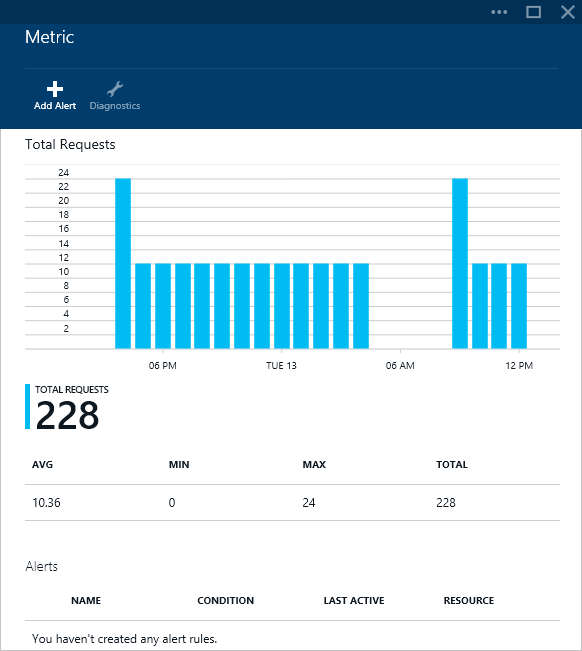
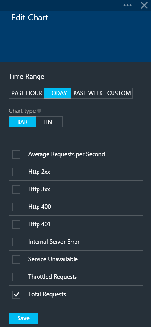

<properties 
	pageTitle="Überwachen eines DocumentDB-Kontos | Azure" 
	description="Erfahren Sie, wie Sie Ihr DocumentDB-Konto anhand von Leistungsmetriken (z. B. Anforderungen und Serverfehler) und Nutzungsmetriken (z. B. Speicherverbrauch) überwachen." 
	services="documentdb" 
	documentationCenter="" 
	authors="mimig1" 
	manager="jhubbard" 
	editor="cgronlun"/>

<tags 
	ms.service="documentdb" 
	ms.workload="data-services" 
	ms.tgt_pltfrm="na" 
	ms.devlang="na" 
	ms.topic="article" 
	ms.date="01/13/2015" 
	ms.author="mimig"/>

# Überwachen eines DocumentDB-Kontos  

Sie können Ihre DocumentDB-Konten im [Azure-Vorschauportal](https://portal.azure.com/) überwachen. Es sind für jedes DocumentDB-Konto sowohl Leistungsmetriken (wie Anfragen und Serverfehler) als auch Nutzungsmetriken (wie verbrauchter Speicher) verfügbar.

##  Anzeigen von Leistungsmetriken für ein DocumentDB-Konto
1.	Klicken Sie im [Azure-Vorschauportal](https://portal.azure.com/) auf **Durchsuchen**, dann auf **DocumentDB-Konten** und anschließend auf den Namen des DocumentDB-Kontos, dessen Leistungsmetriken Sie anzeigen möchten.
2.	Innerhalb des Bereichs **Überwachung** sehen Sie standardmäßig Folgendes:
	*	Gesamtanforderungen des aktuellen Tags.
	*	Durchschnittliche Anfragen pro Sekunde des aktuellen Tags. 
	
	

3.	Wenn Sie auf den Bereich **Anforderungen insgesamt** oder **Durchschnittliche Anforderungen pro Sekunde** klicken, wird ein detailliertes Fenster **Metrik** geöffnet.
4.	Das Fenster **Metrik** enthält Details zu den ausgewählten Metriken.  Im oberen Teil des Fensters befindet sich ein Diagramm und darunter eine Tabelle mit einer Aggregation der Werte der ausgewählten Metriken, also beispielsweise Durchschnitt, Minimum und Maximum.  Das Fenster "Metrik" zeigt auch eine Liste von Warnung, die definiert wurden. Sie ist gefiltert nach den im aktuellen Fenster "Metrik" anzeigten Metriken (wenn Sie eine Reihe von Warnungen haben, dann werden auf diese Weise hier nur die relevanten gezeigt).   

	

## Anpassen der Leistungsmetrikansichten für ein DocumentDB-Konto

1.	Klicken Sie zur Anpassung der in einem bestimmten Bereich angezeigten Metriken mit der rechten Maustaste auf das Metrikdiagramm, und wählen Sie dann **Diagramm bearbeiten**.  
	

2.	Im Fenster **Diagramm bearbeiten** gibt es Optionen zum Ändern der in diesem Bereich angezeigten Metriken sowie deren Zeitspanne.  
	

3.	Die im Bereich angezeigten Metriken können Sie verändern, indem Sie einfach die verfügbaren Leistungsmetriken auswählen oder löschen und dann unten im Fenster auf **Speichern** klicken.  
4.	Die Zeitspanne ändern Sie, indem Sie eine andere wählen (z. B. **Letzte Stunde**) und dann unten im Fenster auf **Speichern** klicken.  

	 

## Erstellen von nebeneinander liegenden Diagrammen mit Leistungsmetriken
Im Azure-Vorschauportal können Sie nebeneinander stehende Metrikdiagramme erstellen.  

1.	Klicken Sie zuerst mit der rechten Maustaste auf das Diagramm, das Sie klonen und ändern möchten, und wählen Sie dann **Anpassen**.. 

	

2.	Klicken Sie im Menü auf **Klonen**, um den Teil zu kopieren, und klicken Sie dann auf **Anpassung fertig**. 

	  

Sie können diesen Bereich jetzt wie jeden anderen Metrikbereich behandeln und ihn sowie die dort angezeigte Zeitspanne anpassen.  Wenn Sie das tun, werden zwei verschiedene Metrikdiagramme nebeneinander angezeigt.  
	  

## Anzeigen von Nutzungsmetriken für ein DocumentDB-Konto
1.	Klicken Sie im [Azure-Vorschauportal](https://portal.azure.com/) auf **Durchsuchen**, dann auf **DocumentDB-Konten** und anschließend auf den Namen des DocumentDB-Kontos, dessen Nutzungsmetriken Sie anzeigen möchten.
2.	Innerhalb des Bereichs **Nutzung** können Sie standardmäßig Folgendes anzeigen:
	*	Geschätzte Kosten
	*	Mit dem Konto verbrauchter Speicher
	*	Maximal verfügbarer Speicher des Kontos
	*	Nutzung von Benutzern und Berechtigungen
	*	Zuteilung von Kapazitätseinheiten (CU)
	*	Nutzung von Anlagen

	
 
## Einrichten von Warnungen bei Leistungsmetriken für ein DocumentDB-Konto
1.	Klicken Sie im [Azure-Vorschauportal](https://portal.azure.com/) auf **Durchsuchen**, dann auf **DocumentDB-Konten** und anschließend auf den Namen des DocumentDB-Kontos, für das Sie Warnungen für Leistungsmetriken einrichten möchten.
2.	Klicken Sie innerhalb des Bereichs **Vorgänge** auf den Bereich **Warnungsregeln**.  
	

3.	Klicken Sie im Fenster "Warnungsregeln" auf **Warnung hinzufügen**.  
	

4.	Geben Sie im Fenster **Warnungsregel hinzufügen** Folgendes an:
	*	Den Namen der Warnungsregel, die Sie einrichten möchten.
	*	Eine Beschreibung der neuen Warnungsregel.
	*	Die Metrik für die Warnungsregel.
	*	Bedingung, Schwellenwert und Zeitraum die festlegen, wann die Warnung aktiviert wird. Zum Beispiel mehr als 5 Serverfehler im Verlauf der letzten 15 Minuten.
	*	Ob der Dienstadministrator oder Coadministratoren bei Auslösung der Warnung eine E-Mail erhalten.
	*	Weitere E-Mail-Adressen für Warnungsbenachrichtigungen.  
	

 
## Nächste Schritte
Weitere Informationen zur DocumentDB-Kapazität und zur Leistung finden Sie unter [Verwalten von DocumentDB-Kapazität und -Leistung](../documentdb-manage/). 

<!--Anchors-->
[Anzeigen von Leistungsmetriken für ein DocumentDB-Konto]: #How-to-view-performance-metrics-for-a-DocumentDB-account
[Anpassen der Leistungsmetrikansichten für ein DocumentDB-Konto]: #Customize-performance-metric-views-for-a-DocumentDB-account
[Erstellen von nebeneinander liegenden Diagrammen mit Leistungsmetriken]: #How-to-create-side-by-side-performance-metric-charts
[Anzeigen von Nutzungsmetriken für ein DocumentDB-Konto]: #How-to-view-usage-metrics-for-a-DocumentDB-account
[Einrichten von Warnungen bei Leistungsmetriken für ein DocumentDB-Konto]: #How-to-setup-performance-metric-alerts-for-a-DocumentDB-account
[Nächste Schritte]: #Next-steps

<!--HONumber=47-->
