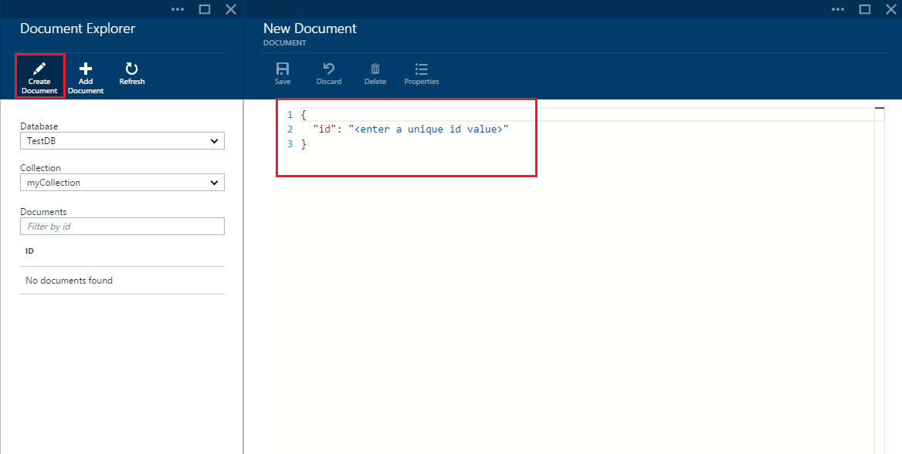
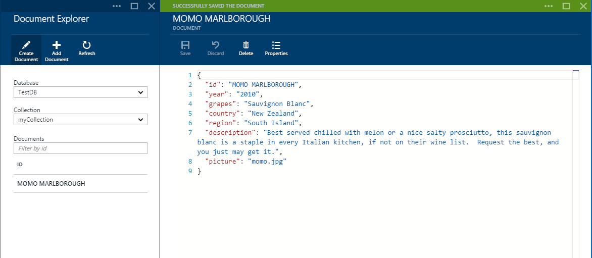
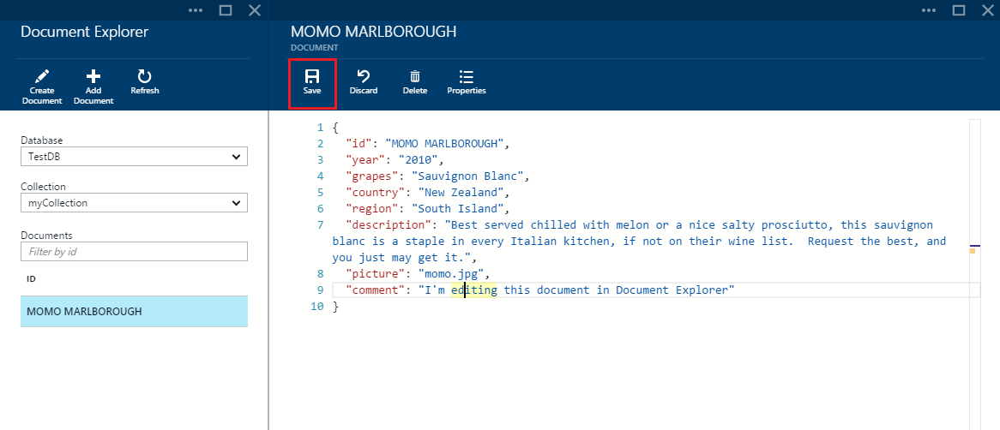
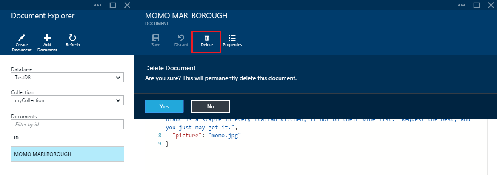
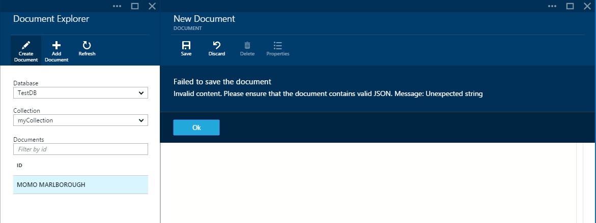
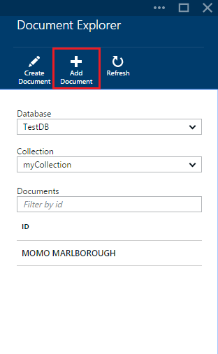
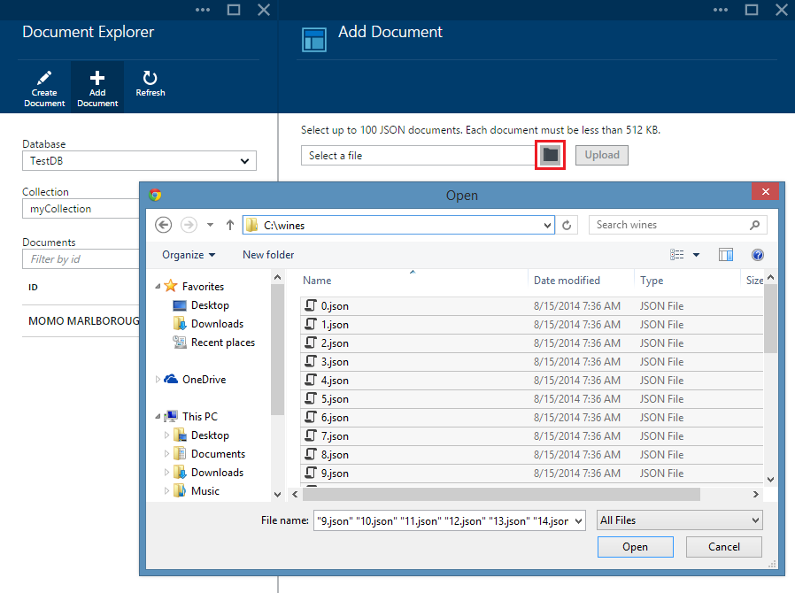
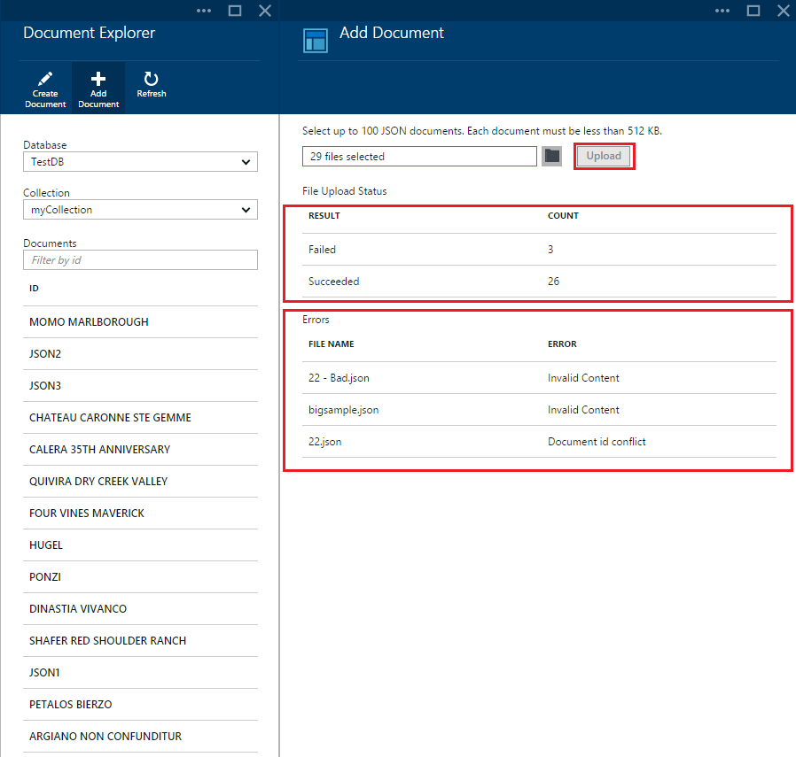

<properties 
	pageTitle="Anzeigen, Bearbeiten, Erstellen und Hochladen von JSON-Dokumenten mithilfe von DocumentDB-Dokument-Explorer | Azure" 
	description="Informationen zum DocumentDB-Dokument-Explorer, einem Azure-Vorschauportaltool zum Anzeigen, Bearbeiten, Erstellen und Hochladen von JSON-Dokumenten mit DocumentDB." 
	services="documentdb" 
	authors="stephbaron" 
	manager="johnmac" 
	editor="monicar" 
	documentationCenter=""/>

<tags 
	ms.service="documentdb" 
	ms.workload="data-services" 
	ms.tgt_pltfrm="na" 
	ms.devlang="na" 
	ms.topic="article" 
	ms.date="2/13/2015" 
	ms.author="stbaro"/>

# Anzeigen, Bearbeiten, Erstellen und Hochladen von JSON-Dokumenten mithilfe von DocumentDB-Dokument-Explorer #

Dieser Artikel bietet eine Übersicht zum [Microsoft Azure DocumentDB](http://azure.microsoft.com/services/documentdb/)-Dokument-Explorer, einem Azure-Vorschauportaltool zum Anzeigen, Bearbeiten, Erstellen und Hochladen von JSON-Dokumenten mit DocumentDB. 

Nach Abschluss dieses Lernprogramms können Sie die folgenden Fragen beantworten:  

-	Wie kann ich einzelne DocumentDB-Dokumente über einen Webbrowser erstellen, anzeigen, bearbeiten und löschen?
-	Wie kann ich die Systemeigenschaften eines DocumentDB-Dokuments über einen Webbrowser anzeigen?
-	Wie kann ich eine Sammelerfassung von Dokumenten in DocumentDB über einen Webbrowser durchführen?

##Starten von und Navigieren in Dokument-Explorer##

Dokument-Explorer kann über jedes Blatt von DocumentDB-Konto, -Datenbank und -Auflistung gestartet werden.  

1. Am unteren Rand von jedem Blatt ist ein Bereich **Entwicklertools** mit dem Bereich **Dokument-Explorer** enthalten.

	 

2. Klicken Sie zum Starten von Dokument-Explorer einfach auf die Kachel.

	
Die DropdownListenfelder **Datenbank** und **Sammlung** werden basierend auf dem Kontext, in dem Sie Dokument-Explorer starten, im Voraus ausgefüllt.  Wenn Sie diesen z. B. aus einem Datenbankblatt starten, sind die Felder der aktuellen Datenbank bereits ausgefüllt.  Wenn Sie diesen aus einem Auflistungsblatt starten, sind die Felder der aktuellen Auflistung ausgefüllt.

	

3. Dokument-Explorer lädt maximal 100 ersten Dokumente der ausgewählten Sammlung.  Sie können weitere Dokumente (in Batches von 100) laden, indem Sie die Option **Mehr laden** am unteren Rand des Dokument-Explorer-Blatts wählen.  

4. MIt den Dropdownlistenfelden **Datenbank** und **Sammlung** können Sie die Sammlung, aus der aktuell Dokumente angezeigt werden, auf einfache Weise ändern, ohne Dokument-Explorer beenden oder neustarten zu müssen.  

5. Dokument-Explorer unterstützt auch das Filtern des aktuell geladenen Dokumentensets nach der id-Eigenschaft.  Geben Sie diese einfach im Filterfeld ein.

	 

	Die Ergebnisse in der Dokument-Explorer-Liste sind nun basierend auf den angegebenen Kriterien gefiltert.

	

	> [AZURE.IMPORTANT] Die Filterfunktion von Dokument-Explorer filtert nur aus dem ***aktuell*** geladenen Satz an Dokumenten und führt keine Abfragen für die aktuell ausgewählte Sammlung aus.

6. Zum Aktualisieren der von Dokument-Explorer geladenen Dokumentenliste klicken Sie einfach auf den Begehl **Aktualisieren** im oberen Bereich des Blatts.

	

##Anzeigen, Erstellen und Bearbeiten von Dokumenten mit Dokument-Explorer##

Mit Dokument-Explorer können Sie problemlos Dokumente erstellen, bearbeiten und löschen.  

- Klicken Sie zum Erstellen eines Dokuments auf den Befehl **Dokument erstellen**, und es wird ein minimaler JSON-Ausschnitt bereitgestellt.

	 

- Geben Sie den JSON-Inhalt des Dokuments ein, das Sie erstellen möchten, oder fügen Sie ihn ein, und klicken Sie auf den Befehl **Speichern**, um das Dokument zu übernehmen.

	

	> [AZURE.NOTE] Wenn Sie keine "id"-Eigenschaft angegebn, fügt Dokument-Explorer automatisch eine id-Eigenschaft hinzu und generiert eine GUID als id-Wert. 

- Wählen Sie zum Bearbeiten eines vorhandenen Dokuments dieses im Dokument-Explorer aus, bearbeiten Sie es wie gewünscht, und klicken Sie auf **Speichern**.

	

- Wenn Sie ein Dokument bearbeiten und dann die Änderungen verwerfen möchten, klicken Sie auf den Befehl "Verwerfen", bestätigen Sie die Aktion "Verwerfen", und die vorherige Version des Dokuments wird neu geladen.

	

- Sie können ein Dokument löschen, indem Sie **Löschen** auswählen und dann den Löschvorgang bestätigen. Nach Bestätigung wird das Dokument sofort aus der Liste im Dokument-Explorer entfernt:

	

- Beachten Sie, dass Dokument-Explorer überprüft, ob alle neuen oder bearbeiteten Dokumente gültiges JSON enthalten.  Sie können sogar mit der Maus auf den falschen Bereich zeigen, um Details zum Validierungsfehler anzuzeigen.

	

- Dokument-Explorer verhindert auch das Speichern eines Dokuments mit ungültigem JSON.

	

- Mit Dokument-Explorer können problemlos die Systemeigenschaften des aktuell geladenen Dokuments durch Klicken auf den Befehl **Eigenschaften** angezeigt werden.

	

	> [AZURE.NOTE] Die Zeitstempeleigenschaft (_ts) wird intern als Epochenzeit dargestellt, im Dokument-Explorer wird der Wert jedoch in einem vom Menschen lesbaren GMT-Format angezeigt.

##Massenhinzufügung von Dokumenten mit Dokument-Explorer##

Dokument-Explorer unterstützt die Sammelerfassung von vorhandenen JSON-Dokumenten.  

1. Klicken Sie zum Starten des Hochladeprozesses auf den Befehl **Dokument hinzufügen**.
	
	

2. Ein neues Blatt wird geöffnet.  Klicken Sie auf die Schaltfläche "Durchsuchen", um ein Datei-Explorer-Fenster zu öffnen, und wählen Sie die JSON-Dokumente aus, die hochgeladen werden sollen.

	

	> [AZURE.NOTE] Dokument-Explorer unterstützt derzeit bis zu 100 JSON-Dokumente pro einzelnen Hochladevorgang.

3. Sobald Sie mit der Auswahl fertig sind, klicken Sie auf die Schaltfläche **Hochladen**.  Die Dokumente werden automatisch zum Dokument-Explorer-Raster hinzugefügt, und die Hochladeergebnisse werden angezeigt, während der Prozess weiterläuft. Importfehler werden für einzelne Dateien gemeldet.

	

4. Sobald der Vorgang abgeschlossen ist, können Sie bis zu 100 weitere Dokumente auswählen, die Sie hochladen möchten.

##Nächste Schritte

Weitere Informationen zu DocumentDB finden Sie [hier](http://azure.com/docdb).

<!--HONumber=49-->