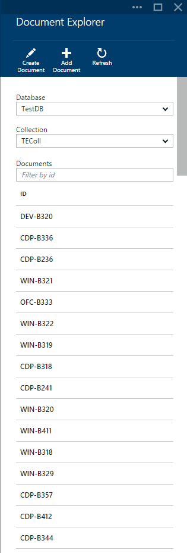
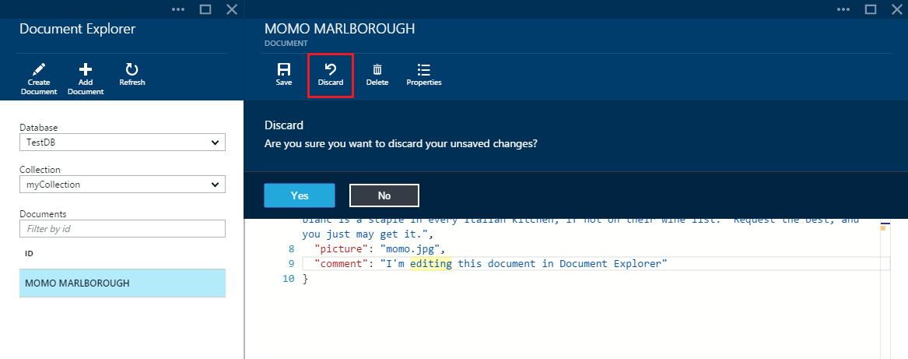
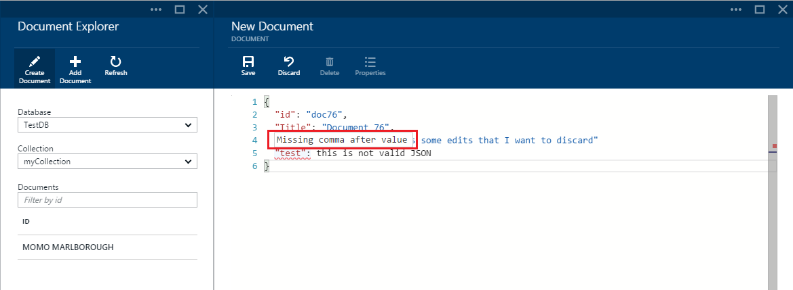
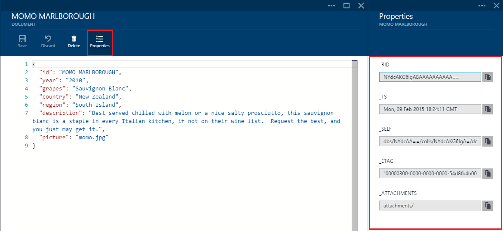
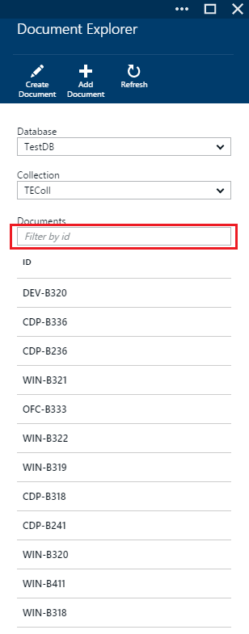
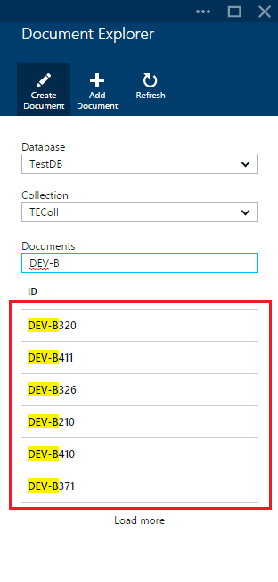
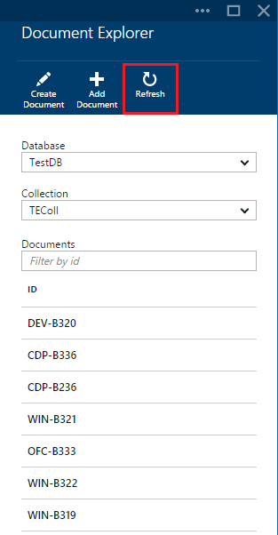

<properties
	pageTitle="DocumentDB-Dokument-Explorer, JSON-Anzeige | Microsoft Azure"
	description="Sie erhalten Informationen zum DocumentDB-Dokument-Explorer, einem Tool im Azure-Portal zum Anzeigen von JSON-Code und Bearbeiten, Erstellen und Hochladen von JSON-Dokumenten mit DocumentDB (NoSQL-Dokumentdatenbank)."
    keywords="JSON-Anzeige"
	services="documentdb"
	authors="AndrewHoh"
	manager="jhubbard"
	editor="monicar"
	documentationCenter=""/>

<tags
	ms.service="documentdb"
	ms.workload="data-services"
	ms.tgt_pltfrm="na"
	ms.devlang="na"
	ms.topic="article"
	ms.date="03/30/2016"
	ms.author="anhoh"/>

# Anzeigen, Bearbeiten, Erstellen und Hochladen von JSON-Dokumenten mithilfe von DocumentDB-Dokument-Explorer

Dieser Artikel enthält eine Übersicht über den [Microsoft Azure DocumentDB](https://azure.microsoft.com/services/documentdb/)-Dokument-Explorer, ein Tool im Azure-Portal zum Anzeigen, Bearbeiten, Erstellen, Hochladen und Filtern von JSON-Dokumenten mit DocumentDB.

## Starten von Dokument-Explorer

1. Klicken Sie in der Navigationsleiste im Azure-Portal auf **DocumentDB-Konten**. Wenn **DocumentDB-Konten** nicht sichtbar ist, klicken Sie auf **Durchsuchen** und dann auf **DocumentDB-Konten**.

2. Klicken Sie oben im Blatt **DocumentDB-Konto** auf **Dokument-Explorer**.
 
	

 	>[AZURE.NOTE] Der Abfrage-Explorer wird auch auf den Blättern für Datenbanken und Sammlungen angezeigt.

    Auf dem Blatt **Dokument-Explorer** werden die Dropdownlisten **Datenbanken** und **Sammlungen** basierend auf dem Kontext, in dem Sie den Dokument-Explorer starten, automatisch ausgefüllt.

	

## Erstellen eines Dokuments

1. [Starten Sie den Dokument-Explorer](#launch-document-explorer).

2. Klicken Sie im Blatt **Dokument-Explorer** auf **Dokument erstellen**.

    Im Blatt **Dokument** wird ein kleiner JSON-Codeausschnitt angegeben.

	

2. Geben bzw. fügen Sie im Blatt **Dokument** den Inhalt des JSON-Dokuments ein, das Sie erstellen möchten. Klicken Sie anschließend auf **Speichern**, um Ihr Dokument für die Datenbank und die Sammlung festzulegen, die im Blatt **Dokument-Explorer** angegeben sind.

	

	> [AZURE.NOTE] Wenn Sie keine "id"-Eigenschaft angegebn, fügt Dokument-Explorer automatisch eine id-Eigenschaft hinzu und generiert eine GUID als id-Wert.

    Wenn Sie bereits über Daten aus JSON-Dateien, MongoDB, SQL Server, CSV-Dateien, Azure-Tabellenspeichern, Amazon DynamoDB, HBase oder anderen DocumentDB-Sammlungen verfügen, können Sie das [Datenmigrationstool](documentdb-import-data.md) von DocumentDB verwenden, um Ihre Daten schnell zu importieren.

## Bearbeiten eines Dokuments

1. [Starten Sie den Dokument-Explorer](#launch-document-explorer).

2. Um ein vorhandenes Dokument zu bearbeiten, wählen Sie es im Blatt **Dokument-Explorer** aus, bearbeiten das Dokument im Blatt **Dokument** und klicken dann auf **Speichern**.

    

    Wenn Sie ein Dokument bearbeiten und dann die Änderungen verwerfen möchten, klicken Sie im Blatt **Dokument** einfach auf den Befehl **Verwerfen** und bestätigen das Verwerfen. Die vorherige Version des Dokuments wird dann neu geladen.

    

## Löschen eines Dokuments

1. [Starten Sie den Dokument-Explorer](#launch-document-explorer).

2. Wählen Sie das Dokument im **Dokument-Explorer** aus, und klicken Sie auf **Löschen**. Bestätigen Sie anschließend den Löschvorgang. Nach der Bestätigung wird das Dokument sofort aus der Liste im Dokument-Explorer entfernt.

	

## Verwenden von JSON-Dokumenten

Der Dokument-Explorer überprüft, ob alle neuen oder bearbeiteten Dokumente gültigen JSON-Code enthalten. Sie können zum Anzeigen von JSON-Fehlern sogar mit der Maus auf den falschen Bereich zeigen, um Details zum Validierungsfehler abzurufen.

Dokument-Explorer verhindert auch das Speichern eines Dokuments mit ungültigem JSON.

Mit dem Dokument-Explorer können Sie ganz einfach die Systemeigenschaften des aktuell geladenen Dokuments anzeigen, indem Sie auf Befehl **Eigenschaften** klicken.

> [AZURE.NOTE] Die Zeitstempeleigenschaft (\_ts) wird intern als Epochenzeit dargestellt, im Dokument-Explorer wird der Wert jedoch in einem vom Menschen lesbaren GMT-Format angezeigt.

## Filtern von Dokumenten
Der Dokument-Explorer unterstützt eine Reihe an Navigationsoptionen und erweiterten Einstellungen.

Standardmäßig lädt der Dokument-Explorer die ersten 100 Dokumente in die ausgewählte Sammlung, sortiert nach Erstellungsdatum, vom ältesten bis zum neuesten. Sie können weitere Dokumente (in Batches von je 100) laden, indem Sie die Option **Mehr laden** am unteren Rand des Dokument-Explorer-Blatts wählen. Sie können auswählen, welche Dokumente geladen werden sollen, indem Sie den Befehl **Filter** verwenden.

1. [Starten Sie den Dokument-Explorer](#launch-document-explorer).

2. Klicken Sie am oberen Rand des Blatts **Dokument-Explorer** auf **Filter**.

    
  
3.  Die Filtereinstellungen werden unterhalb der Befehlsleiste angezeigt. Geben Sie in den Filtereinstellungen eine WHERE-Klausel bzw. eine ORDER BY-Klausel ein, und klicken Sie dann auf **Filter**.

	

	Dokument-Explorer aktualisiert die Ergebnisse automatisch mit Dokumenten, die für die Filterabfrage eine Übereinstimmung ergeben. Weitere Informationen zur DocumentDB-SQL-Grammatik finden Sie im Artikel [SQL-Abfrage und SQL-Syntax](documentdb-sql-query.md), oder drucken Sie sich den [Spickzettel für SQL-Abfragen](documentdb-sql-query-cheat-sheet.md) aus.

    Mit den Dropdownlistenfeldern **Datenbank** und **Sammlung** können Sie die Sammlung, aus der aktuell Dokumente angezeigt werden, ganz einfach ändern, ohne den Dokument-Explorer schließen und neu starten zu müssen.

    Dokument-Explorer unterstützt auch das Filtern des aktuell geladenen Dokumentensets nach der id-Eigenschaft. Geben Sie sie einfach in das Feld „Dokumente nach id filtern“ ein.

	

	Die Ergebnisse in der Dokument-Explorer-Liste werden nun nach den angegebenen Kriterien gefiltert.

	

	> [AZURE.IMPORTANT] Die Filterfunktion des Dokument-Explorers filtert nur aus dem ***aktuell*** geladenen Dokumentensatz und führt keine Abfrage für die aktuell ausgewählte Sammlung aus.

4. Zum Aktualisieren der von Dokument-Explorer geladenen Dokumentenliste klicken Sie im oberen Bereich des Blatts auf **Aktualisieren**.

	

## Massenhinzufügen von Dokumenten

Dokument-Explorer unterstützt die Sammelerfassung von einem oder mehreren JSON-Dokumenten. Pro Uploadvorgang sind bis zu 100 JSON-Dateien zulässig.

1. [Starten Sie den Dokument-Explorer](#launch-document-explorer).

2. Klicken Sie zum Starten des Uploadvorgangs auf **Dokument hochladen**.

	

    Das Blatt **Dokument hochladen** wird geöffnet.

2. Klicken Sie auf die Schaltfläche „Durchsuchen“, um ein Datei-Explorer-Fenster zu öffnen, wählen Sie die JSON-Dokumente aus, die hochgeladen werden sollen, und klicken Sie dann auf **Öffnen**.

	

	> [AZURE.NOTE] Dokument-Explorer unterstützt derzeit bis zu 100 JSON-Dokumente pro einzelnen Hochladevorgang.

3. Sobald Sie mit der Auswahl fertig sind, klicken Sie auf die Schaltfläche **Hochladen**. Die Dokumente werden automatisch zum Dokument-Explorer-Raster hinzugefügt, und die Hochladeergebnisse werden angezeigt, während der Prozess weiterläuft. Importfehler werden für einzelne Dateien gemeldet.

	

4. Sobald der Vorgang abgeschlossen ist, können Sie bis zu 100 weitere Dokumente auswählen, die Sie hochladen möchten.

## Verwenden von JSON-Dokumenten außerhalb des Portals

Der Dokument-Explorer im Azure-Portal ist nur eine Möglichkeit zur Verwendung von Dokumenten in DocumentDB. Sie können mit Dokumenten auch arbeiten, indem Sie die [REST-API](https://msdn.microsoft.com/library/azure/mt489082.aspx) oder die [Client-SDKs](documentdb-sdk-dotnet.md) verwenden. Beispielcode finden Sie unter [.NET SDK-Dokumentbeispiele](documentdb-dotnet-samples.md#document-examples) und [Node.js SDK-Dokumentbeispiele](documentdb-nodejs-samples.md#document-examples).

Wenn Sie Dateien aus einer anderen Quelle (JSON-Dateien, MongoDB, SQL Server, CSV-Dateien, Azure Table Storage, Amazon DynamoDB oder HBase) importieren oder migrieren müssen, können Sie das DocumentDB-[Datenmigrationstool](documentdb-import-data.md) nutzen, um Ihre Daten schnell in DocumentDB zu importieren.

## Nächste Schritte

Weitere Informationen zur DocumentDB-SQL-Grammatik, die im Dokument-Explorer unterstützt wird, finden Sie im Artikel [SQL-Abfrage und SQL-Syntax](documentdb-sql-query.md), oder drucken Sie sich den [Spickzettel für SQL-Abfragen](documentdb-sql-query-cheat-sheet.md) aus.

Der [Lernpfad](https://azure.microsoft.com/documentation/learning-paths/documentdb/) ist auch ein nützlicher Anhaltspunkt, um mehr über DocumentDB zu erfahren.

<!---HONumber=AcomDC_0413_2016-->
