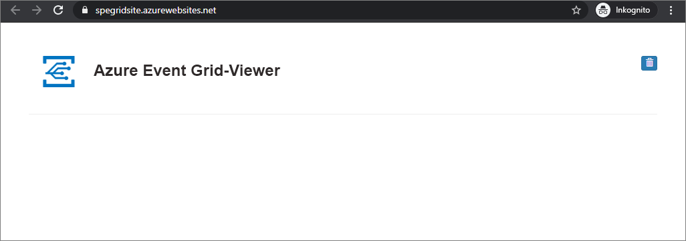

# Weiterleiten von Blob Storage-Ereignissen an einen Webendpunkt mithilfe einer Azure Resource Manager-Vorlage

Azure Event Grid ist ein Ereignisdienst für die Cloud. In diesem Artikel verwenden Sie eine **Azure Resource Manager-Vorlage**, um ein Blob Storage-Konto zu erstellen, Ereignisse für diesen Blobspeicher zu abonnieren und ein Ereignis zum Anzeigen des Ergebnisses auszulösen. Üblicherweise senden Sie Ereignisse an einen Endpunkt, der die Ereignisdaten verarbeitet und entsprechende Aktionen ausführt. Der Einfachheit halber senden Sie die Ereignisse in diesem Artikel allerdings an eine Web-App, die die Nachrichten sammelt und anzeigt.

[!INCLUDE [About Azure Resource Manager](../../includes/resource-manager-quickstart-introduction.md)]

Wenn Sie kein Azure-Abonnement besitzen, können Sie ein [kostenloses Konto](https://azure.microsoft.com/free/) erstellen, bevor Sie beginnen.

## Voraussetzungen

### Erstellen eines Nachrichtenendpunkts

Vor dem Abonnieren der Ereignisse für den Blobspeicher erstellen wir zunächst den Endpunkt für die Ereignisnachricht. Der Endpunkt führt in der Regel Aktionen auf der Grundlage der Ereignisdaten aus. Der Einfachheit halber stellen Sie in dieser Schnellstartanleitung eine [vorgefertigte Web-App](https://github.com/Azure-Samples/azure-event-grid-viewer) bereit, die die Ereignisnachrichten anzeigt. Die bereitgestellte Lösung umfasst einen App Service-Plan, eine App Service-Web-App und Quellcode von GitHub.

1. Wählen Sie **Deploy to Azure** (In Azure bereitstellen), um die Lösung für Ihr Abonnement bereitzustellen. Geben Sie im Azure-Portal Werte für die Parameter an.

    [Bereitstellen in Azure](https://portal.azure.com/#create/Microsoft.Template/uri/https%3A%2F%2Fraw.githubusercontent.com%2FAzure-Samples%2Fazure-event-grid-viewer%2Fmaster%2Fazuredeploy.json)
1. Die Bereitstellung kann einige Minuten dauern. Nach erfolgreichem Abschluss der Bereitstellung können Sie Ihre Web-App anzeigen und sich vergewissern, dass sie ausgeführt wird. Navigieren Sie hierzu in einem Webbrowser zu `https://<your-site-name>.azurewebsites.net`.

1. Die Website wird angezeigt, aber es wurden noch keine Ereignisse bereitgestellt.

   

## Erstellen eines Speicherkontos mit einem Event Grid-Abonnement

### Überprüfen der Vorlage

Die in dieser Schnellstartanleitung verwendete Vorlage stammt von der Seite mit den [Azure-Schnellstartvorlagen](https://github.com/Azure/azure-quickstart-templates/tree/master/101-event-grid-subscription-and-storage).

[!code-json[<Azure Resource Manager template create Blob storage Event Grid subscription>](~/quickstart-templates/101-event-grid-subscription-and-storage/azuredeploy.json)]

Zwei Azure-Ressourcen sind in der Vorlage definiert:

* [**Microsoft.Storage/storageAccounts**](/azure/templates/microsoft.storage/storageaccounts): Erstellen eines Azure Storage-Kontos
* [**Microsoft.Storage/storageAccounts/providers/eventSubscriptions**](/azure/templates/microsoft.eventgrid/eventsubscriptions): Erstellen eines Azure Event Grid-Abonnements für das Speicherkonto

### Bereitstellen der Vorlage

1. Wählen Sie den folgenden Link aus, um sich bei Azure anzumelden und eine Vorlage zu öffnen. Die Vorlage erstellt einen Schlüsseltresor und ein Geheimnis.

    

2. Geben Sie den **Endpunkt** an: Geben Sie die URL Ihrer Web-App an, und fügen Sie `api/updates` der URL der Startseite hinzu.
3. Wählen Sie **Kaufen** aus, um die Vorlage bereitzustellen.

  Hier wird zum Bereitstellen der Vorlage das Azure-Portal verwendet. Sie können auch Azure PowerShell, die Azure CLI und die REST-API verwenden. Informationen zu anderen Bereitstellungsmethoden finden Sie unter [Bereitstellen von Vorlagen](../azure-resource-manager/templates/deploy-powershell.md).

> [!NOTE]
> Weitere Azure Event Grid-Vorlagenbeispiele finden Sie [hier](https://azure.microsoft.com/resources/templates/?resourceType=Microsoft.Eventgrid).

## Überprüfen der Bereitstellung

Zeigen Sie wieder Ihre Web-App an. Wie Sie sehen, wurde ein Abonnementüberprüfungsereignis an sie gesendet. Klicken Sie auf das Augensymbol, um die Ereignisdaten zu erweitern. Event Grid sendet das Überprüfungsereignis, damit der Endpunkt bestätigen kann, dass er Ereignisdaten empfangen möchte. Die Web-App enthält Code zur Überprüfung des Abonnements.

Als Nächstes lösen wir ein Ereignis aus, um zu sehen, wie Event Grid die Nachricht an Ihren Endpunkt weiterleitet.

Sie lösen ein Ereignis für den Blobspeicher aus, indem Sie eine Datei hochladen. Für die Datei ist kein spezifischer Inhalt erforderlich. In den Artikeln wird davon ausgegangen, dass Sie über eine Datei mit dem Namen „testfile.txt“ verfügen, aber Sie können eine beliebige Datei verwenden.

Wenn Sie die Datei in Azure Blob Storage hochladen, sendet Event Grid eine Nachricht an den Endpunkt, den Sie beim Abonnieren konfiguriert haben. Die Nachricht weist das JSON-Format auf und enthält ein Array mit mindestens einem Ereignis. Im folgenden Beispiel enthält die JSON-Nachricht ein Array mit einem Ereignis. Zeigen Sie Ihre Web-App an, und verfolgen Sie, wie ein von einem Blob erstelltes Ereignis empfangen wird.

## Bereinigen von Ressourcen

[Löschen Sie die Ressourcengruppe](../azure-resource-manager/management/delete-resource-group.md?tabs=azure-portal#delete-resource-group
), wenn Sie sie nicht mehr benötigen.

## Nächste Schritte

Weitere Informationen zu Azure Resource Manager-Vorlagen finden Sie in den folgenden Artikeln:

* [Dokumentation zu Azure Resource Manager](/azure/azure-resource-manager)
* [Definieren von Ressourcen in Azure Resource Manager-Vorlagen](/azure/templates/)
* [Azure-Schnellstartvorlagen](https://azure.microsoft.com/resources/templates/)
* [Azure-Schnellstartvorlagen](https://azure.microsoft.com/resources/templates/?resourceType=Microsoft.Eventgrid)
